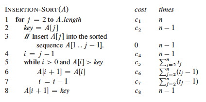
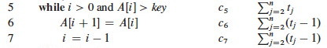
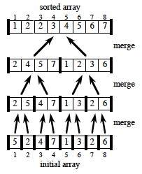
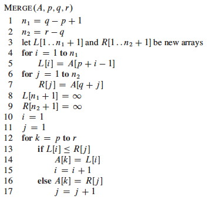
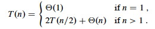
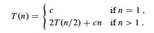
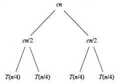
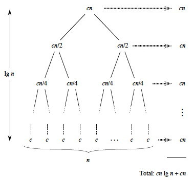

## Outline

  1. The Sorting Problem
  2. Insertion Sort: An Incremental Strategy
  3. Loop Invariants and Correctness of Insertion Sort
  4. RAM Model; What do we count?
  5. Analysis of Insertion Sort: Best and Worst Cases
  6. Worst Case Rate of Growth and Θ (Theta)
  7. Merge Sort: A Divide & Conquer Strategy
  8. Brief Comment on Merge Sort Correctness
  9. Analysis of Merge Sort: Recurrence Relations and Recursion Tree

## Modeling a Problem: The Sorting Problem

### Problem Formulation

Clear and unambiguous definition of what to be solved in terms of:

  * Input of the problem
  * Output of the problem
  * Assumptions in the problem

Descriptions in a problem formulation must be declarative (not procedural).
All assumptions concerning input and output must be explicit. The problem
formulation provides the requirements for an algorithm.

### Problem Formulation for Sorting

Input:

    A sequence σ of n real numbers xi (1 ≤ i ≤ n)
Assumptions:

  1. n is a positive integer.
  2. The real numbers xi (1 ≤ i ≤ n) are not necessarily distinct.
Output:

    A permutation π = x'1 x'2 … x'n of the given sequence σ such that x'j ≤ x'j+1 for every j (1 ≤ j < n)

The numbers are referred to as **keys**.

Additional information known as **satellite data** may be associated with each
key.

Sorting is hugely important in most applications of computers. We will cover
several ways to solve this problem in this course.

* * *

## Insertion Sort: An Incremental Strategy

Insertion sort takes an **incremental strategy** of problem solving: pick off
one element of the problem at a time and deal with it. Our first example of
the text's pseudocode:

Here's a step by step example:

_Is the strategy clear? For fun, see the visualization at
<http://youtu.be/ROalU379l3U>_

* * *

## Loop Invariants and Correctness of Insertion Sort

### Loop Invariants

A loop invariant is a formal property that is (claimed to be) true at the
start of each iteration. We can use loop invariants to prove the correctness
of iteration in programs, by showing three things about the loop invariant:

**Initialization:**
    It is true prior to the first iteration.
**Maintenance:**
    If it is true prior to a given iteration, then it remains true before the next iteration.
**Termination:**
    When the loop terminates, the invariant (and the conditions of termination) gives us a useful property that helps to show that the algorithm is correct.

Notice the similarity to mathematical induction, but here we have a
termination condition.

### Correctness of Insertion Sort

**Loop Invariant:**
    At the start of each iteration of the outer `for` loop at line 1, the subarray A[1 .. _j_-1] consists of the elements originally in A[1 .. _j_-1] but in sorted order. 
**Initialization:**
    We start with _j_=2. The subarray A[1 .. _j_-1] is the single element A[1], which is the element originally in A[1] and is trivially sorted.
**Maintenance:**
    A precise analysis would state and prove another loop invariant for the `while` loop. For simplicity, we'll note informally that at each iteration the elements A[_j_-1], A[_j_-2], A[_j_-3], etc. are shifted to the right (so they remain in the sequence in proper order) until the proper place for _key_ (the former occupant of A[_j_]) is found. Thus at the next iteration, the subarray A[1 .. _j_] has the same elements but in sorted order.
**Termination:**
    The outer `for` loop ends when _j_=_n_+1. Therefore _j_-1=_n_. Plugging _n_ into the loop invariant, the subarray A[1 .. _n_] (which is the entire array) consists of the elements originally in A[1 .. _n_] but in sorted order.

_Convinced? Questions? Could you do it with another problem?_

* * *

## RAM Model: What do we count?

If we are going to tally up time (and space) requirements, we need to know
what counts as a unit of time (and space). Since computers differ from each
other in details, it is helpful to have a common abstract model.

### Random Access Machine (RAM) Model

The RAM model is based on the design of typical von Neumann architecture
computers that are most widely in use. For example:

  * Instructions are executed one after the other (no concurrent operations).
  * Instructions operate on a small number (one or two) of data "words" at a time.
  * Data words are of a limited, constant size (cannot get arbitrarily large computation done in one operation by putting the data in an arbitrarily large word).

### Categories of Primitive Operations

We identify the primitive operations that count as "one step" of computation.
They may differ in actual time taken, but all can be bounded by the same
constant, so we can simplify things greatly by counting them as equal.

#### Data Manipulation

  * Arithmetic operation: +, -, *, /, remainder, floor, ceiling, left/right shift
  * Comparison: <, =, >, ≤, ≥
  * Logical operation: ∧, ∨, ¬

> _These assume bounded size data objects being manipulated, such as integers
that can be represented in a constant number of bits (e.g, a 64-bit word),
bounded precision floating numbers, or boolean strings that are bounded in
size. Arbitrarily large integers, arbitrarily large floating point precision,
and arbitrarily long strings can lead to nonconstant growth in computation
time._

#### Flow Control

  * Branch: case, if, etc.
  * Loop; while, for   __   <-   ___   to   ___ 

> _Here we are stating that the time to execute the machinery of the
conditional loop controllers are constant time. However, if the language
allows one to call arbitrary methods as part of the boolean expressions
involved, the overall execution may not be constant time._

#### Miscellaneous

  * Assignment: <-
  * Subscription: [ ]
  * Reference
  * Setting up a procedure or function call (see below)
  * Setting up an I/O operation (see below) 

> _The time to set up a procedure call is constant, but the time to execute
the procedure may not be. Count that separately. Similarly, the time to set up
an I/O operation is constant, but the time to actually read or write the data
may be a function of the size of the data. Treat I/O as constant only if you
know that the data size is bounded by a constant, e.g., reading one line from
a file with fixed data formats._

###  Input Size

Time taken is a function of input size. How do we measure input size?

  * It is often most convenient to use the number of items in the input, such as the number of numbers being sorted. 
  * For some algorithms we need to measure the size of data, such as the number of bits in two integers being multiplied. 
  * For other algorithms we need more than one number, such as the number of vertices _and_ edges in a graph.

* * *

## Analysis of Insertion Sort: Best and Worst Cases

We now undertake an exhaustive quantitative analysis of insertion sort. We do
this analysis in greater detail than would normally be done, to illustrate why
this level of detail is not necessary!!!

For each line, what does it cost, and how many times is it executed?

We don't know the actual cost (e.g., in milliseconds) as this varies across
software and hardware implementations. A useful strategy when you do not know
a quantity is to just give it a name ...

The _ci_ are the unknown but constant costs for each step. The _tj_ are the
numbers of times that line 5 is executed for a given _j_. These quantities
depend on the data, so again we just give them names.

Let T(_n_) be the running time of insertion sort. We can compute T(_n_) by
multiplying each cost by the number of times it is incurred (on each line) and
summing across all of the lines of code:

### Best Case

When the array is already sorted, we always find that A[_i_] ≤ _key_ the first
time the `while` loop is run; so all _tj_ are 1 and _tj-1_ are 0. Substituting
these values into the above:

As shown in the second line, this is the same as _a__n_ \+ _b_ for suitable
constants _a_ and _b_. Thus the running time is a **linear function of n.**

### Worst Case

When the array is in reverse sorted order, we always find that A[_i_] > _key_
in the while loop, and will need to compare _key_ to all of the (growing) list
of elements to the left of _j_. There are _j_-1 elements to compare to, and
one additional test for loop exit. Thus, _tj=j_.

 

Plugging those values into our equation:

We get the worst case running time, which we simplify to gather constants:

_T(n)_ can be expressed as _an2 \+ bn + c_ for some _a, b, c_: _T(n)_ is a
**quadratic function of n**.

So we can draw these conclusions purely from mathematical analysis, with _ no
implementation or testing needed_: Insertion sort is very quick (linear) on
already sorted data, so it works well when incrementally adding items to an
existing list. But the worst case is slow for reverse sorted data.

* * *

## Worst Case Rate of Growth and Θ (Theta)

From the above example we introduce two key ideas and a notation that will be
elaborated on later.

###  Worst Case Analysis

Above, both best and worst case scenarios were analyzed. We usually
concentrate on the worst-case running times for algorithms, because:

  * This gives us a guaranteed upper bound.
  * For some algorithms, the worst case occurs often (such as failing to find an item in a search). 
  * The average is often almost as bad as the worst case.

_How long does it take on average to successfully find an item in an unsorted
list of n items?  
How long does it take in the worst case, when the item is not in the list?  
What is the difference between the two?_

###  Rate of Growth

In the above example, we kept track of unknown but named constant values for
the time required to execute each line once. In the end, we argued that these
constants don't matter!

  * Their specific values don't matter because they all add up to summary constants in the equations (e.g., _a_ and _b_).
  * Even their presence does not matter, because it is the growth of the function of _n_ that dominates the time taken to run the algorithm.

This is good news, because it means that all of that excruciating detail is
not needed!

Furthermore, only the fastest growing term matters. In _an2 \+ bn + c_, the
growth of _n2_ dominates all the other terms (including _bn_) in its growth.

###  Theta: Θ

We will use Θ notation to concentrate on the fastest growing term and ignore
constants.

If we conclude that an algorithm requires _an2 \+ bn + c_ steps to run, we
will dispense with the constants and lower order terms and say that its growth
rate (the growth of how long it takes as _n_ grows) is Θ(_n_2).

If we see _bn + c_ we will write Θ(_n_).

A simple constant _c_ will be Θ(1), since it grows the same as the constant 1.

When we combine Θ terms, we similarly attend only to the dominant term. For
example, suppose an analysis shows that the first part of an algorithm
requires Θ(_n_2) timeand the second part requires Θ(_n_) time. Since the
former term dominates, we need not write Θ(_n_2 \+ _n_): the overall algorithm
is Θ(_n_2).

Formal definitions next week!

* * *

## Merge Sort: A Divide & Conquer Strategy

Another strategy is to **Divide and Conquer**:

**Divide**
    the problem into subproblems that are smaller instances of the same problem. 
**Conquer**
    the subproblems by solving them recursively. If the subproblems are small enough, solve them trivially or by "brute force."
**Combine**
    the subproblem solutions to give a solution to the original problem.

Merge Sort takes this strategy:

**Divide:**
    Given A[_p .. r_], split the given array into two subarrays A[_p .. q_] and A[_q+1 .. r_] where _q_ is the halfway point of A[_p .. r_].
**Conquer:**
    Recursively sort the two subarrays. If they are singletons, we have the base case. 
**Combine:**
    Merge the two sorted subarrays with a (linear) procedure `Merge` that iterates over the subarrays from the smallest element up to copy the next smallest element into a result array.   
(This is like taking two decks of sorted cards and picking the next smallest
one off to place face-down in a new pile to make one sorted deck.)

The strategy can be written simply and elegantly in recursive code ...

Here are examples when the input is a power of two, and another example when
it is not a power of two:

 

Now let's look in detail at the merge procedure, implemented using ∞ as
**sentinels** _(what do lines 1-2 do? lines 3-9 ? lines 10-17?)_:

Here's an example of how the final pass of `MERGE(9, 12, 16)` happens in an
array, starting at line 12. Entries with slashes have had their values copied
to either L or R and have not had a value copied back in yet. Entries in L and
R with slashes have been copied back into A.

We can also dance this one: <http://youtu.be/XaqR3G_NVoo>

* * *

## Merge Sort Correctness

A loop invariant is used in the book to establish correctness of the Merge
procedure. Since the loop is rather straightforward, we will leave it to the
above example. Once correctness of Merge is established, induction can be used
to show that Merge-Sort is correct for any N.

* * *

## Analysis of Merge Sort: Recurrence Relations and Recursion Tree

Merge Sort provides us with our first example of using recurrence relations
and recursion trees for analysis. We will go into more detail on these methods
when we cover Chapter 4.

### Analysis of Merge

Analysis of the Merge procedure is straightforward. The first two `for` loops
(lines 4 and 6) take Θ(_n1+n2_) = Θ(_n_) time, where _n_1+_n_2 = _n_. The last
`for` loop (line 12) makes _n_ iterations, each taking constant time, for
Θ(_n_) time. Thus total time is Θ(_n_).

### Analyzing Divide-and-Conquer Algorithms

**Recurrence equations** are used to describe the run time of Divide & Conquer algorithms. Let _T(n)_ be the running time on a problem of size _n_. 

  * If _n_ is below some constant (or often, _n=1_), we can solve the problem directly with brute force or trivially in Θ(1) time.
  * Otherwise we divide the problem into _a_ subproblems, each _1/b_ size of the original. Often, as in Merge Sort, _a = b = 2_.
  * We pay cost **_D(n)_** to divide the problems and **_C(n)_** to combine the solutions. 
  * We also pay cost **_aT(n/b)_** solving subproblems. 

Then the total time to solve a problem of size _n_ by dividing into _a_
problems of size _n_/_b_can be expressed as:

### Recurrence Analysis of Merge Sort

Merge-Sort is called with _p=1_ and _r=n_. For simplicity, assume that _n_ is
a power of 2. (We can always raise a given _n_ to the next power of 2, which
gives us an upper bound on a tighter Θ analysis.) When _n≥2_, the time
required is:

  * **Divide** (line 2): Θ(1) is required to compute _q_ as the average of _p_ and _r_.
  * **Conquer** (lines 3 and 4): 2_T_(_n_/2) is required to recursively solve two subproblems, each of size _n/2_.
  * **Combine** (line 5): Merging an n-element subarray takes Θ(_n_) (this term absorbs the Θ(1) term for Divide). 

In Chapter 4 we'll learn some methods for solving this, such as the Master
Theorem, by which we can show that it has the solution T(_n_) = Θ(_n_
lg(_n_)). Thus, Merge Sort is faster than Insertion Sort in proportion to the
difference in growth of lg(_n_) versus _n_.

### Recursion Tree Analysis

Recursion trees provide an intuitive understanding of the above result. In
general, recursion trees can be used to plan out a formal analysis, or even
constitute a formal analysis if applied carefully.

Let's choose a constant _c_ that is the largest of all the constant costs in
the algorithm (the base case and the divide steps). Then the recurrence can be
written:

It costs _cn_ to divide the original problem in half and then to merge the
results. We then have to pay cost _T_(_n_/2) twice to solve the subproblems:

For each of the two subproblems, _n_/2 is playing the role of _n_ in the
recurrence. So, it costs _cn_/2 to divide and then merge the _n_/2 elements,
and _T_(_n_/4) to solve the subproblems:

If we continue in this manner we eventually bottom out at problems of size 1:

Notice that if we sum across the rows each level has cost _cn_. So, all we
have to do is multiply this by the number of levels. Cool, huh?

_But how many levels are there?_ A little thought (or a more formal inductive
proof you'll find in the book) shows that there are about (allowing for the
fact that n may not be a power of 2) lg(_n_)+1 levels of the tree. This is
because you can only divide a power of two in half as many times as that power
before you reach 1, and _n_ = 2lg(_n_). The 1 counts the root note before we
start dividing: there is always at least one level.

_Questions? Does it make sense, or is it totally mysterious?_

### One more Animation

Recapitulating our conclusions, we have seen that Insertion sort is quick on
already sorted data, so it works well when incrementally adding items to an
existing list. Due to its simplicity it is a good choice when the sequence to
sort will always be small. But for large inputs Merge Sort will be faster than
Insertion Sort, as _n_2 grows much faster than _n_lg(_n_). Each sort algorithm
has different strengths and weaknesses, and performance depends on the data.
Some of these points are made in the following visualizations (also watch for
patterns that help you understand the strategies):

> <http://www.sorting-algorithms.com/> (set to 50 elements)

* * *

## Next

Next week we cover Chapter 3: Growth of Functions and Asymptotic Concepts.
Problems will be posted for my students in Laulima.

* * *

Dan Suthers Last modified: Tue Apr 15 16:09:15 HST 2014

Images are from the instructor's manual for Cormen et al.

