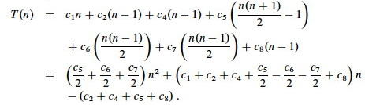
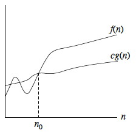
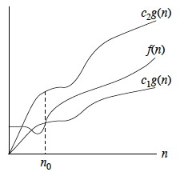
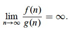

## Outline

  1. Intro to Asymptotic Analysis
  2. Big-O
  3. Ω (Omega)
  4. Θ (Theta)
  5. Asymptotic Notation in Equations
  6. Asymptotic Inequality
  7. Properties of Asymptotic Sets
  8. Common Functions

* * *

## Intro to Asymptotic Analysis

The notations discussed today are ways to describe behaviors of _functions,_
particularly _in the limit_, or _asymptotic_ behavior.

The functions need not necessarily be about algorithms, and indeed asymptotic
analysis is used for many other applications.

Asymptotic analysis of algorithms requires:

  1. Identifying ** what aspect of an algorithm we care about**, such as:    

    * runtime;
    * use of space;
    * possibly other attributes such as communication bandwidth;
  

  2. Identifying **a function that characterizes that aspect; ** and 
  

  3. Identifying **the asymptotic class of functions that this function belongs to**, where classes are defined in terms of bounds on growth rate. 

The different asymptotic bounds we use are analogous to equality and
inequality relations:

  * O   ≈   ≤
  * Ω   ≈   ≥
  * Θ   ≈   =
  * o   ≈   <
  * ω   ≈   >

In practice, most of our analyses will be concerned with run time. Analyses
may examine:

  * Worst case
  * Best case
  * Average case (according to some probability distribution across all possible inputs)

* * *

## Big-O (asymptotic ≤)

Our first question about an algorithm's run time is often "how bad can it
get?" We want a guarantee that a given algorithm will complete within a
reasonable amount of time for typical n expected. This requires an
**asymptotic upper bound**: the "worst case".

Big-O is commonly used for worst case analyses, because it gives an upper
bound on growth rate. Its definition in terms of set notation is:

> O(_g_(_n_)) = {_f_(_n_) : ∃ positive constants _c_ and _n_0 such that 0 ≤
_f_(_n_) ≤ _c__g_(_n_) ∀ _n_ ≥ _n_0}.

This definition means that as _n_ increases, afer a point _f_(_n_) grows no
faster than _g_(_n_) (as illustrated in the figure): _g_(_n_) is an
_asymptotic upper bound_ for _f_(_n_).

Since O(_g_(_n_)) is a set, it would be natural to write _f_(_n_) ∈
O(_g_(_n_)) for any given _f_(_n_) and _g_(_n_) meeting the definition above,
for example, _f_ ∈ O(_n_2).

But the algorithms literature has adopted the convention of using = instead of
∈, for example, writing _f_(_n_) = O(_g_(_n_)). This "abuse of notation" makes
some manipulations possible that would be more tedious if done strictly in
terms of set notation. (We do _not_ write O(_g_(_n_))=_f_(_n_); will return to
this point).

Using the = notation, we often see definitions of big-O in in terms of truth
conditions as follows:

> _f_(_n_) = O(_g_(_n_)) iff ∃ positive constants _c_ and _n_0 such that 0 ≤
_f_(_n_) ≤ _c__g_(_n_) ∀ _n_ ≥ _n_0.

We assume that all functions involved are asymptotically non-negative. Other
authors don't make this assumption, so may use |_f_(_n_)| etc. to cover
negative values. This assumption is reflected in the condition 0 ≤ _f_(_n_).

### Examples

Show that 2_n_2 is O(_n_2).

To do this we need to show that there exists some _c_ and _n_0 such that
(letting 2_n_2 play the role of _f_(_n_) and _n_2 play the role of _g_(_n_) in
the definition):

> 0 ≤ 2_n_2 ≤ _c__n_2 for all _n_ ≥ _n_0.

It works with _c_ = 2, since this makes the _f_ and _g_ terms equivalent for
all _n_ ≥ _n_0 = 0. (We'll do a harder example under Θ.)

#### What's in and what's out

These are all O(_n_2):

These are not:

  * _n_2
  * _n_2 \+ 1000_n_
  * 1000_n_2 \+ 1000_n_
  * _n_1.99999
  * _n_

  * _n_3
  * _n_2.00001
  * _n_2 lg _n_

#### Insertion Sort Example

Recall that we did a tedious analysis of the worst case of insertion sort,
ending with this formula:

_T(n)_ can be expressed as _pn2 \+ _q__n_ \- r_ for suitable _p, q, r_ (_p_ =
(_c_5/2 + _c_6/2 + _c_7/2), etc.).

The textbook (page 46) sketches a proof that __f_(_n_) = _a__n_2 \+ _b__n_ \+
_c__ is Θ(_n_2), and we'll see shortly that Θ(_n_2) -> O(_n_2). This is
generalized to all polynomials in Problem 3-1. So, any polynomial with highest
order term _a__n__d_ (i.e., a polynomial in _n_ of degree _d_) will be
O(_n__d_).

This suggests that the worst case for insertion sort _T_(_n_) ∈ O(_n_2). An
upper bound on the worst case is also an upper bound on all other cases, so we
have already covered those cases.

Notice that the definition of big-O would also work for __g_(_n_) = n3_,
__g_(_n_) = 2n_, etc., so we can also say that _T_(_n_) (the worst case for
insertion sort) is O(_n_3), O(2_n_), etc. However, these loose bounds are not
very useful! We'll deal with this when we get to Θ (Theta).

* * *

## Ω (Omega, asymptotic ≥)

We might also want to know what the best we can expect is. In the last lecture
we derived this formula for insertion sort:

We could prove that this best-case version of T(n) is big-O of something, but
that would only tell us that the best case is no worse than that something.
What if we want to know what is "as good as it gets": a lower bound below
which the algorithm will never be any faster?

We must both pick an appropriate function to measure the property of interest,
and pick an appropriate asymptotic class or comparison to match it to. We've
done the former with _T_(_n_), but what should it be compared to?

It makes more sense to determine the **asymptotic lower bound** of growth for
a function describing the best case run-time. In other words, what's the
fastest we can ever expect, in the best case?

**Ω (Omega)** provides what we are looking for. Its set and truth condition definitions are simple revisions of those for big-O:

> Ω(_g_(_n_)) = {_f_(_n_) : ∃ positive constants _c_ and _n_0 such that 0 ≤
_cg_(_n_) ≤ _f_(_n_) ∀ _n_ ≥ _n_0}.  
_[The _f_(_n_) and _cg_(_n_) have swapped places.]_

> _f_(_n_) = Ω(_g_(_n_)) iff ∃ positive constants _c_ and _n_0 such that
_f_(_n_) ≥ _cg_(_n_) ∀ _n_ ≥ _n_0.  
_[≤ has been replaced with ≥.]_

The semantics of Ω is: as _n_ increases after a point, _f_(_n_) grows no
slower than _g_(_n_) (see illustration).

### Examples

Sqrt(_n_) is Ω(lg _n_) with _c_=1 and _n_0=16.  
_(At n=16 the two functions are equal; try at n=64 to see the growth, or graph
it.)_

####  What's In and What's Out

These are all Ω(_n_2):

These are not:

  * _n_2
  * _n_2 \+ 1000n   _(It's also O(_n_2)!)_
_

  * 1000_n_2 \+ 1000_n_
  * 1000_n_2 \- 1000_n_
  * _n_3
  * _n_2.00001
__ _

  * _n_1.99999
  * _n_
  * lg _n_

#### Insertion Sort Example

We can show that insertion will take at least Ω(_n_) time in the best case
(i.e., it won't get any better than this) using the above formula and
definition.

_T_(_n_) can be expressed as _pn - q_ for suitable _p, q_ (e.g., _q_ = _c_2 \+
_c_4 \+ _c_5 \+ _c_8, etc.). (In this case, _p_ and _q_ are positive.) This
suggests that _T_(_n_) ∈ Ω(_n_), that is, ∃ _c, n0_ s.t. _pn - q ≥ cn,_ ∀_n ≥
n0_. This follows from the generalized proof for polynomials.

* * *

## Θ (Theta, asymptotic =)

We noted that there are _ loose _ bounds, such as _f_(_n_) = _n_2 is O(_n_3),
etc., but this is an overly pessimistic assessment. It is more useful to have
an **asymptotically tight bound** on the growth of a function. In terms of
algorithms, we would like to be able to say (when it's true) that a given
characteristic such as run time grows _no better and no worse_ than a given
function. That is, we want to simultaneoulsy bound from above and below.
Combining the definitions for O and Ω:

> Θ(_g_(_n_)) = {_f_(_n_) : ∃ positive constants **_c_1, _c_2**, and _n_0 such
that 0 ≤ **_c_1_g_(_n_) ≤ _f_(_n_) ≤ _c_2_g_(_n_)**, ∀ _n_ ≥ _n_0}.

As illustrated, _g_(_n_) is an asymptotically tight bound for _f_(_n_): after
a point, _f_(_n_) grows no faster and no slower than _g_(_n_).

The book suggests the proof of this theorem as an easy exercise (just combine
the two definitions):

> _f_(_n_) = Θ(_g_(_n_)) iff _f_(_n_) = Ω(_g_(_n_)) ∧ _f_(_n_) = O(_g_(_n_)).

You may have noticed that some of the functions in the list of examples for
big-O are also in the list for Ω. This indicates that the set Θ is not empty.

### Examples

> _Reminder:_ _f_(_n_) = Θ(_g_(_n_)) iff ∃ positive constants _c_1, _c_2, and
_n_0 such that 0 ≤ _c_1_g_(_n_) ≤ _f_(_n_) ≤ _c_2_g_(_n_)∀ _n_ ≥ _n_0.

_n_2 \- 2_n_ is Θ(_n_2),   with _c_1 = 1/2; _c_2 = 1, and _n_0 = 4,   since:

> _n_2/2   ≤   _n_2 \- 2_n_   ≤   _n_2   for _n_ ≥ _n_0 = 4.

#### Find an asymptotically tight bound (Θ) for

  * 4_n_3
  * 4_n_3 \+ 2_n_. 

Please try these before you [find solutions
here](http://www2.hawaii.edu/~suthers/courses/ics311s14/Notes/Topic-03
/Example-Analysis.html).

#### What's in and what's out

These are all Θ(n2):

These are not

  * _n_2
  * _n_2 \+ 1000_n_
  * 1000_n_2 \+ 1000_n_ \+ 32,700
  * 1000_n_2 \- 1000_n_ \- 1,048,315

  * _n_3
  * _n_2.00001
  * _n_1.99999
  * _n_ lg _n_

* * *

## Asymptotic Inequality

The O and Ω bounds may or may not be asymptotically tight. The next two
notations are for upper bounds that are strictly _not_ asymptotically tight.
There is an _analogy_ to inequality relationships:

  * "≤" is to "<" as big-O (may or may not be tight) is to little-o (strictly not equal) 
  * "≥" is to ">" as Ω (may or may not be tight) is to little-ω (strictly not equal). 

### o-notation ("little o", asymptotic <)

> o(_g_(_n_)) = {_f_(_n_) : ∀ constants _c_ > 0, ∃ constant _n_0 > 0 such that
0 ≤ _f_(_n_) **<** _cg_(_n_) ∀ _n_ ≥ _n_0}.

Alternatively, _f_(_n_) becomes _insignificant_ relative to _g_(_n_) as _n_
approaches infinity (see box):

We say that _f_(_n_) is **asymptotically smaller** than _g_(_n_) if _f_(_n_) =
o(_g_(_n_))

  * _n_1.99999 ∈ o(_n_2)
  * _n_2/lg _n_ ∈ o(_n_2)
  * _n_2 ∉ o(_n_2) (similarly, 2 is not less than 2)
  * _n_2/1000 ∉ o(_n_2) 

### ω-notation ("little omega", asymptotic >)

> ω(_g_(_n_)) = {_f_(_n_) : ∀ constants _c_ > 0, ∃ constant _n_0 > 0 such that
0 ≤ _cg_(_n_) **<** _f_(_n_) ∀ _n_ ≥ _n_0}.

Alternatively, _f_(_n_) becomes _ arbitrarily large _ relative to _g_(_n_) as
_n_ approaches infinity (see box):

We say that _f_(_n_) is **asymptotically larger** than _g_(_n_) if _f_(_n_) =
ω(_g_(_n_))

  * _n_2.00001 ∈ ω(_n_2)
  * _n_2lg _n_ ∈ ω(_n_2)
  * _n_2 ∉ ω(_n_2)

The two are related:   **_f_(_n_) ∈ ω(_g_(_n_))   iff   _g_(_n_) ∈
o(_f_(_n_)).**

* * *

## Asymptotic Notation in Equations

We already noted that while asymptotic categories such as Θ(_n_2) are sets, we
usually use "=" instead of "∈" and write (for example) _f_(_n_) = Θ(_n_2) to
indicate that _f_ is in this set.

Putting asymptotic notation in equations lets us do shorthand manipulations
during analysis.

### Asymptotic Notation on Right Hand Side: ∃

O(_g_(_x_)) on the right hand side stands for _some_ anonymous function in the
set O(_g_(_x_)).

> 2_n_2 \+ 3_n_ \+ 1 = 2_n_2 \+ Θ(_n_)     means:  
2_n_2 \+ 3_n_ \+ 1 = 2_n_2 \+ _f_(_n_)       for _some_ __f_(_n_) ∈ Θ(_n_)_
(in particular, _f_(_n_) = 3_n_ \+ 1).

### Asymptotic Notation on Left Hand Side: ∀

The notation is only used on the left hand side when it is also on the right
hand side.

Semantics: No matter how the anonymous functions are chosen on the left hand
side, there is a way to choose the functions on the right hand side to make
the equation valid.

> 2_n_2 \+ Θ(_n_) = Θ(_n_2)     means   for _all_ _f_(_n_) ∈ Θ(_n_), there _
exists_ _g_(_n_) ∈ Θ(_n_2) such that  
2_n_2 \+ _f_(_n_) = _g_(_n_).

### Combining Terms

We can do basic algebra such as:

> 2_n_2 \+ 3_n_ \+ 1   =   2_n_2 \+ Θ(_n_)   =   Θ(_n_2)

* * *

## Properties

If we keep in mind the analogy to inequality, many of these make sense, but
see the end for a caution concerning this analogy.

### Relational Properties

**Transitivity**:
    

  * _f_(_n_) = Θ(_g_(_n_)) and _g_(_n_) = Θ(h(n))   ⇒   _f_(_n_) = Θ(h(n)).
  * _f_(_n_) = O(_g_(_n_)) and _g_(_n_) = O(h(n))   ⇒   _f_(_n_) = O(h(n)).
  * _f_(_n_) = Ω(_g_(_n_)) and _g_(_n_) = Ω(h(n))   ⇒   _f_(_n_) = Ω(h(n)).
  * _f_(_n_) = o(_g_(_n_)) and _g_(_n_) = o(h(n))   ⇒   _f_(_n_) = o(h(n)).
  * _f_(_n_) = ω(_g_(_n_)) and _g_(_n_) = ω(h(n))   ⇒   _f_(_n_) = ω(h(n)).
**Reflexivity**:
    

  * _f_(_n_) = Θ(_f_(_n_))
  * _f_(_n_) = O(_f_(_n_))
  * _f_(_n_) = Ω(_f_(_n_))
  * _What about o and ω?_
**Symmetry**:
    

  * _f_(_n_) = Θ(_g_(_n_))   iff   _g_(_n_) = Θ(_f_(_n_)) 
  * _Should any others be here? Why or why not?_
**Transpose Symmetry**:
    

  * _f_(_n_) = O(_g_(_n_))   iff   _g_(_n_) = Ω(_f_(_n_)) 
  * _f_(_n_) = o(_g_(_n_))   iff   _g_(_n_) = ω(_f_(_n_)) 

### Incomparability

Here is where the analogy to numeric (in)equality breaks down: There is no
trichotomy. Unlike with constant numbers, we can't assume that one of <, =, >
hold. Some functions may be incomparable.

Example: _n_1 + _sin n_ is incomparable to _n_ since _sin n_ oscillates
between -1 and 1, so 1 + _sin n_ oscillates between 0 and 2. _(Try graphing
it.)_

* * *

## Common Functions and Useful Facts

Various classes of functions and their associated notations and identities are
reviewed in the end of the chapter: please review the chapter and refer to ICS
241 if needed. Here we highlight some useful facts:

### Monotonicity

  * _f_(_n_) is **monotonically increasing**   if   _m_ ≤ _n_   ⇒   _f_(_m_) ≤ _f_(_n_).
  * _f_(_n_) is **monotonically decreasing**   if   _m_ ≥ _n_   ⇒   _f_(_m_) ≥ _f_(_n_).
  * _f_(_n_) is **strictly increasing**   if   _m_ < _n_   ⇒   _f_(_m_) < _f_(_n_).
  * _f_(_n_) is **strictly decreasing**   if   _m_ > _n_   ⇒   _f_(_m_) > _f_(_n_).

### Polynomials

  * _p_(_n_) = Θ(_n__d_), for asymptoptically positive polynomials in _n_ of degree _d_

### Exponentials

  * _n__b_ = o(_a__n_) for all real constants _a_ and _b_ such that _a_ > 1: **_Any exponential function with a base greater than 1 grows faster than any polynomial function._**
  

  * Useful identities: 
    * _a_-1 = 1/_a_
    * (_a__m_)_n_ = _a__mn_
    * _a__m__a__n_ = _a__m_ \+ _n_

### Logarithms

  * (lg _n_)_b_ = lg_b__n_ = o(_n__a_), for a > 0: **_any positive polynomial function grows faster than any polylogarithmic function._**
  

  * Useful identities: 
    * _a_ = _b_log_b__a_   _(Definition of logs.)_
    * log_a__n_ = log_b__n_/log_b__a_     
    _(Base change. If _n_ is variable and _a_ and _b_ are constant, the denominator is constant: this is why asymptotic analysis can ignore the base.)_
    * log_c_(_ab_) = log_c__a_ \+ log_c__b_   _(Ask your slide rule!)_
    * log_b__a_n__ = _n_ log_b__a_
    * log_b_(1/_a_) = −log_b__a_
    * log_b__a_ = 1 / log_a__b_
    * _a_log_b__c_ = _c_log_b__a_   _(Useful for getting the variable where you want it.)_

### Factorials

  * _n_! = ω(2_n_):   _**factorials grow faster than exponentials** (but it could be worse):_
  * _n_! = o(_n__n_)
  * lg(_n_!) = Θ(_n_ lg _n_)
  * See also the more complex **Stirling's approximation** from which these are derived.

### Iterated Functions

  * Definition: _f_(_i_)(_n_) is _f_ applied _i_ times to the initial value _n_. 
  * Iterated Logarithm: lg*_n_ = min{_i_ ≥ 0: lg(_i_)_n_ ≤ 1}   _(The iteration at which lg(_i_)_n_ is less than 1: a very slowly growing function.)_

### Fibonacci Numbers

  * Definition: _F_0 = 0; _F_1 = 1; and for _i_ > 1 _F__i_ = _F__i_-1 \+ _F__i_-2. 
  * **_Fibonacci numbers grow exponentially._**

* * *

Dan Suthers Last modified: Sat Jan 25 03:51:57 HST 2014  
Images are from the instructor's manual for Cormen et al.  

