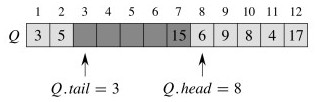
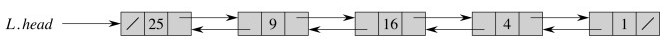
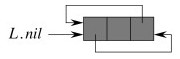

## Outline

  1. Stacks 
  2. Queues 
  3. Lists 
  4. First peek at Trees 
  5. Dynamic Set ADT

Here we review some basic Abstract Data Types that organize information in
useful ways. This should be review, so will be covered briefly, although some
nuances of implementation are discussed and we will also do asymptotic
analyses of the main operations of implementations.

## Stacks

Stacks follow the **Last In, First Out (LIFO)** principle. They are useful
when a problem has goal-subgoal structure, and we need to keep track of higher
level goals or processes when we set them aside to pursue subgoals or sub-
processes (e.g., the run-time stack of a computer operating system, or keeping
track of neighbor vertices yet to be visited when searching a graph).

### Stack ADT

We start by specifying the desired behavior of stacks before looking at
implementations. Here's the Stack ADT written as a simple Java interface:

    
      // ADT that stores and retrieves Objects in a LIFO manner
      public interface Stack {
    
         public Stack( ); 
         // Create an instance of ADT Stack and initialize it to the empty stack.
    
         public void push(Object o); 
         // Insert object o at the top of the stack.
    
         public Object pop( ); 
         // Remove and return the top (most recently pushed) object on the stack.
         // Error occurs if the stack is empty. 
     
         public int size( ); 
         // Return the number of objects in the stack.
    
         public boolean isEmpty( ); 
         // Return a boolean indicating whether the stack is empty.
    
         public Object top( ); 
         // Return the top (most recently pushed) object on the stack, without 
         // removing it. Error occurs if the stack is empty.
      }


    

**Properties**, given `s` a stack instance:

  1. { `push(_s_,_e_); _s_.top()` } returns value `_e_`
  2. { `push(_s_,_e_); _s_.pop()` } returns value `_e_` and leaves `_s_` in the same state 
  3. { `_s_ = new(); _s_.isEmpty() } returns true `
  4. { `push(_s_,_i_); _s_.isEmpty() } returns false `
  5. if `s.isEmpty()` then `s.top()` is an error, and does not change `s`
  6. if `s.isEmpty()` then `s.pop()` is an error, and does not change `s`
  7. if `s.isEmpty()` then `s.size() == 0`
  8. if `s.size() == _n_` then after ` s.push(o), s.size() == _n_+1`
  9. if `¬s.isEmpty()` and `s.size() == _n_` then after `s.pop(o), s.size() == _n_-1.`

_What is the relationship of stacks to method execution in the Java Virtual
Machine?_

_What is the relationship of stacks to recursion?_

### Array Implementation

Assume instance variables (fields) of object array `S` and `int top`. The
three essential operations follow. (I am modifying the book's pseudocode
slightly.)

    
    
      boolean **isEmpty** ( ) 
      1     if top == 0 
      2       return TRUE
      3     else
      4       return FALSE
    
      void **push**(Object o)
      1     top = top + 1
      2     S[top] = o                // what might happen here?
    
      Object **pop**( )
      1     if isEmpty()
      2       error "stack underflow" // or throw new StackException (...) 
      3     else
      4       top = top - 1
      5       return S[top+1]         // we comment on this later 
    

_What is the asymptotic complexity of these operations?_

The potential error in `push` is an implementation concern outside of the
scope of the _logical_ definition of the stack ADT. How might it be handled?

#### Example

Let's start with this stack:

  
  

Push 17, and then 3:

Pop once:

_What is the status of S[top+1] after pop returns? Why might that be a
problem?_

####  An Improvement

    
    
      Object **pop**( )  // version that dereferences objects for garbage collection
      1     if isEmpty()
      2       error "stack underflow" 
      3     else
      4       o = S[top]
      5       S[top] = null  // don't keep references to objects not really there 
      6       top = top - 1
      7       return o 
    

* * *

## Queues

Queues operate in a **First In, First Out (FIFO)**, like what the British call
a "queue" at the post office or bank. They are also very useful for managing
prioritization of tasks in computing.

### Queue ADT

Again, expressed as a simple Java interface:

    
    
      public interface **Queue**{
      // ADT that stores and retrieves Objects in a FIFO manner
    
        public **Queue**( ); 
        // Create an instance of ADT Queue and initialize it to the empty queue.
    
        public void **enqueue**(Object o); 
        // Insert object o at the rear of the queue.
    
        public Object **dequeue**( );
        // Remove and return the frontmost (least recently queued) object from the queue. 
        // queue. Error occurs if the queue is empty.
    
        public int **size**( ); 
        // Return the number of objects in the queue.
    
        public boolean **isEmpty**( ); 
        // Return a boolean indicating whether the queue is empty.
    
        public Object **front**( ); 
        // Return the front (least recently queued) object in the queue, without 
        // removing it. Error occurs if the queue is empty.
      }
    

**Properties** (given `q` a queue instance): are very similar to those for Stack, except for operations where ordering matters (FIFO rather than LIFO). Replace the first two properties for Stack with:

  1. if `q.enqueue(o1) ` occurs before `q.enqueue(o2)` then successive `q.dequeue()` returns `o1` before `o2`
  2. `q.front() ` returns the least recently enqueued element that has not been dequeued.

Then rewrite the other properties with substitution `{enqueue/push,
dequeue/pop, front/top}`.

###  Array Implementation

Assume three instance variables (fields): object array `Q`; `int head`
indexing the next element to dequeue; and `int tail` indexing the next place a
new element may be placed.

    
    
      boolean **isEmpty** ( ) 
      1     if head == tail
      2       return TRUE
      3     else
      4       return FALSE
      
      void **enqueue**(Object o) 
      1     Q[tail] = o
      2     if tail == length  
      3       tail = 1           // wrap around
      4     else
      5       tail = tail + 1
      
      Object **dequeue**( )     
      1     o = Q[head]
      2     if head == length
      3       head = 1
      4     else 
      5       head = head + 1
      6     return o
    

The queue is full when `head == tail + 1`; an error results if enqueue is
called (again, this is an implementation concern outside the logical
definition of the ADT).

#### Example

Beginning with this Queue:

  
  

Enqueue 17, 3 and 5 (notice wrap-around):

Dequeue once:

The same issue concerning object dereferencing applies.

#### Variation using modular arithmetic

This version handles dereferencing but does not check for overflow or
underflow. It assumes that the array index starts with 0, but can be changed
for 1-based indexing.

    
    
      void **enqueue**(Object o) 
      1     Q[tail] = o
      2     tail = (tail + 1) mod length // mod is % in Java 
      
      Object **dequeue**( )
      1     o = Q[head]
      2     Q[head] = null               // allow garbage collection!
      3     head = (head + 1) mod length 
      4     return o
    

_What is the asymptotic complexity of these operations?_

### Deques

One can combine the stack and queue concepts into a double-ended queue (deque)
that allows insertion and deletion at both ends. O(1) procedures are possible
for all insertion and deletion algorithms.

* * *

## Lists

Lists store objects in linear order. We will assume that list elements have a
`key` and may have other satellite data.

In an **unsorted** list, we assume no particular order to the elements (the
order is arbitrary). In a **sorted** list or set, the elements are ordered by
key.

A suitable ADT for lists will be given later, in the form of `DynamicSet`.

### Linked Lists

**Linked lists** use list element objects to hold the data (here in the form of a `key`), and record the linear order using `next` pointers. **Doubly linked lists** also have `prev` pointers.

  * `L.head` points to the first element in the list.
  * If `x.next == nil` then x is the last element of the list.
  * If `x.prev == nil` then x is the first element of the list.

_What are the advantages of adding `prev` pointers?_

Our examples will assume List instance variables for `head` and `tail`, and
ListElement instance variables `key`, `next`, and `prev`. (Note: public
interfaces for ADTs would probably not expose listElement: see discussion
under Dynamic Sets later.)

### Searching

The procedure for seaching is the same for singly and doubly linked lists:

    
    
      ListElement **listSearch**(Key k)
      1     e = head
      2     while e ≠ null and e.key ≠ k
      3       e = e.next 
      4     return e
    

_What is returned if `k` is not in the list?_

_What is the worst case complexity of this algorithm?_

### Inserting and Deleting

Since you are familiar with singularly linked lists from your previous
studies, we'll go direct to doubly linked lists, but recall that with singly
linked lists you had to be careful to keep track of the tail end of the list
that you had "snipped off" during an insertion or deletion. The same applies
here, but we also have to manage prev pointers.

    
    
      void **listInsert**(ListElement e) // inserts at beginning of list
      1     e.next = head
      2     if head ≠ null
      3       head.prev = e 
      4     head = e
      5     e.prev = null
    

Inserting 25:  

    
    
      void **listDelete**(ListElement e) // removes from list, wherever it is 
      1     if e.prev ≠ null
      2       e.prev.next = e.next
      3     else 
      4       head = e.next 
      5     if e.next ≠ null
      6       e.next.prev = e.prev
    

Deleting the element keyed by 4:  

_What is the worst case complexity of these algorithms?_

_What about garbage collection in listDelete? Same problem as for pop and
dequeue?_

### Circular DLLs with Sentinels

CLRS discuss adding an extra **sentinel** element that marks the beginning of
the list and making the linked list circular so that we don't have to check
for null (falling off the end of the list). It also enables us to get to the
end of the list quickly

Sentinels remove the need for a conditional test, but this only speeds up
operations a small constant, at the cost of an extra listElement object per
every list. Their use is more compelling if you often need to go to the end of
the list.

For example, here is the above list as a circular doubly linked list. (`L.nil`
references the sentinel.)

    
    
     
      void **listInsert**(ListElement e) // Sentinel version 
      1     e.next = nil.next           
      2     nil.next.prev = e 
      3     nil.next = e 
      5     e.prev = nil
    

Insert 25: 

_Let's insert something into the empty list ..._  

(Left for you to try.)

You might check your understanding by doing exercises 10.2-1, 10.2-2 and
10.2-3.

* * *

## Array Representations of Lists

We generally do not need to be concerned with the topic of this section in
modern programming languages, but if you ever have to program in FORTRAN, the
section shows how to store objects such as listElement in arrays:

... and how to manage your own **free list** of available listElements
(languages like Java and LISP do this automatically, but (cue old fart voice)
"when I was your age ..."). Here is an array with both a DLL and a free list
embedded in it:

After allocating one free cell to add 7 to the front of the list:

After deleting list item 2 at array position 5:

Of course, someone has to implement the memory management, and there is a
large literature on methods of **garbage collection**.

* * *

## Binary Trees (A First Look)

Trees in general and binary trees in particular are _hugely_ important data
structures in computer science. There are many ways to represent them. A
linked represention provides great flexibility and is widely used. In a few
weeks we'll also see how trees can be embedded in arrays.

Assume that class `BinaryTree` has instance variable `root`, and it consists
of vertices of class `TreeNode` with instance variables `parent`, `left` and
`right`, as well as possibly other data.

In a few weeks we will study methods for search, insertion and deletion in
special types of tree, **heaps** and **binary search trees**.

_Do you have any thoughts on what insertion and deletion might involve, in
general?_

_Exercises:_  
10.4-2: write an O(n) recursive procedure to visit (e.g., print out) the nodes
of the tree.  
10.4-3: write an O(n) non-recursive procedure to visit the nodes of the tree.
Use a stack.

* * *

## N-ary Trees

We can represent n-ary trees by providing each node with a fixed number _n_
child fields (child1, child2, child3 ... childn). An equivalent approach is
used for **b-trees,** which are used for efficient disk access.

But a fixed _n_ is only viable if we can bound the number of children, and can
be wasteful of memory if many nodes do not have _n_ children.

An alternative representation allows each TreeNode to have an arbitrary number
of children while still using O(n) space.

### Left-Child Right-Sibling Representation

This implementation has instance variable `root`, but consists of vertices
that are instances of a class we'll call LCRSTreeNode with instance variables
`parent`, `left-child` and `right-sibling`, as well as possibly other data.
(Alternatively, we can just use TreeNode, but understand `left` to refer to
the left-child and `right` to refer to the right sibling.)

A good practice problem is to write a procedure for visiting (printing out)
all the nodes of these kinds of trees.

* * *

## Dynamic Set ADT

Above we have been reviewing basic data structures for keeping track of
objects under specific organizational schemes (e.g., FIFO, LIFO, sequential,
and hierarchical).

Another organizational scheme is the **set** or **ordered set**. We often need
to keep track of a set of objects, query it for membership, and possibly
modify the set dynamically. Other operations are also possible if the elements
of the set are ordered.

These capabilities can be implemented in different ways. The Dynamic Set ADT
captures the requirements that implementations must meet. Many of the ADTs
(and their implementations as data structures and algorithms) we will study
can be seen as specializations of the Dynamic Set ADT.

### Text's Dynamic Set ADT

The introduction to Part III of the textbook, page 230, gives this
specification:

SEARCH(S; k)

    A query that, given a set S and a key value k, returns a pointer x to an element in S such that x.key = k, or NIL if no such element belongs to S.
  
INSERT(S; x)

    A modifying operation that augments the set S with the element pointed to by x. We usually assume that any attributes in element x needed by the set implementation have already been initialized.
  
DELETE(S; x)

    A modifying operation that, given a pointer x to an element in the set S, removes x from S. (Note that this operation takes a pointer to an element x, not a key value.)
  
MINIMUM(S)

    A query on a totally ordered set S that returns a pointer to the element of S with the smallest key.
  
MAXIMUM(S)

    A query on a totally ordered set S that returns a pointer to the element of S with the largest key.
  
SUCCESSOR(S; x)

    A query that, given an element x whose key is from a totally ordered set S, returns a pointer to the next larger element in S, or NIL if x is the maximum element.
  
PREDECESSOR(S; x)

    A query that, given an element x whose key is from a totally ordered set S, returns a pointer to the next smaller element in S, or NIL if x is the minimum element.

There are some issues with this specification, particularly in the use of x.

  * The specification seems to require that the client know about the the internal implementation of the set ("We usually assume that any attributes in element x needed by the set implementation have already been initialized").
  * Alternatively, if the elements are client objects, the set implementation would have to know how to access these to get the key. 

A safer specification would give INSERT and DELETE the key k rather than the
element x, hiding implementation details and reducing dependencies between
client and ADT. This in turn leads to a performance problem, dicussed below,
but it can be resolved.

### Encapsulated Dynamic Set ADT

An encapsulated version of the ADT is given as a Java interface below. It
communicates with clients primarily through keys and associated elements that
only the client need understand.

    
    
      public interface **DynamicSet** {
      // ADT that stores and retrieves Objects according to keys of type KeyType
     
         public **DynamicSet**( ); 
         // Creates an instance of ADT DynamicSet and initializes it to the empty set.   
     
         public void **insert**(KeyType k; Object e); 
         // Inserts element e in the set under key k.
     
         public void **delete**(KeyType k); 
         // Given a key k, removes elements indexed by k from the set.
     
         public Object **search**(KeyType k); 
         // Finds an Object with key k and returns a pointer to it,
         // or null if not found. 
     
         // The following operations apply when there is a total ordering on KeyType   
     
         public Object **minimum**( ); 
         // Finds an Object that has the smallest key, and returns a pointer to it,
         // or null if the set is empty. 
     
         public Object **maximum**( ); 
         // Finds an Object that has the largest key, and returns a pointer to it,
         // or null if the set is empty.
     
         public Object **successor**(KeyType k); 
         // Finds an Object that has the next larger key in the set above k, 
         // and returns a pointer to it, or null if k is the maximum element.
     
         public Object **predecessor**(KeyType k); 
         // Finds an Object that has the next smaller key in the set below k,
         // and returns a pointer to it, or null if k is the minimum element.
     }
    

As hinted above, we may pay a cost for proper encapsulation. For example,
suppose an application must frequently pair `search` and `delete` operations
to find elements we want to remove. If `search` cannot communicate the
location found in the underlying datastructure to `delete`, then `delete` will
have to search again to find what to operate on.

This inefficiency could be eliminated by abstracting the concept of a
**position** in a data structure, and passing around position objects that
hide implementation details. This solution is not discussed here as it is more
of a software engineering rather than algorithm design and analysis concern:
see Goodrich & Tamassia's Algorithms textbook for one approach.

### Alternative Dynamic Set Implementations

Linked lists can be used to support a viable Dynamic Set implementation for
small sets, for example using `listInsert` and `listSearch` to implement
`insert` and `search`, respectively.

Future Topics will present Hash Tables, Binary Search Trees, and Red-Black
Trees as alternative implementations of DynamicSet. You will use some of these
in your assignments (and often as a working professional), so need to
understand them well.

* * *

Dan Suthers Last modified: Tue Apr 15 16:30:23 HST 2014  
Images are from Cormen et al. Introduction to Algorithms, Third Edition.  

