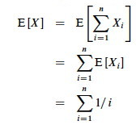
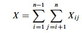
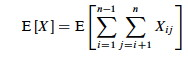
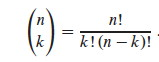
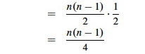
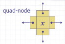
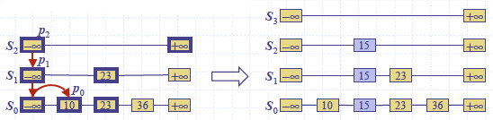
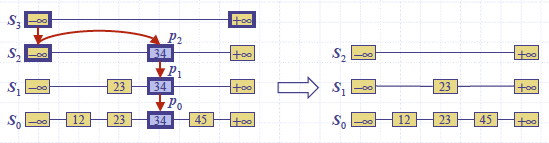
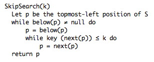

## Outline

  1. Probabilistic Analysis
  2. Randomized Algorithms
  3. Skip Lists 

## Motivations and Preview

Instead of limiting analysis to best case or worst case, analyze all cases
based on a distribution of the probability of each case.

We implicitly used probabilistic analysis when we said that _given random
input_ it takes n/2 comparisons _on average_ to find an item in a linked list
of n items.

### Hiring Problem and Cost

The book's example is a little strange but illustrates the points well.
Suppose you are using an employment agency to hire an office assistant.

  * The agency sends you one candidate per day: interview and decide.
  * Cost to interview is _c__i_ per candidate (fee to agency). 
  * Cost to hire is _c__h_ per candidate (includes firing prior assistant and fee to agency).
  * _ch_ > _ci_
  * You always hire the best candidate seen so far.
    
    
      Hire-Assistant(n)
      1  best = 0                // fictional least qualified candidate
      2  for i = 1 to n
      3    interview candidate i // paying cost  _ci_
      4    if candidate i is better than candidate best
      5      best = i
      6      hire candidate i    // paying cost _ch_
    

What is the cost of this strategy?

  * If we interview _n_ candidates and hire _m_ of them, cost is O(_cin_ \+ _chm_)
  * We interview all _n_ and _ci_ is small, so we focus on _chm_.
  * _chm_ varies with each run and depends on interview order
  * This is a common paradigm: finding the maximum or minimum in a sequence by examining each element, and changing the winner _m_ times.

#### Best Case

If each candidate is worse than all who came before, we hire one candidate:  
    O(_cin_ \+ _ch_) = O(_cin_)

#### Worst Case

If each candidate is better than all who came before, we hire all _n_ (_m_ =
_n_):  
    O(_cin_ \+ _chn_) = O(_chn_) since _ch_ > _ci_  
But this is pessimistic. What happens in the average case?

### Probabilistic Analysis

  * We must know or make assumptions about the distribution of inputs.
  * The expected cost is over this distribution.
  * The analysis will give us **_average case_** running time.

We don't have this information for the Hiring Problem, but suppose we could
assume that candidates come in random order. Then the analysis can be done by
counting permutations:

  * Each ordering of candidates (relative to some reference ordering such as a ranking of the candidates) is equally likely to be any of the n! permutations of the candidates. 
  * In how many do we hire once? twice? three times? ... _n_−1 times? _n_ times?
  * It depends on how many permutations have zero, one two ... _n_−2 or _n_−1 candidates that come before a better candidate.
  * This is complicated!
  * Instead, we can do this analysis with indicator variables (next section)

### Randomized Algorithms

We might not know the distribution of inputs or be able to model it.

Instead we _randomize_ within the algorithm to _impose_ a distribution on the
inputs.

An algorithm is **randomized** if its behavior is determined in parts by
values provided by a random number generator.

This requires a change in the hiring problem scenario:

  * The employment agency sends us a list of _n_ candidates in advance and lets us choose the interview order.
  * We choose randomly.

Thus we _take control_ of the question of whether the input is randomly
ordered: we _enforce_ random order, so the average case becomes the **_
expected value_**.

* * *

## Probabilistic Analysis with Indicator Random Variables

Here we introduce technique for computing the expected value of a random
variable, even when there is dependence between variables. Two informal
definitions will get us started:

A **random variable** (e.g., _X_) is a variable that takes on any of a range
of values according to a probability distribution.

The **expected value** of a random variable (e.g., E[_X_]) is the average
value we would observe if we sampled the random variable repeatedly.

###  Indicator Random Variables

Given sample space _S_ and event _A_ in _S_, define the **indicator random
variable**

We will see that indicator random variables simplify analysis by letting us
work with the probability of the values of a random variable separately.

#### Lemma 1

For an event _A_, let _XA_ = I{_A_}. Then the expected value **E[_XA_] =
Pr{_A_}** (the probability of event _A_).

_Proof:_ Let ¬_A_ be the complement of _A_. Then

> E[_XA_] = E[I{_A_}]   (by definition)  
    = 1*Pr{_A_} + 0*Pr{¬_A_}   (definition of expected value)  
    = Pr{_A_}. 

### Simple Example

What is the expected number of heads when flipping a fair coin once?

  * Sample space _S_ is {H, T}
  * Pr{H} = Pr{T} = 1/2
  * Define indicator random variable _X_H= I{H}, which counts the number of heads in one flip.
  * Since Pr{H} = 1/2, Lemma 1 says that E[_X_H] = 1/2. 

### Less Simple Example

What is the expected number of heads when we flip a fair coin _n_ times?

Let _X_ be a random variable for the number of heads in _n_ flips.

We could compute E[_X_] = ∑_i_=0,_n__i_ Pr{_X_=_i_} \-- that is, compute and
add the probability of there being 0 heads total, 1 head total, 2 heads total
... n heads total, as is done in C.37 in the appendix and in my screencast
lecture [5A](http://youtu.be/MgnvWTZgqcA) \-- but it's messy!

Instead use indicator random variables to count something we _do_ know the
probability for: the probability of getting heads when flipping the coin once:

  * For _i = 1, 2, ... n_ define _Xi_ = I{the _i_th flip results in event H}.
  * Then _X_ = ∑_i_=1,_n__Xi_.   _ (That is, count the flips individually and add them up.)_
  * Lemma 1 says that E[_Xi_] = Pr{H} = 1/2 for _i = 1, 2, ... n_.
  * Expected number of heads is E[_X_] = E[∑_i_=1,_n__Xi_]
  * _Problem:_ We don't have ∑_i_=1,_n__Xi_; we only have E[_X_1], E[_X_2], ... E[_Xn_].
  * _Solution:_ **Linearity of expectation** (appendix C): _**expectation of sum equals sum of expectations.**_ Therefore:   

The key idea: if it's hard to count one way, use indicator random variables to
count an easier way!

### Hiring Problem Revisited

Assume that the candidates arrive in random order.

Let _X_ be the random variable for the number of times we hire a new office
assistant.

Define indicator random variables _X_1, _X_2, ... _Xn_ where _Xi_ =
I{candidate _i_ is hired}.

We will rely on these properties:

  * _X_ = _X_1 \+ _X_2 \+ ... + _Xn_   _(The total number of hires is the sum of whether we did each individual hire (1) or not (0).)_
  * Lemma 1 implies that E[_Xi_] = Pr{candidate _i_ is hired}.

We need to compute Pr{candidate _i_ is hired}:

  * Candidate _i_ is hired iff candidate _i_ is better than candidates 1, 2, ..., _i_−1
  * Assumption of random order of arrival means any of the first _i_ candidates are equally likely to be the best one so far. 
  * Thus, Pr{candidate _i_ is the best so far} = 1/i.   
_(Intuitively, as you add more candidates each candidate is less and less
likely to be better than all the ones prior.)_

By Lemma 1, E[Xi] = _1/i_, a fact that lets us compute E[X]:  

The sum is a harmonic series. From formula A7 in appendix A, the _n_th
**harmonic number** is:  

Thus, the expected hiring cost is O(_ch_ ln _n_), much better than worst case
O(_chn_)! (ln is the natural log. Formula 3.15 of the text can be used to show
that ln _n_ = O(lg _n_.)

We will see this kind of analysis repeatedly. Its strengths are that it lets
us count in ways for which we have probabilities (compare to C.37), and that
it works even when there are dependencies between variables.

### Expected Number of Inversions

This is Exercise 5.2-5 page 122, for which there is a publicly posted
solution. This example shows the great utility of random variables.

Let A[1.. _n_] be an array of _n_ distinct numbers. If _i < j_ and A[_i_] >
A[_j_], then the pair (_i_, _j_) is called an **inversion** of A (they are
"out of order" with respect to each other). Suppose that the elements of A
form a uniform random permutation of ⟨1, 2, ... _n_⟩.

We want to find the expected number of inversions. This has obvious
applications to analysis of sorting algorithms, as it is a measure of how much
a sequence is "out of order". In fact, each iteration of the `while` loop in
insertion sort corresponds to the elimination of one inversion (see the posted
solution to problem 2-4c).

_If we had to count in terms of whole permutations, figuring out how many
permutations had 0 inversions, how many had 1, ... etc. (sound familiar? :),
that would be a real pain, as there are _n_! permutations of n items. Can
indicator random variables save us this pain by letting us count something
easier? _

We will count the number of inversions directly, without worrying about what
permutations they occur in:

Let _Xij_, _i < j_, be an indicator random variable for the event where A[_i_] > A[_j_] (they are inverted).

More precisely, define: X_ij_= I{A[_i_] > A[_j_]} for 1 ≤ _i_ < _j_ ≤ _n_.

Pr{X_ij_ = 1} = 1/2 because given two distinct random numbers the probability
that the first is bigger than the second is 1/2. _(We don't care where they
are in a permutation; just that we can easily identify the probabililty that
they are out of order. Brilliant in its simplicity!)_

By Lemma 1, E[X_ij_] = 1/2, and now we are ready to count.

Let X be the random variable denoting the total number of inverted pairs in
the array. X is the sum of all X_ij_ that meet the constraint 1 ≤ _i_ < _j_ ≤
_n_:  

We want the expected number of inverted pairs, so take the expectation of both
sides:  

Using linearity of expectation, we can simplify this far:  

The fact that our nested summation is choosing 2 things out of _n_ lets us
write this as:  

We can use formula C.2 from the appendix:  

In screencast [5A](http://youtu.be/MgnvWTZgqcA) I show how to simplify this to
(_n_(_n_−1))/2, resulting in:

Therefore the expected number of inverted pairs is _n_(_n_ − 1)/4, or O(_n_2).

* * *

## Randomized Algorithms

Above, we had to _assume_ a distribution of inputs, but we may not have
control over inputs.

An "adversary" can always mess up our assumptions by giving us worst case
inputs. (This can be a fictional adversary in making analytic arguments, or it
can be a real one ...)

Randomized algorithms foil the adversary by _imposing_ a distribution of
inputs.

The modifiation to HIRE-ASSISTANT is trivial: add a line at the beginning that
randomizes the list of candidates.

  * The randomization is now in the algorithm, not the input distribution. 
  * Whereas before the algorithm was deterministic, and we could predict the hiring cost for a given input, now we can no longer say what the hiring cost will be.
  * But our payoff is that no particular input elicits worst-case behavior, even what was worst-case for the deterministic version!
  * Bad behavior occurs only if we get "unlucky" numbers. 

Having done so, the above analysis applies to give us _expected value_ rather
than average case.

_Discuss:_ Summarize the difference between probabilistic analysis and
randomized algorithms.

####  Randomization Strategies

There are different ways to randomize algorithms. One way is to randomize the
ordering of the input before we apply the original algorithm (as was suggested
for HIRE-ASSISTANT above). A procedure for randomizing an array:

    
    
      Randomize-In-Place(A)
      1  _n_ = A.length
      2  for _i_ = 1 to _n_
      3      swap A[_i_] with A[Random(_i_,_n_)]  
    

The text offers a proof that this produces a uniform random permutation. It is
obviously O(_n_).

Another approach to randomization is to randomize choices made within the
algorithm. This is the approach taken by Skip Lists ...

* * *

## Skip Lists

This is additional material, not found in your textbook. I introduce Skip
Lists here for three reasons:

  1. They are a natural extension of the linked list implementation of Dynamic Sets, which we covered recently.
  2. They are a good example of a randomized algorithm, where randomization is used to _improve_ asymptotic behavior from O(_n_) to O(lg _n_).
  3. They are one candidate implementation to be tested in your homework, the Battle of the Dynamic Sets!

Motivation: Why do we have to search the entire linked list one item at a
time? Can't we be more efficient by diving into the middle somewhere?

Skip lists were first described by William Pugh. 1990. Skip lists: a
probabilistic alternative to balanced trees. Commun. ACM 33, 6 (June 1990),
668-676. DOI=10.1145/78973.78977 <http://doi.acm.org/10.1145/78973.78977> or
<ftp://ftp.cs.umd.edu/pub/skipLists/skiplists.pdf> (actually he had a
conference paper the year before, but the CACM verion is more accessible).

My discussion below follows Goodrich & Tamassia (1998), _Data Structures and
Algorithms in Java_, first edition, and uses images from their slides. Some
details differ from the edition 4 version of the text.

An animated applet may be found at
<http://iamwww.unibe.ch/~wenger/DA/SkipList/>.

### Definition of Skip List

Given a set _S_ of items with distinct keys, a **skip list** is a series of
lists _S_0, _S_1, ... _Sh_ (as we shall see, _h_ is the height) such that:

  * Each _S__i_ contains the special keys −∞ and +∞
  * List _S__h_ contains only −∞ and +∞
  * List _S_0 contains all of the keys of _S_ in nondecreasing order. 
  * Each list is a subsequence of the previous one: _S_0 ⊇ _S_1 ⊇ ... ⊇ _Sh_. 

We can implement skip lists with nodes that have `above` and `below` fields as
well as the more familiar `prev` and `next`:

### Searching a Skip List

An algorithm for searching for a key _k_ in a skip list as follows:

    
    
     SkipSearch(k)
       Input: search key k
       Output: Position p in S such that the item at p has the largest key ≤ k.
       Let p be the topmost-left position of S // _which has at least -∞ and +∞_
       while below(p) ≠ null do
           p = below(p)                       // _drop down_
           while key (next(p)) ≤ k do
               p = next(p)                    // _scan forward _
       return p. 
    

Example: Search for 78:

### Insertion and Randomization

Construction of a skip list is randomized:

  * Begin by inserting the new item where it belongs in S0
  * After inserting an item at level Si, flip a coin to decide whether to also insert it at Si+1.
  * If Si+1 does not exist, the height of the Skip lists can be increased.   
_(Alternatively, some policy can be used to limit growth as a function of n,
but the probability of a run of "heads" diminishes greatly as the number of
flips increases.)._

The psuedocode provided by Goodrich & Tamassia uses a helper procedure
`InsertAfterAbove(p1, p2, k, d)` (left as exercise), which inserts key `k` and
data `d` after `p1` and above `p2`. (The following omits code for returning
"elements" not relevant here.)

    
    
     SkipInsert(k,d)
       Input: search key k and data d
       Instance Variables: s is the start node of the skip list,
         h is the height of the skip list, and n the number of entries 
       Output: None (list is modified to store d under k)
       p = SkipSearch(k)
       q = InsertAfterAbove(p, null, k, d)    // _we are at the bottom level_
       l = 0                                  // _keeps track of level we are at_ 
       while random(0,1) ≤ 1/2 do
           l = l + 1
           if l ≥ h then                      // need to add a level
               h = h + 1
               t = next(s)
               s = insertAfterAbove(null, s, −∞, null)
               insertAfterAbove(s, t +∞, null) 
           while above(p) == null do
               p = prev(p)                    // _scan backwards to find tower_
           p = above(p)                       // _jump higher_
           q = insertAfterAbove(p, q, k, d)   // _add new item to top of tower_
       n = n + 1.
    

For example, inserting key 15, when the randomization gave two "heads",
forcing growth of _h_ (for simplicity the figure does not include the above
and below pointers):

Deletion requires finding and removing all occurrences, and removing all but
one empty list if needed. Example for removing key 34:

### Analysis

The **worst case** performance of skip lists is very bad, but highly unlikely.
Suppose `random(0,1)` is always less than 1/2. If there were no bound on the
height of the data structure, `SkipInsert` would never exit! But this is as
likely as an unending sequence of "heads" when flipping a fair coin.

If we do impose a bound _h_ on the height of the list (_h_ can be a function
of _n_), the worst case is that every item is inserted at every level. Then
searching, insertion and deletion is O(_n+h_): you not only have to search a
list S0 of _n_ items, as with conventional linked lists; you also have to go
down _h_ levels.

But the probabilistic analysis shows that the expected time is much better.
This requires that we find the expected value of the height _h_:

  * Probability that item is stored at level _i_ is the probability of getting _i_ consecutive heads: 1/2_i_.
  * Probability P_i_ that level _i_ has at least one item: P_i_ ≤ n/2_i_   _(We had n tries at getting i consecutive heads.)_
  * Probablity that _h_ is larger than _i_ is no more than P_i_.
  * G&T show that given a constant _c_ > 1, the probability that _h_ is larger than _c_ lg _n_ is at most 1/_n__c_−1 (also worked out in screencast [5A](http://youtu.be/MgnvWTZgqcA)).
  * For example, for _c_ = 3, the probability that _h_ is larger than 3 lg _n_ is at most 1/_n_2, which gets very small as n grows (e.g., p = .000001 = 1/1000000 for a list of length 1000).
  * They conclude that the height _h_ is O(lg _n_).

The search time is proportional to the number of drop-down steps plus the
number of scan-forward steps. The number of drop-down steps is the same as _h_
or O(lg _n_). So, we need the number of scan-forward steps.

In their textbook (1998), G&T provide this argument: Let _Xi_ be the number of
keys examined scanning forward at level _i_.

  * After the starting position, each key examined at level _i_ cannot also belong to level _i+1_. _(Why?)_
  * Thus the probability that any key is counted in _Xi_ is 1/2. _(Why??)_
  * Therefore the expected value of _Xi_ is the expected number of times we must flip a coin before it comes up heads: 2.
  * Hence the expected amount of time scanning forward at each level is O(1). _(Wow!)_
  * Since there are O(lg _n_) levels, the expected search time is O(lg _n_). 

In their slides (2002), they provide this alternative analysis of the number
of scan-forwards needed. The reasoning is very similar, but based on the odds
of the list we encounter being constructed:

  * When we scan forward in a list, the destination key does not belong to a higher list.
  * Therefore, a scan forward is associated with a former coin toss that gave tails (otherwise it would be in the higher list).
  * The expected number of coin tosses in order to get tails is 2.
  * Therefore the expected number of scan-forward steps at each level is 2.
  * Thus the total number of expected scan forward steps (summing across all _h_ or O(lg _n_) levels) is O(lg _n_). 

A similar analysis can be applied to insertion and deletion. Thus, skip lists
are far superior to linked lists in performance.

G&T also show that the expected space requirement is O(n). They leave as an
exercise the elimination of `above` and `prev` fields: if random(0,1) is
called up to _h_ times in advance of the insertion search, then one can insert
the item "on the way down" as specified by the results.

* * *

Dan Suthers Last modified: Tue Apr 15 16:40:33 HST 2014  
Images of mathematical expressions are from the instructor's material for
Cormen et al. Introduction to Algorithms, Third Edition. Images of skip lists
are from lecture slides provided by M. Goodrich & R. Tamassia.  

