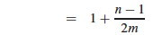
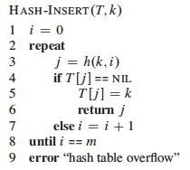

## Outline

  1. Motivations and Introduction
  2. Hash Tables with Chaining 
  3. Hash Functions and Universal Hashing
  4. Open Addressing Strategies

## Motivations and Introduction

Many applications only need the insert, search and delete operations of a
[dynamic set](http://www2.hawaii.edu/~suthers/courses/ics311s14/Notes/Topic-04
.html#dynamicsetadt). Example: symbol table in a compiler.

Hash tables are an effective approach. Under reasonable assumptions, they have
O(1) operations, but they can be Θ(n) worst case

### Direct Addressing

Hash tables generalize arrays. Let's look at the idea with arrays first. Given
a key _k_ from a universe _U_ of possible keys, a **direct address table**
stores and retrieves the element in position _k_ of the array.

Direct addressing is applicable when we can allocate an array with one element
for every key (i.e., of size |_U_|). It is trivial to implement:

However, often the space of possible keys is much larger than the number of
actual keys we expect, so it would be wasteful of space (and sometimes not
possible) to allocate an array of size |_U_|.

### Hash Tables and Functions

**Hash tables** are also arrays, but typically of size proportional to the number of keys expected to be stored (rather than to the number of keys). 

If the expected keys K ⊂ U, the Universe of keys, and |K| is substantially
smaller than |U|, then hash tables can reduce storage requirements to Θ(|K|).

A **hash function** _h(k)_ maps the larger universe U of external keys to
indices into the array. Given a table of size _m_ with zero-based indexing (we
shall see why this is useful):

  * _h_ : U -> {0, 1, ..., _m_-1}.
  * We say that _k_ **hashes** to slot _h(k)_. 

###  Collisions

The major issue to deal with in designing and implementing hash tables is what
to do when the hash function maps multiple keys to the same table entry.

Collisions may or may not happen when |K| ≤ _m_, but definitely happens when
|K| > _m_. _(Is there any way to avoid this?)_

There are two major approaches: Chaining (the preferred method) and Open
Addressing. We'll look at these and also hash function design.

* * *

## Hash Tables with Chaining

A simple resolution: Put elements that hash to the same slot into a linked
list. This is called _chaining_ because we chain elements off the slot of the
hash table.

  * Slot _j_ points to the head of a list of all stored elements that hash to _j_, or to NIL if there are no such elements.
  * Doubly linked lists may be used when deletions are expected to be frequent.
  * Sentinels can also be used to simplify the code.

### Pseudocode for Chaining

Implementation is simple if you already have implemented linked lists:

_What are the running times for these algorithms? Which can we state directly,
and what do we need to know to determine the others?_

### Analysis of Hashing with Chaining

How long does it take to find an element with a given key, or to determine
that there is no such element?

  * Analysis is in terms of the **load factor _α = n/m_**, where 
    * _n_ = number of elements in the table 
    * _m_ = number of slots in the table = number of (possibly empty) linked lists
  * The load factor α is the average number of elements per linked list. 
  * Can have α < 1; α = 1; or α > 1\. 
  * Worst case is when all _n_ keys hash to the same slot.   
_Why? What happens? Θ(_____?)_

  * Average case depends on how well the hash function distributes the keys among the slots. 

Let's analyze averge-case performance under the assumption of **simple uniform
hashing:** any given element is equally likely to hash into any of the _m_
slots:

  * For _j_ = 0, 1, ..., _m_-1, denote the length of list T[_j_] by _nj_.
  * Then _n_ = _n0_ \+ _n1_ \+ ... + _nm-1_. 
  * Average value of _nj_ is E[_nj_] = α = _n/m_. 
  * Assuming _h(k)_ computed in O(1), so time to search for _k_ depends on length _nh(k)_ of the list T[_h(k)_]. 

Consider two cases: Unsuccessful and Successful search. The former analysis is
simpler because you always search to the end, but for successful search it
depends on where in T[_h(k)_] the element with key _k_ will be found.

#### Unsuccessful Search

Simple uniform hashing means that any key not in the table is equally likely
to hash to any of the _m_ slots.

We need to search to end of the list T[_h(k)_]. It has expected length
E[_nh(k)_] = α = _n/m_.

Adding the time to compute the hash function gives **Θ(1 + α)**. (We leave in
the "1" term for the initial computation of _h_ since α can be 0, and we don't
want to say that the computation takes Θ(0) time).

#### Successful Search

We assume that the element _x_ being searched for is equally likely to be any
of the _n_ elements stored in the table.

The number of elements examined during a successful search for _x_ is 1 more
than the number of elements that appear before _x_ in _x_'s list (because we
have to search them, and then examine _x_).

These are the elements inserted _after x_ was inserted (because we insert at
the head of the list).

Need to find on average, over the _n_ elements _x_ in the table, how many
elements were inserted into _x_'s list after _x_ was inserted. _Lucky we just
studied indicator random variables!_

For _i_ = 1, 2, ..., _n_, let _xi_ be the _i_th element inserted into the
table, and let _ki_ = _key_[_xi_].

For all _i_ and _j_, define the indicator random variable:

> _Xij_ = I{_h(ki)_ = _h(kj)_}.     _(The event that keys _ki_ and _kj_ hash
to the same slot.)_

Simple uniform hashing implies that Pr{_h(ki)_ = _h(kj)_} = 1/_m_ _(Why?)_

Therefore, E[_Xij_] = 1/_m_ by Lemma 1 ([Topic #5](http://www2.hawaii.edu/~sut
hers/courses/ics311s14/Notes/Topic-05.html#lemma1)).

The expected number of elements examined in a successful search is those
elements _j_ that are inserted after the element _i_ of interest _and_ that
end up in the same linked list (_Xij_):

  * The innermost summation is adding up, for all _j_ inserted after _i_ (_j_=_i_+1), those that are in the same hash table (when _Xij_ = 1).
  * The outermost summation runs this over all _n_ of the keys inserted (indexed by _i_), and finds the average by dividing by _n_.

I fill in some of the implicit steps in the rest of the text's analysis.
First, by linearity of expectation we can move the E in:

That is the crucial move: instead of analyzing the probability of complex
events, use indicator random variables to break them down into simple events
that we know the probabilities for. In this case we know E[_Xi,j_] (if _you_
don't know, ask the lemming above):

Multiplying 1/_n_ by the terms inside the summation,

  * For the first term, we get Σ_i_=1,_n_1/_n_, which is just _n_/_n_ or 1
  * Move 1/_m_ outside the summation of the second term to get 1/_nm_. This leaves Σ_i_=1,_n_(Σ_j_=_i_+1,_n_1), which simplifies as shown below (if you added 1 _n_ times, you would overshoot by _i_).

Splitting the two terms being summed, the first is clearly _n_2, and the
second is the familiar sum of the first _n_ numbers:

  

Distributing the 1/_nm_, we get 1 + (_n_2/_nm_ \- _n_(_n_+1)/2_nm_   =   1 +
_n_/_m_ \- (_n_+1)/2_m_   =   1 + 2_n_/2_m_ \- (_n_+1)/2_m_, and now we can
combine the two fractions:

Now we can turn two instances of _n_/_m_ into α with this preparation: 1 +
(_n_ \- 1)/2_m_   =   1 + _n_/2_m_ \- 1/2_m_   =   1 + α/2 - n/2_mn_   =  

Adding the time (1) for computing the hash function, the expected total time
for a successful search is:

> Θ(2 + α/2 - α/2_n_) = **Θ(1 + α).**

since the third term vanishes in significance as _n_ grows, and the constants
2 and 1/2 have Θ(1) growth rate.

Thus, **search is an average of Θ(1 + α) in either case.**

If the number of elements stored _n_ is bounded within a constant factor of
the number of slots _m_, i.e., _n_ = O(_m_), then α is a constant, and search
is O(1) on average.

Since insertion takes O(1) worst case and deletion takes O(1) worst case when
doubly linked lists are used, all three operations for hash tables are O(1) on
average.

_(I went through that analysis in detail to show again the utility of
indicator random variables and to demonstrate what is possibly the most
crucial fact of this chapter, but we won't do the other analyses in detail.
With perserverence you can similarly unpack the other analyses.)_

* * *

## Hash Functions and Universal Hashing

Ideally a hash function satisfies the assumptions of simple uniform hashing.

This is not possible in practice, since we don't know in advance the
probability distribution of the keys, and they may not be drawn independently.

Instead, we use heuristics based on what we know about the domain of the keys
to create a hash function that performs well.

### Keys as natural numbers

Hash functions assume that the keys are natural numbers. When they are not, a
conversion is needed. Some options:

  * Floating point numbers: If an integer is required, sum the mantissa and exponent, treating them as integers.
  * Character string: Sum the ASCII or Unicode values of the characters of the string. 
  * Character string: Interpret the string as an integer expressed in some radix notation. (This gives very large integers.) 

### Division method

A common hash function: **_h(k)_ = _k_ mod _m_**.  
_(Why does this potentially produce all legal values, and only legal values?)_

_Advantage:_ Fast, since just one division operation required.

_Disadvantage:_ Need to avoid certain values of _m_, for example:

  * Powers of 2. If _m_ = 2_p_ for integer _p_ then _h(k)_ is the least significant _p_ bits of _k_.   
(There may be a domain pattern that makes the keys clump together).

  * If character strings are interpreted in radix 2_p_ then _m_ = 2_p_ \- 1 is a bad choice: permutations of characters hash the same. 

A prime number not too close to an exact power of 2 is a good choice for _m_.

### Multiplication method

**_h(k)_ = Floor(_m_(_k_ A mod 1))**, where _k_ A mod 1 = fractional part of _k_A. 

  1. Choose a constant A in range 0 < A < 1\. 
  2. Multiply _k_ by A
  3. Extract the fractional part of _k_A
  4. Multiply the fractional part by _m_
  5. Take the floor of the result. 

_Disadvantage:_ Slower than division.

_Advantage:_ The value of _m_ is not critical.

The book discusses an implementation that we won't get into ...

### Universal Hashing 

Our malicious adversary is back! He's choosing keys that all hash to the same
slot, giving worst case behavior and gumming up our servers! What to do?

Random algorithms to the rescue: randomly choose a different hash function
each time you construct and use a new hash table.

But it has to be a good one. Can we define a family of good candidates?

Consider a finite collection _Η_ of hash functions that map universe U of keys
into {0, 1, ..., _m_-1}.

_Η_ is **universal** if for each pair of keys _k, l_ ∈ U, where _k ≠ l_, the
number of hash functions _h ∈ Η_ for which _h(k) = h(l)_ is less than or equal
to _|Η|/m_ (that's the size of _Η_ divided by _m_).

In other words, with a hash function _h_ chosen randomly from _Η_, the
probability of collision between two different keys is no more than _1/m_, the
chance of a collision when choosing two slots randomly and independently.

Universal hash functions are good because (proven as Theorem 11.3 in text):

  * If _k_ is not in the table, the expected length E[_nh(k)_] of the list that _k_ hashes to is less than or equal to α. 
  * If _k_ is in the table, the expected length E[_nh(k)_] of the list that holds _k_ is less than or equal to 1 + α. 

Therefore, the expected time for search is O(1).

One candidate for a collection _Η_ of hash functions is:

> _Η_ = {_hab_(_k_) : **_hab_(_k_) = ((_ak + b_) mod _p_) mod _m_)},** where
_a_ ∈ {1, 2, ..., _p_-1} and _b_ ∈ {0, 1, ..., _p_-1}, where _p_ is prime and
larger than the largest key.

Details in text, including proof that this provides a universal set of hash
functions. Java built in hash functions take care of much of this for you:
read the Java documentation for details.

* * *

## Open Addressing Strategies

Open Addressing seeks to avoid the extra storage of linked lists by putting
all the keys in the hash table itself.

Of course, we need a way to deal with collisions. If a slot is already
occupied we will apply a systematic strategy for searching for alternative
slots. This same strategy is used in both insertion and search.

###  Probes and _h_(_k_,_i_)

Examining a slot is called a **probe**. We need to extend the hash function
_h_ to take the probe number as a second argument, so that _h_ can try
something different on subsequent probes. We count probes from 0 to _m_-1
(you'll see why later), so the second argument takes on the same values as the
result of the function:

> **_h_ : _U_ x {0, 1, ... _m_-1} -> {0, 1, ... _m_-1}**  

We require that the **probe sequence**

> ⟨ _h_(_k_,0),   _h_(_k_,1)   ...   _h_(_k_,_m_-1) ⟩

be a permutation of ⟨ 0, 1, ... _m_-1 ⟩. Another way to state this requirement
is that all the positions are visited.

There are three possible outcomes to a probe: _k_ is in the slot probed
(successful search); the slot contains NIL (unsuccessful search); or some
other key is in the slot (need to continue search).

The strategy for this continuation is the crux of the problem, but first let's
look at the general pseudocode.

### Pseudocode

**Insertion** returns the index of the slot it put the element in _k_, or throws an error if the table is full:

**Search** returns either the index of the slot containing element of key _k_, or NIL if the search is unsuccessful:

**Deletion** is a bit complicated. We can't just write NIL into the slot we want to delete. _(Why?)_

Instead, we write a special value DELETED. During search, we treat it as if it
were a non-matching key, but insertion treats it as empty and reuses the slot.

_Problem:_ the search time is no longer dependent on α. _(Why?)_

The ideal is to have **uniform hashing**, where each key is equally likely to
have any of the _m_! permutations of ⟨0, 1, ... _m_-1⟩ as its probe sequence.
But this is hard to implement: we try to guarantee that the probe sequence is
_some_ permutation of ⟨0, 1, ... _m_-1⟩.

We will define the hash functions in terms of ** auxiliary hash functions**
that do the initial mapping, and define the primary function in terms of its
_i_th iterations, where 0 ≤ _i_ < _m_.

### Linear Probing

Given an **auxiliary hash function _h'_**, the probe sequence starts at
_h'_(_k_), and continues sequentially through the table:

> _h_(_k_,_i_) = (_h'_(_k_) + _i_) mod _m_

_Problem:_ **primary clustering**: sequences of keys with the same _h'_ value
build up long runs of occupied sequences.

### Quadratic Probing

Quadratic probing is attempt to fix this ... instead of reprobing linearly, QP
"jumps" around the table according to a quadratic function of the probe, for
example:

> _h_(_k_,_i_) = (_h'_(_k_) + _c_1_i_ \+ _c_2_i_2) mod _m_,  
where _c_1 and _c_2 are constants.

_Problem:_ **secondary clustering**: although primary clusters across
sequential runs of table positions don't occur, two keys with the same _h'_
may still have the same probe sequence, creating clusters that are broken
across the same sequence of "jumps".

### Double Hashing

A better approach: use two auxiliary hash functions _h1_ and _h_2, where _h_1
gives the initial probe and _h_2 gives the remaining probes (here you can see
that having _i_=0 initially drops out the second hash until it is needed):

> _h_(_k_,_i_) = (_h_1(_k_) + _ih_2(_k_)) mod _m_.

_h_2(_k_) must be relatively prime to _m_ (relatively prime means they have no
factors in common other than 1) to guarantee that the probe sequence is a full
permutation of ⟨0, 1, ... _m_-1⟩. Two approaches:

  * Choose _m_ to be a power of 2 and _h_2 to always produce an odd number > 1.
  * Let _m_ be prime and have 1 < _h_2(_k_) < _m_.   
(The example figure is _h_1(_k_) = _k_ mod 13, and _h_2(_k_) = 1 + (_k_ mod
11).)

There are Θ(_m_2) different probe sequences, since each possible combination
of _h_1(_k_) and _h_2(_k_) gives a different probe sequence. This is an
improvement over linear or quadratic hashing.

### Analysis of Open Addressing

The textbook develops two theorems you will use to compute the expected number
of probes for unsuccessful and successful search. (These theorems require α <
1 because an expression 1/1−α is derived and we don't want to divide by 0.)

> **Theorem 11.6:** Given an open-address hash table with load factor α =
_n_/_m_ < 1, the expected number of probes in an _**unsuccessful**_ search is
at most **1/(1 − α)**, assuming uniform hashing.

> **Theorem 11.8:** Given an open-address hash table with load factor α =
_n_/_m_ < 1, the expected number of probes in a _**successful**_ search is at
most **(1/α) ln (1/(1 − α))**, assuming uniform hashing and assuming that each
key in the table is equally likely to be searched for.

We leave the proofs for the textbook, but note particularly the "intuitive
interpretation" in the proof of 11.6 of the **_expected number of probes_** on
page 275:

> E[_X_]   =   1/(1-α)   =   1   \+   α   \+   α2   \+   α3   \+   ...

We always make the first probe (1). With probability α < 1, the first probe
finds an occupied slot, so we need to probe a second time (α). With
probability α2, the first two slots are occupied, so we need to make a third
probe ...

* * *

Dan Suthers Last modified: Sun Feb 16 02:14:59 HST 2014  
Images are from the instructor's material for Cormen et al. Introduction to
Algorithms, Third Edition.  

