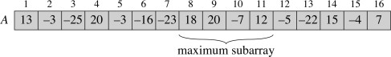
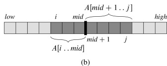
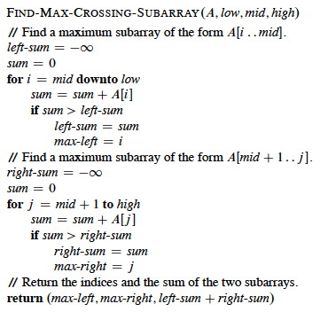
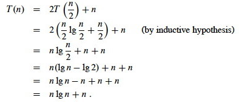
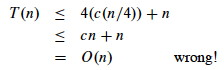
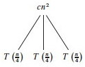
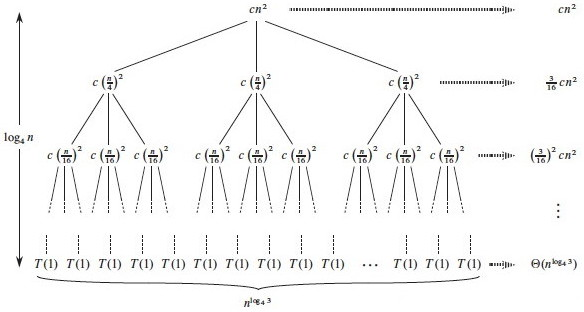

# Outline

  1. Divide & Conquer and Recurrences
  2. Substitution Method
  3. Recursion Trees
  4. Master Theorem & Method

## Divide & Conquer Strategy

**Divide**
    the problem into subproblems that are smaller instances of the same problem. 
**Conquer**
    the subproblems by solving them recursively. If the subproblems are small enough, solve them trivially or by "brute force."
**Combine**
    the subproblem solutions to give a solution to the original problem.

## Recurrences

The recursive nature of D&C leads to _recurrences_, or functions defined in
terms of:

  * one or more base cases, and 
  * itself, with smaller arguments.

Reviewing from [Topic #2](http://www2.hawaii.edu/~suthers/courses/ics311s14/No
tes/Topic-02.html#mergesort), a common (but not the only) form of recurrence
is as follows. Let _T_(_n_) be the running time on a problem of size _n_.

  * If _n_ is below some constant (often, _n_=1), we can solve the problem directly with brute force or trivially in Θ(1) time.
  * Otherwise we divide the problem into _a_ subproblems, each 1/_b_ size of the original. 
  * We pay cost _D_(_n_) to divide the problems and _C_(_n_) to combine the solutions. 
  * We also pay cost _aT_(_n_/_b_) solving subproblems. 

Then the total time to solve a problem of size _n_ can be expressed as:

Some technical points should be made:

  * Subproblems are not constrained to being a constant fraction of the original problem size, for example, you can have T(_n_) = T(_n-1_) + Θ(1).   _(What's an example algorithm that this describes?)_
  * There can be other forms, such as multiple ways of dividing the problem. The book gives an example page 91 that divides the problem into 1/3 and 2/3 parts, requiring terms for T(_n/3_) and T(_2n/3_)
  * Floors and ceilings can easily be removed and don't affect the solution to the recurrence.
  * Boundary conditions (the smaller order terms that result from base cases) are usually Θ(1) and are omitted from asymptotic analyses, though they do matter for exact solutions.
  * Recurrences can be inequalities. We use Big-O or Ω as appropriate. 

Today we cover three approaches to solving such relations: substitution,
recursion tree, and the master method. But first, we look at two examples, one
of which we have already seen ...

### Merge Sort

Sort an array A[_p_ .. _r_] of comparable elements recursivly by divide and
conquer:

**Divide:**
    Given A[_p_ .. _r_], split the given array into two subarrays A[_p_ .. _q_] and A[_q_+1 .. _r_] where _q_ is the halfway point of A[_p_ .. _r_].
**Conquer:**
    Recursively sort the two subarrays. If they are singletons, we have the base case. 
**Combine:**
    Merge the two sorted subarrays with a (linear) procedure Merge ... 

We have seen in [Topic 2](http://www2.hawaii.edu/~suthers/courses/ics311s14/No
tes/Topic-02.html#mergesort) that this has the following recurrence (please
review Topic 2 if you don't see why):

### Recursive Solution to Maximum Subarray

Suppose you have an array of numbers and need to find the subarray with the
maximum sum of elements in the subarray. (The problem is trival unless there
are negative numbers involved.)

The book provides a not very convincing application: there are applications to
graphics (2D version: finding the brightest spot in an image).

The following algorithm is not the fastest known (a linear solution exists),
but it illustrates divide and conquer. The solution strategy, given an array
A[_low_ .. _high_], is:

**Divide**
     the subarray into two subarrays of equal size as possible by finding the midpoint _mid_ of the subarrays. 
**Conquer**
    by finding a maximum subarray of A[_low_ .. _mid_] and A[_mid_+1 .. _high_].
**Combine**
    by also finding a maximum subarray that crosses the midpoint, and using the best solution of the three (the subarray crossing the midpoint and the best of the solutions in the Conquer step).

The strategy works because any subarray must lie in one of these three
positions:

####  Pseudocode

Recursion will handle the lower and upper halves. The algorithm relies on a
helper to find the crossing subarray. Any maximum subarray crossing the
midpoint must include arrays ending at A[_mid_] and starting at A[_mid_+1]:

Therefore the pseudocode finds the maximum array on each side and adds them
up:

It should be clear that the above is Θ(n). The recursive solution follows.

_Check your understanding: Where is the work done? What adds up the values in
the left and right subarrays?_

#### Analysis

The analysis relies on the simplifying assumption that the problem size is a
power of 2 (the same assumption for merge sort). Let T(_n_) denote the running
time of FIND-MAXIMUM-SUBARRAY on a subarray of _n_ elements.

**Base case:**
    Occurs when _high_ equals _low_, so that _n=1_: it just returns in Θ(1) time. 
  
**Recursive Case** (when _n_>1):
    

  * Dividing takes Θ(1) time. 
  * Conquering solves two subproblems, each on an array of n/2 elements: 2T(_n_/2). 
  * Combining calls FIND-MAX-CROSSING-SUBARRAY, which takes Θ(_n_), and some constant tests: Θ(_n_) + Θ(1). 
T(_n_)   =   Θ(1) + 2T(_n_/2) + Θ(_n_) + Θ(1)   =   2T(_n_/2) + Θ(_n_).

The resulting recurrence is the same as for merge sort:

So how do we solve these? We have three methods: Substitution, Recursion
Trees, and the Master Method.

* * *

##  Substitution Method

Don't you love it when a "solution method" starts with ...

  1. Guess the solution!
  2. Use induction to find any unspecified constants and show that the solution works.

Recursion trees (next section) are one way to guess solutions. Experience
helps too. For example, if a problem is divided in half we may expect to see
lg _n_ behavior.

As an example, let's solve the recurrence for merge sort and maximum subarray.
We'll start with an exact rather than asymptotic version:

  1. **Guess:**   T(_n_) = _n_ lg _n_ \+ _n_.  _(Why this guess?)_
  

  2. **Induction:**

**_Basis:_**
    _n_ = 1   ⇒   _n_ lg _n_ \+ _n_   =   1 lg 1 + 1   =   1   =   T(_n_). 
  
**_Inductive Step:_**
    Inductive hypothesis is that T(_k_) = _k_ lg _k_ \+ _k_ for all _k < n_. We'll use _k = n/2_, and show that this implies that T(_n_) = _n_ lg _n_ \+ _n_. First we start with the definition of T(_n_); then we substitute ...   

Induction would require that we show our solution holds for the boundary
conditions. This is discussed in the textbook.

Normally we use asymptotic notation rather than exact forms:

  * writing T(_n_) = 2T(_n/2_) + O(_n_),
  * assuming T(_n_) = O(1) for sufficiently small _n_,
  * not worrying about boundary or base cases, and
  * writing solutions in asymptotic notation, e.g., T(_n_) = O(_n_ lg _n_).

If we want Θ, sometimes we can prove big-O and Ω separately "squeezing" the Θ
result.

But be careful when using asymptotic notation. For example, suppose you have
the case where _a_=4 and _b_=4 and want to prove T(_n_) = O(_n_) by guessing
that T(_n_) ≤ _cn_ and writing:

One must prove the _exact form_ of the inductive hypothesis, T(_n_) ≤ _cn_.

See the text for other strategies and pitfalls.

Problems 4.3-1 and 4.3-2 are good practice problems.

* * *

##  Recursion Trees

Although recursion trees can be considered a proof format, they are normally
used to generate guesses that are verified by substitution.

  * Each node represents the cost of a single subproblem in the set of recursive invocations
  * Sum the costs with each level of the tree to obtain per-level costs
  * Sum the costs across levels for the total cost.

### A Familiar Example

We have already seen recursion trees when analyzing the recurrence relations
for Merge Sort:

  

The subproblems are of size _n_/20, _n_/21, _n_/22, .... The tree ends when
_n_/2_p_ = _n_/_n_ = 1, the trivial subproblem of size 1.

Thus the height of the tree is the power _p_ to which we have to raise 2
before it becomes _n_, i.e., _p_ = lg _n_. Since we start at 20 there are lg
_n_ \+ 1 levels. Multiplying by the work _cn_ at each level, we get _cn_ lg
_n_ \+ _cn_ for the total time.

###  A More Complex Example

A more complex example is developed in the textbook for

> T(_n_) = 3T(_n_/4) + Θ(_n_2)

which is rewritten (making the implied constant explicit) as

> T(_n_) = 3T(_n_/4)+ _cn_2

 node, T(_n_) = 3T(_n_/4)
+_cn_2.

We can develop the recursion tree in steps, as follows. First, we begin the
tree with its root 

Now let's branch the tree for the three recursive terms 3T(_n_/4). There are
three children nodes with T(_n_/4) as their cost, and we leave the cost _cn_2
behind at the root node.

We repeat this for the subtrees rooted at each of the nodes for T(_n/4_):
Since each of these costs 3T((_n_/4)/4) +_c_(_n_/4)2, we make three branches,
each costing T((_n_/4)/4) = T(_n_/16), and leave the _c_(_n_/4)2 terms behind
at their roots.

Continuing this way until we reach the leaf nodes where the recursion ends at
trivial subproblems T(1), the tree looks like this:

Subproblem size for a node at depth _i_ is _n_/4_i_, so the subproblem size
reaches _n_ = 1 when (assuming _n_ a power of 4) _n_/4_i_ = 1, or when _i_ =
log4_n_.  
Including _i_ = 0, there are log4_n_ \+ 1 levels. Each level has 3_i_ nodes.  
Substituting _i_ = log4_n_ into 3_i_, there are 3log4_n_ nodes in the bottom
level.  
Using alogbc = clogba, there are _n_log43 in the bottom level (_not_ _n_, as
in the previous problem).

Adding up the levels, we get:  

It is easier to solve this summation if we change the equation to an
inequality and let the summation go to infinity (the terms are decreasing
geometrically), allowing us to apply equation A.6 (∑_k_=0,∞_xk_ = 1/1-_x_):  

Additional observation: since the root contributes _cn2_, the root dominates
the cost of the tree, and the recurrence must also be Ω(_n_2), so we have
Θ(_n_2).

Please see the text for an example involving unequal subtrees. For practice,
exercises 4.4-6 and 4.4-9 have solutions posted on the book's web site.

* * *

##  Master Theorem & Method

If we have a divide and conquer recurrence of the form

> T(_n_) = _a_T(_n/b_) + _f(n)_  
  
where _a ≥ 1_, _b > 1_, and _f(n) > 0_ is asymptotically positive,

then we can apply the **master method**, which is based on the **master
theorem**. We compare _f(n)_ to _nlogba_ under asymptotic (in)equality:

**Case 1: _f(n)_ = O(_nlogba - ε_)** for some constant _ε_ > 0.  
    (That is, _f(n)_ is polynomially smaller than _nlogba_.)  
    **_Solution:_** T(_n_) = **Θ(_nlogba_).**   
    Intuitively: the cost is dominated by the leaves.

**Case 2: _f(n)_ = Θ(_nlogba_)**, or more generally (exercise 4.6-2): _f(n)_ = Θ(_nlogba_lg_k__n_), where _k_ ≥ 0.  
    (That is, _f(n)_ is within a polylog factor of _nlogba_, but not smaller.)  
    _**Solution:**_ T(_n_) = **Θ(_nlogba_lg_n_),** or T(_n_) = Θ(_nlogba_lg_k+1__n_) in the more general case.  
    Intuitively: the cost is _nlogba_lg_k_ at each level and there are Θ(lg_n_) levels.

**Case 3: _f(n)_= Ω(_nlogba + ε_)** for some constant _ε_ > 0, and _f(n)_ satisfies the regularity condition _af(n/b) ≤ cf(n)_ for some constant _c<1_ and all sufficiently large _n_.   
    (That is, _f(n)_ is polynomially greater than _nlogba_.)  
    _**Solution:**_ T(_n_) = **Θ(_f(n)_)**,  
    Intuitively: the cost is dominated by the root.

Important: there are functions that fall between the cases!

### Examples

**T(_n_) = 5T(_n_/2) + Θ(_n_2)**

  * _a_ = 5, _b_ = 2, _f_(_n_) = _n_2
  * Compare   _n_2   to   _n_log_b__a_ = _n_log25. 
  * log25 - ε = 2 for some constant ε > 0\. 
  * Case 1: T(_n_) = Θ(_n_lg 5). 

**T(_n_) = 27T(_n_/3) + Θ(_n_3 lg _n_)**

  * _a_ = 27, _b_ = 3, _f_(_n_) = _n_3 lg _n_
  * Compare   _n_3 lg _n_   to   _n_log327 = _n_3
  * Case 2 with _k_ = 1: T(_n_) = Θ(_n_3 lg2 _n_). 

**T(_n_) = 5T(_n_/2) + Θ(_n_3)**

  * _a_ = 5, _b_ = 2, _f_(_n_) = _n_3
  * Compare   _n_3   to   _n_log25
  * log25 + ε = 3 for some constant ε > 0\. 
  * Check regularity condition (not necessary since _f_(_n_) is polynomial:  
_a__f_(_n_/_b_) = 5(_n_/2)3 = 5_n_3/8 ≤ _cn_3 for _c_ = 5/8 < 1\.

  * Case 3: T(_n_) = Θ(_n_3). 

**T(_n_) = 27T(_n_/3) + Θ(_n_3 / lg _n_)**

  * _a_ = 27, _b_ = 3, _f_(_n_) = _n_3 / lg _n_
  * Compare   _n_3/lg _n_   to   _n_log327 = _n_3
  * Cases 1 and 3 won't work as no ε can adjust the exponent of 3 to account for the 1/lg_n_ = lg−1_n_ factor. Only hope is Case 2. 
  * But _n_3/lg _n_ = _n_3 lg−1_n_ ≠ Θ(_n_3 lg_k_ _n_) for any _k_ ≥ 0\. 
  * Cannot use master method. 
  * Could try substitution, which requires a guess. Drawing the full recursion tree would be tedious, but perhaps visualizing its general form would help with the guess. 

* * *

## Next

Chapter 12, Binary Search Trees (entire chapter), to which we can apply divide
& conquer and use recurrence relations.

* * *

Dan Suthers Last modified: Sat Feb 8 02:42:12 HST 2014  
Images are from the instructor's material for Cormen et al. Introduction to
Algorithms, Third Edition.  

