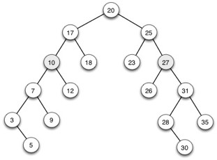
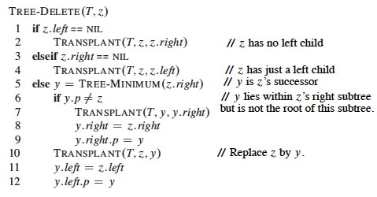

# Reasoning about binary search trees

**1.** Show that if a node in a binary search tree has two children, then its successor Y has no left child and its predecessor has no right child. (_The proofs are symmetric. Hints: Rule out where the successor cannot be to narrow down to where it must be. Draw Pictures!!!_) 

> **(a)** Prove by contradiction that the successor Y cannot be an ancestor of
X, so Y must be in a subtree.  
**(b)** Identify and prove the subtree of X that successor Y must be in.   
**(c)** Show by contradiction that successor Y cannot have a left child.  
**(d)** Indicate how this proof would be changed for predecessor. 

**2\. ** Delete the nodes with keys 10 and 27 from this Binary Search Tree, indicating for each case what "if/elseif" block is executed. (_You will need to apply the cases carefully to get this right: refer to the text or web notes. "Eyeballing" it may lead to a legal tree that would not result from the code._) 

> **(a)** Lines executed in deletion of 10:  
**(b)** Lines executed in deletion of 27: 

