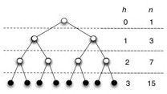
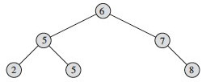
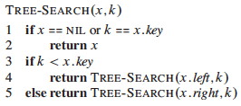
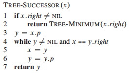
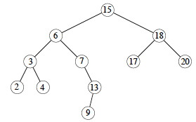
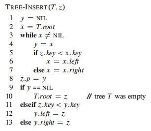
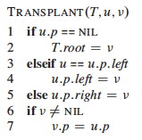
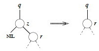
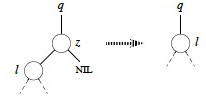
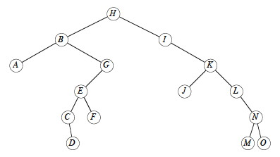

## Outline

  1. Trees, Binary Trees, Binary Search Trees 
  2. Querying BSTs
  3. Modifying BSTs (Insertion and Deletion)
  4. Performance of BSTs 

##  Trees, Binary Trees, Binary Search Trees

First, a preliminary look at trees. (This should be review. Some of this
material is taken from Thomas Standish Data Structure Techniques (1980) and
Goodrich & Tamassia (1998) as well as the Cormen appendix, but is widely
published.)

###  Fundamental Theorem of Free Trees

If _G_=(_V_,_E_) is a finite graph with _v > 1_ vertices, the following
properties are equivalent definitions of a generalized or **free tree**:

  1. _G_ is connected and has no simple cycles. 
  2. _G_ has no simple cycles and has _v-1_ edges (|_E_| = |_V_| - 1)
  3. _G_ is connected and has _v-1_ edges.
  4. _G_ is acyclic, and if an edge is added that joins two nonadjacent vertices, exactly one cycle is formed.
  5. _G_ is connected, but if an edge is deleted, _G_ becomes disconnected. 
  6. Every pair of vertices is connected by exactly one path. 

Although this is a definition, the theorem is that these definitions are
equivalent. A classic exercise in basic graph theory is to prove each of these
statements using the one before it, and #1 from #6.

#### Comments

When we use the term "tree" without qualification, we will assume that we mean
a free tree unless the context makes it clear otherwise (e.g., when we are
discussing binary trees).

In some contexts, _G_=({},{}) and _G_=({_v_},{}) are also treated as trees.
These are obvious base cases for recursive algorithms.

A **forest** is a (possibly disconnected) graph, each of whose connected
components is a tree.

An **oriented tree** is a directed graph having a designated vertex _r_,
called the **root**, and having exacly one oriented path between the root and
any vertex _v_ distinct from the root, in which _r_ is the origin of the path
and _v_ the terminus.

In some fields (such as social network analysis), the word "node" is used
interchangeably with "vertex". I use "vertex" in these notes but may slip into
"node" in my recorded lectures or in class.

### Binary Trees

A **binary tree** is a finite set of vertices that is either empty or consists
of a vertex called the root, together with two binary subtrees that are
disjoint from each other and from the root and are called the **left** and
**right subtrees**.

A **full binary tree ** is a binary tree in which each vertex either is a leaf
or has exactly two nonempty descendants. In a full binary tree of height _h_:

  1. number of leaves = (number internal vertices) + 1.
  2. number leaves is at least _h_+1 _(first example figure)_ and at most 2_h_ _(second example figure)_.

  3. number internal vertices is at least _h_ _(first example)_ and at most 2_h_-1 _(second example)_.
  4. Total number of vertices (summing the last two results) is at least 2_h_+1 _(first example)_ and at most 2_h+1_-1 _(second example)_.
  5. Height _h_ is at least lg(_n_+1)-1 _(second example)_ and at most (_n_-1)/2 _(first example)_

A **complete binary tree ** is full binary tree in which all leaves have the
same depth and all internal vertices have degree 2 _(e.g., second example
above)_.

(_Note:_ some earlier texts allow the last level of a "complete" tree to be
incomplete! They are defined as binary trees with leaves on at most two
adjacent levels _l-1_ and _l_ and in which the leaves at the bottommost level
_l_ lie in the leftmost positions of _l_.)

### Binary Search Trees (BSTs)

A **binary search tree** (BST) is a binary tree that satisfies the **binary
search tree property:**

  * if _y_ is in the left subtree of _x_ then _y.key ≤ x.key_. 
  * if _y_ is in the right subtree of _x_ then _y.key ≥ x.key_. 

BSTs provide a useful implementation of the Dynamic Set ADT, as they support
most of the operations efficiently (as will be seen).

Two examples on the same data:  
 

_Could we just just say "if y is the **left child** of x then y.key ≤ x.key,
etc., and rely on transitivity? What would go wrong?_

Implementations of BSTs include a _root_ instance variable. Implementations of
BST vertices usually include fields for the _key_, _left_ and _right_
children, and the _parent_.

* * *

## Querying Binary Search Trees

Note that all of the algorithms described here are given a tree vertex as a
starting point. Thus, they can be applied to any subtree of the tree as well
as the full tree.

### Traversing Trees

Traversals of the tree "visit" (e.g., print or otherwise operate on) each
vertex of the tree exactly once, in some systematic order. This order can be
**Inorder**, **Preorder**, or **Postorder**, according to when a vertex is
visited relative to its children. Here is the code for inorder:

_Quick exercise: Do INORDER-TREE-WALK on this tree ... in what order are the
keys printed?_

_Quick exercise: How would you define Preorder traversal? Postorder
traversal?_

Traversals can be done on any tree, not just binary search trees. For example,
traversal of an expression tree will produce preorder, inorder or postorder
versions of the expressions.

#### Time to Traverse a BST

**Time:** Traversals (INORDER-TREE-WALK and its preorder and postorder variations) take _T_(_n_) = Θ(_n_) time for a tree with _n_ vertices, because we visit and print each vertex once, with constant cost associated with moving between vertices and printing them. More formally, we can prove as follows:

_T_(_n_) = Ω(_n_) since these traversals must visit all _n_ vertices of the
tree.

_T_(_n_) = O(_n_) can be shown by substitution. First the base case of the
recurrence relation captures the work done for the test _x_ ≠ NIL:

> _T_(0) = _c_ for some constant c > 0

To obtain the recurrence relation for _n_ > 0, suppose the traversal is called
on a vertex _x_ with _k_ vertices in the left subtree and _n_−_k_−1 vertices
in the right subtree, and that it takes constant time _d_ > 0 to execute the
body of the traversal exclusive of recursive calls. Then the time is bounded
by

> _T_(_n_) ≤ _T_(_k_) + _T_(_n_−_k_−1) + _d_.

We now need to "guess" the inductive hypothesis to prove. The "guess" that
CLRS use is _T_(_n_) ≤ (_c_ \+ _d_)_n_ \+ _c_, which is clearly O(_n_). It's
less clear how they got this guess. As discussed in Chapter 4, section 4
(especially subsection "Subtleties" page 85-86), one must prove the exact form
of the inductive hypothesis, and sometimes you can get a better guess by
observing how your original attempt at the proof fails. Perhaps this is what
they did. We'll skip the failure part and go directly to proving their
hypothesis by substitution (showing two steps skipped over in the book):

> **_Inductive hypothesis:_** Suppose that _T_(_m_) ≤ (_c_ \+ _d_)_m_ \+ _c_
for all _m_ < _n_  
  
**_Base Case:_** (_c_ \+ _d_)0 + _c_ = _c_ = _T_(0) as defined above.  
  
**_Inductive Proof:_**  
   _T_(_n_) ≤ _T_(_k_) + _T_(_n_−_k_−1) + _d_
_by definition_  
           = ((_c_ \+ _d_)_k_ \+ _c_) + ((_c_ \+ _d_)(_n_−_k_−1) + _c_) + _d_    _substiting inductive hypothesis for values < n_   
            = ((_c_ \+ _d_)(_k_ \+ _n_ − _k_ − 1) + _c_ \+ _c_ \+ _d_             _collecting factors _   
            = ((_c_ \+ _d_)(_n_ − 1) + _c_ \+ _c_ \+ _d_                         _simplifying _   
            = ((_c_ \+ _d_)_n_ \+ _c_ − (_c_ \+ _d_) + _c_ \+ _d_                   _multiplying out _n_−1 and rearranging _   
            = ((_c_ \+ _d_)_n_ \+ _c_.                                            _the last terms cancel._

### Searching for an Element in a BST

Here are two implementations of the dynamic set operation `search`:

 

_Quick exercise: Do TREE-SEARCH for D and C on this tree ... _

For now, we will characterize the run time of the remaining algorithms in
terms of _h_, the height of the tree. Then we will consider what _h_ can be as
a function of _n_, the number of vertices in the tree.

**Time:** Both of the algorithms visit vertices on a downwards path from the root to the vertex sought. In the worst case, the leaf with the longest path from the root is reached, examining _h_+1 vertices (_h_ is the height of the tree, so traversing the longest path must traverse _h_ edges, and _h_ edges connect _h_+1 vertices). Comparisons and movements to the chosen child vertex are O(1), so the algorithm is O(_h_). (_Why don't we say Θ?_) 

### Finding the Minimum and Maximum Element

The BST property guarantees that:

  * The minimum key of a BST is located at the leftmost vertex.
  * The maximum key of a BST is located at the rightmost vertex.

_(Why?)_ This leads to simple implementations:

 

**Time:** Both procedures visit vertices on a path from the root to a leaf. Visits are O(1), so again this algorithm is O(_h_).

###  Finding the Successor or Predecessor of an Element

Assuming that all keys are distinct, the successor of a vertex _x_ is the
vertex _y_ such that _y.key_ is the smallest _key_ > _x.key_. If _x_ has the
largest key in the BST, we define the successor to be NIL.

We can find _x_'s successor based entirely on the tree structure (no key
comparison is needed). There are two cases:

  1. **If vertex _x_ has a non-empty right subtree, then _x_'s successor is the minimum in its right subtree.** _(Why?)_
  2. **If vertex _x_ has an empty right subtree, then _y_ is the lowest ancestor of _x_ whose left child is also an ancestor of _x_.**   _To see this, consider these facts: _
    * If _y_ is the successor of _x_ then _x_ is the predecessor of _y_, so _x_ is the maximum in _y_'s left subtree _(flip the reasoning of your answer to the last question)_.
    * Moving from _x_ to the left up the tree (up through right children) reaches vertices with smaller keys, which must also be in this left subtree. 

_Exercise: Write the pseudocode for TREE-PREDECESSOR_

Let's trace the min, max, successor (15, 13, 6, 4), and predecessor (6)
operations:

**Time:** The algorithms visit notes on a path down or up the tree, with O(1) operations at each visit and a maximum of _h+1_ visitations. Thus these algorithms are O(_h_). 

_Exercise: Show that if a vertex in a BST has two children, then its succesor
has no left child and its predecessor has no right child._

* * *

##  Modifying Binary Search Trees

The key point is that the BST property must be sustained. This is more
straightforward with insertion (as we can add a vertex at a leaf position)
than with deletion (where an internal vertex may be deleted).

###  Insertion

The algorithm assumes that the vertex _z_ to be inserted has been initialized
with _z.key_ = _v_ and _z.left_ = _z.right_ = NIL.

The strategy is to conduct a search (as in tree search) with pointer _x_, but
to sustain a **trailing pointer** _y_ to keep track of the parent of _x_. When
_x_ drops off the bottom of the tree (becomes NIL), it will be appropriate to
insert _z_ as a child of _y_.

Comment on variable naming: I would have preferred that they call _x_
something like `leading` and _y_ `trailing`.

Try `TREE-INSERT(T,C)`:

**Time:** The same as TREE-SEARCH, as there are just a few additional lines of O(1) pointer manipulation at the end.

_Discuss: How would you use TREE-INSERT and INORDER-TREE-WALK to sort a set of
numbers?_  
_Think about at home: How would you prove its time complexity?_

###  Deletion

Deletion is more complex, as the vertex _z_ to be deleted may or may not have
children. We can think of this in terms of three cases:

  1. If _z_ has no children, we can just remove it (by setting _z_'s parent's pointer to NIL). 
  2. If _z_ has just one child _c_, then make _c_ take _z_'s position in the tree, updating _z_'s parent to point to _c_ and "dragging" _c_'s subtree along.
  3. If _z_ has two children, find _z_'s successor _y_ and replace _z_ by _y_ in the tree (noting that _y_ has no left child): 
    * If _y_ is _z_'s right child, then replace _z_ by _y_ (including updating _z_'s parent to point to _y_, and _y_ to point to _z_'s left child) and we are done. 
    * Otherwise _y_ is further down in _z_'s right subtree (and again has no left child): 
      1. Replace _y_ with its own right child. 
      2. The rest of _z_'s right subtree becomes _y_'s new right subtree.
      3. _z_'s left subtree becomes _y_'s new left subtree.
      4. Make _z_'s parent point to _y_.

The code organizes the cases differently to simplify testing and make use of a
common procedure for moving subtrees around. This procedure replaces the
subtree rooted at _u_ with the subtree rooted at _v_.

  * It makes _u_'s parent become _v_'s parent (lines 6-7), unless _u_ is the root, in which case it makes _v_ the root (lines 1-2).
  * _v_ replaces _u_ as _u_'s parent's left or right child (lines 3-5).
  * It does not update _v.left_ or _v.right_, leaving that up to the caller. 

_(If we have time, draw a few examples.)_

Here are the four actual cases used in the main algorithm TREE-DELETE(T,_z_):

#### No left child (and possibly no children):

If _z_ has no left child, replace _z_ by its right child (which may or may not
be NIL). This handles case 1 and half of case 2 in the conceptual breakdown
above. (Lines 1-2 of final algorithm.)

#### No right child (and has left child):

If _z_ has just one child, and that is its left child, then replace _z_ by its
left child. This handles the rest of case 2 in the conceptual breakdown above.
(Lines 3-4.)

Now we just have to deal with the case where both children are present. Find
_z_'s successor (line 5), which must lie in _z_'s right subtree and have no
left child (_why?_). Handling depends on whether or not the successor is
immediately referenced by _z_:

#### Successor is child:

If successor _y_ is _z_'s right child (line 6), replace _z_ by _y_, "pulling
up" _y_'s right subtree. The left subtree of _y_ is empty so we can make _z_'s
former left subtree _l_ be _y_'s new left subtree. (Lines 10-12.)

#### Successor is not child:

Otherwise, _y_ is within _z_'s right subtree rooted at _r _but is not the root
of this subtree (_y≠r_).

  1. Replace _y_ by its own right child _x_. (Line 7.)
  2. Set _y_ to be _r_'s parent. (Line 8-9.)
  3. Then let _y_ take _z_'s place with respect to _z_'s parent __ and left child _l_. (Lines 10-12.)

Now we are ready for the full algorithm:

The last three lines excecute whenever _z_ has two children (the last two
cases above).

Let's try `TREE-DELETE(T,_x_)` on _x=_ I, G, K, and B:

**Time:** Everything is O(1) except for a call to TREE-MINIMUM, which is O(_h_), so TREE-DELETE is O(_h_) on a tree of height _h_. 

The above algorithm fixes a problem with some published algorithms, including
the first two editions of the book. Those versions copy data from one vertex
to another to avoid a tree manipulation. If other program components maintain
pointers to tree vertices (or their positions in Goodrich & Tamassia's
approach), this could invalidate their pointers. The present version
guarantees that a call to TREE-DELETE(T, _z_) deletes exactly and only vertex
_z_.

An animation is available at
<http://www.csc.liv.ac.uk/~ullrich/COMP102/applets/bstree/> (The code shown
probably has the flaw discussed above.)

* * *

##  Performance of Binary Search Trees

We have been saying that the asympotic runtime of the various BST operations
(except traversal) are all O(lg _h_), where _h_ is the height of the tree. But
_h_ is usually hidden from the user of the ADT implementation and we are more
concerned with the runtime as a function of _n_, our input size. So, what is
_h_ as a function of _n_?

We know that in the worst case, _h_ = O(_n_) (when the tree degenerates to a
linear chain). Is this the expected case? Can we do anything to guarantee
better performance? These two questions are addressed below.

###  Expected height of randomly built binary search trees

The textbook has a proof in section 12.4 that **the expected height of a
randomly build binary search tree on _n_ distinct keys is O(lg _n_).**

We are not covering the proof (and you are not expected to know it), but I
recommend reading it, as the proof elegantly combines many of the ideas we
have been developing, including indicator random variables and recurrences.
(They take a huge step at the end: can you figure out how the log of the last
polynomial expression simplifies to O(lg _n_)?)

An alternative proof provided by Knuth (Art of Computer Programming Vol. III,
1973, p 247), and also summarized by Standish, is based on average path
lengths in the tree. It shows that about 1.386 lg _n_ comparisons are needed:
**the average tree is about 38.6% worse than the best possible tree in number
of comparisons required for average search**.

Surprisingly, _analysts have not yet been able to get clear results when
random deletions are also included_.

### Balanced Trees

Given the full set of keys in advance, it is possible to build an optimally
balanced BST for those keys (guaranteed to be lg _n_ height). See section 15.5
of the Cormen et al. text.

If we don't know the keys in advance, many clever methods exist to keep trees
balanced, or balanced within a constant factor of optimal, by performing
manipulations to re-balance after insertions (AVL trees, Red-Black Trees), or
after all operations (in the case of splay trees). We cover Red-Black Trees in
two weeks ([Topic
11](http://www2.hawaii.edu/~suthers/courses/ics311s14/Notes/Topic-11.html)),
after a diversion to heaps (which have tree-like structure) and sorting.

* * *

## Next

In [Topic
09](http://www2.hawaii.edu/~suthers/courses/ics311s14/Notes/Topic-09.html) we
look at how a special kind of tree, a Heap, can be embedded in an array and
used to implement a sorting algorithm and priority queues.

After a brief diversion to look at other sorting algorithms, we will return to
other kinds of trees, in particular special kinds of binary search trees that
are kept balanced to guarantee O(lg _n_) performance, in [Topic
11](http://www2.hawaii.edu/~suthers/courses/ics311s14/Notes/Topic-11.html).

* * *

Dan Suthers Last modified: Sun Feb 16 02:15:30 HST 2014  
Images are from the instructor's material for Cormen et al. Introduction to
Algorithms, Third Edition.  

