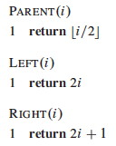
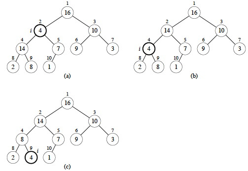
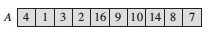
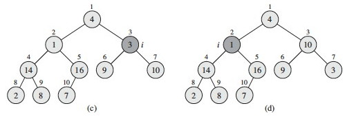
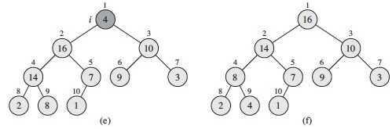
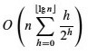
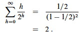
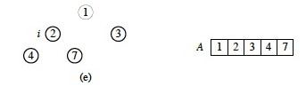
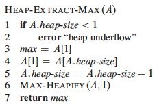
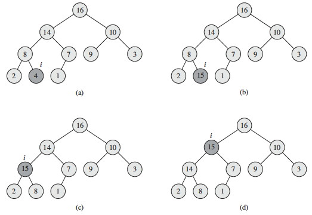

# Heaps, Heapsort, and Priority Queues

## Outline

  1. Heaps and their Properties
  2. Building and Maintaining Heaps
  3. Application to Sorting
  4. Application to Priority Queues

##  Heaps and their Properties

Heaps are a useful data structure with applications to sorting and priority
queues.

They are _nearly complete binary trees_ that satisfy a _heap property_ that
organizes data under a partial ordering of their keys, enabling access to
elements with maximum (or minimum) keys without having to pay the cost of
fully sorting the keys.

Heaps are not to be confused with garbage collected storage (a heap of
garbage)!

### Heaps as Nearly Complete Binary Trees

Conceptually, heaps are **nearly complete binary trees**: they have leaves on
at most two adjacent levels _l-1_ and _l_ and in which the leaves at the
bottommost level _l_ lie in the leftmost positions of _l_:

These quantitative properties concerning full and nearly complete binary trees
will be useful:

#### Number of elements in nearly complete binary trees of height _h_ (6.1-1)

As discussed in [Topic 8](http://www2.hawaii.edu/~suthers/courses/ics311s14/No
tes/Topic-08.html#binarytrees), a **complete binary tree** has at most 2_h_+1
− 1 nodes (vertices). We can see this by adding up the number of elements at
each level: 20 \+ 21 \+ ... + 2h for a complete binary tree of height _h_.
Then apply formula A.5 with _x_=2 and _n_=_h_:

You get (2_h_+1 − 1) / (2 − 1) = 2_h_+1 − 1\.

So, a _nearly_ complete binary tree has _at most_ 2_h_+1 − 1 elements (if it
is complete, as analyzed above). The _fewest_ number of elements it can have
at height _h_ is when the last level has just 1 element and the level before
it is complete. So do the math for a complete binary tree of height _h_−1:
there are exactly 2_h_ − 1 elements in levels 1 to _l_−1 and one more element
in the _l_th level, for a total of 2_h_ elements.

#### Height of an _n_-element nearly complete binary tree (6.1-2)

Given an _n_-element nearly complete binary tree of height _h_, from 6.1-1:

> 2_h_   ≤   _n_   ≤   2_h+1_ − 1   <   2_h+1_

Taking the log of the first, second and last terms,

> _h_   ≤   lg _n_   <   _h_ \+ 1

Since _h_ is an integer, _h_ = ⌊lg _n_⌋     _(Notice the "floor" notation.)_

#### Number of leaves

An _n_-element nearly complete binary tree has ⌈n/2⌉ leaves.     _(Notice the
"ceiling" notation. Left as exercise.)_

####  Nodes of height _h_ in a nearly complete binary tree (6.3-3)

There are at most ⌈n/2h+1⌉ nodes of height _h_ in a nearly complete binary
tree. (A proof by contradiction is possible.)

### The Heap Property

Depending on whether it is a _max heap_ or a _min heap_, to be a heap the
binary tree must also satisfy a heap property:

**Max Heap Property:**
  
    For all nodes _i_, excluding the root, key(parent(_i_)) ≥ key(_i_).  
  
By induction and transitivity of ≥, the max heap property guarantees that the
maximum element of a max-heap is at the root.

  
**Min Heap Property:**
  
    For all nodes _i_, excluding the root, key(parent(_i_)) ≤ key(_i_).  
  
By induction and transitivity of ≤, the min heap property guarantees that the
minimum element of a min heap is at the root.

### Array Representation

Heaps are usually represented using arrays, following the mapping shown by the
indices in the tree:

  

The fact that we can see a heap both as a binary tree and as an array is an
example of a powerful idea in computer science: mapping between an
implementation representation that has efficient computational properties and
a conceptual representation that fits how we think about a problem.

If a heap is stored in array `A`, then movement in the tree is easy:

  * Root of the tree is `A[1]`
  * Parent of `A[_i_]` is `A[⌊_i_/2⌋]`     _(Notice we are taking the floor of _i_/2)_.
  * Left Child of `A[_i_]` is `A[_2i_]`
  * Right Child of `A[_i_]` is `A[_2i+1_]`
  * Index operations are fast in binary (left and right shifts and setting the low order bit).

#### Indices of leaves (6.1-7)

By the number of leaves fact, when an _n_-element heap is stored in the array
representation, the leaves are the nodes indexed by ⌊n/2⌋ \+ 1, ⌊n/2⌋ \+ 2,
..., _n_. (Left as exercise.)

This fact will be used in algorithms that only need to process either the
leaves or the internal nodes of a heap.

* * *

##  Building and Maintaining Heaps

### Maintaining the Heap Property

MAX-HEAPIFY is used to maintain the max-heap property by addressing a possible
violation at node `A[_i_]`:

  * MAX-HEAPIFY assumes that the left and right subtrees of _i_ are max-heaps.
  * When called, `A[_i_]` may (or may not) be smaller than its children, violating the max-heap property if it is.
  * After MAX-HEAPIFY, the subtree rooted at _i_ will be a heap. 

It works by comparing `A[_i_]` with its left and right children (lines 3-7),
and if necessary swapping `A[_i_]` with the larger of the two children to
preserve the heap property (lines 8-9). _Tail recursion_ after the swap
propagates this change until the subtree is a heap (line 10).

#### Example

Max-Heapify from the node at index 2 (containing 4):

#### Analysis

It is easy to see that the body of each call before recursion is O(1), and the
recursion repeats this for at most O(lg _n_) nodes on the path from the root
to the leaves.

More formally, the worst case is when the bottom level is exactly half full,
and in this case, the _children's subtrees_ can have at most 2_n_/3 nodes. So,
adding the cost to recurse on these subtrees plus Θ(1) cost for comparisons at
a given node, we get the recurrence relation:

> _T_(_n_)   ≤   _T_(2_n_/3) + Θ(1).

This fits case 2 of the Master Theorem (_a_ = 1, _b_ = 3/2 since 1/(3/2) =
2/3, and _f_(_n_) = 1 = O(_n_log3/21) = O(_n_0)), giving Θ(lg _n_).

### Building a Heap

Suppose we load some keys into an array in arbitrary order from left to right,
creating an almost complete binary tree that may not satisfy the heap
property.

Each leaf of the corresponding tree is trivially a heap. If we call MAX-
HEAPIFY on the parents of the leaves, the assumption that the right and left
subtrees are heaps is met. Once MAX-HEAPIFY returns, the parents are roots of
heaps too, so we call it on _their_ parents.

Using the previously established result that the leaves begin in the array at
index ⌊n/2⌋ \+ 1, so the last non-leaf node is at ⌊n/2⌋, the implementation is
trivial:

#### Example

Let's trace this on an array of size 10, for _i_ = 5 downto 1:

(a) The heap rooted at vertex or array index 5 is already a max heap: no
change is made.

(b) The heap rooted at index 4 is not a max heap: the value 2 is smaller than
its children. We restore the max heap property by swapping 2 with the larger
child key, 14 (see next figure for result). If we had swapped with 8, it would
not be a max heap: this is why we always swap with the larger child.

(c) Decrementing _i_ to 3, there is another violation of the max heap
property, and we swap value 3 at index 3 with value 10 at index 7 (the larger
child).

(d) The heap at index 2 violates the max heap property: we must propagate the
value 1 down by swapping with 16, and then with 7 in a recursive call to Max-
Heapify (see next figure).

(e) Finally, checking the value at index 1 (value 4) against its children, we
find we need to swap it with value 16 at index 2, and then with value 14 at
index 4 and value 8 at index 9 in two recursive calls to Max-Heapify. (f)
shows the resulting max heap.

#### Correctness

_**Loop Invariant:**_

    At the start of every iteration of the `for` loop, each node _i_+1, _i_+2, ..., _n_ is a root of a max heap.
  
_**Initialization:**_

    By Exercise 6.1-7, each node ⌊n/2⌋ \+ 1, ⌊n/2⌋ \+ 2, ..., _n_ is a leaf, which is the root of a trivial max-heap. Since _i_ = ⌊n/2⌋ before the first iteration of the `for` loop, the invariant is initially true. 
  
_**Maintenance:**_

    Children of node _i_ are indexed higher than _i_, so by the loop invariant, they are both roots of max-heaps. Thus the assumption of MAX-HEAPIFY is met, enabling it to make node _i_ a max-heap root. Decrementing _i_ reestablishes the loop invariant at each iteration.
  
_**Termination:**_

    The loop terminates when _i_ = 0. By the loop invariant, each node including the root indexed by 1 is the root of a max-heap.

#### Analysis

Sometimes a good approach is to prove an easy bound and then tighten it.

It is easy to see that there are O(_n_) (about _n_/2) calls to MAX-HEAPIFY,
and we already know that MAX-HEAPIFY on a tree of height O(lg _n_) is O(lg
_n_). Therefore an upper bound is O(_n_ lg _n_).

However, only the root node and those near it are at height O(lg _n_). Many
nodes are close to the leaves and we don't even process half of them. So let's
try for a tighter bound ...

There are no more than ⌈n/2h+1⌉ nodes of height _h_ (Exercise 6.3-3), and the
heap is ⌊lg_n_⌋ high (Exercise 6.1-2). MAX-HEAPIFY called on a node of height
_h_ is O(_h_), so we need to sum this cost times the number of nodes at each
_h_ for all relevant _h_:

We can simplify this as follows:

  1. Wrap big-O around the whole thing, leaving h behind.
  2. Remove the ceiling (which does not affect big-O analysis).
  3. Rewrite the resulting _nh_/2_h_+1 as (_n_/2)(h/2_h_).
  4. Move _n_/2 out of the summation, as it does not involve _h_.
  5. Eliminate the constant 1/2, as we are inside the magical world of big-O!

Tricky, huh? Now maybe you can see why the text authors write that as:

The above summation runs up to ⌊lg_n_⌋, but we would like to use a convenient
formula A-8, shown below, which runs up to ∞:

Since big-O implies an inequality (upper bound), we can go ahead and run the
summation to ∞ instead of ⌊lg_n_⌋, because all of the additional terms are
positive (and also very small), so the inequality will be maintained. Then, if
we let _x_ = 1/2 (since _h_/2_h_ = _h_(1_h_/2_h_) can be written as h(1/2)h),
we get:

Thus our big-O expression simplifies to O(_n_*2) = O(_n_), which is a tighter
bound than O(_n_ lg _n_). The same analysis appliles to the min-heap version.

(You might wonder why we can build a heap in O(_n_) time when sorting takes
O(_n_ lg _n_), as will be proven in [Topic
10](http://www2.hawaii.edu/~suthers/courses/ics311s14/Notes/Topic-10.html).
This is because a heap is only a partial order, so less work needs to be done
to guarantee the heap property.)

* * *

##  Application to Sorting

Suppose `A[1.._n_]` contains keys to be sorted. If we call BUILD-MAX-HEAP on
this array, the maximum element will be at `A[1]`. We can swap it with the
item at `A[_n_]`, then repeat on `A[1.._n_-1]` (reducing the size of the heap
by 1 each iteration) until this reaches size 1.

#### Analysis:

BUILD-MAX-HEAP is O(_n_) (by analysis above). The `for` loop executes _n_-1
times, with O(1) exchange each iteration and a call to O(lg _n_) MAX-HEAPIFY.
Thus heapsort is O(_n_ lg _n_).

#### Example:

Suppose we have an array A with five integers. First, BUILD-MAX-HEAP is called
on it, resulting in the array A = [7, 4, 3, 1, 2] shown as the tree in (a)
below.

Then the loop of HEAPSORT successively takes out the maximum from the first
index by swapping it with the last element in the heap, and calls MAX-HEAPIFY.
So, 7 is swapped with 2, and then the heap (now one smaller) is reconstructed,
resulting in the heap shown in (b): A = [4, 2, 3, 1, 7], with the first four
elements being the heap.

The maximum element 4 (from b) was swapped with the minimum element 1
(removing 4 from the heap) and the heap restored, resulting in (c) A = [3, 2,
1, 4, 7] with the first three elements being the heap. Then in (d), the max
element 3 was swapped with 1 and the heap restored by percolating 1 down: A =
[2, 1, 3, 4, 7] with the heap being the first two elements.

(e) Finally, the maximum element 2 is removed by swapping with the only
remaining element 1, resulting in the sorted array shown.

Here is a [playing card
demonstration](http://www.youtube.com/watch?v=WYII2Oau_VY) of heap sort, in
case it helps. This demonstration is using a _min-heap_ to sort the cards with
the card of _maximum_ value ending up at the top of the stack of cards.

* * *

##  Application to Priority Queues

An important application of heaps is implementing **priority queues**. There
are _min_ and _max_ versions.

A **max-priority queue** is an ADT with the following operations:

INSERT(S,_x_)

    S <- S ∪ {_x_}
  
MAXIMUM(S)

    Returns the element of S with the largest key.
  
EXTRACT-MAX(S)

    Removes and returns the element of S with the largest key.
  
INCREASE-KEY(S,_x_,_k_)

    Increases the value of _x_'s key to the new value _k_ ≥ current key(_x_).

A **min-priority queue** has corresponding operations MINIMUM, EXTRACT-MIN,
and DECREASE-KEY.

Max-priority queues can be used in job scheduling: the highest priority job is
always run next, but job priority can be increased as a job ages in the queue,
or for other reasons.

Min-priority queues will be very important in graph algorithms we cover later
in the semester: efficient implementations of EXTRACT-MIN and DECREASE-KEY
will be especially important.

Min-priority queues also used in event-driven simulations, where an event may
generate future events, and we need to simulate the events in chronological
order.

#### Accessing Maximums

In the array representation, MAXIMUM is trival to implement in O(1) by
returning the first element of the array. However, if we EXTRACT-MAX we need
to restore the heap property afterwards.

HEAP-EXTRACT-MAX takes the root out, replaces it with the last element in the
heap _(stop and think: why this element?)_, and then uses MAX-HEAPIFY to
propagate that element (which probably has a small key) down to its proper
place:

HEAP-EXTRACT-MAX is O(lg _n_) since there is only constant work added to the
O(lg _n_) MAX-HEAPIFY.

#### Increasing keys

An increase to the key may require propagating the element _up_ the tree (the
opposite direction as compared to MAX-HEAPIFY):

This is clearly O(lg _n_) due to following a simple path up the tree. Let's
work this example, where the element at _i_ has its key increased from 4 to
15, and then it is propagated up:

This propagation follows the "Peter Principle": the claim that persons in a
hierarchical organization are promoted through the ranks of management until
they reach their level of incompetency!!!

#### Inserting New Elements

When inserting, we are going to have to make the heap bigger, so let's add the
element at the end and propagate it up to where it belongs.

HEAP-INCREASE-KEY already has the code for this propagation, so if we set the
key to the smallest possible value and then try to increase it with HEAP-
INCREASE-KEY, it will end up in the right place:

Again, this is O(lg _n_).

* * *

## Next

In [Topic
10](http://www2.hawaii.edu/~suthers/courses/ics311s14/Notes/Topic-10.html) we
wrap up our examination of sort algorithms with Quicksort, a practical sort
that performs well in practice and also illustrates the value of probabilistic
analysis and random algorithms.

We will return to other kinds of trees, in particular special kinds of binary
search trees that are kept balanced to guarantee O(lg _n_) performance, in
[Topic
11](http://www2.hawaii.edu/~suthers/courses/ics311s14/Notes/Topic-11.html).

* * *

Dan Suthers Last modified: Sat Feb 15 16:37:46 HST 2014  
Images are from the instructor's material for Cormen et al. Introduction to
Algorithms, Third Edition.  

