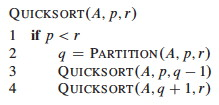
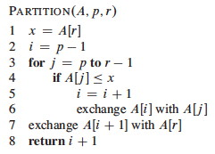

### 1\. Finding _i_th largest element with Partition

#### 1-2 points TBD

How would you _use Quicksort's `Partition` procedure_ to write an algorithm
for _finding the _i_th smallest element of an unsorted array_? _Hint: what
does the returned value of Partition tell you about the rank ordering of the
pivot?_

  * Describe the strategy in English
  * Then if you have time after finishing the next question, write pseudocode for an algorithm.

### 2\. Calls to Partition in Worst and Best Case

#### 3-4 points TBD

When we measure runtime efficiency in terms of _number of comparisons_ to be
made, Quicksort is Θ(_n_2) in the worst case (when the pivot is always chosen
to be the smallest or largest element), and Θ(_n_ lg _n_) in the best case
(when the pivot is always the median key). But we might also try to _measure
efficiency in terms of number of calls to `Partition`_, since all the work is
done in there.

**(a)**   Asymptotically, _how many calls to `Partition` are made in the **worst case runtime**_ as defined above (when the pivot is always chosen to be the smallest or largest element)? Answer with Θ(_f_(_n_)), where your job is to identify _f_.

**(b)**   Asymptotically, _how many calls to `Partition` are made in the **best case runtime**_ as defined above (when the pivot is always the median key)? Answer with Θ(_f_(_n_)), where your job is to identify _f_.

Argue for your conclusions!! _(One approach is to write and solve recurrence
relations. Another approach is to notice that the Quicksort recursion trees
are binary, and use quantitative facts about binary trees. For a big-O rather
than Θ reply, a simple counting argument based on the pseudocode is possible,
but not as rigorous.)_

 

