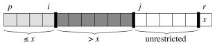
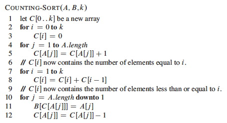
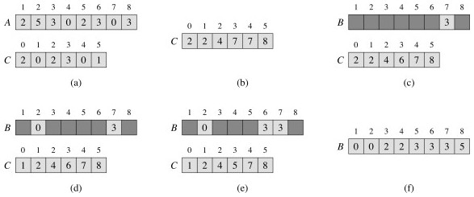
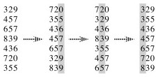
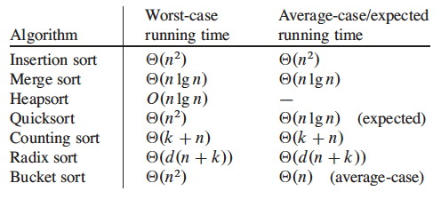

## Notes on quicksort

  1. Quicksort 
  2. Analysis of Quicksort 
  3. Lower Bound for Comparison Sorts 
  4. O(n) Sorts (briefly)

### Motivations

Quicksort, like Mergesort, takes a divide and conquer approach, but on a
different basis.

If we have done two comparisons among three keys and find that _x_ < _p_ and
_p_ < _y_, do we ever need to compare _x_ to _y_? Where do the three belong
relative to each other in the sorted array?

Quicksort uses this idea to partition the set of keys to be sorted into those
less than the pivot _p_ and those greater than the pivot. (It can be
generalized to allow keys equal to the pivot.) It then recurses on the two
partitions.

Compare this to Mergesort.

  * Both take a recursive divide-and-conquer approach.
  * Mergesort does its work on the way back up the recursion tree (merging), while Quicksort does its work on the way down the recursion tree (partitioning).
  * Mergesort always partitions in half; for Quicksort the size of the partitions depends on the pivot (this results in Θ(_n_2) worst case behavior, but expected case remains Θ(_n_ lg _n_).
  * Mergesort requires axillary arrays to copy the data; while as we shall see Quicksort can operate entirely within the given array: it is an **in-place sort**.

Quicksort performs well in practice, and is one of the most widely used sorts
today.

### The Quicksort Algorithm

To sort any subarray A[_p_ .. _r_],   _p_ < _r_:

**_Divide:_**
    Partition A[_p_ .. _r_] into two (possibly empty) subarrays 

  * A[_p_ .. _q-1_], where every element is ≤ A[_q_]
  * A[_q + 1_ .. _r_], where A[_q_] ≤ every element
**_Conquer:_**
    Sort the two subarrays by recursive calls
**_Combine:_**
    No work is needed to combine: all subarrays (including the entire array) are sorted as soon as recursion ends.

An array is sorted with a call to `QUICKSORT(A, 1, A.length)`:

The work is done in the PARTITION procedure. A[_r_] will be the pivot. (Note
that the _end_ element of the array is taken as the pivot. Given random data,
the choice of the position of the pivot is arbitrary; working with an end
element simplifies the code):

PARTITION maintains four regions.

Three of these are described by the following loop invariants, and the fourth
(A[_j_ .. _r_-1]) consists of elements that not yet been examined:

> **Loop Invariant:**

>

>   1. All entries in A[_p_ .. _i_] are ≤ pivot.

>   2. All entries in A[_i_+1 .. _j_-1] are > pivot.

>   3. A[_r_] = pivot.

### Example Trace

It is worth taking some time to trace through and explain each step of this
example of the PARTITION procedure, paying particular attention to the
movement of the dark lines representing partition boundaries.

 

Continuing ...

Here is the [Hungarian Dance version of
quicksort](http://www.youtube.com/watch?v=kDgvnbUIqT4), in case that helps to
make sense of it!

### Correctness

Here use the loop invariant to show correctness:

  1. All entries in A[_p_ .. _i_] are ≤ pivot.
  2. All entries in A[_i_+1 .. _j_ −1] are > pivot.
  3. A[_r_] = pivot. 

**_Initialization:_**
    Before the loop starts, _x_ is assigned the pivot A[_r_] (satisfying condition 3), and the subarrays a[_p_ .. _i_] and A[_i_+1 .. _j_−1] are empty (trivially satisfying conditions 1 and 2). 
**_Maintenance:_**
    While the loop is running, 

  * if A[_j_] ≤ pivot, then _i_ is incremented, A[_j_] and A[_i_] are swapped, and _j_ is incremented. Because of the swap, A[_i_] ≤ _x_ for condition 1. The item swapped into A[_j_-1] > _x_ by the loop invariant, for condition 2.
  * If A[_j_] > pivot, then _j_ is incremented, sustaining condition 2 (the others are unchanged), as the element added was larger
**_Termination:_**
    The loop terminates when _j_=_r_, so all elements in A are partitioned into one of three cases: A[_p_ .. _i_] ≤ pivot, A[_i_+1 .. _r_-1] > pivot, and A[_r_] = pivot. The last two lines fix the placement of A[_r_] by moving it between the two subarrays.

* * *

##  Informal Analysis

The formal analysis will be done on a randomized version of Quicksort. This
informal analysis helps to motivate that randomization.

First, PARTITION is Θ(_n_): We can easily see that its only component that
grows with _n_ is the `for` loop that iterates proportional to the number of
elements in the subarray).

The runtime depends on the partitioning of the subarrays:

### Worst Case

The worst case occurs when the subarrays are completely unbalanced, i.e.,
there are 0 elements in one subarray and _n_-1 elements in the other subarray
(the single pivot is not processed in recursive calls). This gives a familiar
recurrence (compare to that for insertion sort):

One example of data that leads to this behavior is when the data is already
sorted: the pivot is always the maximum element, so we get partitions of size
_n_−1 and 0 each time. Thus, _quicksort is O(_n_2) on sorted data_. Insertion
sort actually does better on a sorted array! (O(_n_))

### Best Case

The best case occurs when the subarrays are completely balanced (the pivot is
the median value): subarrays have about _n_/2 elements. The reucurrence is
also familiar (compare to that for merge sort):

### Effect of Unbalanced Partitioning

It turns out that expected behavior is closer to the best case than the worst
case. Two examples suggest why expected case won't be that bad.

#### Example: 1-to-9 split

Suppose each call splits the data into 1/10 and 9/10. This is highly
unbalanced: won't it result in horrible performance?

We have log10_n_ full levels and log10/9_n_ levels that are nonempty.

As long as it's constant, the base of the log does not affect asymptotic
results. Any split of constant proportionality will yield a recursion tree of
depth Θ(lg _n_). In particular (using ≈ to indicate truncation of low order
digits),

> log10/9_n_ = (log2_n_) / (log210/9)     _by formula 3.15_  
            ≈ (log2_n_) / 0.152   
            = 1/0.152 (log2_n_)  
            ≈ 6.5788 (log2_n_)  
            = Θ(lg _n_), where _c_ = 6.5788. 

So the recurrence and its solution is:

A general lesson that might be taken from this: sometimes, even very
unbalanced divide and conquer can be useful.

#### Example: extreme cases cancel out

With random data there will usually be a mix of good and bad splits throughout
the recursion tree.

A mixture of worst case and best case splits is asymptotically the same as
best case:

Both these trees have the same two leaves. The extra level on the left hand
side only increases the height by a factor of 2, and this constant disappears
in the Θ analysis.

Both result in O(_n_ lg _n_), though with a larger constant for the left.

* * *

##  Randomized Quicksort

We expect good average case behavior if all input permutations are equally
likely, but what if it is not?

To get better performance on sorted or nearly sorted data -- and to foil our
adversary! -- we can randomize the algorithm to get the same effect as if the
input data were random.

Instead of explicitly permuting the input data (which is expensive),
randomization can be accomplished trivially by **random sampling** of one of
the array elements as the pivot.

If we swap the selected item with the last element, the existing PARTITION
procedure applies:

  

Now, even an already sorted array will give us average behavior.

_Curses! Foiled again!_

* * *

##  Quicksort Analysis

The analysis assumes that all elements are unique, but with some work can be
generalized to remove this assumption (Problem 7-2 in the text).

### Worst Case

The previous analysis was pretty convincing, but was based on an assumption
about the worst case. This analysis proves that our selection of the worst
case was correct, and also shows something interesting: we can solve a
recurrence relation with a "max" term in it!

PARTITION produces two subproblems, totaling size _n_-1. Suppose the partition
takes place at index _q_. The recurrence for the worst case always selects the
maximum cost among all possible ways of splitting the array (i.e., it always
picks the worst possible _q_):

Based on the informal analysis, we guess T(_n_) ≤ _cn_2 for some _c_.
Substitute this guess into the recurrence:

The maximum value of _q_2 \+ (_n_ \- _q_ \- 1)2 occurs when _q_ is either 0 or
_n_-1 (the second derivative is positive), and has value (_n_ \- 1)2 in either
case:

Substituting this back into the reucrrence:

We can pick _c_ so that _c_(2_n_ \- 1) dominates Θ(_n_). Therefore, the worst
case running time is O(_n_2).

One can also show that the recurrence is Ω(_n_2), so worst case is Θ(_n_2).

### Average (Expected) Case

With a randomized algorithm, expected case analysis is much more informative
than worst-case analysis.
_[Why?](http://www2.hawaii.edu/~suthers/courses/ics311s14/Notes/Topic-10/why-
expected.txt)_

This analysis nicely demonstrates the use of indicator variables and two
useful strategies.

#### Setup

The dominant cost of the algorithm is partitioning. PARTITION removes the
pivot element from future consideration, so is called at most _n_ times.

QUICKSORT recurses on the partitions. The amount of work in each call is a
constant plus the work done in the `for` loop. We can count the number of
executions of the `for` loop by counting the number of comparisons performed
in the loop.

Rather than counting the number of comparisons in each call to QUICKSORT, it
is easier to derive a bound on the number of comparisons across the entire
execution.

This is an example of a strategy that is often useful: **if it is hard to
count one way** (e.g., "locally"), **then count another way** (e.g.,
"globally").

Let _X_ be the total number of comparisons in all calls to PARTITION. The
total work done over the entire execution is O(_n_ \+ _X_), since QUICKSORT
does constant work setting up _n_ calls to PARTITION, and the work in
PARTITION is proportional to _X_. But what is _X_?

#### Counting comparisons

For ease of analysis,

  * Call the elements of A _z_1, _z_2, ... _z__n_, with _z__i_ being the _i_th smallest element. 
  * Define the set Z_ij_ = {_z__i_, _z__i_ \+ 1, ... _z__j_} to be the set of elements between _z__i_ and _z__j_ inclusive. 

We want to count the number of comparisons. Each pair of elements is compared
at most once, because elements are compared only to the pivot element and then
the pivot element is never in any later call to PARTITION.

Indicator variables can be used to count the comparisons. (Recall that we are
counting across all calls, not just during one partition.)

> Let _Xij_ = I{ _zi_ is compared to _zj_ }

Since each pair is compared at most once, the total number of comparisons is:

Taking the expectation of both sides, using linearity of expectation, and
applying Lemma 5.1 (which relates expected values to probabilities):

 

#### Probability of comparisons

What's the probability of comparing _z_i to _z_j?

Here we apply another useful strategy: **if it's hard to determine when
something happens, think about when it does _ not_ happen**.

Elements (keys) in separate partitions will not be compared. If we have done
two comparisons among three elements and find that _zi_ < _x_ <_zj_, we do not
need to compare _zi_ to _zj_ (no further information is gained), and QUICKSORT
makes sure we do not by putting _zi_ and _zj_ in different partitions.

On the other hand, if either _zi_ or _zj_ is chosen as the pivot before any
other element in Z_ij_, then that element (as the pivot) will be compared to
_all_ of the elements of Z_ij_ except itself.

  * The probability that _zi_ is compared to _zj_ is the probability that either is the first element chosen.
  * Since there are _j_ \- _i_ \+ 1 elements in Z_ij_, and pivots are chosen randomly and independently, the probability that any one of them is chosen first is 1/(_j_ \- _i_ \+ 1). 

Therefore (using the fact that these are mutually exclusive events):

We can now substitute this probability into the analyis of E[_X_] above and
continue it:

This is solved by applying equation A.7 for harmonic series, which we can
match by substituting _k_ = _j_ \- _i_ and shifting the summation indices down
_i_:

We can get rid of that pesky "+ 1" in the denominator by dropping it and
switching to inequality (after all, this is an upper bound analysis), and now
A7 (shown in box) applies:

 

Above we used the fact that logs of different bases (e.g., ln _n_ and lg _n_)
grow the same asymptotically.

To recap, we started by noting that the total cost is O(_n_ \+ _X_) where _X_
is the number of comparisons, and we have just shown that _X_ = O(_n_ lg _n_).

Therefore, the _average running time of QUICKSORT on uniformly distributed
permutations (random data)_ and the _expected running time of randomized
QUICKSORT_ are both O(_n_ \+ _n_ lg _n_) = **O(_n_ lg _n_)**.

This is the same growth rate as merge sort and heap sort. _Empirical studies
show quicksort to be a very efficient sort in practice (better than the other
_n_ lg _n_ sorts) whenever data is not already ordered._ (When it is nearly
ordered, such as only one item being out of order, insertion sort is a good
choice.)

* * *

##  Lower Bound for Comparison Sorts

We have been studying sorts in which the only operation that is used to gain
information is pairwise comparisons between elements. So far, we have not
found a sort faster than O(_n_ lg _n_).

It turns out it is not possible to give a better guarantee than O(_n_ lg _n_)
in a comparison sort.

The proof is an example of a different level of analysis: of all _possible_
algorithms of a given type for a problem, rather than particular algorithms
... pretty powerful.

### Decision Tree Model

A decision tree abstracts the structure of a comparison sort. A given tree
represents the comparisons made by a specific sorting algorithm on inputs of a
given size. Everything else is abstracted, and we count only comparisons.

#### Example Decision Tree

For example, here is a decision tree for insertion sort on 3 elements.

Each internal node represents a branch in the algorithm based on the
information it determines by comparing between elements indexed by their
original positions. For example, at the nodes labeled "2:3" we are comparing
the item that was originally at position 2 with the item originally at
position 3, although they may now be in different positions.

Leaves represent permutations that result. For example, "⟨2,3,1⟩" is the
permutation where the first element in the input was the largest and the third
element was the second largest.

This is just an example of one tree for one sort algorithm on 3 elements. Any
given comparison sort has one tree for each _n_. The tree models all possible
execution traces for that algorithm on that input size: a path from the root
to a leaf is one computation.

#### Reasoning over All Possible Decision Trees

We don't have to know the specific structure of the trees to do the following
proof. We don't even have to specify the algorithm(s): the proof works for any
algorithm that sorts by comparing pairs of keys. We don't need to know what
these comparisons are. Here is why:

  * The root of the tree represents the unpermuted input data.
  * The leaves of the tree represent the possible permuted (sorted) results.
  * The branch at each internal node of the tree represents the outcome of a comparision that changes the state of the computation. 
  * The paths from the root to the leaves represent possible courses that the computation can take: to get from the unsorted data at the root to the sorted result at a leaf, the algorithm must traverse a path from the root to the correct leaf by making a series of comparisons (and permuting the elements as needed) 
  * The length of this path is the runtime of the algorithm on the given data.
  * Therefore, if we can derive a lower bound on the height of _any_ such tree, we have a lower bound on the running time _any_ comparison sort algorithm. 

### Proof of Lower Bound

We get our result by showing that the number of leaves for a tree of input
size _n_ implies that the tree must have minimum height O(_n_ lg _n_). This
will be a lower bound on the running time of _any_ comparison sort algorithm.

  * There are at least _n_! leaves because every permutation appears at least once (the algorithm must correctly sort every possible permutation): _l_ ≥ _n_! 
  * Any binary tree of height _h_ has _l_ ≤ 2_h_ leaves ([Notes #8](http://www2.hawaii.edu/~suthers/courses/ics311s14/Notes/Topic-08.html))
  * Putting these facts together:   _n_! ≤ _l_ ≤ 2_h_   or   2_h_ ≥ _n_!
  * Taking logs:   _h_ ≥ lg(_n_!) 
  * Using Sterling's approximation (formula 3.17):   _n_! > (_n_/_e_)_n_
  * Substituting into the inequality: 

> _h_   ≥   lg(_n_/_e_)_n_  
    =   _n_ lg(_n_/_e_)  
    =   _n_ lg _n_ \- _n_ lg _e_   
    =   Ω (_n_ lg _n_). 

Thus, the height of a decision tree that permutes _n_ elements to all possible
permutations cannot be less than _n_ lg _n_.

A path from the leaf to the root in the decision tree corresponds to a
sequence of comparisons, so there will always be some input that requires at
least O(_n_ lg _n_) comparisions in _any_ comparision based sort.

There may be some specific paths from the root to a leaf that are shorter. For
example, when insertion sort is given sorted data it follows an O(_n_) path.
But to give an o(_n_ lg _n_) guarantee (i.e, strictly better than O(_n_ lg
_n_)), one must show that _ all_ paths are shorter than O(_n_ lg _n_), or that
the tree height is o(_n_ lg _n_) and we have just shown that this is
impossible since it is Ω(_n_ lg _n_).

* * *

##  O(n) Sorts

Under some conditions it is possible to sort data without comparing two
elements to each other. If we know something about the structure of the data
we can sometimes achieve O(n) sorting. Typically these algorithms work by
using information about the keys themselves to put them "in their place"
without comparisons. We only introduce these algorithms very briefly so you
are aware that they exist.

### Counting Sort

Assumes (requires) that keys to be sorted are integers in {0, 1, ... _k_}.

For each element in the input, determines how many elements are less than that
input.

Then we can place the element directly in a position that leaves room for the
elements below it.

An example ...

Counting sort is a **stable sort**, meaning that two elements that are equal
under their key will stay in the same order as they were in the original
sequence. This is a useful property ...

Counting sort requires Θ(_n_ \+ _k_). Since _k_ is constant in practice, this
is Θ(_n_).

### Radix Sort

Using a stable sort like counting sort, we can sort from least to most
significant digit:

This is how punched card sorters used to work. _ (When I was an undergraduate
student my University still had punched cards, and we had to do an assignment
using them mainly so that we would appreciate not having to use them!)_

The code is trivial, but requires a stable sort and only works on _n_ _d_-
digit numbers in which each digit can take up to _k_ possible values:

If the stable sort used is Θ(_n_ \+ _k_) time (like counting sort) then RADIX-
SORT is Θ(_d_(_n_ \+ _k_)) time.

### Bucket Sort

This one is reminiscent of hashing with chaining.

It maps the keys to the interval [0, 1), placing each of the _n_ input
elements into one of _n_-1 buckets. If there are collisions, chaining (linked
lists) are used.

Then it sorts the chains before concatenating them.

It assumes that the input is from a random distribution, so that the chains
are expected to be short (bounded by constant length).

#### Example:

The numbers in the input array A are thrown into the buckets in B according to
their magnitude. For example, 0.78 is put into bucket 7, which is for keys 0.7
≤ _k_ < 0.8. Later on, 0.72 maps to the same bucket: like chaining in hash
tables, we "push" it onto the beginning of the linked list.

At the end, we sort the lists (B shows the lists after they are sorted;
otherwise we would have 0.23, 0.21, 0.26) and then copy the values from the
lists back into an array.

But sorting linked lists is awkward, and I am not sure why CLRS's pseudocode
and figure imply that one does this. In an alternate implementation, steps 7-9
can be done simultaneously: scan each linked list in order, inserting the
values into the array and keeping track of the next free position. Insert the
next value at this position and then scan back to find where it belongs,
swapping if needed as in insertion sort.

Since the values are already partially sorted, an insertion procedure won't
have to scan back very far. For example, suppose 0.78 had been inserted after
0.72. The insertion would only have to scan over one item to put 0.78 in its
place, as all values in lists 0..6 are smaller.

* * *

## Comparing the Sorts

You can also compare some of the sorts with these animations (set to 50
elements): <http://www.sorting-algorithms.com/>. Do the algorithms make more
sense now?

* * *

## Next

We return to the study of trees, with balanced trees.

* * *

Dan Suthers Last modified: Wed Feb 19 02:14:38 HST 2014  
Images are from the instructor's material for Cormen et al. Introduction to
Algorithms, Third Edition, and from Wikipedia commons.  

