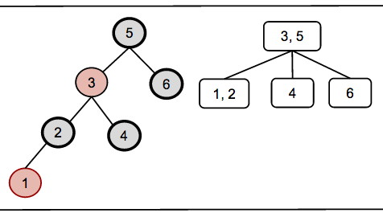

#### 1\. Peer Credit Assignment

Please list the names of the other members of your peer group for this week
and the number of extra credit points you think they deserve for their
participation in group work on Tuesday and Thursday combined.

  * If all three members besides yourself were present at some time, you have a total of 3 points to allocate.
  * If only two members besides yourself were present, you have a total of 4 points to allocate.
  * If only one other member was present, you have a total of 6 points to allocate.
  * You need not allocate all the points available to you. Points allocated to yourself will not be recorded.

### RBT and (2,4) Deletion

**2\. (6 pts)** Delete the keys **8, 6, 5, 3, 2, 1** in that order from the red/black tree shown below with its (2,4) representation. Following the format we used in class (see above), for each key:
   
(a) Show the RBT after the BST-style deletion but before RB-Delete-Fixup  
(b) Identify (in writing) whether there is a **double black (identifying the node)**, corresponding to underflow. 
(c) Identify (in writing) the situation (the color of the sibling and its
children) and its remedy (adjustment, recolor, and/or or restructure?), using
the cases in the web notes.  
(d) Show the RBT after RB-Delete-Fixup  
(e) Show the (2,4) tree representation that results.

The solution to Thursday's sequence of insertions is shown below, to be sure
you start with a correct tree. You may use a drawing program or just do it on
paper in dark ink (or soft dark pencil that reproduces well) and scan or
photograph your work.

### Cormen et al. RBT Code

The lecture notes were based on Goodrich & Tamassia's textbook, because they
show the correspondence of RBTs to 2-4 trees, which makes the former easier to
understand as balanced trees.

The CLRS version differs somewhat. Because of CLRS's reputation, I would tend
to trust their version for an actual implementation, even if their
presentation is more difficult to understand. Below are a few questions to
help you understand the CLRS version.

The cases for insertion are similar between G&T and CLRS, but the terminology
differs (e.g., what the letters w, x, y, and z refer to). The cases for
deletion differ: G&T have 3 while CLRS have 4! Be careful because there are
mirror images of every situation (e.g., is the double black node a left child
or a right child?): G&T and CLRS may be describing the same situation with
mirror image graphs.

The top level methods in CLRS for RB-INSERT (p. 315) and RB-DELETE (p. 324)
essentially do legal binary search three (BST) insertion and deletion, and
then call "FIXUP" methods to fix the red-black properties. Thus they are very
similar to the BST methods TREE-INSERT (p. 294) and TREE-DELETE (p. 298). The
real work specific to RBTs is in these fixup methods, so we will focus on them
in these questions, but you should also study the top level methods to
understand them as BST methods.

#### In RB-INSERT-FIXUP (p. 316):

**3\. (1 pt)** Which lines of the code handle incorrect representation of the 2-4 node (G&T case 1 in the web notes)? 

**4\. (1 pt)** Which lines of the code handle overflow of the 2-4 node (G&T case 2 in the web notes)? 

#### In RB-DELETE-FIXUP (p. 326):

**5\. (1 pt)** _During the while loop of RB-DELETE-FIXUP, which line(s) of code remove double-black from node x?_ Note: do NOT answer "line 23" as this is outside the while loop: I am asking how double black moves up the tree inside the while loop. You will need to read the text: the code doesn't make it obvious. But once you have understood this, the cases in figure 13.7 will be easier to understand for the next question. 

**6\. (1 pt)** G&T deletion has three cases (see web notes) while CLRS deletion has four (see figure 13.7 and explanation in the text). Two of the G&T cases correspond to the CLRS cases. Which G&T deletion cases map directly to which CLRS deletion cases? (Give two pairs). Explain why. 

The correspondence between the other cases is harder to understand in a simple
way. If you see it, you are welcome to try to explain it.

* * *

Dan Suthers Last modified: Sat Mar 1 03:35:53 HST 2014

