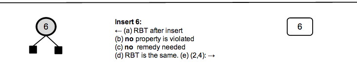
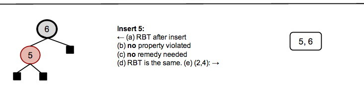
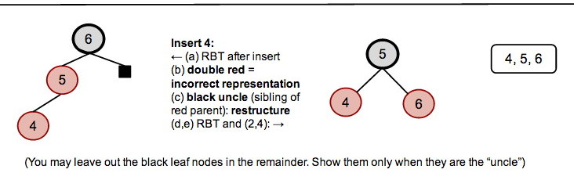
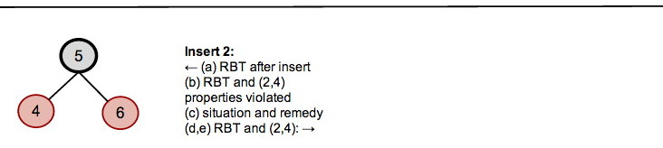

## In Class Thursday

Insert the keys **6, 5, 4, 2, 3, 1** in that order into a Red-Black Tree
representation of a (2,4) balanced tree. For each key:  

(a) Show the RBT after the insertion but before RB-Insert-Fixup  

(b) Identify (in writing) the RBT property that is violated and whether that
violation corresponds to overflow in or incorrect representation of the
corresponding (2,4) tree (see next item to help you decide this).  

(c) Identify (in writing) the situation (red uncle/sibling or black
uncle/sibling?) and its remedy (recolor or restructure?).  

(d) Show the RBT after RB-Insert-Fixup  

(e) Show the (2,4) tree representation that results.  

The first three keys have been inserted to get you started.

  
  
  
  

