## Outline

  * Balanced and Multi-Way Trees 
  * 2-3-4 or (2,4) Trees 
  * Red-Black Trees 
    * as a binary representation of (2,4) trees
    * as binary search trees
  * Insertion in Red-Black Trees
  * Deletion in Red-Black Trees
  * Comparison of Dictionary Implementations

_(Much of this material is derived from Goodrich & Tamassia's slides widely
available on the Web.)_

* * *

##  Multi-Way Trees

A **multi-way search tree** is an ordered tree such that

  * Each internal node has at least two children and stores _d_-1 key-element items (_ki_, _oi_), where _d_ is the number of children
  * For a node with children _v1_ _v2_ ... _vd_ storing keys _k1_ _k2_ ... _kd-1_
    * keys in the subtree of _v1_ are less than _k1_
    * keys in the subtree of _vi_ are between _ki-1_ and _ki_ (_i_ = 2, ..., _d_ \- 1)
    * keys in the subtree of _vd_ are greater than _kd-1_
  * The leaves store no items and serve as placeholders

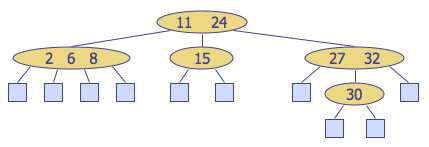

**Multi-way inorder traversal** can be defined by extension of BST inorder traversal to visit the keys in increasing order:

> Visit item (_ki_, _oi_) of node _v_ between the recursive traversals of the
subtrees of _v_ rooted at children _vi_ and _vi+1_.

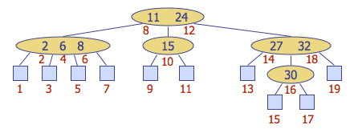

**Searching** can similarly be extended to multi-way trees by searching within each node as well as down the tree:

  * At each internal node with children _v1_ _v2_ ... _vd_ and keys _k1_ _k2_ ... _kd-1_: 
    * _k_ = _ki_ (_i_ = 1, ... , _d_ \- 1): the search terminates with success
    * _k_ < _k1_: we continue the search in child _v1_
    * _ki-1_ < _k_ < _ki_ (_i_ = 2, ... , _d_ \- 1): we continue the search in child _vi_
    * _k_ > _kd-1_: we continue the search in child _vd_
  * Reaching an external node terminates the search unsuccessfully

For example, searching for key 30:

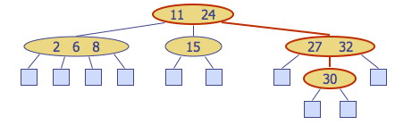

* * *

## (2,4), 2-4 or 2-3-4 Trees

These are multi-way trees restricted in two ways:

  * **Node Size Property**: every internal node has at least two children (one key) and at most four children (three keys).
  * **Depth Property**: all of the external nodes have the same depth. (The tree is balanced.)

The internal nodes are called 2-nodes, 3-nodes or 4-nodes, depending on the
number of children they have.

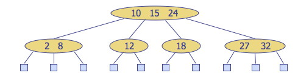

### Height of (2,4) Trees and Searching

**_Theorem:_ A (2,4) tree storing n items has height Θ(log n).**

Proof:

Let _h_ be the height of a (2,4) tree with _n_ items. The tallest possible
tree (worst case) for a fixed _n_ is when all internal nodes are 2-nodes
(i.e., the tree is equivalent to a binary tree), so we restrict consideration
to this case. Due to the depth property, the tree at depth _h_-1 is filled, so
it is a complete binary tree.

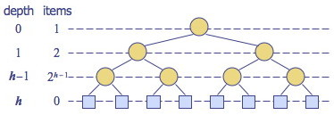

The figure illustrates the number of nodes in each level of a complete binary
tree. Since there are at least 2_i_ items at depth _i_ = 0, ... , _h_-1 and no
items at depth _h_ (the leaves store no items):  
    _n_ ≥ 1 + 2 + 4 + ... + 2_h_-1  
(we use ≥ because there could be more items in internal 3-nodes or 4-nodes,
leading to "better cases" where _n_ increases without a penalty in _h_).

Applying formula A5 (shown) for geometric series with _n_ = _h_-1 and _x_ = 2,  
1 + 2 + 4 + ... + 2_h_-1 = Σ_k_=0,_h_-12_k_ = (2(h-1) + 1 \- 1)/(2 - 1) = 2_h_
\- 1, so  
    _n_ ≥ = 2_h_ \- 1   or   n + 1 ≥ 2_h_

Taking the log of both sides:   lg (_n_ \+ 1) ≥ _h_.  
Thus, _h_ = Θ(lg _n_).

(See also similar facts concerning full binary trees in [Topic
8](http://www2.hawaii.edu/~suthers/courses/ics311f12/Notes/Topic-08.html).)

Since searching in a (2,4) tree with _n_ items requires time proportional to a
path from root to leaves, searching is **O(lg _n_)** time.

### (2,4) Tree Insertion

We will examine insertion and deletion briefly to understand the conceptual
cases.

Insert a new item keyed by _k_ into _(not below)_ the parent of the leaf
reached by searching for _k_. (_In this respect, (2,4) trees differ from
binary search trees._)

This preserves depth but may cause **overflow** (a node may become a 5-node).

_Example:_ Inserting 30, we find its position between 27 and 32. However
inserting here causes overflow:

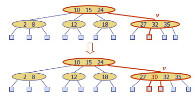

Overflow is handled with a **split operation**, as illustrated below with a
simpler tree:

  * The 5-node containing keys _k1_, _k2_, _k3_, _k4_ is split into a 3-node with keys _k1_, _k2_ and a 2-node with key _k4_.
  * Key _k3_ is inserted into the parent node (as would be the case with the tree above).
  * Overflow may propagate to the parent node.
  * A new root may be created if the root overflows.

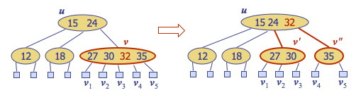

_(Note: Sedgewick splits 4-nodes on the way down while searching for the
insertion position, guaranteeing that there will be no overflow. Both Goodrich
& Tamassia and Cormen et al. take the other approach, propagating splits
upwards only as needed. The asymptotic time complexity remains the same.)_

#### Time Complexity of (2,4) Insertion

A tree with _n_ items has Θ(lg _n_) height. The algorithm first searches for
the insertion location, which may require visiting _h_ = Θ(lg _n_) nodes (Θ,
not O, because we must go to the leaves in all cases). The insertion takes
Θ(1) time. If there is overflow, splits (taking Θ(1) time each) may be
propagated upwards to as many as O(lg _n_) nodes. Since the Θ(lg _n_)
overrides the possibility of slower growing functions in O(lg _n_), insertion
is **Θ(lg _n_)**.

### (2,4) Tree Deletion

If the entry to be deleted is in a node that has internal nodes as children,
we replace the entry to be deleted with its inorder successor and delete the
latter entry. Example: to delete key 24, we replace it with 27 (inorder
successor):

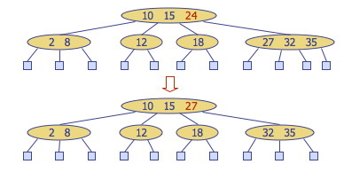

This reduces deletion of an entry to the case where the item is at the node
with leaf children.

Deletion of an entry from a node _v_ may cause **underflow,** where node _v_
becomes a 1-node with one child and no keys. Underflow at node _v_ with parent
_u_ is handled in two cases.

**_Case 1_**: An adjacent sibling of _v_ is a 2-node. Perform a **fusion operation**, merging _v_ with the adjacent 2-node sibling _w_ and moving an entry from _u_ to the merged node _v'_.

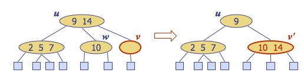

After a fusion, the underflow may propagate to the parent u, for at most O(lg
_n_) adjustments up the tree.

**_Case 2_**: An adjacent sibling _w_ of _v_ is a 3-node or a 4-node. Perform a **transfer operation:** move a child of _w_ to _v_; an item from _u_ to _v_; and an item from _w_ to _u_. 

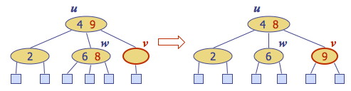

A transfer eliminates underflow.

#### Time Complexity of (2,4) Deletion

The algorithm first searches for the item to delete, which requires visiting
_h_ = Θ(lg _n_) nodes on the way down the tree, either to find a bottom level
key to delete, or to find the successor of a key in an internal node to
delete. Underflow is handled with up to O(lg _n_) fusions and transfers, each
taking Θ(1) time. Thus deletion is **Θ(lg _n_)**.

* * *

##  Red-Black Trees

### Red-Black Tree Properties

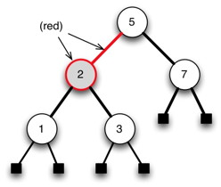

A red-black tree (RBT) is a binary search tree with the following additional
properties:

  1. **Color property**: Every node is either red or black. _(We can indicate this either by coloring the node or by coloring its parent link.)_
  2. **Root property**: The root is black
  3. **External property**: Every leaf is black.
  4. **Internal property**: If a node is red, then both of its children are black. _(Hence, no two reds in a row are allowed on a simple path from the root to a leaf.)_
  5. **Depth property**: For each node, all the paths from the node to descendant leaves contain the same number of black nodes (the **black height** of the node).

These properties seem rather arbitrary until we consider the correspondence
with (2,4) trees shortly, but first let's see how the properties hold in an
example ...

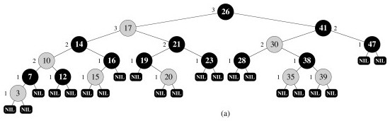

### Red-Black Tree Representation

A single extra bit is required on each node to mark it as "red" or "black".

To save space, we can represent the leaf nodes _and_ the parent with a single
node, T.nil:

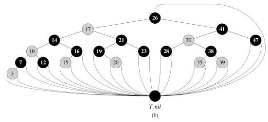

This also simplifies the code, as we can follow pointers without having to
check for null pointers.

We usually don't draw T.nil:

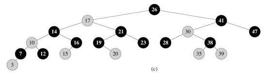

### RBTs as a Binary Representation of (2,4) Trees

It would be rather complex to implement and manipulate 2-nodes, 3-nodes and
4-nodes. One motivation for red-black trees is that they provide a binary tree
representation of (2,4) trees, enabling us to manipulate only one kind of
node. The mapping is as follows (__you should make sure you understand this
well before going on!__):

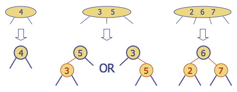

**Red nodes (and the links from their parents) capture the _internal structure of a (2,3) node_;**

**Black nodes (and the links from their parents) capture the _structure of the (2,3) tree_ itself.**

### RBTs as Binary Search Trees

At the same time as they represent (2,4) trees, _**RBTs are also Binary Search
Trees**_: they satisfy the Binary Search Tree property. For example, here is a
RBT: we can search for keys or enumerate elements in order as usual:

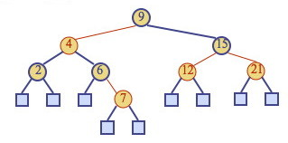

In order to maintain the Red-Black-Tree properties, it will be necessary to do
structural rotations. These rotations are designed to not disrupt the BST
property. For example, this rotation does not disturb the BST ordering of keys
9, 11, 12, 14, 17, 18, 19:

#### Height of Red-Black Trees and Searching

Theorem: A red-black tree storing n items has height Θ(lg _n_).  
Proof:

  * Let _h_ be the height of a red-black tree with _n_ items
  * By property 4, there cannot be more red nodes (and links) on a simple path from the root to a leaf than there are black nodes (and links). 
  * Therefore the black height of the root of the tree is between _h_ and _h_/2. 
  * The black height of the root of the red-black tree corresponds to the height _h'_ of the (2,4) tree that the red-black tree represents (since red nodes/links in the RBT represent the internal structure of the nodes in the (2,4) tree). 
  * From the theorem concerning the height of (2,4) trees, _h'_ is Θ(lg _n_). 
  * Since _h_ is no more than twice _h'_, _h_ is also Θ(lg _n_).

(See Cormen et al. for a proof not relying on (2,4) trees.)

Therefore, searching in a red-black tree with _n_ items takes **O(lg _n_)**
time (O rather than Θ as we may find the key in an internal node).

We now consider insertion and deletion. Please see the textbook for the many
details of implementation in pseudocode, etc.: here we will concentrate on
seeing how the RBT operations correspond to (2,4) tree operations.

###  Insertion in Red-Black Trees

To insert an element with key _k_, perform the insertion for binary search
trees (except that conceptually we insert _k_ in an internal node with null
children, not at a leaf node), and color the newly inserted node _z_ red,
unless it is the root.

This preserves the color, root, external, and depth properties. _(You should
check this in the example below.)_

If the parent _v_ of _z_ is black, this also preserves the internal property
and we are done.

Else (_v_ is red), we have a **double red** (i.e., a violation of the internal
property), which requires a reorganization of the tree. For example, insert 4:

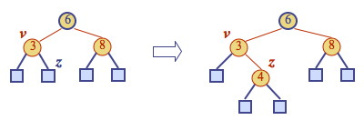

A double red with child _z_ and parent _v_ is dealt with in two cases. Let _w_
be the sibling of _v_ (and hence the uncle of _z_).

**_Case 1:_** _w_ is black. The double red is an _**incorrect representation**_ of a 4-node. (We will fix this with restructuring). For example, the RBT on the left is an incorrect representation of the (2,4) tree on the right:

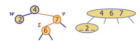

**_Case 2:_** w is red. The double red corresponds to an _**overflow**_ in the (2,4) tree. (We will fix this with recoloring, which is the equivalent of a (2,4) split.) For example:

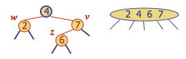

#### Restructuring

**Restructuring** remedies a child-parent double red when the parent red node has a black sibling. It restores the correct representation (internal property) of a 4-node, leaving other RBT and BST properties intact: 

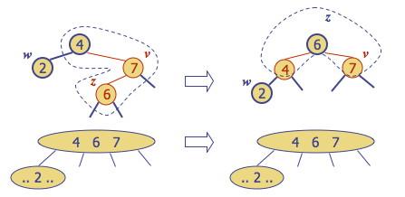

There are four restructuring configurations depending on whether the double
red nodes are left or right children. They all lead to the same end
configuration of a black with two red children:

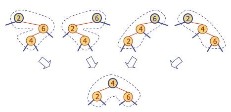

After a restructuring, the double red has been remedied without violating any
of the other properties _(you should verify this)_: there is no need to
propagate changes upwards.

Notice that the height of the subtree tree has been reduced by one. **_This is
the operation that keeps the trees balanced to within a constant factor of
lg(_n_) height_**, by ensuring that the height of the RBT is no more than
twice that of the (necessarily balanced) 2-4 tree it represents. _Do you see
why?_

#### Recoloring

**Recoloring** remedies a child-parent double red when the parent red node has a red sibling. The parent _v_ and its sibling _w_ become black and the grandparent _u_ becomes red, unless it is the root.

It is equivalent to performing a split on a 5-node in a (2,4) tree. (When
there is a double red and yet another red in the parent's sibling, we are
trying to collect too many keys under the grandparent.) For example, the RBT
recoloring on the top corresponds to the (2,4) transformation on the bottom:

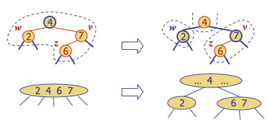

Notice that in this example the parent "4" is now red, meaning it belongs to
its parent node in the (2,4) tree. The double red violation may propagate to
this parent in the RBT, which corresponds to the overflow propagating up the
(2,4) tree, requiring further repair.

#### Time Complexity of RBT Insertion

We already established that insertion in (2,4) trees is Θ(lg _n_) due to their
height. Since RBTs are only at most twice as high, we might expect this result
to transfer, and it does, but it needs to be shown separately since the
manipulations of the RBT are different. So:

  * The algorithm first searches for the insertion location, which will require visiting _h_ = Θ(lg _n_) nodes on the way down the tree (since we are searching for a leaf node and the tree is balanced).
  * Adding the item takes O(1). 
  * Recolorings and restructurings are Θ(1) each, and we perform at most O(lg _n_) recolorings and _one_ restructuring propagating structural changes back up the tree.

Thus insertion is **Θ(lg _n_).**

Note: A top-down version of this algorithm is also possible, restructuring on
the way down and requiring only one pass through the tree. See the Sedgewick
reading distributed.

###  Deletion in Red-Black Trees

To remove item with key _k_, we first perform the BST deletion (modified for
our representational changes using T.nil).

Because deletion of a node higher in the tree involves replacing it with its
successor, which is then deleted, deletion always involves an internal and an
external node.

We can preserve the RBT properties at the new internal location of the
successor by giving the successor the color of the node deleted, so we need
only be concerned with possible violations of RBT properties at the bottom of
the tree, where the successor was moved from, or where a node without a
successor was deleted.

Let _v_ be the internal node removed, _w_ the external node removed, and _r_
the sibling of _w_:

    
    
        x       
         \               x                    
          v       ==>     \
         / \               r 
        r   w
    

If either _v_ or _r_ was red, we color _r_ black and we are done (the number
of black nodes has not changed).

Else (_v_ and _r_ were both black), we have removed a black node, violating
the depth property. We fix this by coloring _r_ **double black,** a fictional
color. (Intuitively, the black of both _v_ and _r_ have been absorbed into
_r_.) Now we have the correct "amount" of black on this path from root to
leaf, but the double black violates the color property.

Fixing this will require a reorganization of the tree. Example: deletion of 8
causes a double black:

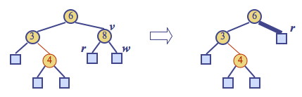

A double black corresonds to _**underflow**_ in (2,4) trees (and here the
images I am borrowing from Goodrich & Tamassia go to greyscale!):

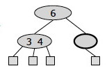

Goodrich & Tamassia's algorithm for remedying a double black node _w_ with
sibling _y_ considers _three cases_, discussed below. _(Note that these are
different from CLRS's four cases!)_

**_Case 1:_** _y_ is black and has a red child: Perform a RBT **restructuring**, equivalent to a (2,4) **transfer**, and we are done.

For example, if we have the RBT on the left corresponding to underflow in the
(2,4) tree on the right:

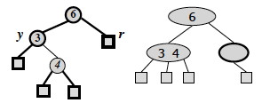

... we do the following restructuring:

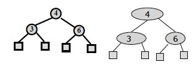

**_Case 2:_** _y_ is black and its children are both black: Perform a RBT **recoloring**, equivalent to a (2,4) **fusion**, which may propagate up the double black violation.

If the double-black reaches the root we can just remove it, as it is now on
_all_ of the paths from the root to the leaves, so does not affect property 5,
the depth property.

For example, if we have the RBT on the left corresponding to underflow in the
(2,4) tree on the right:

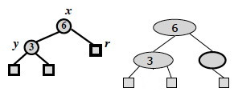

... we do the following recoloring: the black node _y_ is colored red, and the
double black node _r_ is colored ordinary black:

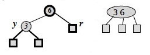

The root of the above subtree takes on an extra black, which propagates only
if it was previously black and is not the root. If it was red it merely turns
black; if it was the root the extra black no longer affects the balanced black
height of the tree.

**_Case 3:_** _y_ is red: Perform a RBT **adjustment**, equivalent to choosing a different representation of a 3-node, after which either Case 1 or Case 2 applies.

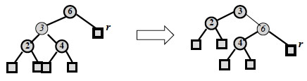

These are both representations of the following 2-4 tree, but the
transformation allows one of the other cases to apply, reducing duplication of
cases.

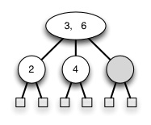

The CLRS chapter divides the situation up into four cases: try to see whether
you can map between the above cases and theirs!

#### Time Complexity of RBT Deletion

The analysis is similar to the previous ones: Θ(lg _n_) search to find the
deletion point (the item to delete may be in an internal node, but we always
find its successor in any case, which is at the bottom of the tree), followed
by deletion and restructuring O(1) operations that are propagated at most up
O(lg _n_) levels. Deletion is **Θ(lg _n_)**.

### RBT Animations

You may want to look at these:

<http://secs.ceas.uc.edu/~franco/C321/html/RedBlack/redblack.html>

    A java applet. You can go step by step and it tells you the rules violated and the fixes. Must click on "next step" until done with process. To delete, click on Delete and then on the node to be deleted.
<http://www.csanimated.com/animation.php?t=Red-black_tree>

     A flash animation: slides with voice-over. It goes kind of fast (little time to figure out what property is being fixed in each case), and does not let you control slide by slide. 

* * *

## Related Data Structures

**AVL Trees,** named for their authors, are the oldest balanced trees. They are binary trees with the requirement that the heights of the left and right subtree of any given node differ at most by 1\. A small amount of extra storage is needed to record height differences. Their operations are O(lg _n_) like RBTs, but may require O(lg _n_) rotations to rebalance. 

**Splay Trees** are binary trees in which an adjustment moving a node towards the root called _splaying_ is done after every access (including search). There are no rules about properties to maintain and no labels. Amazingly, splaying alone is enough to guarantee O(lg _n_) behavior in an amortized sense: we will use these as an example when we cover chapter 17 Amortized analysis. They also make frequently accessed items more accessible. 

**B-Trees,** covered in Chapter 18 of Cormen et al. (but not in this course), are balanced multi-way trees that allow up to M keys per node for large M. They are used for trees in external (disk) storage, where speed is optimized by making the size of a node be the same as the size of a block read in by one disk read.

* * *

##  Comparison of Dictionary Implementations

First, here is a summary of the correspondence between (2,4) and Red-Black
tree operations:

<table width="100%" border="1">
  <tr>
    <th colspan="3" scope="col">
Insertion: Remedy double red
</th>
  </tr>
  <tr>
    <th scope="row">
(2,4) tree action
</th>
    <td>
<strong>Red-Black Tree Action</strong>
</td>
    <td>
<strong>Result</strong>
</td>
  </tr>
  <tr>
    <td>Change of 4-node representation</td>
    <td>Restructuring</td>
    <td>Double red removed</td>
  </tr>
  <tr>
    <td>Split</td>
    <td>Recoloring</td>
    <td>Double red removed or propagated up</td>
  </tr>
  <tr>
    <th colspan="3" scope="row">&nbsp;</th>
  </tr>
  <tr>
    <th colspan="3" scope="row">
Deletion: Remedy double black
</th>
  </tr>
  <tr>
    <th scope="row">
(2,4) tree action
</th>
    <td><strong>Red-Black Tree Action</strong></td>
    <td><strong>Result</strong></td>
  </tr>
  <tr>
    <td>Transfer</td>
    <td>Restructuring</td>
    <td>Double black removed</td>
  </tr>
  <tr>
    <td>Fusion</td>
    <td>Recoloring</td>
    <td>Double black removed or propagated up</td>
  </tr>
  <tr>
    <td>Change of 3-node representation</td>
    <td>Adjustment</td>
    <td>Restructuring or recoloring follows</td>
  </tr>
</table>

### A comparison of run times.

<table width="100%" border="1">
  <tr>
    <th scope="col">&nbsp;</th>
    <th scope="col">Search</th>
    <th scope="col">Insert</th>
    <th scope="col">Delete</th>
    <th scope="col">Notes</th>
  </tr>
  <tr>
    <th scope="row">Hash Table</th>
    <td>O(1) expected</td>
    <td>O(1) expected</td>
    <td>O(1) expected</td>
    <td>
No ordered dictionary methods. Simple to implement.

    </td>
  </tr>
  <tr>
    <th scope="row">Doubly Linked List</th>
    <td>O(<i>n</i>)</td>
    <td>O(1) if not sorted; O(<i>n</i>) if sorted </td>
    <td>&Theta;(1) if node given, O(<i>n</i>) otherwise</td>
    <td>Simple to implement.</td>
  </tr>
  <tr>
    <th scope="row">Skip List</th>
    <td>O(lg <i>n</i>) with high probability</td>
    <td>O(lg <i>n</i>) with high probability</td>
    <td>O(lg <i>n</i>) with high probability</td>
    <td>Randomized insertion. Simple to implement.</td>
  </tr>
  <tr>
    <th scope="row">Binary Tree</th>
    <td>O(<i>n</i>) worst case, O(lg <i>n</i>) random </td>
    <td>O(<i>n</i>) worst case, O(lg <i>n</i>) random </td>
    <td>O(<i>n</i>) worst case, O(lg <i>n</i>) random </td>
    <td>Moderately complex to implement deletion.</td>
  </tr>
  <tr>
    <th scope="row">Red-Black Tree</th>
    <td>O(lg <i>n</i>) worst case</td>
    <td>&Theta;(lg <i>n</i>)</td>
    <td>&Theta;(lg <i>n</i>) </td>
    <td>Complex to implement.</td>
  </tr>
</table>

From this we can see that hash tables are most efficient expected behavior
when no ordered methods are needed, and red-black trees give us the best
guarantee when ordering matters.

* * *

Dan Suthers Last modified: Mon Mar 3 20:13:52 HST 2014  
Images are from lecture slides provided by Michael Goodrich and Roberto
Tamassia, and from the instructor's material for Cormen et al. Introduction to
Algorithms, Third Edition.  

