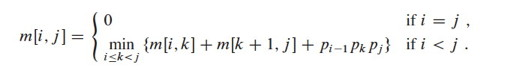
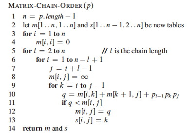
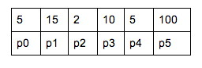
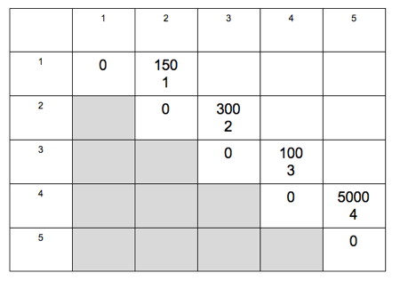

#### 1\. Peer Credit Assignment

Please list the names of the other members of your peer group for this week
and the number of extra credit points you think they deserve for their
participation in group work on Tuesday and Thursday combined.

  * If all three members besides yourself were present at some time, you have a total of 3 points to allocate.
  * If only two members besides yourself were present, you have a total of 4 points to allocate.
  * If only one other member was present, you have a total of 6 points to allocate.
  * You need not allocate all the points available to you. Points allocated to yourself will not be recorded.

* * *

### Dynamic Programming

#### 2\. (8 pts) Matrix Chain

The Matrix Chain multiplication problem is the classic dynamic programming
problem: every algorithms textbook I have seen uses it as an example. Thus you
should at least be familiar with it, and this gives us a chance to get a feel
for what a Dynamic Programming computation is like.

Read the Matrix Chain section of the book first (it's not in my lectures) so
you understand the optimal substructure (page 373-374, summarized in formula
15.7) and how the matrices **_m_** and **_s_** function in the code.

_Briefly:_ Given we have an optimal solution that includes the optimal choice
of where to put the parentheses at the top level, the solutions to the
subproblems of how to recursively parenthesize within each half must also be
optimal, because otherwise we could substitute in a subproblem solution with
fewer multiplications: the top level number of multiplications would not
change, so there would be fewer multiplications overall, contradicting the
assumption that the solution was optimal. But we don't know what the optimal
top level choice is until we have solved all the subproblems: this is the min
in the bottom half of formula 15.7. So we will compute the cost of multiplying
each pair of matrices together, then optimize multiplying 3 matrices together,
then optimize 4, on up to 5, building a table of the costs as we go.

The code is shown to the right. A table **_p_** of dimensions is given. The
algorithm iterates for chains of length **_l_**, starting with 2. Variables
**_i_** and **_j_** control the left and right boundaries of the chain, and
**_k_** is the current split being considered. The algorithm records the
minimal number of _m_ultiplications needed for each chain in matrix **_m_**,
and where we _s_plit the chain into two with the parentheses in matrix
**_s_**.

You will solve it for this chain:

> A1(5x15), A2(15x2), A3(2x10), A4(10x5), A5(5x100)

The chain is represented by this table **_p_**:

I provide the solution and the full computations for **_l_=2** below, and give
you the template for the computations for **_l_=3**. You will:

**(a)** Fill out the computations for **_l_=3**, put the results in the table, and continue for **_l_=4** and **_l_=5** to complete the table.

**(b)** Write down the output of `Print-Optimal-Parens(_s_,1,5)` assuming the table you produced in (a) is `_s_`. 

    
    
    n = 5 
    
    ---
    l=2 // compute the optimal way to multiply each pair
        // I demonstrate this for you 
    
      i=1, j=2, k=1:
        q = m[1,1] + m[2,2] + p0*p1*p2
          = 0 + 0 + 150 
          = 150 
      i=2, j=3, k=2:
        q = m[2,2] + m[3,3] + p1*p2*p3 
          =  0 + 0 + 300
          = 300 
      i=3, j=4, k=3:
        q = m[3,3] + m[4,4] + p2*p3*p4 
          = 0 + 0 + 100
          = 100
      i=4, j=5, k=4:
        q = m[4,4] + m[5,5] + p3*p4*p5 
          = 0 + 0 + 5000
          = 5000
    
    
    ---
    l=3 // compute the optimal way to multiply each triplet
        // there will be more than one value of k: choose the minimum result
        // this will indicate the top level parenthesization of the chain
      i=1, j=3 
        k=1: 
          q = m[1,1] + m[2,3] + p0*p1*p3 
            = 
        k=2: 
          q = m[1,2] + m[3,3] + p0*p2*p3 
            = 
      i=2, j=4 
        k=2: 
          q = m[2,2] + m[3,4] + p1*p2*p4 
            = 
        k=3: 
          q = m[2,3] + m[4,4] + p1*p3*p4 
            = 
      i=3, j=5 
        k=3: 
          q = m[3,3] + m[4,5] + p2*p3*p5 
            = 
        k=4: 
          q = m[3,4] + m[5,5] + p2*p4*p5 
            = 
    
    ---
    l=4 // compute the optimal way to multiply each set of 4 matrices 
    
    What's the pattern? fill out as above, but now you go over 3 values of k. 
    
    ---
    l=5 // compute the optimal way to multiply all 5 matrices
        // then you are ready to give the answer in part (b) 
    

* * *

### Meet Mr. Fibonacci

He has some numbers he is proud of (they [seem to show up in nature a
lot](http://jwilson.coe.uga.edu/emat6680/parveen/fib_nature.htm)), but needs
your help in generating and storing them. His first and second numbers are 1,
and then each successive number is generated by adding up the previous two
numbers. He has written a recursive procedure that generates these numbers:

    
    
    Fibonacci (n)
        if n < 2
            return 1
        else
            return Fibonacci (n-1) + Fibonacci(n-2) 
    

But it is very slow!

#### 3\. (4 pts) Analysis of Recursive Fibonacci

Explain to him the asymptotic complexity of his algorithm, as follows.
(Formula A.5 will come in handy.)

**(a)** Draw the recursion tree.

**(b)** Identify these quantities: 

  * How many edges go down the left hand side, following the recursive calls for _n_−1? This is an upper bound on tree height.
  * How many edges go down the right hand side, following the recursive calls for _n_−2? This is a lower bound on tree height.
  * How many vertices are at level _i_ (where root is level 0)? 

**(c)** Then, assuming Θ(1) work at each vertex, how much work is in the tree, as determined by the upper and lower bounds on tree height and work per level that you just computed?

#### 4\. (4 pts) Dynamic Programming Solution

**(a)** _Rewrite his algorithm to use dynamic programming,_ saving and re-using previous values rather than re-computing them: it's a simple iterative solution. (Did I mention that the solution is _simple_? If you are doing anything complicated you're over-thinking it.) 

**(b)** _What's the asymptotic complexity of your re-written algorithm?_ Justify your conclusion.

#### 5\. (4 pts) Huffman Coding of Fibonacci Numbers

Now that we can efficiently generate his numbers, he has observed that certain
configurations in the flowers in his garden occur with frequencies following
his number. He has given each configuration letters. Configuration "A" and "B"
occur only once. Configuration "C" occurs twice, "D" 3 times, "E" 5 times, "F"
8 times, "G" 13 times and "H" 21 times. Show him how he can encode his
configurations with less space using Huffman coding.

**(a)** _Draw the Huffman Tree for these first 8 letters using the observed frequencies._   
_Note:_ Assume a heap implementation of a min-priority queue where _keys of
the same value come out in FIFO order_. For example, when letters A and B are
merged to form a node of weight 2, the node for C of weight 2 will be dequeued
before that for A and B. This means that singletons will always be the left
child and subtrees the right child. Then you will get a prettier tree and the
pattern will be clear.

**(b)** If we extended this to _n_ letters, _describe the pattern for what the code will look like for any _i_th Fibonacci number_, _i_ ≤ _n_.

* * *

Dan Suthers Last modified: Wed Apr 16 14:38:28 HST 2014

