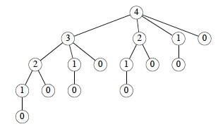

## Outline

  1. Problem Solving Methods and Optimization Problems 
  2. Introducing DP with the Rod Cutting Example 
  3. Illustrating DP with the Longest Common Subsequence Example 
  4. Summary and Comments on Optimal Substructure

## Readings 

  * Read all of CLRS Chapter 15. The focus is on the problem solving strategy: Read the examples primarily to understand the Dynamic Programming strategy rather than to memorize the specifics of each problem (although you will be asked to trace through some of the algorithms). 

  * I have also posted a chapter by Sedgewick in Laulima. In this case, I don't think that Sedgewick is any clearer than Cormen et al. The Rod-Cutting example in Cormen et al. illustrates the basics of DP quite well. Also, although usually it is easier to understand examples first, DP examples involve tedious combinations of subproblems, so you may be better off trying to understand the gist of the strategy first in this case.

* * *

##  Setting the Context

### Problem Solving Methods

In this course we study many well defined algorithms, including (so far) those
for ADTs, sorting and searching, and others to come to operate on graphs.
Quality open source implementations exist: you often don't need to implement
them.

But we also study problem solving methods that guide the design of algorithms
for your specific problem. Quality open source implementations may not exist
for your specific problem: you may need to:

  * Understand and identify characteristics of your problem
  * Match these characteristics to algorithmic design patterns.
  * Use the chosen design patterns to design a custom algorithm.

Such problem solving methods include divide & conquer, dynamic programming,
and greedy algorithms (among others to come).

### Optimization Problems

An **optimization problem** requires finding a/the "best" of a set of
alternatives (alternative approaches or solutions) under some quality metric
(which we wish to maximize) or cost metric (which we wish to minimize).

Dynamic Programming is one of several methods we will examine. (Greedy
algorithms and linear programming can also apply to optimization problems.)

### Basic Idea of Dynamic Programming

Dynamic programming solves optimization problems by combining solutions to
subproblems.

This sounds familiar: **divide and conquer** also combines solutions to
subproblems, but **_applies when the subproblems are disjoint_**. For example,
here is the recursion tree for merge sort on an array A[1..8]. Notice that the
indices at each level do not overlap):

**Dynamic programming _applies when the subproblems overlap_**. For example, here is the recursion tree for a "rod cutting" problem to be discussed in the next section (numbers indicate lengths of rods). Notice that not only do lengths repeat, but also that there are entire subtrees repeating. It would be redundant to redo the computations in these subtrees. 

**Dynamic programming _solves each subproblem just once, and saves its answer in a table_**, to avoid the recomputation. It uses additional memory to save computation time: an example of a **time-memory tradeoff**.

There are many examples of computations that require exponential time without
dynamic programming but become polynomial with dynamic programming.

* * *

##  Example: Rod Cutting

This example nicely introduces key points about dynamic programming.

Suppose you get different prices for steel rods of different lengths. Your
supplier provides long rods; you want to know how to cut the rods into pieces
in order to maximize revenue. Each cut is free. Rod lengths are always an
integral number of length units (let's say they are centimeters).

> **Input:** A length _n_ and a table of prices _pi_ for _i_ = 1, 2, ..., _n_.  
  
**Output:** The maximum revenue obtainable for rods whose lengths sum to _n_, computed as the sum of the prices for the individual rods. 

We can choose to cut or not cut at each of the _n_-1 units of measurement.
Therefore one can cut a rod in 2_n_-1 ways.

If _pn_ is large enough, an optimal solution might require no cuts.

### Example problem instance

Suppose we have a rod of length 4. There are 2_n_-1 = 23 = 8 ways to cut it up
(the numbers show the price we get for each length, from the chart above):

Having enumerated all the solutions, we can see that for a rod of length 4 we
get the most revenue by dividing it into two units of length 2 each: _p_2 \+
_p_2 = 5 + 5 = 10.

###  Optimal Substructure of Rod Cutting

Any optimal solution (other than the solution that makes no cuts) for a rod of
length > 2 results in at least one subproblem: a piece of length > 1 remaining
after the cut.

_Claim:_ The optimal solution for the overall problem must include an optimal
solution for this subproblem.

_Proof:_ The proof is a "cut and paste" proof by contradiction: if the overall
solution did not include an optimal solution for this problem, we could cut
out the nonoptimal subproblem solution, paste in the optimal subproblem
solution (which must have greater value), and thereby get a better overall
solution, contradicting the assumption that the original cut was part of an
optimal solution.

Therefore, rod cutting exhibits **optimal substructure: _The optimal solution
to the original problem incorporates optimal solutions to the subproblems,
which may be solved independently._** This is a hallmark of problems amenable
to dynamic programming. (Not all problems have this property.)

###  Continuing the example

Here is a table of _ri_, the maximum revenue for a rod of length _i_, for this
problem instance.

To solve a problem of size 7, find the best solution for subproblems of size
7; 1 and 6; 2 and 5; or 3 and 4. Each of these subproblems also exhibits
optimal substructue.

One of the optimal solutions makes a cut at 3cm, giving two subproblems of
lengths 3cm and 4cm. We need to solve both optimally. The optimal solution for
a 3cm rod is no cuts. As we saw above, the optimal solution for a 4cm rod
involves cutting into 2 pieces, each of length 2cm. These subproblem optimal
solutions are then used in the solution to the problem of a 7cm rod.

###  Quantifying the value of an optimal solution

The next thing we want to do is write a general expression for the value of an
optimal solution that captures its recursive structure.

For any rod length _n_, we can determine the optimal revenues _rn_ by taking
the maximum of:

  * _pn_: the price we get by not making a cut, 
  * _r_1 \+ _r__n_-1: the maximum revenue from a rod of 1cm and a rod of _n_-1cm, 
  * _r_2 \+ _r__n_-2: the maximum revenue from a rod of 2cm and a rod of _n_-2cm, .... 
  * _r__n_-1 \+ _r_1

So, _rn_ = max (_pn_, _r_1 \+ _r__n_-1, _r_2 \+ _r__n_-2, .... _r__n_-1 \+
_r_1).

There is redundancy in this equation: if we have solved for _ri_ and _r__n_-
_i_, we don't also have to solve for _r__n_-_i_ and _ri_.

#### A Simpler Decomposition

Rather than considering all ways to divide the rod in half, leaving two
subproblems, consider all ways to cut off the first piece of length _i_,
leaving only one subproblem of length _n_ \- _i_:

We don't know in advance what the first piece of length _i_ should be, but we
do know that one of them must be the optimal choice, so we try all of them.

### Recursive Top-Down Solution

The above equation leads immediately to a direct recursive implementation (_p_
is the price vector; _n_ the problem size):

This works but is inefficient. It calls itself repeatedly on subproblems it
has already solved (circled). Here is the recursion tree for _n_ = 4:

In fact we can show that the growth is exponential. Let _T_(_n_) be the number
of calls to Cut-Rod with the second parameter = _n_.

This has solution 2_n_. (Use the inductive hypothesis that it holds for _j_ <
_n_ and then use formula A5 of Cormen et al. for an exponential series.)

### Dynamic Programming Solutions

Dynamic programming arranges to solve each sub-problem just once by saving the
solutions in a table. There are two approaches.

#### Top-down with memoization

Modify the recursive algorithm to store and look up results in a table _r_.
**Memoizing** is remembering what we have computed previously.

 

The top-down approach has the advantages that it is easy to write given the
recursive structure of the problem, and only those subproblems that are
actually needed will be computed. It has the disadvantage of the overhead of
recursion.

#### Bottom-up

One can also sort the subproblems by "size" (where size is defined according
to which problems use which other ones as subproblems), and solve the smaller
ones first.

The bottom-up approach requires extra thought to ensure we arrange to solve
the subproblems before they are needed. (Here, the array reference _r_[_j_ \-
_i_] ensures that we only reference subproblems smaller than _j_, the one we
are currently working on.)

The bottom-up approach can be more efficient due to the iterative
implementation (and with careful analysis, unnecessary subproblems can be
excluded).

#### Asymptotic running time

Both the top-down and bottom-up versions run in Θ(_n_2) time.

  * _Bottom-up:_ there are doubly nested loops, and the number of iterations for the inner loop forms an arithmetic series. 
  

  * _Top-down:_ Each subproblem is solved just once. Subproblems are solved for sizes 0, 1, ... _n_. To solve a subproblem of size _n_, the `for` loop iterates _n_ times, so over all recursive calls the total number of iterations is an arithmetic series. (This uses aggregate analysis, covered in a later lecture.) 

### Constructing a Solution

The above programs return the value of an optimal solution. To construct the
solution itself, we need to record the choices that led to optimal solutions.
Use a table _s_ to record the place where the optimal cut was made (compare to
Bottom-Up-Cut-Rod):

For our problem, the input data and the tables constructed are:

 

We then trace the choices made back through the table _s_ with this procedure:

Trace the calls made by `Print-Cut-Rod-Solution(_p_, 8)`...

* * *

## Four Steps of Problem Solving with Dynamic Programming

In general, we follow these steps when solving a problem with dynamic
programming:

  1. **Characterize the structure of an optimal solution**: 
    * How are optimal solutions composed of optimal solutions to subproblems?
    * Assume you have an optimal solution and show how it must decompose
    * Sometimes it is useful to write a brute force solution, observe its redunancies, and characterize a more refined solution
    * e.g., our observation that a cut produces one to two smaller rods that can be solved optimally
  

  2. **Recursively define the value of an optimal solution**: 
    * Write a recursive cost function that reflects the above structure
    * e.g., the recurrence relation shown
  

  3. **Compute the value of an optimal solution**: 
    * Write code to compute the recursive values, memoizing or solving smaller problems first to avoid redundant computation
    * e.g., `Bottom-Up-Cut-Rod`
  

  4. **Construct an optimal solution from the computed information**: 
    * Augment the code as needed to record the structure of the solution
    * e.g., `Extended-Bottom-Up-Cut-Rod` and `Print-Cut-Rod-Solution`

The steps are illustrated in the next example.

* * *

##  Example: Longest Common Subsequence

A **subsequence** of sequence _S_ leaves out zero or more elements but
preserves order.

_Z_ is a ** common subsequence ** of _X_ and _Y_ if _Z_ is a subsequence of
both _X_ and _Y_.  
_Z_ is a **longest common subsequence** if it is a subsequence of maximal
length.

### The LCS Problem

Given two sequences _X_ = ⟨ _x_1, ..., _x__m_ ⟩ and _Y_ = ⟨ _y_1, ..., _y__n_
⟩, find a subsequence common to both whose length is longest. Solutions to
this problem have applications to DNA analysis in bioinformatics. The analysis
of optimal substructure is elegant.

#### Examples

### Brute Force Algorithm

For every subsequence of _X_ = ⟨ _x_1, ..., _x__m_ ⟩, check whether it is a
subsequence of _Y_ = ⟨ _y_1, ..., _y__n_ ⟩, and record it if it is longer than
the longest previously found.

  * There are 2_m_ subsequences of _X_ to check. 
  * For each subsequence, scan _Y_ for the first letter. From there scan for the second letter, etc., up to the _n_ letters of _Y_. 
  * Therefore, Θ(_n_2_m_). 

This involves a lot of redundant work.

  * If a subsequence _Z_ of _X_ fails to match _Y_, then any subsequence having _Z_ as a prefix will also fail. 
  * If a subsequence _Z_ of _X_ matches _Y_, then there is no need to check prefixes of _Z_. 

Many problems to which dynamic programming applies have exponential brute
force solutions that can be improved on by exploiting redundancy in subproblem
solutions.

### Step 1. Optimal Substructure of LCS

The first step is to characterize the structure of an optimal solution,
hopefully to show it exhibits optiomal stubstructure.

Often when solving a problem we start with what is known and then figure out
how to contruct a solution. The optimal substructure analysis takes the
reverse strategy: _ _assume_ you have found an optional solution_ (Z below)
_and figure out what you must have done to get it_!

Notation:

  * _Xi_ = prefix ⟨ _x_1, ..., _x__i_ ⟩
  * _Yi_ = prefix ⟨ _y_1, ..., _y__i_ ⟩

**_Theorem:_ ** Let _Z_ = ⟨ _z_1, ..., _z__k_ ⟩ be any LCS of _X_ = ⟨ _x_1, ..., _x__m_ ⟩ and _Y_ = ⟨ _y_1, ..., _y__n_ ⟩. Then 

  1. If _xm_ = _yn_, then _zk_ = _xm_ = _yn_, and _Z__k_-1 is an LCS of _X__m_-1 and _Y__n_-1.
  2. If _xm_ ≠ _yn_, then _zk_ ≠ _xm_ ⇒ _Z_ is an LCS of _X__m_-1 and _Y_. 
  3. If _xm_ ≠ _yn_, then _zk_ ≠ _yn_ ⇒ _Z_ is an LCS of _X_ and _Y__n_-1. 

_Sketch of proofs:_

(1) can be proven by contradiction: if the last characters of _X_ and _Y_ are
not included in _Z_, then a longer LCS can be constructed by adding this
character to _Z_, a contradiction.

(2) and (3) have symmetric proofs: Suppose there exists a subsequence _W_ of
_X__m_-1 and _Y_ (or of _X_ and _Y__n_-1) with length > _k_. Then _W_ is a
common subsequence of _X_ and _Y_, contradicting _Z_ being an LCS.

Therefore, **an LCS of two sequences contains as prefix an LCS of prefixes of
the sequences.** We can now use this fact construct a recursive formula for
the value of an LCS.

### Step 2. Recursive Formulation of Value of LCS

Let _c_[_i_, _j_] be the length of the LCS of prefixes _Xi_ and _Yj_. The
above recursive substructure leads to the definition of _c_:

We want to find _c_[_m_, _n_].

### Step 3. Compute Value of Optimal Solution to LCS

A recursive algorithm based on this formulation would have lots of repeated
subproblems, for example, on strings of length 4 and 3:

 Dynamic programming avoids
the redundant computations by storing the results in a table. We use
_c_[_i_,_j_] for the length of the LCS of prefixes _Xi_ and _Yj_ (hence it
must start at 0). (_b_ is part of the third step and is explained next
section.)

Try to find the correspondence betweeen the code below and the recursive
definition shown in the box above.

This is a bottom-up solution: Indices _i_ and _j_ increase through the loops,
and references to _c_ always involve either _i_-1 or _j_-1, so the needed
subproblems have already been computed.

It is clearly **Θ(_m__n_)**; _much better than Θ(_n_2_m_)_!

### Step 4. Construct an Optimal Solution to LCS

In the process of computing the _value_ of the optimal solution we can also
record the _choices_ that led to this solution. Step 4 is to add this latter
record of choices and a way of recovering the optimal solution at the end.

Table _b_[_i_, _j_] is updated above to remember whether each entry is

  * a common substring of _X__i_-1 and _Y__j_-1 (diagonal arrow), in which case the common character _xi_ = _yj_ is included in the LCS;
  * a common substring of _X__i_-1 and _Y_ (↑); or
  * a common substring of _X_ and _Y__j_-1 (<-).

We reconstruct the path by calling Print-LCS(_b_, _X_, _n_, _m_) and following
the arrows, printing out characters of _X_ that correspond to the diagonal
arrows (a Θ(_n_ \+ _m_) traversal from the lower right of the matrix to the
origin):

### Example of LCS

What do "spanking" and "amputation" have in common?

* * *

##  Other Applications

Two other applications are covered in the Cormen et al. text, and many others
in the Problems at the end of the chapter. I omit them to keep this lecture
from being too long, and trust that the student will read them in the text.

### Optimizing Matrix-Chain Multiplication

Many scientific and business applications involve multiplication of chains of
matrices ⟨ A1, A2, A3, ... A_n_ ⟩. Since matrix multiplication is associative,
the matrices can be multiplied with their neighbors in this sequence in any
order. The order chosen can have a huge difference in the number of
multiplications required. For example suppose you have A, a 2x100 matrix, B
(100x100) and C (100x20). To compute A*B*C:

> (A*B) requires 2*100*100 = 20000 multiplications, and results in a 2x100
matrix. Then you need to multiply by C: 2*100*20 = 4000 multiplications, for a
total of 24,000 multiplications (and a 2x20 result).

> (B*C) requires 100x100x20 = 200000 multiplications, and results in a 100x20
matrix. Then you need to multiply by A: 2*100*20 = 4000 multiplications, for a
total of 204,000 multiplications (and the same 2x20 result).

The Matrix-Chain Multiplication problem is to determine the optimal order of
multiplications (_not_ to actually do the multiplications). For three matrices
I was able to figure out the best sequence by hand, but some problems in
science, business and other areas involve many matrices, and the number of
combinations to be checked grows exponentially.

Planning matrix multiplication is perhaps the most "canonical" example of
dynamic programming: it is used in most introductory presentations. I chose to
present LCS instead because matrix multiplication optimization will be built
into turnkey software, and current students will more likely be interested in
bioinformatics applications

###  Optimal Binary Search Tree

We saw in [Topic
8](http://www2.hawaii.edu/~suthers/courses/ics311s14/Notes/Topic-08.html) that
an unfortunate order of insertions of keys into a binary search tree (BST) can
result in poor performance (e.g., linear in _n_). If we know all the keys in
advance and also the probability that they will be searched, we can optimize
the construction of the BST to minimize search time in the aggregate over a
series of queries. An example application is when we want to construct a
dictionary from a set of terms that are known in advance along with their
frequency in the language. The reader need only try problem 15.5-2 from the
Cormen et al. text (manual simulation of the algorithm) to appreciate why we
want to leave this tedium to computers!

* * *

##  Further Observations Concerning Optimal Substructure

To use dynamic programming, we must show that any optimal solution involves
making a choice that leaves one or more subproblems to solve, and the
solutions to the subproblems used within the optimal solution must themselves
be optimal.

### The optimal choice is not known before solving the subproblems

We may not know what that first choice is. Consequently:

  * To show that there is optimal substructure, we suppose that the choice has been made, and show that the subproblems that result must also be solved optimally. This argument is often made using a cut-and-paste proof by contradiction.
  * Then when writing the code, we must ensure that enough potential choices and hence their supbproblems are considered that we find the optimal first choice. This usually shows up as iteration in which we find the maximum or minimum according to some objective function across all choices.

### Optimal substructure varies across problem domains:

How many subproblems are used in an optimal solution may vary:

  * Rod Cutting: 1 subproblem (of size _n_ \- _i_)
  * LCS: 1 subproblem (LCS of the prefix sequence(s).) 
  * Optimal BST: 2 subproblems (given _kr_ has been chosen as the root, _ki_ ..., _k__r_-1 and _k__r_+1 ..., _kj_) 

How many choices in determining which subproblem(s) to use may vary:

  * Rod cutting: _n_ choices (for each value of _i_)
  * LCS: Either 1 choice (if _xi_ = _yj_, take LCS of _X__i_-1 and _Y__j_-1), or 2 choices (if _xi_ ≠ _yj_, check both LCS of _X__i_-1 and _Y_, and LCS of _X_ and _Y__j_-1)
  * Optimal BST: _j_ \- _i_ \+ 1 choices for the root _kr_ in _ki_ ..., _kj_: see text.

Informally, running time depends on (# of subproblems overall) x (# of
choices).

  * Rod Cutting: Θ(_n_) subproblems overall, ≤ _n_ choices for each ⇒ O(_n_2) running time.
  * LCS: Θ(_m__n_) subproblems overall; ≤ 2 choices for each ⇒ O(_m__n_) running time.
  * Optimal BST: Θ(_n_2) subproblems overall; O(_n_) choices for each ⇒ O(_n_3) running time. 

(We'll have a better understanding of "overall" when we cover amortized
analysis.)

### Not all optimization problems have optimal substructure

When we study graphs, we'll see that finding the **shortest path** between two
vertices in a graph has optimal substructure: if _p_ = _p_1 \+ _p_2 is a
shortest path between _u_ and _v_ then _p_1 must be a shortest path between
_u_ and _w_ (etc.). Proof by cut and paste.

But finding the **longest simple path** (the longest path not repeating any
edges) between two vertices is not likely to have optimal substructure.

For example, _q_ -> _s_ -> _t_ -> _r_ is longest simple path from _q_ to _r_,
and _r_ -> _q_ -> _s_ -> _t_ is longest simple path from _r_ to _t_, but the
composed path is not even legal: the criterion of simplicity is violated.

Dynamic programming requires _overlapping_ yet _independently solveable_
subproblems.

Longest simple path is NP-complete, a topic we will cover at the end of the
semester, so is unlikely to have any efficient solution.

### Dynamic programming uses optimal substructure bottom up

Although we wrote the code both ways, in terms of the order in which solutions
are found, dynamic programming _first_ finds optimal solutions to subproblems
and _then_ choses which to use in an optimal solution to the problem. It
applies when one cannot make the top level choice until subproblem solutions
are known.

In [Topic
13](http://www2.hawaii.edu/~suthers/courses/ics311s14/Notes/Topic-13.html),
we'll see that ** greedy algorithms** work top down: _first_ make a choice
that looks best, _then_ solve the resulting subproblem. Greedy algorithms
apply when one can make the top level choice without knowing how subproblems
will be solved.

* * *

##  Summary

Dynamic Programming applies when the problem has these characteristics:

**Recursive Decomposition**
    The problem has recursive structure: it breaks down into smaller problems of the same type. _This characterisic is shared with divide and conquer, but dynamic programming is distinguished from divide and conquer by the next item._
**Overlapping Subproblems**
    The subproblems solved by a recursive solution overlap (the same subproblems are revisited more than once). _This means we can save time by preventing the redundant computations._
**Optimal Substructure**
    Any optimal solution involves making a choice that leaves one or more subproblems to solve, and the solutions to the subproblems used within the optimal solution must themselves be optimal. _This means that optimized recursive solutions can be used to construct optimized larger solutions._
  

Dynamic programming can be approached top-down or bottom-up:

**Top-Down with memoization:**
    Write a recursive procedure to solve the problem, computing subproblems as needed. Each time a sub-problem is encountered, see whether you have stored it in a table, and if not, solve it and store the solution.
  
**Bottom-Up:**
    Order the subproblems such that "smaller" problems are solved first, so their solutions are available in the table before "larger" problems need them. (This ordering need not be based on literal size.) 

Both have the same asympotic running time. The top-down procedure has the
overhead of recursion, but computes only the subproblems that are actually
needed. Bottom-up is used the most in practice.

We problem solve with dynamic programming in four steps:

  1. **Characterize the structure of an optimal solution**: 
    * How are optimal solutions composed of optimal solutions to subproblems?
  2. **Recursively define the value of an optimal solution**: 
    * Write a recursive cost function that reflects the above structure
  3. **Compute the value of an optimal solution**: 
    * Write code to compute the recursive values, memoizing or solving smaller problems first to avoid redundant computation
  4. **Construct an optimal solution from the computed information**: 
    * Augment the code as needed to record the structure of the solution

* * *

## Wrapup

There is an online presentation focusing on LCS at [ http://www.csanimated.com
/animation.php?t=Dynamic_programming](http://www.csanimated.com/animation.php?
t=Dynamic_programming).

In the next Topic 13 we look at a related optimization strategy: greedy
algorithms.

* * *

Dan Suthers Last modified: Sun Mar 2 05:24:02 HST 2014  
Images are from the instructor's material for Cormen et al. Introduction to
Algorithms, Third Edition.  

