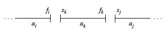
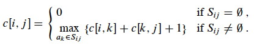
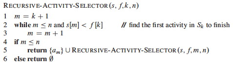
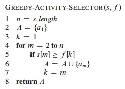
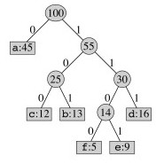
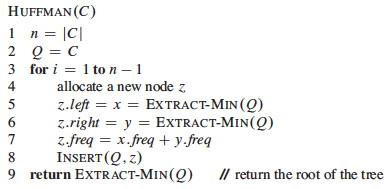
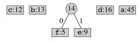
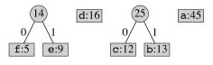

## Outline

  1. Prelude: Greedy Algorithms and Dynamic Programming
  2. Example: Activity Selection Problem 
  3. Greedy Strategy 
  4. Huffman Codes 

## Readings and Screencasts

  * Read the first three sections of CLRS Chapter 16, although you need not read the details of the proofs. We are not covering Matroids (the 4th section).

This presentation follows the CLRS reading fairly closely, selecting out the
most relevant parts and explaining a few things in more detail. (The
associated videos change the ordering somewhat: 13A provides a conceptual
introduction, leaving the activity selection example for 13B.)

* * *

##  Prelude: Greedy Algorithms and Dynamic Programming

Both Dynamic Programming and Greedy Algorithms are ways of solving
_**optimization problems**_: a solution is sought that optimizes (minimizes or
maximizes) an _**objective function**_.

**Dynamic Programming:**

  * Finds solutions bottom-up (solves subproblems before solving their super-problem) 
  * Exploits overlapping subproblems for efficiency (by reusing solutions)
  * Can handle subproblem interdependence 

**Greedy Algorithms** "greedily" take the choice with the most immediate gain. 

  * Find solutions top-down (commit to a choice, then solve sub-problems) 
  * Assume that if the objective function is optimized locally it will be optimized globally
  * Cannot handle interdependent subproblems 

For some problems, but not all, local optimization actually results in global
optimization.

We'll use an example to simultaneously review dynamic programming and motivate
greedy algorithms, as the two approaches are related (but distinct).

* * *

##  Activity Selection Problem

Suppose that _activities_ require exclusive use of a common resource, and you
want to schedule as many as possible.

Let _S_ = {_a_1, ..., _a__n_} be a set of _n_ activities.

Each activity _ai_ needs the resource during a time period starting at _si_
and finishing before _fi_, i.e., during [_si_, _fi_).

(_Why not_ [_si_, _fi_]?)

The optimization problem is to select the largest set of non-overlapping
(mutually compatible) activities from _S_.

We assume that activities are sorted by finish time _f_1 ≤ _f_2 ≤ ... _f__n_-1
≤ _f__n_ (this can be done in Θ(_n_ lg _n_)).

### Example

Consider these activities:

Here is a graphic representation:

Suppose we chose one of the activities that _start first_, and then look for
the next activity that starts after it is done. This could result in {_a_4,
_a_7, _a_8}, but this solution is not optimal.

An optimal solution is {_a_1, _a_3 _a_6, _a_8}. (It maximizes the objective
function of number of activities scheduled.)

Another one is {_a_2, _a_5, _a_7, _a_9}. (Optimal solutions are not
necessarily unique.)

How do we find (one of) these optimal solutions? Let's consider it as a
dynamic programming problem ...

### Optimal Substructure Analysis

A dynamic programming analysis begins by identifying the choices to be made,
and assuming that you can make an optimal choice (without yet specifying what
that choice is) that will be part of an optimal solution.

It then specifies the possible subproblems that result in the most general way
(to ensure that possible components of optimal solutions are not excluded),
and shows that an an optimal solution must recursively include optimal
solutions to the subproblems. (This is done by reasoning about the value of
the solutions according to the objective function.)

We'll approach Activity Selection similarly. I'll try to clarify the reasoning
in the text ...

For generality, we define the problem in a way that applies both to the
original problem and subproblems.

Suppose that due to prior choices we are working on a time interval from _i_
to _j_. This could be after some already-scheduled activity _ai_ and before
some already-scheduled event _aj_, or for the original problem we can define
_i_ and _j_ to bound the full set of activities to be considered.

Then the candidate activities to consider are those that start after _ai_ and
end before _aj_:

  

Now let's define _Aij_ to be an optimal solution, i.e., a maximal set of
mutualy compatible activities in _Sij_. What is the structure of this
solution?

At some point we will need to make a choice to include some activity _ak_ with
start time _sk_ and finishing by _fk_ in this solution. This choice will leave
two sets of compatible candidates after _ak_ is taken out:

  * _Sik_ : activities that start after _ai_ finishes, and finish before _ak_ starts 
  * _Skj_ : activities that start after _ak_ finishes, and finish before _aj_ starts 

(Note that _Sij_ may be a proper superset of _Sik_ ∪ {_ak_} ∪ _Skj_, as
activities incompatible with _ak_ are excluded.)

Using the same notation as above, define the optimal solutions to these
subproblems to be:

  * _Aik_ = _Aij_∩ _Sik_: the optimal solution to _Sik_
  * _Akj_ = _Aij_ ∩ _Skj_: the optimal solution to _Skj_

So the structure of an optimal solution _Aij_ is:

> _Aij_ = _Aik_ ∪ {_ak_} ∪ _Akj_

and the number of activities is:

> |_Aij_| = |_Aik_| + 1 + |_Akj_|

By the "cut and paste argument", an optimal solution _Aij_ for _Sij_ must
include the optimal solutions _Aik_ for _Sik_ and _Akj_ for _Skj_, because if
some suboptimal solution _A'ik_ were used for _Sik_ (or similarly _A'kj_ for
_Skj_), where |_A'ik_| < |_Aik_|, we could substitute _Aik_ to increase the
number of activities (a contradiction to optimality).

Therefore the Activity Scheduling problem exhibits optimal substructure.

### Recursive Solution

Since the optimal solution _A__ij_ must include optimal solutions to the
subproblems for _S__ik_ and _S__kj_, we could solve by dynamic programming.

Let _c_[_i_, _j_] = size of optimal solution for _S__ij_ (_c_[_i_, _j_] has
the same value as |_Aij_|, but apparently we are switching notation to
indicate that this is for any optimal solution). Then

> _c_[_i_, _j_] = _c_[_i_, _k_] + _c_[_k_, _j_] + 1   (the 1 is to count
_ak_).

We don't know which activity _ak_ to choose for an optimal solution, so we
could try them all:

This suggests a recursive algorithm that can be memoized, or we could develop
an equivalent bottom-up approach, filling in tables in either case.

But it turns out we can solve this without considering multiple subproblems.

### Being Greedy

We are trying to optimize the number of activities. Let's be greedy!

  * The more time that is left after running an activity, the more subsequent activities we can fit in. 
  * If we **choose the first activity to _finish,_** the most time will be left.
  * Since activities are sorted by finish time, we will always start with _a_1. 
  * Then we can solve the single subproblem of activity scheduling in this remaining time.

Since there is only a single subproblem, the _Sij_ notation, bounding the set
at both ends, is more complex than we need. We'll simplify the notation to
indicate the activities that start after _ak_ finishes:

> _S_k = {_ai_ ∈ _S_ : _si_ ≥ _fk_}

So, after choosing _a_1 we just have _S_1 to solve (and so on after choices in
recursive subproblems).

By optimal substructure, _if_ _a_1 is part of an optimal solution, then an
optimal solution to the original problem consists of _a_1 plus all activities
in an optimal solution to _S_1.

But we need to prove that _a_1 is always part of some optimal solution (i.e.,
to prove our original intuition).

_**Theorem:**_ If _S_k is nonempty and _am_ has the earliest finish time in
_S_k, then _am_ is included in some optimal solution.

_Proof:_ Let _Ak_ be an optimal solution to _S_k, and let _aj_ ∈ _Ak_ have the
earliest finish time in _Ak_. If _aj_ = _am_ we are done. Otherwise, let
_A'__k_ = (_Ak_ \- {_aj_}) ∪ {_am_} (substitute _am_ for _aj_).

> _Claim:_ Activities in _A'k_ are disjoint.

>

> _Proof of Claim:_ Activities in _Ak_ are disjoint because it was a solution.  
Since _aj_ is the first activity in _Ak_ to finish, and fm ≤ fj (_am_ is the
earliest in _Sk_), _am_ cannot overlap with any other activities in _A'k_.  
No other changes were made to _Ak_, so _A'k_ must consist of disjoint
activities.

Since |_A'k_| = |_Ak_| we can conclude that _A'k_ is also an optimal solution
to _S_k, and it includes _am_.

Therefore we don't need the full power of dynamic programming: we can just
repeatedly choose the activity that finishes first, remove any activities that
are incompatible with it, and repeat on the remaining activities until no
activities remain.

### Greedy Algorithm Solution

Let the start and finish times be represented by arrays _s_ and _f_, where _f_
is assumed to be sorted in monotonically increasing order.

Add a fictitious activity _a_0 with _f_0 = 0, so _S_0 = _S_ (i.e., the entire
input sequence).

Our initial call will be RECURSIVE-ACTIVITY-SELECTOR(_s_, _f_, 0, _n_).

The algorithm is Θ(_n_) because each activity is examined exactly once across
all calls: each recursive call starts at _m_, where the previous call left
off. (Another example of aggregate analysis.)

If the activities need to be sorted, the overall problem can be solved in
Θ(_n_ lg _n_)).

This algorithm is nearly tail recursive, and can easily be converted to an
iterative version:

Let's trace the algorithm on this:

* * *

##  A Closer Look at the Greedy Strategy

Instead of starting with the more elaborate dynamic programming analysis, we
could have gone directly to the greedy approach.

Typical steps for designing a solution with the greedy strategy (and two
properties that are key to determining whether it might apply to a problem):

  1. Consider how we can make a greedy choice (local optimization of the objective function), leaving one subproblem to solve.
  2. **Greedy Choice Property:** Prove that the greedy choice is always part of some optimal solution.
  3. **Optimal Substructure:** Demonstrate that an optimal solution to the problem contains within it optimal solutions to the subproblems.

Then we can construct an algorithm that combines the greedy choice with an
optimal solution to the remaining problem.

###  Dynamic Programming compared to Greedy Strategy:

Both require optimal substructure, but ...

**Dynamic Programming**

  * Each choice depends on knowing the optimal solutions to subproblems.
  * Bottom-up: Solve subproblems first

**Greedy Strategy**

  * Each choice depends only on local optimization 
  * Top-down: Make choice before solving subproblems 

### Example: Knapsack Problems

These two problems demonstrate that the two strategies do not solve the same
problems. Suppose a thief has a knapsack of fixed carrying capacity, and wants
to optimize the value of what he takes.

#### 0-1 knapsack problem:

There are _n_ items. Item _i_ is worth $_vi_ and weighs _wi_ pounds. The thief
wants to take the most valuable subset of items with weight not exceeding _W_
pounds. It is called 0-1 because the thief must either not take or take each
item (they are discrete objects, like gold ingots).

In the example, item 1 is worth $6/pound, item 2 $5/pound and item 3 $4/pound.

The greedy strategy of optimizing value per unit of weight would take item 1
first.

#### Fractional knapsack problem:

The same as the 0-1 knapsack problem except that the thief _can take a
fraction of each item_ (they are divisible substances, like gold powder).

Both have optimal substructure _(why?)._

Only the fractional knapsack problem has the greedy choice property:

_Fractional:_ One can fill up as much of the most valuable substance by weight
as one can hold, then as much of the next most valuable substance, etc., until
_W_ is reached:

_0-1:_ A greedy strategy could result in empty space, reducing the overall
dollar density of the knapsack. After choosing item 1, the optimal solution
(shown third) cannot be achieved:

* * *

##  Huffman Codes

We are going to see several greedy algorithms throughout the semester. The
activity scheduler was good for illustration, but is not important in
practice. We should look at one important greedy algorithm today ...

Huffman codes provide an efficient way to compress text, and are constructed
using a greedy algorithm. We only have time to review how this important
algorithm works; see the text for analysis.

### Binary Codes

**Fixed-length binary codes** (e.g., ASCII) represent each character with a fixed number of bits (a binary string of fixed length called a **codeword**).

**Variable-length binary codes** can vary the number of bits allocated to each character. This opens the possibility of space efficiency by using fewer bits for frequent characters.

Example: Suppose we want to encode documents with these characters:

With a 3 bit code it would take 300,000 bits to code a file of 100,000
characters, but the variable-length code shown requires only 224,000 bits.

**Prefix codes** (better named **prefix-free codes**) are codes in which no codeword is a prefix of another.

For any data, it is always possible to construct a prefix code that is optimal
(though not all prefix codes are optimal, as we will see below).

Prefix codes also have the advantage that each character in an input file can
be "consumed" unambiguously, as the prefix cannot be confused with another
code.

### Binary Tree Representation of Prefix Codes

We can think of the 0 and 1 in a prefix code as directions for traversing a
binary tree: 0 for left and 1 for right. The leaves store the coded character.
For example, here is the fixed-length prefix code from the table above
represented as a binary tree:

Consuming bits from an input file, we traverse the tree until the character is
identified, and then start over at the top of the tree for the next character.

_Exercise: Decode 101100100011_

But the above tree uses three bits per character: it is not optimal. It can be
shown that an optimal code is always represented by a full binary tree (every
non-leaf node has two children).

For example, an optimal prefix code (from the table reproduced again here) is
represented by this tree:

 

_Exercise: Decode 10111010111_

### Huffman's Algorithm

Huffman's greedy algorithm constructs optimal prefix codes called **Huffman
Codes**.

It is given a set _C_ of _n_ characters, where each character has frequency
_c.freq_ in the "text" to be encoded.

The optimality of a code is relative to a "text", which can be what we
normally think of as texts, or can be other data encoded as sequences of bits,
such as images.

  * We can construct a generic Huffman code for a universe of texts, such as all texts in English, by estimating the frequency of characters in this universe of texts.
  * More commonly, we contruct Huffman codes optimized for particular documents. Then the document-specific code needs to be passed on along with the compressed document.

The algorithm creates a binary tree leaf node for each character, annotated
with its frequency, and the tree nodes are then put on a min-priority queue
(this is only implied in line 2 below).

Then the first two subtrees on the queue (those with minimum frequency) are
dequeued with `Extract-Min`, merged into a single tree, annotated with the sum
of their frequencies, and this single node is re-queued.

This process is repeated until only one tree node remains on the queue (the
root). Since a tree is being constructed and |_E_| = |_V_|−1 we can just run
the loop until _n_−1 and know that there will be one node left at this point.

Here is the algorithm:

#### Informal Correctness

The "greedy" aspect is the choice to merge min-frequency nodes first, and
assume that this local minimization will result in an optimal global solution.

Intuitively, this approach will result in an optimal solution because the
lowest frequency items will be "pushed down" deeper in the tree, and hence
have longer codes; while higher frequency items will end up nearer the root,
and hence have the shortest codes.

Cormen et al. prove correctness with two Lemmas for the two properties:

  * Greedy choice property: there exists an optimal prefix code where two characters having the lowest frequency in _C_ are encoded with equal length strings that differ only in the last bit, as they are leaf nodes. 
  * Optimal-substructure property: if the tree constructed by merging two nodes is optimal it must have been constructed from an optimal tree for the subproblem.

#### Complexity

The initial BUILD-MIN-HEAP implied by line 2 requires O(_n_) time.  
The loop executes _n_ times, with O(lg _n_) required for each heap operation.  
Thus, HUFFMAN is O(_n_ lg _n_).

### An Example of Huffman Coding

The characters are in a min priority queue by frequency:

Take out the two lowest frequency items and make a subtree that is put back on
the queue as if it is a combined character:

 

Combine the next lowest frequency characters:

Continuing, tree fragments themselves become subtrees:

Two subtrees are merged next:

The highest frequency character gets added to the tree last, so it will have a
code of length 1:

One might wonder why the second most frequent character does not have a code
of length 2. This would force the other characters to be deeper in the tree,
giving them excessively long codes.

* * *

## Wrapup

We will encounter several examples of greedy algorithms later in the course,
including classic algorithms for finding minimum spanning trees (Topic
[17](http://www2.hawaii.edu/~suthers/courses/ics311s14/Notes/Topic-17.html))
and shortest paths in graphs (Topics
[18](http://www2.hawaii.edu/~suthers/courses/ics311s14/Notes/Topic-18.html)
and
[19](http://www2.hawaii.edu/~suthers/courses/ics311s14/Notes/Topic-19.html)).

* * *

Dan Suthers Last modified: Sat Mar 1 17:53:22 HST 2014  
Images are from the instructor's material for Cormen et al. Introduction to
Algorithms, Third Edition.  

