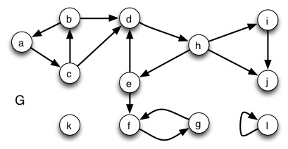
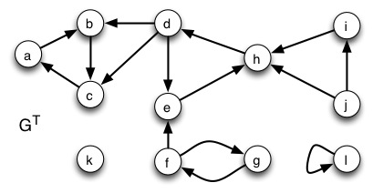

## Finding SCC of a graph with DFS

**1.** _Run DFS on this graph_. To make grading easier, _visit vertices in alphabetical order_ (both in the main loop of DFS and the adjacency list loop of DFS-Visit). For each vertex, show values _d_ (discovery), _f_ (finish), and π (parent). 

The finish times from largest to smallest order the nodes in a manner
consistent with a topological sort of their SCCs.

**2.** Now run DFS on the transpose graph, visiting vertices in order of finish time (highest to lowest) from the DFS of step 1 (as required by the SCC algorithm). Again, show values _d_ (discovery), _f_ (finish), and π (parent).

**3.** List the strongly connected components you found by first _listing the tree edges_ in the transpose graph that define the SCC, and then _listing the vertices_ in the SCC (the first is shown): 
    
    
    SCC 1:  Tree edges: { }; Vertices: {l} 
    SCC 2:  Tree edges: {...}; Vertices: {...} 
    SCC 3:  ... 
    

