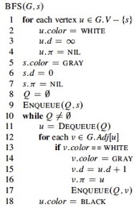

## Breadth first search and depth first search

### Peer Credit Assignment

**1.** Please list the names of the other members of your peer group for this week and the number of extra credit points you think they deserve for their participation in group work on Tuesday and Thursday combined.

  * If three members besides yourself were present at some time, you have a total of 3 points to allocate across all members (_NOT_ 3 points per member!).
  * If two members besides yourself were present, you have a total of 4 points to allocate across all members.
  * If only one other member was present, you have a total of 6 points to allocate across all members.
  * You need not allocate all the points available to you. Points allocated to yourself will not be recorded.

### Breadth first search

#### 2 points

The text (p. 597) analyzes Breadth-First-Search (BFS), using an _aggregate
analysis_ (what you are reading about for Tuesday's upcoming class) to show
that because the procedure scans the adjacency list of each vertex only when
the vertex is dequeued, and this happens only once, the total time spent
scanning adjacency lists is O(E). Along with O(V) initialization this gives
O(V+E) for the total running time.

**2.** What would be the running time of BFS if we replace the adjacency list with an adjacency matrix and modify it at line 12 to handle this form of input? Justify your answer. 

(_Note:_ Change of representation is a common situation and I will also ask
you about the implications of change of representation on the next exam.)

### Depth first search and Cycles

#### 8 points; 2 each

DFS classifies edges as tree edges, back edges, forward edges, and cross edges
(see p. 609).

**3.** How can you modify DFS to detect back-edges? Say what code you would modify or insert, referencing CLRS line numbers.

**4.** How can you modify DFS to determine whether a graph has a cycle? Again, say what code you would modify or insert, referencing CLRS line numbers. 

**5.** What is the run time of this modified cycle-detecting algorithm on _Directed_ graphs? Assume that it exits the DFS as soon as a cycle is found. Justify your answer.

**6.** What is the run time of this modified cycle-detecting algorithm on _**Un**directed_ graphs? Assume that it exits the DFS as soon as a cycle is found. Justify your answer. 

* * *

Dan Suthers Last modified: Sat Mar 29 21:44:46 EDT 2014

