## Outline

Tuesday

  1. Graph Definitions & examples
  2. Graph ADT
  3. Representations (Implementations) of Graph ADT
  4. Breadth-first Search 

Thursday

  1. Depth-first Search 
  2. Topological Sort 
  3. Strongly Connected Components 
  4. Related Concepts 

The video lectures and notes below provide material not found in the textbook:
defining graphs, an ADT, and implementations. This material is important for
Project 2.

##  Graphs

### Definitions

A graph _G_ is a pair

> _G_ = (_V_, _E_)

where

> _V_ = {_v_1, _v_2, ... _v_n}, a set of **vertices**

> _E_ = {_e_1, _e_2, ... _e_m} ⊆ _V_ ⊗ _V_, a set of **edges**.

#### Undirected Graphs

In an **undirected graph** the edge set E consists of _unordered pairs_ of
vertices. That is, they are sets _e_ = {_u_, _v_}. Edges can be written with
this notation when clarity is desired, but we will often use parentheses (_u_,
_v_).

No self loops are allowed in undirected graphs. That is, we cannot have (_v_,
_v_), which would not make as much sense in the set notation {_v_, _v_}.

We say that _e_ = {_u_, _v_} is **incident on** _u_ and _v_, and that the
latter vertices are **adjacent**. The **degree** of a vertex is the number of
edges incident on it.

The **handshaking lemma** is often useful in proofs:

> Σ_v_∈_V_degree(_v_) = 2|_E_|

(Each edge contributes two to the sum of degrees.)

#### Directed Graphs

In a **directed graph** or **digraph** the edges are ordered pairs (_u_, _v_).

We say that _e_ = (_u_, _v_) is **incident from** or **leaves** _u_ and is
**incident to** or **enters** _v_. The **in-degree** of a vertex is the number
of edges incident to it, and the **out-degree** of a vertex is the number of
edges incident from it.

**Self loops** (_v_, _v_) are allowed in directed graphs.

#### Paths

A **path** of length _k_ is a sequence of vertices ⟨_v_0, _v_1, _v_2, ...
_v_k⟩ where (_v__i_-1, _v__i_) ∈ _E_, for _i_ = 1, 2, ... _k_. (Some authors
call this a "walk".) The path is said to **contain** the vertices and edges
just defined.

A **simple path** is a path in which all vertices are distinct. (The "walk"
authors call this a "path").

If a path exists from _u_ to _v_ we say that _v_ is **reachable** from _u_.

In an undirected graph, a path ⟨_v_0, _v_1, _v_2, ... _v_k⟩ forms a **cycle**
if _v_0 = _v_k and _k_ ≥ 3 (as no self-loops are allowed).

In a directed graph, a path forms a **cycle** if _v_0 = _v_k and the path
contains at least one edge. (This is clearer than saying that the path
contains at least two vertices, as self-loops are possible in directed
graphs.) The cycle is **simple** if _v_1, _v_2, ... _v_k are distinct (i.e.,
all but the designated start and end _v_0 = _v_k are distinct). A directed
graph with no self-loops is also **simple**.

A graph of either type with no cycles is **acyclic**. A directed acyclic graph
is often called a **dag**.

#### Connectivity

A graph _G'_ = (_V'_, _E'_) is a **subgraph** of _G_ = (_V_, _E_) if _V'_ ⊆
_V_ and _E'_ ⊆ _E_.

An undirected graph is **connected** if every vertex is reachable from all
other vertices. In any connected undirected graph, |_E_| ≥ |_V_| - 1 (see also
[discussion of tree properties](http://www2.hawaii.edu/~suthers/courses/ics311
s14/Notes/Topic-08.html)). The **connected components** of _G_ are the maximal
subgraphs _G_1 ... _G__k_ where every vertex in a given subgraph is reachable
from every other vertex in that subgraph, but not reachable from any vertex in
a different subgraph.

A directed graph is **strongly connected** if every two vertices are reachable
from each other. The **strongly connected components** are the subgraphs
defined as above. A directed graph is thus strongly connected if it has only
one strongly connected component. A directed graph is **weakly connected** if
the underlying undirected graph (converting all tuples (_u_, _v_) ∈ _E_ into
sets {_u_, _v_} and removing self-loops) is connected.

#### Variations

A **bipartite** graph is one in which _V_ can be partitioned into two sets
_V_1 and _V_2 such that every edge connects a vertex in _V_1 to one in _V_2.
Equivalently, there are no odd-length cycles.

A **complete** graph is an undirected graph in which every pair of vertices is
adjacent.

A **weighted** graph has numerical weights associated with the edges. (The
allowable values depend on the application. Weights are often used to
represent distance, cost or capacity in networks.)

### Graph Size in Analysis

Asymptotic analysis is often in terms of both |_V_| and |_E_|. Within
asymptotic notation we leave out the "|" for simplicity, for example, writing
O(_V_ \+ _E_), O(_V_2 lg _E_), etc.

### Many Applications ...

 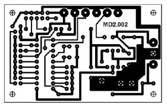 

* * *

## Graph ADT

These are detailed slightly more in [Project
2](http://www2.hawaii.edu/~suthers/courses/ics311s14/Projects/Project-2.html),
and in the Goodrich & Tamassia excerpt uploaded to Laulima.

#### Graph Accessors

**numVertices()**  
    Returns the number of vertices |_V_|

**numEdges()**   
    Returns the number of edges |_E_|

**vertices()**  
    Returns an iterator over the vertices _V_

**edges()**  
    Returns an iterator over the edges _E_

#### Accessing Undirected Graphs

**degree(_v_)**  
    Returns the number of edges (directed and undirected) incident on _v_.

**adjacentVertices(_v_)**  
    Returns an iterator of the vertices adjacent to _v_.

**incidentEdges(_v_)**  
    Returns an iterator of the edges incident on _v_. 

**endVertices(_e_)**  
    Returns an array of the two end vertices of _e_.

**opposite(_v_,_e_)**  
    Given _v_ is an endpoint of _e_.  
    Returns the end vertex of _e_ different from _v_.   
    Throws InvalidEdgeException when _v_ is not an endpoint of _e_.

**areAdjacent(_v_1,_v_2)**  
    Returns true iff _v_1 and _v_2 are adjacent by a single edge. 

####  Accessing Directed Graphs

**directedEdges()**  
    Returns an iterator over the directed edges of _G_. 

**undirectedEdges()**  
    Returns an iterator over the undirected edges of _G_. 

**inDegree(_v_)**  
    Returns the number of directed edges (arcs) incoming to _v_. 

**outDegree(_v_)**  
    Returns the number of directed edges (arcs) outgoing from _v_.

**inAdjacentVertices(_v_)**  
    Returns an iterator over the vertices adjacent to _v_ by incoming edges. 

**outAdjacentVertices(_v_)**  
    Returns an iterator over the vertices adjacent to _v_ by outgoing edges. 

**inIncidentEdges(_v_)**  
    Returns an iterator over the incoming edges of _v_. 

**outIncidentEdges(_v_)**  
    Returns an iterator over the outgoing edges of _v_. 

**destination(_e_)**  
    Returns the destination vertex of _e_, if _e_ is directed.  
    Throws InvalidEdgeException when _e_ is undirected.

**origin(_e_)**  
    Returns the origin vertex of _e_, if _e_ is directed.  
    Throws InvalidEdgeException when _e_ is undirected. 

**isDirected(_e_)**  
    Returns true if _e_ is directed, false otherwise

#### Mutators (Undirected and Directed)

**insertEdge(_u_,_v_)**  
**insertEdge(_u_,_v_,_o_)**  
    Inserts a new undirected edge between two existing vertices, optionally containing object _o_.  
    Returns the new edge. 

**insertVertex()**  
**insertVertex(_o_)**  
    Inserts a new isolated vertex optionally containing an object _o_ (e.g., the label associated with the vertex).  
    Returns the new vertex. 

**insertDirectedEdge(_u_,_v_)**  
**insertDirectedEdge(_u_,_v_,_o_)**  
    Inserts a new directed edge from an existing vertex to another.  
    Returns the new edge. 

**removeVertex(_v_)**  
    Deletes a vertex and all its incident edges.  
    Returns object formerly stored at _v_.

**removeEdge(_e_)**  
    Removes an edge.  
    Returns the object formerly stored at _e_.

#### Annotators (for vertices and all types of edges)

Methods for annotating vertices and edges with arbitrary data.

**setAnnotation(Object _k_, _o_)**  
    Annotates a vertex or edge with object _o_ indexed by key _k_.

**getAnnotation(Object _k_)**  
    Returns the object indexed by _k_ annotating a vertex or edge.

**removeAnnotation(Object _k_)**  
    Removes the annotation on a vertex or edge indexed by _k_ and returns it.

#### Changing Directions

There are various methods for changing the direction of edges. I think the
only one we will need is:

**reverseDirection(_e_)**  
    Reverse the direction of an edge.  
    Throws InvalidEdgeException if the edge is undirected

* * *

##  Graph Representations

There are two classic representations: the adjacency list and the adjacency
matrix.

In the **adjacency list**, vertices adjacent to vertex _v_ are listed
explicitly on linked list _G_.Adj[_v_] (assuming an array representation of
list headers).

In the **adjacency matrix**, vertices adjacent to vertex _v_ are indicated by
nonzero entries in the row of the matrix indexed by v, in the columns for the
adjacent vertices.

Adjacency List and Matrix representations of an undirected graph:

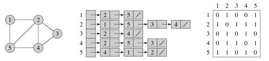

Adjacency List and Matrix representations of a directed graph:

_Consider this before reading on: What are the asymptotic complexities of
these methods in each representation? _

  * List vertices/edges 
  * areAdjacent 
  * access (out)AdjacentVertices or (out)IncidentEdges (outdegree) 
  * access (in)AdjacentVertices or (in)IncidentEdges (indegree) 

_Are edges first class objects in the above representations? Where do you
store edge information in the undirected graph representations?_

### Complexity Analysis

#### Adjacency List

Space required: Θ(_V_ \+ _E_).

Time to list all vertices adjacent to u: Θ(degree(_u_)).

Time to determine whether (_u_, _v_) ∈ _E_: O(degree(_u_)).

#### Adjacency Matrix

Space required: Θ(_V_2).

Time to list all vertices adjacent to _u_: Θ(_V_).

Time to determine whether (_u_, _v_) ∈ _E_: Θ(1).

So the matrix takes more space and more time to list adjacent matrices, but is
faster to test adjacency of a pair of matrices.

### "Modern" Adjacency Representation

Goodrich & Tamassia (reading in Laulima) propose a representation that
combines an edge list, a vertex list, and an adjacency list for each vertex:

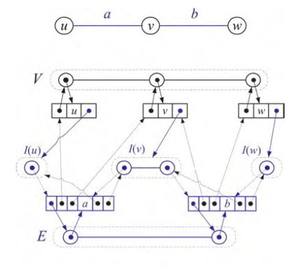

The sets _V_ and _E_ can be represented using a dictionary ADT (from
Implementation Project #1). In many applications, it is especially important
for _V_ to enable fast access by key, and may be important to access in order.
Each vertex object has an adjacency list _I_ (I for incident), and the edges
reference both the vertices they connect and the entries in this adjacency
list. There's a lot of pointers to maintain, but this enables fast access in
any direction you need, and for large sparse graphs the memory allocation is
still less than for a matrix representation.

See also Newman (2010) chapter 9, posted in Laulima, for discussion of graph
representations.

* * *

## BFS and DFS Overview

Before starting with Cormen et al.'s more complex presentation, let's discuss
how BFS and DFS can be implemented with nearly the same algorithm, but using a
queue for BFS and a stack for DFS. You should be comfortable with this
relationship between BFS/queues and DFS/stacks.

Sketch of both algorithms:

  1. Pick a starting vertex and put it on the queue (BFS) or stack (DFS) 
  2. Repeat until the queue/stack is empty:
    1. Dequeue (BFS) or pop (DFS) the next vertex _v_ from the appropriate data structure
    2. If _v_ is unvisited, 
      * Mark _v_ as visited (and process it as needed for the specific application). 
      * Find the unvisted neighbors of _v_ and queue (BFS) or push (DFS) them on the appropriate data structure. 

Try starting with vertex q and run this using both a stack and a queue:

BFS's FIFO queue explores nodes at each distance before going to the next
distance. DFS's LIFO stack explores the more distant neighbors of a node
before continuing with nodes at the same distance ("goes deep").

Search in a directed graph that is weakly but not strongly connected may not
reach all vertices.

* * *

## Breadth-first Search

Given a graph _G_ = (_V_,_E_) and a source vertex _s_ ∈ _V_, output _v.d_, the
shortest distance (# edges) from _s_ to _v_, for all _v_ ∈ _V_. Also record
_v.π_ = _u_ such that (_u_,_v_) is the last edge on a shortest path from _s_
to _v_. (We can then trace the path back.)

_Analogy_ Send a "tsunami" out from _s_ that first reaches all vertices 1 edge
from _s_, then from them all vertices 2 edges from _s_, etc. Like a tsunami,
equidistant destinations are reached at the "same time".

Use a FIFO queue _Q_ to maintain the wavefront, such that _v_ ∈ _Q_ iff the
tsunami has hit _v_ but has not come out of it yet.

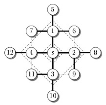 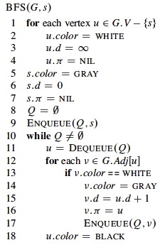

At any given time _Q_ has vertices with _d_ values _i, i, ... i, i+1, i+1, ...
i+1_. That is, there are at most two distances on the queue, and values
increase monotonically.

### Examples

#### Book's Example: Undirected Graph

#### A directed example:

Let's do another (number the nodes by their depth, then click to compare your
answer):

### Time Analysis

(This is an aggregate analysis.) Every vertex is enqueued at most once. We
examine edge (_u_, _v_) only when _u_ is dequeued, so every edge is examined
at most once if directed and twice if undirected. Therefore, O(_V_ \+ _E_).

### Shortest Paths

**Shortest distance** δ(_s_, _v_) from _s_ to _v_ is the minimum number of edges across all paths from _s_ to _v_, or ∞ if no such path exists.

A **shortest path** from _s_ to _v_ is a path of length δ(_s_, _v_).

It can be shown that BFS is guaranteed to find the shortest paths to all
vertices from a start vertex _s_: _v_._d_ = δ(_s_, _v_), ∀ _v_ at the
conclusion of the algorithm. See book for tedious proof.

Informally, we can see that all vertices at distance 1 from _s_ are enqueued
first, then via them all nodes of distance 2 are reached and enqueued, etc.,
so inductively it would be a contradiction if BFS reached a vertex _c_ by a
longer path than the shortest path because the last vertex _u_ on the shortest
path to the given vertex _v_ would have been enqueued first and then dequeued
to reach _v_.

### Breadth-First Trees

The **predecessor subgraph** of G is

> Gπ = (Vπ, Eπ) where  
Vπ= {_v_ ∈ V : _v_.π ≠ NIL} ∪ {_s_} and  
Eπ = {(_v_.π, _v_) : _v_ ∈ Vπ \- {_s_}}

A predecessor subgraph Gπ is a **breadth-first tree** if Vπ consists of
exactly all vertices reachable from _s_ and for all _v_ in Vπ the subgraph Gπ
contains unique simple and _ shortest_ paths from _s_ to _v_.

BFS constructs π such that Gπ is a breadth-first tree.

* * *

## Depth-first Search

Given _G_ = (_V_, _E_), directed or undirected, DFS explores the graph from
every vertex (no source is vertex given), constructing a _forest_ of trees and
recording two time stamps on each vertex:

  * _v.d_ = discovery time
  * _v.f_ = finishing time

Time starts at 0 before the first vertex is visited, and is incremented by 1
for every discovery and finishing event (as explained below). These attributes
will be used in other algorithms later on.

Since each vertex is discovered once and finished once, discovery and
finishing times are unique integers from 1 to 2|_V_|, and for all _v_, _v.d_ <
_v.f_.

_(Some presentations of DFS pose it as a way to visit nodes, enabling a given
method to be applied to the nodes with no output specified. Others present it
as a way to construct a tree. The CLRS presentation is more complex but
supports a variety of applications.)_

DFS explores _every_ edge and starts over from different vertices if necessary
to reach them (unlike BFS, which may fail to reach subgraphs not connected to
_s_).

As it progresses, every vertex has a color:

> WHITE = undiscovered

>  
GRAY = discovered, but not finished (still exploring vertices reachable from
it)

>     _v_._d_ records the moment at which _v_ is _discovered_ and colored
gray.

>  
BLACK = finished (have found everything reachable from it)

>     _v_._f_ records the moment at which _v_ is _finished_ and colored black.

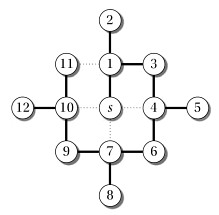

### Pseudocode

 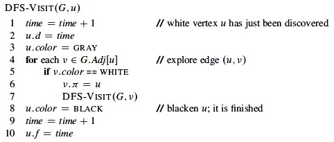

While BFS uses a queue, DFS operates in a stack-like manner (using the
implicit recursion stack in the algorithm above).

  * BFS's FIFO queue explores nodes at each distance before going to the next distance
  * DFS's implicit LIFO stack explores the more distant neighbors of a node before continuing with nodes at the same distance ("goes deep").

Another major difference in the algorithms as presented here is that DFS will
search from every vertex until all edges are explored, while BFS only searches
from a designated start vertex.

  * This is not an essential difference: both could be either restricted to a start vertex or run from all vertices; 
  * This reflects how the algorithms are used in practice (BFS for finding shortest paths; DFS for exposing structure of the graph, as will be explained shortly). 

### Example:

One could start DFS with any arbitrary vertex, and continue at any remaining
vertex after the first tree is constructed. Regularities in the book's
examples (e.g., processing vertices in alphabetical order, or always starting
at the top of the diagram) do not reflect a requirement of the algorithm.

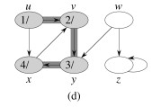

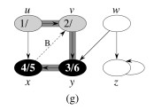

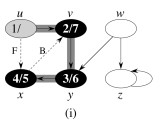
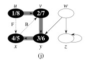

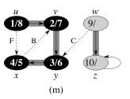

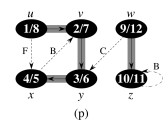

Let's do this example (start with the upper left node, label the nodes with
their d and f, then click to compare your answer):

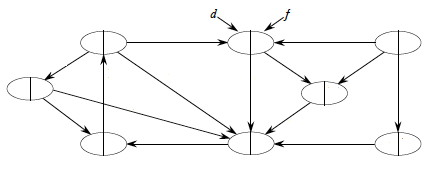

#### Time Analysis

The analysis uses aggregate analysis, and is similar to the BFS analysis,
except that DFS is guaranteed to visit every vertex and edge, so it is Θ not
O:

> Θ(_V_) to visit all vertices in lines 1 and 5 of `DFS`;  
  
Σ_v_∈_V_ |Adj(_v_)| = Θ(_E_) to process the adjacency lists in line 4 of `DFS-
Visit`.  
  
(_Aggregate analysis:_ we are not attempting to count how many times the loop
of line 4 executes each time it is encountered, as we don't know |Adj(_v_)|.
Instead, we sum the number of passes through the loop in total: all edges will
be processed.)  
  
The rest is constant time.

Therefore, Θ(_V_ \+ _E_).

### Classification of Edges

This classification will be useful in forthcoming proofs and algorithms.

  * **Tree Edge**: in the **depth-first forest** constructed by DFS: found by exploring (_u_,_v_). 
  * **Back Edge**: (_v_,_u_), where _v_ is a descendant of _u_.
  * **Forward Edge**: (_u_,_v_), where _v_ is a descendant of _u_ but not a tree edge.
  * **Cross Edge**: any other edge. They can go between vertices in the same depth-first tree or in different depth-first trees.

Here's a graph with edges classified, and redrawn to better see the structural
roles of the different kinds of edges:

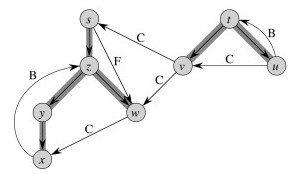

### DFS Properties

These theorems show important properties of DFS that will be used later to
show how DFS exposes properties of the graph.

#### Parentheses Theorem

After any DFS of a graph _G_, for any two vertices _u_ and _v_ in _G_, exactly
one of the following conditions holds:

  * The intervals [_u_._d_, _u_._f_] and [_v_._d_, _v_._f_] are entirely disjoint, and neither _u_ nor _v_ is a descendant of the other in the DFS forest.
  * The interval [_u_._d_, _u_._f_] is contained entirely within the interval [_v_._d_, _v_._f_], and _u_ is a descendant of _v_ in a DFS tree. 
  * The interval [_v_._d_, _v_._f_] is contained entirely within the interval [_u_._d_, _u_._f_], and _v_ is a descendant of _u_ in a DFS tree. 

Essentially states that the _d_ and _f_ visit times are well nested. See text
for proof. For the above graph:

#### Corollary: Nesting of Descendant's Intervals

Vertex _v_ is a **_proper descendent_** of vertex _u_ in the DFS forest of a
graph iff _u_._d_ < _v_._d_ < _v_._f_ < _u_._f_. (Follows immediately from
parentheses theorem.)

Also, (_u_, _v_) is a **_back edge_** iff _v_._d_ ≤ _u_._d_ < _u_._f_ ≤
_v_._f_; and a **_cross edge_** iff _v_._d_ < _v_._f_ < _u_._d_ < _u_._f_.

#### White Path Theorem

Vertex _v_ is a descendant of _u_ iff at time _u.d_ there is a path from _u_
to _v_ consisting of only white vertices (except for _u_, which was _just_
colored gray).

(Proof in textbook uses _v_._d_ and _v_._f_. Metaphorically and due to its
depth-first nature, if a search encounters an unexplored location, all the
unexplored territory reachable from this location will be reached before
another search gets there.)

#### DFS Theorem

DFS of an undirected graph produces only tree and back edges: never forward or
cross edges.

(Proof in textbook uses _v_._d_ and _v_._f_. Informally, this is because the
edges being bidirectional, we would have traversed the supposed forward or
cross edge earlier as a tree or back edge.)

* * *

##  Topological Sort

A **directed acyclic graph** (DAG) is a good model for processes and
structures that have partial orders: You may know that _a_ > _c_ and _b_ > _c_
but may not have information on how _a_ and _b_ compare to each other.

One can always make a **total order** out of a partial order. This is what
topological sort does. A **topological sort** of a DAG is a linear ordering of
vertices such that if (_u_, _v_) ∈ _E_ then _u_ appears somewhere before _v_
in the ordering.

### Outline of Algorithm:

`Topological-Sort(G)` is actually a modification of `DFS(G)` in which each
vertex _v_ is inserted onto the front of a linked list as soon as finishing
time _v_._f_ is known.

### Examples

Some real world examples include

  * Scheduling 100,000 independent tasks on a high performance computing system (research by Dr. Henri Casanova) 
Producing 5,000,000 documents that reference each other such that each
document is produced before the ones that reference it.

Here is the book's example ... a hypothetical professor (not me!) getting
dressed _(what node did they start the search at? Could it have been done
differently?)_:

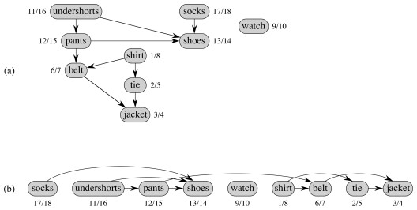

We can make it a bit more complex, with catcher's outfit (click to compare
your answer):

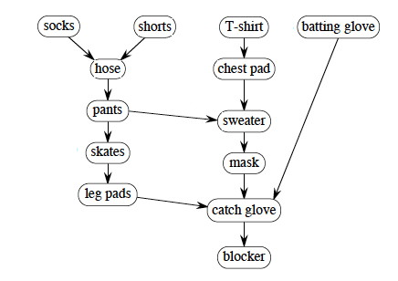

_The answer given starts with the batting glove and works left across the
unvisted nodes. What if we had started the search with socks and worked right
across the top nodes? If you put your clothes on differently, how could you
get the desired result? Hint: add an edge._

As noted previously, one could start with any vertex, and once the first tree
was constructed continue with any artibrary remaining vertex. It is not
necessary to start at the vertices at the top of the diagram. _Do you see
why?_

### Time Analysis

Time analysis is based on simple use of DFS: Θ(_V_ \+ _E_).

### Correctness

**_Lemma_**: A directed graph _G_ is acyclic iff a DFS of _G_ yields no back edges. 

See text for proof, but it's quite intuitive:

> ⇒ A back edge by definition is returning to where one started, which means
it completes a cycle.  
⇐ When exploring a cycle the last edge explored will be a return to the vertex
by which the cycle was entered, and hence classified a back edge.

**_Theorem:_** If `G` is a DAG then `Topological-Sort(G)` correctly produces a topological sort of `G`. 

It sufficies to show that

> if (_u_, _v_) ∈ _E_ then _v.f_ < _u.f_

because then the linked list ordering by _f_ will respect the graph topology).

When we explore (_u_, _v_), what are the colors of _u_ and _v_?

  * _u_ is gray, because it is being explored when (_u_, _v_) is found. 
  * Can _v_ be gray too? No, because then _v_ would be an ancestor of _u_, meaning (_u_, _v_) is a back edge, contradicting the DAG property by the lemma above.
  * Is _v_ white? Then it becomes a descendant of _u_. By the parentheses theorem, _u.d_ < _v.d_ <**_v.f_ < _u.f_**. 
  * Is _v_ black? Then _v_ is finished. Since we are exploring (_u_, _v_) we have not finished _u_. Therefore **_v.f_ < _u.f_**.

* * *

##  Strongly Connected Components

Given a directed graph _G_ = (_V_, _E_), a **strongly connected component
(SCC)** of _G_ is a maximal set of vertices _C_ ⊆ _V_ such that for all _u_,
_v_ ∈ _C_, there is a path both from _u_ to _v_ and from _v_ to _u_.

#### Example:

What are the Strongly Connected Components? (Click to see.)

### Algorithm

The algorithm uses _GT_= (_V_, _ET_), the **transpose** of _G_ = (_V_, _E_).
_GT_ is _G_ with all the edges reversed.

    
    
    Strongly-Connected-Components (G)
    1.  Call DFS(G) to compute finishing times _u_._f_ for each vertex _u_ ∈ _E_. 
    2.  Compute _GT_
    3.  Call modified DFS(_GT_) that considers vertices
        in order of decreasing _u_._f_ from line 1.
    4.  Output the vertices of each tree in the depth-first forest
        formed in line 3 as a separate strongly connected component. 
    

### Example 1

#### First Pass of DFS:

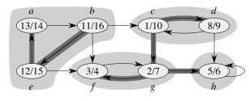

#### Second Pass of DFS:

### Why it Works

#### Informal Explanation

_(This is from my own attempt to understand the algorithm. It differs from the
book's formal proof.)_

_G_ and _GT_ have the same SCC.     _Proof:_

  * If _u_ and _v_ are in the same SCC in _G_, then there is a path _p_1 from _u_ to _v_ and a path _p_2 from _v_ to _u_.
  * Reversing the edges, path _p_1 becomes a path from _v_ to _u_ and _p_2 becomes a path from _u_ to _v_.

A DFS from any vertex _v_ in a SCC _C_ will reach _all_ vertices in _C_ (by
definition of SCC).

  * Then why can't we call DFS on unvisited vertices to find the SCCs in the first pass, line 1? 
  * Because this first unconstrained DFS could also get vertices _not_ in _C_, as there may be a path from _v_ in _C_ to _v'_ where there is no path from _v'_ to _v_ (so _v'_ is not in _C_)!

So how does the second search on _GT_ help avoid inadvertent inclusion of _v'_
in _C_?

  * _v'_ will have an earlier finishing time than some of the other vertices in _C_, because at least some of those vertices (in particular, _v_ from which _v'_ was reached) are still active (gray) when _v'_ is finished (Parentheses Theorem). 
  * In the second search, the component _C_ to which _v_ belongs is processed before _v'_ and its component, because _v_ has a later finishing time, so the entire component will be explored before other components (in particular, that containing _v'_). 
  * Since _GT_ has the same SCC as _G_, the component found from _v_ in the second search is the same component as in the previous search. 
  * But in this second search, _v'_ will _not_ be reached. Why? Because we are using reversed edges in _GT_. If _v'_ could be reached from _C_ in _GT_, then _v_ would be reachable from _v'_ in _G_, and so _v'_ would be a member of _C_, a contradiction.
  * So, due to the topological sort, the trees constructed in the second search cannot contain vertices _v'_ that do not belong to the SCC of the other vertices in the tree. This along with the fact that any DFS from a vertex _v_ in a SCC _C_ will find _all_ vertices in _C_ means that the trees constructed by the second DFSs find exactly the vertices in the SCCs.

In the example above, notice how node _c_ corresponds to _v_ and _g_ to _v'_
in the argument above. But we need to also say why nodes like _b_ will never
be reached from _c_ in the second search. It is because _b_ finished later in
the first search, so was processed earlier and already "consumed" by the
correct SCC in the second search, before the search from _c_ could reach it.
The following fact is useful in understanding why this would be the case.

#### Component Graph

  * Define _GSCC_ to be a graph of the SCCs of G obtained by collapsing all the vertices in each SCC into one vertex for the component but retaining the edges between SCCs.
  * Then this **component graph _GSCC_ is a Directed Acyclic Graph**. (If there were any cycles, vertices in each component would be reachable from all others, so they would be one component.) 

Here is _GSCC_ for the above example:

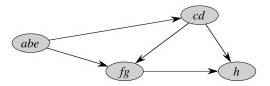

The first pass of the SCC algorithm essentially does a topological sort of the
graph _GSCC_ (by doing a topological sort of constituent vertices). The second
pass visits the components of _GTSCC_ in topologically sorted order such that
**_each component is searched before any component that can reach that
component_**.

Thus, for example, the component _abe_ is processed first in the second
search, and since this second search is of _GT_ (reverse the arrows above) one
can't get to _cd_ from _abe_. When _cd_ is subsequently searched, one can get
to _abe_ but it's vertices have _already been visited_ so can't be incorrectly
included in _cd_.

### Example 2

Start at the node indicated by the arrow; conduct a DFS; then click to compare
your answer:

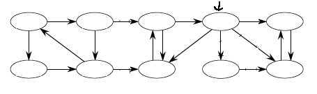

### Analysis

We have provided an informal justification of correctness: please see the CLRS
book for a formal proof of correctness for the SCC algorithm.

The CLRS text says we can create _GT_ in Θ(_V_ \+ _E_) time using adjacency
lists.

  * The easy approach is to simply copy the graph, but given the size of some graphs we work with, it would be much better to reverse the edges in place (and reverse them back when done). 
  * _ Problem for class: How can this be done? (A naive implementation could end up undoing some of its own work, as it confuses already-reversed edges with those to be reversed.)_

The SCC algorithm also has two calls to DFS, and these are Θ(V + E) each.

All other work is constant, so the overall time complexity is Θ(V + E).

* * *

##  Related Graph Concepts

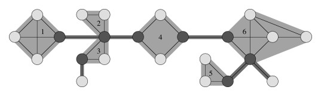

An **articulation point** or **cut vertex** is a vertex that when removed
causes a (strongly) connected component to break into two components.

A **bridge** is an edge that when removed causes a (strongly) connected
component to break into two components.

A **biconnected component** is a maximal set of edges such that any two edges
in the set lie on a common simple cycle. This means that there is no bridge
(at least two edges must be removed to disconnect it). This concept is of
interest for network robustness.

* * *

##  Up Next

We take a brief diversion from graphs to introduce amortized analysis and
efficient processing of union and find operations on sets, both of which will
be used in subsequent work on graphs. Then we return to graphs with concepts
of minimum spanning trees, shortest paths, and flows in networks.

* * *

Dan Suthers Last modified: Sat Mar 8 00:37:35 HST 2014  
Some images are from the instructor's material for Cormen et al. Introduction
to Algorithms, Third Edition.  

