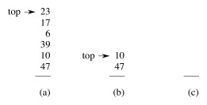
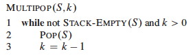
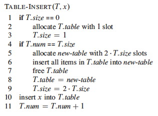
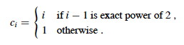

## Outline

  1. Amortized Analysis: The General Idea 
  2. Multipop Example 
  3. Aggregate Analysis 
  4. Accounting Method
  5. Potential Method
  6. Dynamic Table Example (first look)
  7. Other Examples

##  Amortized Analysis: The General Idea

We have already used _aggregate_ analysis several times in this course. For
example, when analyzing the BFS and DFS procedures, instead of trying to
figure out how many times their inner loops

> `for each _v_ ∈ G.Adj[_u_]`

execute (which depends on the degree of the vertex being processed), we
realized that no matter how the edges are distributed, there are at most |_E_|
edges, so in aggregate across all calls the loops will execute |_E_| times.

But that analysis concerned itself only with the complexity of a single
operation. In practice a given data structure will have associated with it
several operations, and they may be applied many times with varying frequency.

Sometimes a given operation is designed to pay a larger cost than would
otherwise be necessary to enable other operations to be lower cost.

_Example:_ Red-black tree insertion. We pay a greater cost for balancing so
that future searches will remain O(lg _n_).

_Another example:_ Java Hashtable.

  * These grow dynamically when a specified load factor is exceeded.
  * Copying into a new table is expensive, but copying is infrequent and table growth makes access operations faster.

It is "fairer" to average the cost of the more expensive operations across the
entire mix of operations, as all operations benefit from this cost.

Here, "average" means average cost in the worst case (thankfully, no
probability is involved, which greatly simplifies the analysis).

We will look at three methods. The notes below use Stacks with Multipop to
illustrate the methods. See the text for binary counter examples.

(We have already seen examples of aggregate analysis throughout the semseter.
We will see examples of amortized analysis later in the semester.)

* * *

##  Multipop Example

We already have the stack operations:

  * `Push(_S, x_)`: O(1) each call, so O(_n_) for any sequence of _n_ operations.
  * `Pop(_S_)`: O(1) each call, so O(_n_) for any sequence of _n_ operations.

Suppose we add a `Multipop` (this is a generalization of `ClearStack`, which
empties the stack):

 

The example shows a `Multipop(S,4)` followed by another where _k_ ≥ 2.

Running time of `Multipop`:

  * Linear in number of `Pop` operations (one per loop iteration)
  * Number of iterations of `while` loop is min(_s_, _k_), where _s_ = number of items on the stack
  * Therefore, total cost = min(_s_, _k_). 

What is the worst case of a sequence of _n_ `Push`, `Pop` and `Multipop`
operations?

Using our existing methods of analysis we can identify a _loose bound:_:

  * The most expensive operation is `Multipop`, potentially O(_n_).
  * Therefore, potentially O(_n2_) over _n_ operations.

* * *

##  Aggregate Analysis

We can tighten this loose bound by aggregating the analysis over all _n_
operations:

  * Each object can only be popped once per time that it is pushed.
  * There are at most _n_ `Push`es, so at most n `Pop`s, including those in `Multipop`
  * Therefore, total cost = O(_n_)
  * Averaging over the _n_ operations we get O(1) per operation.

This analysis shows O(1) per operation on average in a sequence of _n_
operations without using any probabilities of operations.

See text for example of aggregate analysis of binary counting. An example of
aggregate analysis of dynamic tables is at the end of these notes.

Some of our previous analyses with indicator random variables have been a form
of aggregate analysis, e.g., our analysis of the expected number of inversions
in sorting, [Topic 5
Notes](http://www2.hawaii.edu/~suthers/courses/ics311s14/Notes/Topic-05.html).

Aggregate analysis treats all operations equally. The next two methods let us
give different operations different costs, so are more flexible.

* * *

##  Accounting Method

#### Metaphor:

  * View the computer as a coin operated appliance that requires one _cyber-dollar_ (CY$) per basic operation.
  * The banks are wary of making loans these days, so when an operation is to be performed we must have enough cyber-dollars available to pay for it. 
  * We are permitted to charge some operations more than they actually cost so we can save enough to pay for the more expensive operations.

**Amortized cost** = amount we charge each operation.

This differs from aggregate analysis:

  * In aggregate analysis, all operations have the same cost.
  * In the accounting method, different operations can have different costs.

When an operation is overcharged (amortized cost > actual cost), the
difference is associated with _specific objects_ in the data structure as
_credit_.

We use this credit to pay for operations whose actual cost > amortized cost.

The credit must never be negative. Otherwise the amortized cost may not be an
upper bound on actual cost for some sequences.

Let

  * _ci_ = actual cost of _i_th operation. 
  * _ĉi_ = amortized cost of _i_th operation _(notice the 'hat')_. 

Require ∑_i_=1,_n__ĉi_   ≥   ∑_i_=1,_n__ci_ for all sequences of _n_
operations. That is, the difference between these sums always ≥ 0: we never
owe anyone anything.

### Stack Example

Whenever we `Push` an object (at actual cost of 1 cyberdollar), we potentially
have to pay CY$1 in the future to `Pop` it, whether directly or in `Multipop`.

To make sure we have enough money to pay for the `Pops`, we charge `Push`
CY$2.

  * CY$1 pays for the push
  * CY$1 is prepayment for the object being popped (metaphorically, this CY$1 is stored "on" the object).

Since each object has CY$1 credit, the credit can never go negative.

The total amortized cost _ĉ_ = ∑_i_=1,_n__ĉi_ for _any_ sequence of _n_
operations is an upper bound on the total actual cost _c_ = ∑_i_=1,_n__ci_ for
that sequence.

Since _ĉ_ = O(_n_), also _c_ = O(_n_).

Note: we don't actually store cyberdollars in any data structures. This is
just a metaphor to enable us to compute an amortized upper bound on costs.

* * *

##  Potential Method

Instead of credit associated with objects in the data structure, this method
uses the metaphor of _potential_ associated with the _entire data structure._

(I like to think of this as potential _energy,_ but the text continues to use
the monetary metaphor.)

This is the most flexible of the amortized analysis methods, as it does not
require maintaining an object-to-credit correspondence.

Let

  * D0 = initial data structure 
  * D_i_ = data structure after _i_th operation
  * _ci_ = actual cost of _i_th operation. 
  * _ĉi_ = amortized cost of _i_th operation. 

Potential Function **Φ**: D_i_ -> ℜ, and we say that Φ(D_i_) is the
**potential** associated with data structure D_i_.

We define the amortized cost _ĉi_ to be the actual cost _ci_ plus the change
in potential due to the _i_th operation:

> _ĉi_ = _ci_ \+ Φ(D_i_) − Φ(D_i-1_)

  * If at the _i_th operation, Φ(D_i_) − Φ(D_i-1_) is positive, then the amortized cost _c_'_i_ is an _overcharge_ and the potential of the data structure increases.
  * On the other hand, if Φ(D_i_) &minus: Φ(D_i-1_) is negative then _c_'_i_ is an undercharge, and the decrease of the potential of the data structure pays for the difference (as long as it does not go negative). 

The total amortized cost across _n_ operations is:

> ∑_i_=1,_n__ĉi_   =   ∑_i_=1,_n_(_ci_ \+ Φ(D_i_) - Φ(D_i-1_))   =
(∑_i_=1,_n__ci_) + (Φ(D_n_) - Φ(D0))

(The last step is taken because the middle expression involves a telescoping
sum: every term other than D_n_ and D0 is added once and subtracted once.)

If we require that Φ(D_i_) ≥ Φ(D0) for all _i_ then the amortized cost will
always be an upper bound on the actual cost no matter which _i_th step we are
on.

This is usually accomplished by defining Φ(D0) = 0 and then showing that
Φ(D_i_) ≥ 0 for all _i_. (Note that this is a constraint on Φ, not on _ĉ_. _ĉ_
can go negative as long as Φ(D_i_) never does.)

### Stack Example

Define Φ(D_i_) = number of objects in the stack.

Then Φ(D0) = 0 and Φ(D_i_) ≥ 0 for all _i_, since there are never less than 0
objects on the stack.

Charge as follows (recalling that _ĉi_ = _ci_ \+ Φ(D_i_) - Φ(D_i-1_)):

Since we charge 2 for each `Push` and there are O(n) Pushes in the worst case,
the amortized cost of a sequence of _n_ operations is O(_n_).

Does it seem strange that we charge `Pop` and `Multipop` 0 when we know they
cost something?

  * Remember that this is just a way of counting the total cost over a sequence of operations more precisely.
  * It is not a claim about the actual cost of a specific procedural call.
  * Like with the accounting method, we are guaranteeing that we have just enough credit on hand to pay for the operations when they happen.
  * The methods give a tight bound on amortized cost, but with much easier counting than if we had to reason about probability distributions, etc.

* * *

## Application: Dynamic Tables

There is often a tradeoff between time and space, for example, with hash
tables. Bigger tables give faster access but take more space.

Dynamic tables, like the Java Hashtable, grow dynamically as needed to keep
the load factor reasonable.

Reallocation of a table and copying of all elements from the old to the new
table is expensive!

But this cost is amortized over all the table access costs in a manner
analogous to the stack example: We arrange matters such that table-filling
operations build up sufficient credit before we pay the large cost of copying
the table; so the latter cost is averaged over many operations.

### A Familiar Definition

**Load factor α** = _num_/_size_, where _num_ = # items stored and _size_ = the allocated size of the table.

For the boundary condition of _size_ = _num_ = 0, we will define α = 1.

We never allow α > 1 (no chaining).

### Insertion Algorithm

We'll assume the following about our tables. (See Exercises 17.4-1 and 17.4-3
concerning different assumptions.):

When the table becomes full, we double its size and reinsert all existing
items. This guarantees that α ≥ 1/2, so we are not wasting a lot of space.

    
    
    Table-Insert (T,x)
    1   if T.size == 0
    2       allocate T.table with 1 slot 
    3       T.size = 1
    4   if T.num == T.size
    5       allocate newTable with 2*T.size slots
    6       insert all items in T.table into newTable
    7       free T.table
    8       T.table = newTable 
    9       T.size = 2*T.size 
    10  insert x into T.table 
    11  T.num = T.num + 1
    

Each _elementary insertion_ has unit actual cost. Initially _T.num_ = _T.size_= 0.

### Aggregate Analysis of Dynamic Table Expansion

Charge 1 per elementary insertion. Count only elementary insertions, since all
other costs are constant per call.

**_ci_** = actual cost of _i_th operation.

  * If the table is not full, _ci_ = 1 (for lines 1, 4, 10, 11). 
  * If full, there are _i_ \- 1 items in the table at the start of the _i_th operation. Must copy all of them (line 6), and then insert the _i_th item. Therefore _ci_ = _i_ \- 1 + 1 = _i_. 

A sloppy analysis: In a sequence of _n_ operations where any operation can be
O(_n_), the sequence of _n_ operations is O(_n_2).

This is "correct", but inprecise: we rarely expand the table! A more precise
account of _ci_:

Then we can sum the total cost of all _ci_ for a sequence of _n_ operations:

_Explain:_ Why the _n_? What is the summation counting? Why does the summation
start at _j_ = 0? Why does it end at _j_ = lg _n_?

Therefore, the amortized cost per operation = 3: we are only paying a small
constant price for the expanding table.

The text also gives accounting and potential analyses of table expansion.

This analysis assumed that the table never shrinks. See section 17.4 (and your
homework) for an analysis using the potential method that covers shrinking
tables.

* * *

## Other Examples

Here are some other algorithms for which amortized analysis is useful:

### Red-Black Trees

An amortized analysis of Red-Black Tree restructuring (Problem 17-4 of CLRS)
improves upon our analysis earlier in the semester:

  * Any sequence of _m_ `RB-Insert` and `RB-Delete` operations performs O(_m_) structural modifications (rotations), 
  * This each operation does **O(1) structural modifications on average**, regardless of the size of the tree!
  * An operation still may need to do O(lg _n_) recolorings, but these are very simple operations.

### Self-Organizing Lists

  * Self-organizing lists use a **_move-to-front heuristic_**: Immediately after searching for an element, it is moved to the front of the list.
  * This makes frequently accessed items more readily available near the front of the list.
  * An amortized analysis (Problem 17-5) shows that the heuristic is no more than 4 times worse than optimal.

### Splay Trees

  * Splay trees are ordinary binary search trees (no colors, no height labels, etc.)
  * After every access (every insertion, deletion, or search), the element operated on (or its parent in the case of deletion) is moved towards the top of the tree.
  * This movement uses three **_splaying_** operations called "zig", "zig-zig" and "zig-zag".
  * Although in the worst case a splay tree can degenerate into an O(_n_) linked list, amortized analysis shows that the expected case is O(lg _n_)
  * Randomization can be used to make the worst case very unlikely.
  * If a single element is accessed at least _m_/4 times where _m_ is the number of operations, then the amortized running time of each of these accesses is O(1).
  * Thus, splay-trees self-organize to provide fast access to frequently accessed items.
  * This makes them good for locality of reference in memory, but multithreaded access must be implemented carefully.

### To Be Continued

Amortized analysis will be used in analyses of

  * Graph search (Topic 14, Ch. 22) 
  * Disjoint set operations (Topic 16, Ch. 21) 
  * Dijkstra's Algorithm for Shortest Paths (Topic 18, Ch. 24) 

* * *

Dan Suthers Last modified: Sun Mar 16 02:03:09 HST 2014  
Images are from the instructor's material for Cormen et al. Introduction to
Algorithms, Third Edition.  

