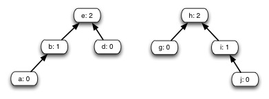

## Disjoint sets

### 1. State of the Union

**Show the result of Union(e,j) on this forest.**

### 2. Iterative Find-Set

Find-Set as written in the text is not tail recursive, so a compiler won't be
able to automatically generate efficient iterative executable code. **Write an
iterative version of Find-Set.**

### 3. Connected-Components 
  
 

During the execution
of Connected-Components on an undirected graph _G_=(_V_,_E_) with _k_
connected components,

**(a) How many times is Find-Set called directly by Connected-Components? **  
  
**(b) How many times is Union called directly by Connected-Components? **

Express your answer in terms of _V_, _E_ and _k_ (but NOT asymptotic
notation). (Hint: solve for _k_=1 first and then think about what happens when
_k_=2.)

