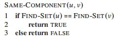
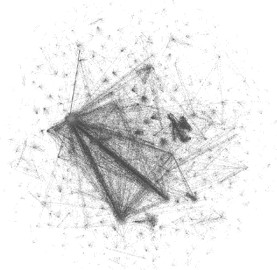
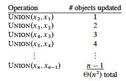
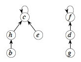
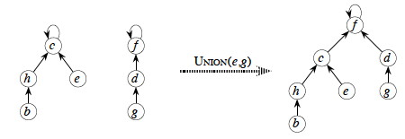
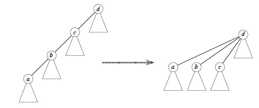
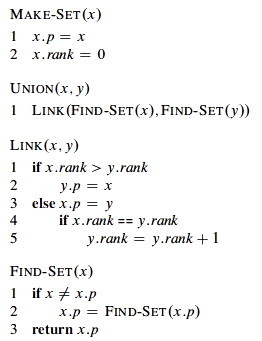
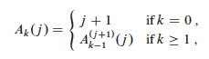
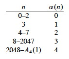

## Outline

  1. Disjoint Dynamic Sets 
  2. Finding Connected Components with Disjoint Sets 
  3. Linked List Representations of Disjoint Sets 
  4. Forest Representations of Disjoint Sets

##  Dynamic Disjoint Sets (Union Find)

Two sets _A_ and _B_ are **disjoint** if they have no element in common.

Sometimes we need to group n distinct elements into a collection Š of disjoint
sets Š = {_S_1, ..., _Sk_} that may change over time.

  * Š is a set of sets: { { _x_, ... }, ..., { _y_, ... } } 
  * Each set _Si_ ∈ Š is identified by a **representative**, which is some member of the set (e.g., _x_ and _y_).
  * It does not matter which member is the representative, as long as the representative remains the same while the set is not modified.

Disjoint set data structures are also known as **Union-Find** data structures,
after the two operations in addition to creation. (Applications often involve
a mixture of searching for set membership and merging sets.)

### Operations

> **Make-Set(_x_)**: make a new set _Si_ = {_x_} _(_x_ will be its
representative)_ and add _Si_ to Š.

> **Union(_x_, _y_)**: if _x_ ∈ _Sx_ and _y_ ∈ _Sy_, then Š <- Š − _Sx_ − _Sy_
∪ {_Sx_ ∪ _Sy_} _(that is, combine the two sets _Sx_ and _Sy_)_.

>

>   * The representative of _Sx_ ∪ _Sy_ is any member of that new set
(implementations often use the representative of one of _Sx_ or _Sy_.)

>   * Destroys _Sx_ and _Sy_, since the sets must be disjoint (they cannot co-
exist with _Sx_ ∪ _Sy_).

> **Find-Set(_x_)**: return the representative of the set containing _x_.

### Analysis

We analyze in terms of:

  * _n_ = number of Make-Set operations, i.e., the number of sets initially involved
  * _m_ = total number of operations

Some facts we can rely on:

  * _m_ ≥ _n_
  * Can have at most _n_−1 Union operations, since after _n_−1 Unions, only 1 set remains.
  * It can be helpful for analysis to assume that the first _n_ operations are Make-Set operations (put all the elements we will be working with in singleton sets to start with).

* * *

##  Applications of Disjoint Sets

Union-Find on disjoint sets is used to find structure in other data
structures, such as a graph. We initially assume that all the elements are
distinct by putting them in singleton sets, and then we merge sets as we
discover the structure by which the elements are related.

### Finding Connected Components

Recall from [Topic
14](http://www2.hawaii.edu/~suthers/courses/ics311s14/Notes/Topic-14.html)
that for a graph _G_ = (_V_, _E_), vertices _u_ and _v_ are in the same
**connected component** if and only if there is a path between them.

Here are the algorithms for computing connected components and then for
testing whether two items are in the same component:

 

_Would that work with a directed graph?_

#### Example

Although it is easy to see the connected components above, the utility of the
algorithm becomes more obvious when we deal with large graphs (such as
pictured)!

#### Alternatives

In a _static_ undirected graph, it is faster to run Depth-First Search
(exercise 22.3-12), or for static directed graphs the strongly connected
components algorithm of [Topic
14](http://www2.hawaii.edu/~suthers/courses/ics311s14/Notes/Topic-14.html)
(section 22.5), which consists of two DFS. But in some applications edges may
be added to the graph. In this case, union-find with disjoint sets is faster
than re-running the DFS.

### Minimum Spanning Trees

Next week we cover algorithms to find _minimum spanning trees_ of graphs.
Kruskal's algorithm will use Union-Find operations.

* * *

##  Linked List Representations of Disjoint Sets

One might think that lists are the simplest approach, but there is a better
approach that is not any more complex: this section is mainly for comparision
purposes.

### Representation

Each set is represented using an unordered singly linked list. The list object
has attributes:

  * **head**: pointing to the first element in the list, the set's representative.
  * **tail**: pointing to the last element in the list.

Each object in the list has attributes for:

  * **next**
  * The **set member** (e.g., the vertex in the graph being analyzed)
  * A pointer to the list object that represents the **set**

### Operations

First try:

  * Make-Set(_x_): create a singleton list containing _x_
  * Find-Set(_x_): follow the pointer back to the list object, and then follow the `head` pointer to the representative
  * Union(_x_, _y_): append _y_'s lists onto the end of _x_'s list. 
    * Use _x_'s tail pointer to find the end.
    * Need to update the pointer back to the set object for every node on _y_'s list.

For example, let's take the union of _S_1 and _S_2, replacing _S_1:

This can be slow for large data sets. For example, suppose we start with _n_
singletons and always happend to append the larger list onto the smaller one
in a sequence of merges:

If there are _n_ Make-Sets and _n_ Unions, the amortized time per operation is
O(_n_)!

A **weighted-union heuristic** speeds things up: always append the smaller
list to the larger list (so we update fewer set object pointers). Althought a
single union can still take Ω(_n_) time (e.g., when both sets have _n_/2
members), a sequence of _m_ operations on _n_ elements takes O(_m_ \+ _n_ lg
_n_) time.

**_Sketch of proof:_** Each Make-Set and Find-Set still takes O(1). Consider how many times each object's set representative pointer must be updated during a sequence of _n_ Union operations. It must be in the smaller set each time, and after each Union the size of this smaller set is at least double the size. So: 

Each representative set for a given element is updated ≤ lg _n_ times, and
there are _n_ elements plus _m_ operations. However, we can do better!

* * *

##  Forest Representations of Disjoint Sets

The following is a classic representation of Union-Find, due to Tarjan (1975).
The set of sets is represented by a forest of trees. The code is as simple as
the analysis of runtime is complex.

### Representation

  * Each tree represents a set.
  * The root of the tree is the set representative.
  * Each node points only to its parent (no child pointers needed).
  * The root points to itself as parent. 

### Operations

  * Make-Set(_x_): create a single node tree with _x_ at the root
  * Find-Set(_x_): follow parent pointers back to the root
  * Union(_x_, _y_): make one root a child of the other. (This in itself could degenerate to a linear list-like tree, but we will fix this below.)

#### Heuristics

In order to avoid degeneration to linear trees, and achieve amazing amortized
performance, these two heuristics are applied:

**Union by Rank**: make the root of the "smaller" tree a child of the root of the "larger" tree. But rather than size we use **rank**, an upper bound on the height of each node (stored in the node).

  * Rank of singleton sets is 0.
  * When taking the Union of two trees of equal rank, choose one arbitrarily to be the parent and increment its rank by one. _(Why is it incremented?)_
  * When taking the Union of two trees of unequal rank, the tree with lower rank becomes the child, and ranks are unchanged. _(Why does this make sense?)_

**Path Compression**: When running Find-Set(_x_), make all nodes on the path from _x_ to the root direct children of the root. For example, Find-Set(a):

### Algorithms

The algorithms are very simple! (But their analysis is complex!) We assume
that nodes _x_ and _y_ are tree nodes with the client's element data already
initialized.

Link implements the union by rank heuristic.

Find-Set implements the path compression heuristic. It makes a recursive pass
up the tree to find the path to the root, and as recursion unwinds it updates
each node on the path to point directly to the root. (This means it is not
tail recursive, but as the analysis shows, the paths are very unlikely to be
long.)

### Time Complexity

The analysis can be found in section 21.4. It is very involved, and I only
expect you to know what is discussed below. It is based on a very fast growing
function:

_Ak_(_j_) is a variation of **Ackerman's Function**, which is what you will
find in most classic texts on the subject. The function grows so fast that
_A_4(1) = 16512 is _much_ larger than the number of atoms in the observable
universe (1080)!

The result uses **α(_n_),** a single parameter inverse of _Ak_(_j_) defined as
the lowest _k_ for which _Ak_(1) is at least _n_:

> α(_n_) = min{_k_ : _Ak_(1) ≥ _n_}

α(_n_) grows _very_ slowly, as shown in the table. We are highly unlikely to
ever encounter α(_n_) > 4 (we would need input size much greater than the
number of atoms in the universe). Although its growth is strictly larger than
a constant, for all practical purposes we can treat α(_n_) as a constant.

The analysis of section 21.4 shows that the running time is **O(_m_ α(_n_))**
for a sequence of _m_ `Make-Set`, `Find-Set` and `Union` operations. Thus for
all practical purposes, the cost of a sequence of _m_ such operations is
O(_m_), or O(1) amortized cost per operation!

* * *

## Wrapup

We now return to Graphs. We'll see Union-Find used when we cover minimum
spanning trees.

* * *

Dan Suthers Last modified: Thu Apr 17 15:35:22 HST 2014  
Images are from the instructor's material for Cormen et al. Introduction to
Algorithms, Third Edition.  

