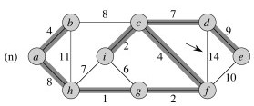

## Minimum Spanning Graph

#### 1\. Peer Credit Assignment

Please list the names of the other members of your peer group for this week
and the number of extra credit points you think they deserve for their
participation in group work on Tuesday and Thursday combined.

  * If all three members besides yourself were present at some time, you have a total of 3 points to allocate.
  * If only two members besides yourself were present, you have a total of 4 points to allocate.
  * If only one other member was present, you have a total of 6 points to allocate.
  * You need not allocate all the points available to you. Points allocated to yourself will not be recorded.

#### 2\. (4 pts) Positive and Negative Weights: Minimum Spanning Graph?

Given a graph _G_ = (_V_, _E_), must any subset of edges _T_ ⊆ _E_ that
connects all vertices in V and have minimal total weight be a tree, or can it
be some other subgraph? Answer this question separately for two cases:

> **a.** All of the edges have positive weight.  
  
**b.** Some edges may have negative weights. 

If you think "yes it must be a tree" then argue why this is the case (hint:
suppose it's not a tree: find a contradiction to connectedness or minimality).
If you think "no, it need not be a tree" then give an example where a
connected graph that is not a tree has lower weight.

#### 3\. (1 pt) Kruskal Alternative Spanning Tree

The graph of Figure 23.4 has several edges of equal weight. Sometimes both are
used; sometimes one can't be used because it forms a cycle; and sometimes the
choice is arbitrary: either edge could have been used. In this third case, the
choice of which one was used depends on the order in which edges are sorted in
line 4 (nondecreasing order by weight).

The actual ordering used in the book's example is:

> ` (g, h), (c, i), (f, g), (a, b), (c, f), (g, i), (c, d),  
(h, i), (a, h), (b, c), (d, e), (e, f), (b, h), (d, f) `

Give an ordering that would result in a different minimum spanning tree than
the one shown in figure 23.4 by rewriting the above list swapping just one
pair of edges.

#### 4\. (5 pts) Building Low Cost Bridges

Suppose we are in Canada's Thousand Islands National Park, and in one
particular lake there are eight small islands that park officials want to
connect with floating bridges so that people can experience going between
islands without a canoe. The cost of constructing a bridge is proportional to
its length, and the table below shows the distances between pairs of islands
in meters (Canada is trying to free itself of the archaic British system of
measurement based on the sizes of a dead king's body parts.)

Which bridges should they build to connect the eight islands at minimal cost?
Say in a sentence or two how you found the solution, and give the solution as
a list of pairs of islands, for example, (A, B) ....

<table width="50%" border="1">
  <tr>
    <th scope="col">&nbsp;</th>
    <th scope="col">A</th>
    <th scope="col">B</th>
    <th scope="col">C</th>
    <th scope="col">D</th>
    <th scope="col">E</th>
    <th scope="col">F</th>
    <th scope="col">G</th>
    <th scope="col">H</th>
  </tr>
  <tr>
    <th scope="row">A</th>
    <td>
&minus;
</td>
    <td>
240
</td>
    <td>
210
</td>
    <td>
340
</td>
    <td>
280
</td>
    <td>
200
</td>
    <td>
345
</td>
    <td>
120
</td>
  </tr>
  <tr>
    <th scope="row">B</th>
    <td>

      
&minus;

    
</td>
    <td>
&minus;
</td>
    <td>
265
</td>
    <td>
175
</td>
    <td>
215
</td>
    <td>
180
</td>
    <td>
185
</td>
    <td>
155
</td>
  </tr>
  <tr>
    <th scope="row">C</th>
    <td>
&minus;
</td>
    <td>

      
&minus;

    
</td>
    <td>
&minus;
</td>
    <td>
260
</td>
    <td>
115
</td>
    <td>
350
</td>
    <td>
435
</td>
    <td>
195
</td>
  </tr>
  <tr>
    <th scope="row">D</th>
    <td>

      
&minus;

    
</td>
    <td>

      
&minus;

    
</td>
    <td>

      
&minus;

    
</td>
    <td>
&minus;
</td>
    <td>
160
</td>
    <td>
330
</td>
    <td>
295
</td>
    <td>
230
</td>
  </tr>
  <tr>
    <th scope="row">E</th>
    <td>

      
&minus;

    
</td>
    <td>

      
&minus;

    
</td>
    <td>

      
&minus;

    
</td>
    <td>

      
&minus;

    
</td>
    <td>
&minus;
</td>
    <td>
360
</td>
    <td>
400
</td>
    <td>
170
</td>
  </tr>
  <tr>
    <th scope="row">F</th>
    <td>

      
&minus;

    
</td>
    <td>

      
&minus;

    
</td>
    <td>

      
&minus;

    
</td>
    <td>

      
&minus;

    
</td>
    <td>

      
&minus;

    
</td>
    <td>
&minus;
</td>
    <td>
175
</td>
    <td>
205
</td>
  </tr>
  <tr>
    <th scope="row">G</th>
    <td>

      
&minus;

    
</td>
    <td>

      
&minus;

    
</td>
    <td>

      
&minus;

    
</td>
    <td>

      
&minus;

    
</td>
    <td>

      
&minus;

    
</td>
    <td>
&minus;
</td>
    <td>
&minus;
</td>
    <td>
305
</td>
  </tr>
  <tr>
    <th scope="row">H</th>
    <td>

      
&minus;

    
</td>
    <td>

      
&minus;

    
</td>
    <td>

      
&minus;

    
</td>
    <td>
&minus;
</td>
    <td>

      
&minus;

    
</td>
    <td>
&minus;
</td>
    <td>

      
&minus;

    
</td>
    <td>

      
&minus;

    
</td>
  </tr>
</table>