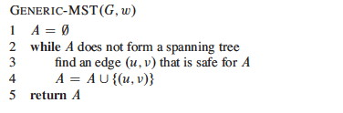

## Outline

  1. Minimum Spanning Trees 
  2. Generic Algorithm and Safe Edge Theorem 
  3. Kruskal's Algorithm 
  4. Prim's Algorithm 

##  Minimum Spanning Trees

### Spanning Trees

A **spanning tree** _T_ for a connected graph _G_ is a tree that includes all
the vertices of _G_: it _spans_ the graph.

Without calling them such, we have already encountered two kinds of spanning
trees in the introduction to graphs ([Topic
14](http://www2.hawaii.edu/~suthers/courses/ics311s14/Notes/Topic-14.html)):
those generated by breadth-first search and depth-first search. We saw that _
breadth-first trees _ are one way of finding shortest paths in a graph, and _
depth-first forests _ (a collection of spanning trees, one for each connected
component) are good for uncovering the structure of a graph such as
topological sort and connectivity. These were defined on unweighted graphs.

### Minimum Spanning Trees

Many application areas (e.g., in communications, electronics, and
transportation) require finding the lowest cost way to connect a set of
objects or locations. For example, the cost may be measured in terms of
currency or distance. We can model such situations with _**weighted graphs**_,
introduced in [Topic
14](http://www2.hawaii.edu/~suthers/courses/ics311s14/Notes/Topic-14.html) as
graphs where a real-valued number is associated with each edge. Then we want
to find a spanning tree of minimum cost.

More formally, we can pose this as a problem on a graph representation _G_ =
(_V_, _E_):

  * The objects or locations are vertices _V_ and the available connections are edges _E_.
  * A weight function _w_(_u_,_v_) gives the weight on each edge (_u_,_v_) ∈ _E_.
  * We seek _T_ ⊆ _E_ such that 
    * _T_ connects all the vertices _V_ of _G_. 
    * The sum of weights _w_(_T_) = Σ(_u_,_v_)∈_T_ _w_(_u_,_v_) is minimized. 

A few facts can be noted:

  * _G_ must be connected (consist of a single connected component) in order for _T_ to be possible. 
  * However, if _G_ is not connected we can generalize the problem to one of finding _T_1 ... _Tc_ for each of _c_ connected components of _G_.
  * A subgraph of _G_ that connects its vertices _V_ at minimal cost will always be a tree. _Why?_

Therefore we call this the **minimum spanning tree (MST)** problem (and the
generalized version the minimum spanning forest problem).

Here is an example of a minimum spanning tree (the shaded edges represent
_T_):

_Are minimum spanning trees unique?_

Look at edges (_e_,_f_) and (_c_,_e_).

* * *

##  Generic Algorithm and Safe Edge Theorem

We specify a generic greedy algorithm for solving the MST problem. The
algorithm will be "greedy" in terms of always choosing a lowest cost edge.
This algorithm is instantiated into two versions, Kruskal's and Prim's
algorithms, which differ in how they define from what set of edges the lowest
cost edge is chosen.

Let's start by noting some properties that MSTs of _G_ = (_V_, _E_) must have

  * A MST for _G_ has |_V_| − 1 edges. (See properties of trees, [Topic 8](http://www2.hawaii.edu/~suthers/courses/ics311s14/Notes/Topic-08.html).)
  * Any tree (and hence any MST) has no cycles. It has only one path between any two vertices.
  * There might be more than one MST for _G_.

### Building a Solution

  * We will build a set of edges _A_. 
  * Initially _A_ has no edges.
  * As we add edges to _A_, we maintain a loop invariant: _A_ is a subset of _some_ MST for _G_.

Define an edge (_u_,_v_) to be **safe** for _A_ iff _A_ ∪ {(_u_,_v_)} is also
a subset of some MST for _G_.

(BTW, "iff" is not a spelling error: it is shorthand for "if and only if"
commonly used in proofs.

If we only add safe edges to _A_, once |_V_| − 1 edges have been added we have
a MST for _G_. This motivates the ...

### Generic MST Algorithm

_Loop Invariant:_ _A_ is a subset of some MST for _G_

  * _Initialization:_ The initially empty set trivially satisfies the loop invariant.
  * _Maintenance:_ Since we add only safe edges, _A_ remains a subset of some MST.
  * _Termination:_ We stop when _A_ is a spanning tree (|_A_| = |_V_| − 1), and it is a subset of itself.

OK, great, but how do we find safe edges?

### Finding Safe Edges

Each time we add an edge we are connecting two sets of vertices that were not
previously connected by _A_. (Otherwise we would be forming a cycle.) A greedy
algorithm might try to keep the cost down by choosing the lowest cost edge
that connects previously unconnected vertices. (Perhaps we should call it a
"stingy" algorithm!)

But is this greedy strategy "safe"? How do we know that after adding this edge
we still have a subset of an MST?

First some definitions:

  * A **cut** (_S_, _V_ − _S_) is a partition of vertices into disjoint sets _S_ and _V_ − _S_. 
  * Edge (_u_,_v_) ∈ _E_ **crosses** cut (_S_, _V_ − _S_) if one endpoint is in _S_ and the other is in _V_ − _S_. 
  * A cut **respects** _A_ iff no edge in _A_ crosses the cut.
  * An edge is a **light edge** crossing a cut iff its weight is minimum over all edges crossing the cut. (There may be more than one light edge for a given cut.) 

The following illustrates a cut and will be used in the proof below. There are
two sets of vertices _S_ and _V_ − _S_. Four edges cross the cut (_S_, _V_ \-
_S_). Whether or not this respects _A_ depends on what is in _A_.

_Suppose A is the shaded edges. Does this cut respect A?_

#### Safe Edge Theorem

Let _G_ = (_V_, _E_) be a graph, _A_ be a subset of some MST for _G_, (_S_,
_V_ − _S_) be a cut that respects _A_, and (_u_,_v_) be a light edge crossing
(_S_, _V_ − _S_). Then (_u_,_v_) is safe for _A_.

(_A light edge that crosses a cut that respects _A_ is safe for _A_._)

_**Proof:**_ Let _T_ be a MST that includes _A_. Consider two cases:

Case 1: _T_ contains (_u_,_v_). Then the theorem is proven, since _A_ ∪
{(_u_,_v_)} ⊆ _T_ is a subset of some MST for _G_.

Case 2: _T_ does not contain (_u_,_v_). We will show that we can construct a
tree _T'_ that is a MST for _G_ and that contains _A_ ∪ {(_u_,_v_)}.

Since _T_ is a tree it contains a unique path _p_ between _u_ and _v_. Path
_p_ must cross the cut (_S_, _V_ − _S_) at least once (otherwise _T_ would be
disconnected). Let (_x_,_y_) be an edge of _p_ that crosses the cut.

(Except for the dashed edge (_u_,_v_), all the edges shown in the figure are
in _T_. _A_ is not shown in the figure, but it cannot contain any edges that
cross the cut, since the cut respects _A_. Shaded edges are the path _p_.)

Since the cut respects _A_, edge (_x_,_y_) is not in _A_.

To form _T'_ from _T_: Remove (_x_,_y_). This breaks _T_ into two components.
Add (_u_,_v_). This reconnects the tree. So _T'_ = T - {(_x_,_y_)} ∪ (_u_,_v_)
is a spanning tree.

To show that _T'_ is a minimal spanning tree: _w_(_T'_) = _w_(_T_) -
_w_(_x_,_y_) + _w_(_u_,_v_) ≤ _w_(_T_) since (_u_,_v_) is light.

We still need to show that (_u_,_v_) is safe for _A_. Since _A_ ⊆ _T_ and
(_x_,_y_) ∉ _A_ then A ⊆ _T'_. Therefore _A_ ∪ {(_u_,_v_)} ⊆ _T'_, a MST. ♦

#### Further Observations

_A_ is a forest containing connected components. Initially each component is a
single vertex. Any safe edge merges two of these components into one. Each
component so constructed is a tree. Since an MST has exactly |_V_| − 1 edges,
the loop iterates |_V_| − 1 times before we are down to one component.

#### Corollary

If _C_ = (_VC_, _EC_) is a connected component in the forest _GA_ = (_V_, _A_)
and (_u_,_v_) is a light edge connecting _C_ to some other component _C'_ in
_GA_ \-- that is, (_u_,_v_) is a light edge crossing the cut (_VC_, _V_ \-
_VC_) -- then (_u_,_v_) is safe for _A_.

_Proof:_ Set _S_ = _VC_ in the theorem. ♦

This idea (of thinking in terms of components rather than vertices) leads to
Kruskal's algorithm ...

* * *

##  Kruskal's Algorithm

Kruskal's algorithm starts with each vertex being its own component, and
repeatedly merges two components into one by choosing the light edge that
connects them. It does this greedily (or stingily?) by scanning the edges in
increasing order by weight. A disjoint-set data structure is used to determine
whether an edge connects vertices in two different components.

This algorithm has similarities with the connected components algorithm we
previously saw in [Topic
16](http://www2.hawaii.edu/~suthers/courses/ics311s14/Notes/Topic-16.html):

Here is Kruskal's version:

### Example

Let's start with this example. The first edge has been chosen.

Add 4 more edges (notice we could add edges of weight 2 in either order, and
similarly for 4) ...

The next edge considered is not added because it would connect already
connected vertices:

Keep going until the MST is constructed, and click to see the final tree.

### Analysis

The costs are:

  * Initialize _A_: O(1)
  * First `for` loop: |_V_| `MAKE-SET` operations
  * Sort _E_: O(_E_ lg _E_) 
  * Second `for` loop: O(_E_) `FIND-SETs` and `UNIONs`

If we use the tree implementation of the disjoint-set data structure with
union by rank and path compression ([Topic
16](http://www2.hawaii.edu/~suthers/courses/ics311s14/Notes/Topic-16.html)),
the amortized cost per `MAKE-SET`, `UNION` and `FIND-SET` operation (across
|_E_| operations) is O(α(_V_)), where α is a _very_ slowly growing function,
the inverse of Ackermann's function. (Lemma 21.11 states that MAKE-SET in
isolation is O(1), but here we must treat it as O(α(_V_)) since we are making
a statement about the amortized cost per operation in a _sequence_ of _m_
operations: see section 24.1. Also, using O(α(_V_)) simplifies the expression
below.)

Droping the lower order O(1) and substituting α(_V_) for the disjoint-set
operations, the above list of costs sums to O((_V_ \+ _E_)⋅α(_V_))+ O(_E_ lg
_E_).

Since G is connected, |_E_| ≥ |_V_| − 1, so we can replace _V_ with _E_ to
simplify the first term for the disjoint-set operations, O((_V_ \+
_E_)⋅α(_V_)), to O((_E_ \+ _E_)⋅α(_V_)) or O(_E_⋅α(_V_)).

Furthermore, α(_V_) = O(lg _V_) = O(lg _E_), so O(_E_⋅α(_V_)) is O(_E_ lg
_E_), and hence the entire expression we started with, O((_V_ \+ _E_)⋅α(_V_))+
O(_E_ lg _E_), simplifies to O(_E_ lg _E_).

Finally, since |_E_| ≤ |_V_|2, lg |_E_| = O(2 lg _V_) = O(lg _V_), so we can
write the result as **O(_E_ lg _V_)** to obtain the growth rate in terms of
both |_E_| and |_V_|.

(It is usually a good idea to include both _V_ and _E_ when giving growth
rates for graph algorithms, unless one of them can be strictly limited to the
other. Shortly we will see that O(_E_ lg _V_) enables comparison to Prim's
algorithm.)

* * *

##  Prim's Algorithm

This algorithm is also a greedy (stingy) algorithm, but it builds one tree,
choosing the lightest edge incident on the growing tree, so the set _A_ is
always a tree. The tree is initialized to be a single vertex, designated _r_
for root.

At each step it finds a light edge crossing the cut (_VA_, _V_ \- _VA_), where
_VA_= vertices that are incident on _A_, and adds this edge to _A_.
(Initially, _A_ = {} and _VA_ = {_r_}.)

(Edges of _A_ are shaded in the illustration.)

### General Idea

To find the light edge quickly we use a priority queue _Q_ ([Topic
09](http://www2.hawaii.edu/~suthers/courses/ics311s14/Notes/Topic-09.html)):

  * Each queued object is a vertex in _V_ − _VA_ (the vertices that have not yet been connected to _A_). 
  * The key is the minimum weight of any edge (_u_,_v_) where _u_ ∈ _VA_. (We update this weight for _v_ whenever a new edge is found that reaches _v_ at a lower cost than before.) 
  * Thus the vertex returned by `EXTRACT-MIN` is for _v_ such that ∃ _u_ ∈ _VA_ and (_u_,_v_) is a light edge crossing (_VA_, _V_ \- _VA_). 
  * If _v_ is not adjacent to any vertices in _VA_, the key of _v_ is ∞

The edges of _A_ will form a rooted tree with root _r_, given as input (_r_
can be any vertex).

  * Each vertex keeps track of its parent by the attribute _v_.π = parent of _v_, or NIL if _v_ = _r_ or has no parent yet.
  * As the algorithm progresses, _A_ = {(_v_, _v_.π) : _v_ ∈ _V_ \- {_r_} − _Q_}. 
  * At termination, _Q_ is empty, so _A_ is a MST.

### Pseudocode

This code _differs from the book's version_ in having explicit calls to the
heap methods:

Notice that it is possible for the last `if` to execute multiple times for a
given _v_. In other words, we may find an edge reaching vertex _v_, but before
we choose to use it (because other edges have lower key values), we find
another edge reaching _v_ for lower cost (key value). _Watch for this
situation in the example below._

### Example

Let's try it with this graph. The first three steps are shown. Every time a
vertex is dequed, it is colored black and the cost of all adjacent vertices
are updated as needed. For example, when **a** is dequeued, the cost of **b**
is updated from infinite to 4, and the cost of **h** is updated from infinite
to 8. Then when **b** is dequeued, its neighbors are updated and so on.

_Did you see where a vertex's key was lowered from one non-infinite value to
another? Which one? _

_Now finish it and click on the image to see final solution._

###  Analysis

Performance depends on the priority queue implementation. With a binary heap
implementation ([Topic
09](http://www2.hawaii.edu/~suthers/courses/ics311s14/Notes/Topic-09.html)),
the costs are:

  * Initialize _Q_ and iterate over |_V_| vertices in first `for` loop to insert in queue, each insert being O(lg _V_): O(_V_ lg _V_) total.
  * Decrease key of r: O(lg _V_)
  * The `while` loop has |_V_| `EXTRACT-MIN` calls -> O(_V_ lg _V_)
  * By amortized analysis, the inner `for each` loop processes Θ(|_E_|) edges, O(_E_) of which result in O(lg _V_) `DECREASE-KEY` calls -> O(_E_ lg _V_)

The sum of the dominating terms is O(_V_ lg _V_) + O(_E_ lg _V_).

If G is connected, |_E_| ≥ |_V_| − 1, so we can replace O(_V_ lg _V_) with
O(_E_ lg _V_), and the total is **O(_E_ lg _V_)**.

This is asympotitically the same as Kruskal's algorithm. A faster
implementation of O(_E_ \+ _V_ lg _V_) is possible with Fibonacci Heaps, as
explained in the text.

* * *

Dan Suthers Last modified: Thu Apr 3 12:36:42 HST 2014  
Images are from the instructor's material for Cormen et al. Introduction to
Algorithms, Third Edition.  

