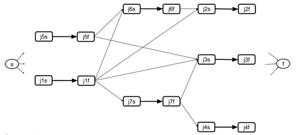
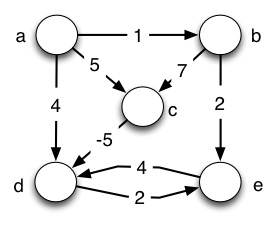
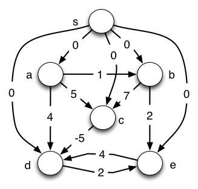
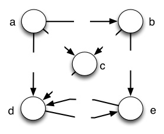
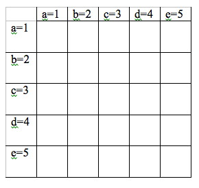

### 1\. Peer Credit Assignment

Please list the names of the other members of your peer group for this week
and the number of extra credit points you think they deserve for their
participation in group work on Tuesday and Thursday combined.

  * If all three members besides yourself were present at some time, you have a total of 3 points to allocate.
  * If only two members besides yourself were present, you have a total of 4 points to allocate.
  * If only one other member was present, you have a total of 6 points to allocate.
  * You need not allocate all the points available to you. Points allocated to yourself will not be recorded.

* * *

### 2\. DAG-Shortest-Paths for Job Scheduling

In class we learned how the problem of scheduling a set of jobs with time
required and precedence constraints can be modeled using a Directed Acyclic
Graph.

  * Edges from j_i_s to j_i_f are weighted with the time required to do job j_i_.
  * If job j_j_ cannot start until job j_i_ finishes, a 0 weighted edge is put from j_i_f to j_j_s. 
  * There is an implicit 0 weight edge from start node s to every j_j_ s and from every j_j_ f to f.

We also discussed how it would be preferable to use an existing algorithm so
we don't have to go to the trouble of developing a new one and proving that it
is correct. The `DAG-Shortest-Paths` algorithm is promising, but it computes
shortest paths while we need longest paths in order to find the longest chain
of precedence constraints. A simple transformation to the problem
representation makes it possible to use `DAG-Shortest-Paths`: negate the
weights!

Your problem here is to _**solve the job scheduling problem for the jobs shown
in the table using `DAG-Shortest-Paths`**_. You will fill in the edge weights,
run `DAG-Shortest-Paths` on the modified DAG, and transform the results into a
table for each job of the time that it can start running and the time it will
finish. (The start time of s is time 0.)

#### DAG with edge weights filled in:

#### Start and End Times for Jobs:

    
    
    job    start   end 
    -----  -----  -----
    j1
    j2
    j3
    j4
    j5
    j6
    j7
    
    Last job finishes at: 
    

* * *

### 3\. Dijkstra's Algorithm on Negative Weight Graphs

Run **Dijkstra's algorithm** on the graph shown, using vertex `a` as the start
vertex. For each step of the algorithm, show what vertex is dequeued and the
distance estimate _v_._d_ it had at the time it is put into _S_. (To help the
TA debug, you may wish to show the entire graph each iteration.) Then identify
the final distance estimates and explain what distance estimate is in error
and why.

    
    
    Step  v put in S  v.d
    ----  ----------  ---
    1.
    2.
    3.
    4.
    5.
    
    (Final distance estimates are in column v.d.)
    **What distance estimate(s) is(are) in error, and explanation of why:**
    

* * *

#### The next two problems are the steps of Johnson's Algorithm that fix the
problem we just showed above.

* * *

### 4\. Bellman-Ford on Johnson's _G_'

**(a)** First we construct the graph _G_' defined in the first step of Johnson's algorithm by adding a new vertex `s` with edges of cost 0 to all other vertices. Run `Initialize-Single-Source` (the first step of `Bellman-Ford`) on this graph (so vertices are labeled by _v_._d_, either 0 or ∞). Use the template below to show the resulting graph. (Large version of templates will be emailed to you.)

#### Graph _G_' after Bellman-Ford calls Initialize-Single-Source:

**(b)** Complete running the **`Bellman-Ford`** algorithm on the graph you just constructed, using vertex `s` as the start vertex. For Pass #0 (first line), copy the values of _v_.d from the graph above and nil for _v_.π. Then show updated values of _d_ and π for each vertex after each pass of loop at line 2 (at the end, _v_.d = δ(_s_,_v_), which will be used in problem 5). To make it easier for the TA to grade, let's all relax the edges in the same order, namely lexical order of pairs: ` (a,b), (a,c), (a,d), (b,c), (b,e), (c,d), (d,e), (e,d), (s,a), (s,b), (s,c), (s,d), (s,e).`
    
    
    Pass#    a._d_  a.π    b._d_  b.π    c._d_  c.π    d._d_  d.π    e._d_  e.π
    -----    ---  ---    ---  ---    ---  ---    ---  ---    ---  ---
    0.
    1.
    2.
    3.
    4.
    5.
    

#### Graph _G_' after Bellman-Ford completes (vertices labeled by _h_(_v_) =
δ(_s_,_v_)):

* * *

### 5\. Iterated Dijkstra with _ŵ_

**(a)** Using the results of problem 4 and defining _h_(_v_) = δ(_s_,_v_) ∀ _v_ ∈ _V_, draw the revised graph _G_ (with `s` removed) with edge weights _ŵ_(_u_,_v_) = _w_(_u_,_v_) + _h_(_u_) − _h_(_v_) and after `Initialize-Single-Source` (vertices are labeled by _v_.d, either 0 or ∞). (Refer to 4b above for _h_ values.) 

#### Graph _G_ showing edge weights _ŵ_(_u_,_v_) after Initialize-Single-
Source:

**(b)** Run Dijkstra's algorithm on the resulting graph, again using vertex `a` as the start vertex. Show the resulting δ̂(_a_,_v_) as labels inside the vertices.
    
    
    Step  v put in S   v.d
    ----  ----------  -----
    1.
    2.
    3.
    4.
    5. 
    

#### Graph _G_ with edge weights _ŵ_(_u_,_v_) and vertex labels δ̂(_a_,_v_):

**(c)** Now map the distances above back to what they would be under _w_ by using δ(_a_,_v_) = δ̂(_a_,_v_) − _h_(_u_) + _h_(_v_), referring to your results of 4b for _h_. Note that this should get the correct path that was missed in problem 2! 

#### Graph _G_ with edge weights _w_(_u_,_v_) and vertex labels δ(_a_,_v_):

* * *

Johnson's algorithm would now repeat 5(a) and 5(b) on each of the other
vertices b, c, d, and e. However, you do not need to turn in the other runs of
Dijkstra. We'll compute the other paths below.

* * *

### 6\. Floyd-Warshall

Construct and show the matrix _D_(0) for the graph shown again here. Then run
Floyd-Warshall, showing the matrix _D_(_k_) for each value of _k_. The final
matrix should have the same values as those computed in problem 5 for the
start vertex _a_, as well as values for all other start vertices. To make it
clear what order to process the vertices and easier for the TA to grade, we
will number the vertices in alphabetical order: for _k_=1, _k_ is vertex a;
for _k_=2, _k_ is vertex b, etc.

#### _D_(0)

 

#### _D_(1)

#### _D_(2)

#### _D_(3)

#### _D_(4)

#### _D_(5)

* * *

Dan Suthers Last modified: Sun Apr 20 03:32:41 HST 2014

