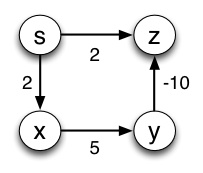
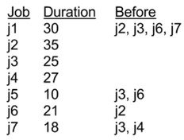

### Bellman-Ford

####  1\. Modifying Bellman-Ford to exit early when all paths are done.

Suppose we have modified the Relax procedure to return TRUE if it changed an
edge weight and FALSE otherwise. This enables us to write a better
encapsulated version of Bellman-Ford, shown below.

    
    
    Bellman-Ford(G,w,S)
    1  Initialize-Single-Source(G,s)
    2  for i = 1 to |G.V| - 1
    3      for each edge (u,v) in G.E
    4          Relax(u,v,w) 
    5  for each edge (u,v) in G.E
    6      if Relax(u,v,w) 
    7          return FALSE
    8  return TRUE
    

But Bellman-Ford still does unnecessary work if all shortest paths are
significantly shorter than |G.V| - 1. Modify the code above to exit the
algorithm early with the correct value if there will be no further changes. Do
this by modifying Bellman-Ford alone: don't change the Relax procedure.

### Dijkstra's Algorithm

#### 2\. Dijkstra's algorithm and negative weight edges.

Dijkstra's algorithm assumes (based on the triangle inequality) that once a
vertex v is moved to S, v.d = δ(s, v). It is not supposed to be able to handle
graphs with negative weight edges, such as the graph shown below, because they
violate the triangle inequality.

 

But nothing in Dijkstra's algorithm says lines 7-8 can't update weights of
vertices that are already in S. If you simulate the algorithm, you will see
that when vertex y is dequeued, vertex z (which is already in S) should be
updated to its correct distance δ(s, z). Why won't this always happen? Can you
modify the graph to be one for which v.d ≠ δ(s, v) at the end for some v?

### DAG Shortest Paths

#### 3\. Parallel scheduling with critical paths in a DAG

The parallel scheduling problem is to take a set of interdependent jobs with
known execution time and determine when to schedule each job so that the last
job finishes as soon as possible while respecting the interdependency
constraints.

We can model such problems using weighted DAGs as follows:

  1. Create a DAG with a start node _s_, a finish node _f_, and two vertices for each job _j_: a job start vertex _j_s and a job end vertex _j_f.
  2. For each job, add an edge from its start vertex to its end vertex with weight equal to its duration. (This models the time required for the job.) 
  3. For each precedence constraint where job _i_ must finish before job _j_ starts, add a zero-weight edge from _i_f to _j_s. (This models precedence constraints where one job relies on another having been finished, but can start immediately after it finished: hence the 0.)
  4. Also add zero-weight edges from the start node _s_ to every job start node _j_s and from every job finish node _j_f to the finish node _f_. (The start vertex gives us a place to begin the shortest paths algorithm and the finish vertex gives us a place where we will assign the finishing time.) 

But we need an algorithm to do the scheduling. Rather than write an algorithm
from scratch, we will see how we can do this with DAG-Shortest-Paths. Some
adjustment may be required to make the data structure fit the algorithm.

Some jobs are shown in the table to the right. The first job should start at
time 0. Your task is to schedule the jobs such that they are all completed in
the minimum amount of time while respecting the constraints. You will complete
this on your homework: here we will ensure we understand the approach.

**(a)** Do we need to find the shortest paths or the longest paths, and why? 

**(b)** Do you need to change the weights in any way to solve it with DAG-Shortest-Paths, and if so how and why? 

**(c)** After running DAG-Shortest-Paths, how do you extract the solution, specifically the start time of each job and the time at which all jobs will be finished? 

