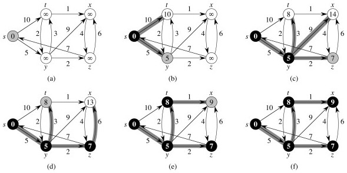

## Outline

Today's Theme: Relax!

  1. Shortest Paths Problems 
  2. Bellman-Ford Algorithm
  3. Shortest Paths in a DAG 
  4. Dijkstra's Algorithm 

##  Shortest Paths Problems

or how to get there from here ...

### Definition

Input is a directed graph _G_ = (_V_, _E_) and a **_weight function_** _w_:
_E_ -> ℜ.

Define the **_path weight_ _w_(_p_) ** of path _p_ = ⟨_v_0, _v_1, ... _vk_⟩ to
be the sum of edge weights on the path:

Then the **_shortest path weight_** from _u_ to _v_ is:

A **shortest path** from _u_ to _v_ is any path such that _w_(_p_) = δ(_u_,
_v_).

### Examples

In our examples the shortest paths will always start from _s_, the
**_source_**. The δ values will appear inside the vertices, and shaded edges
show the shortest paths.

As can be seen, shortest paths are not unique.

### Variations

  * **_Single-Source:_** from _s_ to every _v_ ∈ _V_ (the version we consider)
  * **_Single-Destination:_** from every _v_ ∈ _V_ to some _d_. (Solve by reversing the links and solving single source.) 
  * **_Single-Pair:_** from some _u_ to some _v_. Every known algorithm takes just as long as solving Single-Source. (_Why might that be the case?_)
  * **_All-Pairs:_** for every pair _u_, _v_ ∈ _V_. Next lecture.

### Negative Weight Edges

These are OK as long as no negative-weight cycles are reachable from the
source _s_. Fill in the blanks:

If a negative-weight cycle is accessible, it can be iterated to make _w_(_s_,
_v_) arbitarily small for all _v_ on the cycle:

Some algorithms can detect negative-weight cycles and others cannot, but when
they are present shortest paths are not well defined.

### Cycles

Shortest paths cannot contain cycles.

  * We already ruled out negative-weight cycles.
  * If there is a positive-weight cycle we can get a shorter path by omitting the cycle, so it can't be a shortest path with the cycle.
  * If there is a zero-weight cycle, it does not affect the cost to omit them, so we will assume that solutions won't use them.

### Optimal Substructure

The shortest paths problem exhibits **_optimal substructure_**, suggesting
that greedy algorithms and dynamic programming may apply. Turns out we will
see examples of both (Dijkstra's algorithm in this chapter, and Floyd-Warshall
in the next chapter, respectively).

**_Lemma:_ Any subpath of a shortest path is a shortest path.**

**_Proof_** is by cut and paste. Let path _puv_ be a shortest path from _u_ to _v_, and that it includes subpath _pxy_ (this represents subproblems):

Then δ(_u_, _v_) = _w_(_p_) = _w_(_pux_) + _w_(_pxy_) + _w_(_pyv_).

Now, for proof by contradiction, suppose that substructure is not optimal,
meaning that for some choice of these paths there exists a shorter path _p'xy_
from _x_ to _y_ that is shorter than _pxy_. Then _w_(_p'xy_) < _w_(_pxy_).

From this, we can construct _p'_:

Then

which contradicts the assumption that _puv_ is a shortest path.

### Algorithms

All the algorithms we consider will have the following in common.

#### Output

For each vertex _v_ ∈ _V_, we maintain these attributes:

**_v.d_** is called the **_shortest path estimate_**. 

  * Initially, _v.d_ = ∞
  * _v.d_ may be reduced as the algorithm progresses, but _v.d_ ≥ δ(_s_, _v_) is always true.
  * We want to show that at the conclusion of our algorithms, _v.d_ = δ(_s_, _v_).

**_v._π** = the predecessor of _v_ by which it was reached on the shortest path known so far. 

  * If there is no predecessor, _v._π = NIL.
  * We want to show that at the conclusion of our algorithms, _v._π = the predecessor of _v_ on the shortest path from _s_.
  * If that is true, π induces a **_shortest path tree_** on _G_. (See text for proofs of properties of π.) 

#### Initialization

All the shortest-paths algorithms start with this:

#### Relaxation

They all apply the relaxation procedure, which essentially asks: can we
improve the current shortest-path estimate for _v_ by going through _u_ and
taking (_u_, _v_)?

 

The algorithms differ in the order in which they relax each edge and how many
times they do that.

### Shortest Paths Properties

All but the first of these properties assume that `INIT-SINGLE-SOURCE` has
been called once, and then `RELAX` is called zero or more times.

Proofs are available in the text. Try to explain informally why these are
correct.

* * *

##  Bellman-Ford Algorithm

Essentially a **brute force strategy**: relax systematically enough times that
you can be sure you are done.

The algorithm can also be considered a dynamic programming algorithm for
reasons discussed below.

  * Allows negative-weight edges
  * Computes _v_._d_ and _v_.π for all _v_ ∈ _V_.
  * Returns True (and a solution embedded in the graph) if no negative-weight cycles are reachable from _s_, and False otherwise.

 

The first `for` loops do the work of relaxation. _How does the last `for` loop
help -- how does it work?_

### Analysis:

`RELAX` is O(1), and the nested `for` loops relax all edges |_V_| - 1 times,
so `BELLMAN-FORD` is Θ(_V E_).

### Examples:

Example from the text, relaxed in order (t,x), (t,y), (t,z), (x,t), (y,x)
(y,z), (z,x), (z,s), (s,t), (s,y):

Try this other example (click for answer):

 

###  Correctness

The values for _v_._d_ and _v_.π are guaranteed to converge on shortest paths
after |_V_| - 1 passes, assuming no negative-weight cycles.

This can be proven with the path-relaxation property, which states that if we
relax the edges of a shortest path ⟨_v_0, _v_1, ... _vk_⟩ in order, even if
interleaved with other edges, then _vk_._d_ = δ(_s_,_vk_) after _vk_ is
relaxed.

Since the list of edges is relaxed as many times as the longest possible
shortest path (|_V_|- 1), it must converge by this property.

  * First iteration relaxes (_v_0, _v_1)
  * Second iteration relaxes (_v_1, _v_2)
  * ... 
  * _k_th iteration relaxes (_v__k_-1, _v__k_)

This is why the Bellman Ford algorithm can be considered to be a dynamic
programming algorithm:

  * After the first pass, paths of length 1 are correct and are used to construct longer paths;
  * after the second pass, paths of length 2 are correct and are used to construct longer paths; etc.

up until _n_−1, which is the longest possible path.

We also must show that the True/False values are correct. Informally, we can
see that if _v_._d_ is still getting smaller after it should have converged
(see above), then there must be a negative weight cycle that continues to
decrement the path.

The full proof of correctness may be found in the text.

The values computed on each pass and how quickly it converges depends on order
of relaxation: it may converge earlier.

_How can we use this fact to speed the algorithm up a bit?_

* * *

##  Shortest Paths in a DAG

Life is easy when you are a DAG ...

There are no cycles in a Directed Acyclic Graph. Thus, negative weights are
not a problem. Also, vertices must occur on shortest paths in an order
consistent with a topological sort.

We can do something like Bellman-Ford, but don't need to do it as many times,
and don't need to check for negative weight cycles:

#### Analysis:

Given that topological sort is Θ(_V_ \+ _E_), what's the complexity of `DAG-
SHORTEST-PATHS`? _This one's on you: what's the run-time complexity?_ Use
aggregate analysis ...

#### Correctness:

Because we process vertices in topologically sorted order, edges of _any_ path
must be relaxed in order of appearance in the path.

Therefore edges on any shortest path are relaxed in order.

Therefore, by the path-relaxation property, the algorithm terminates with
correct values.

### Examples

From the text:

Notice we could not reach _r_!

Let's try another example (click for answer):

* * *

##  Dijkstra's Algorithm

The algorithm is essentially a weighted version of breadth-first search: BFS
uses a FIFO queue; while this version of Dijkstra's algorithm uses a priority
queue.

It also has similarities to Prim's algorithm, being greedy, and with similar
iteration.

Assumes there are no negative-weight edges.

### Algorithm

  * _S_ = set of vertices whose final shortest-path weights are determined.
  * _Q_ = _V_ \- _S_ is the priority queue. 
  * Priority queue keys are shortest path estimates _v_._d_. 

Here it is, with Prim on the right for comparison:

Dijkstra's algorithm is greedy in choosing the closest vertex in _V_ \- _S_ to
add to _S_ each iteration. The difference is that

  * For Prim "close" means the cost to take one step to include the next cheapest vertex:   
` if _w_(_u_,_v_) < _v_.key`

  * for Dijkstra "close" means the cost from the source vertex _s_ to _v_: this is in the RELAX code   
`if _v_._d_ > _u_._d_ \+ _w_(_u_,_v_)`.

### Examples

From the text (black vertices are set _S_; white vertices are on _Q_; shaded
vertex is the min valued one chosen next iteration):

Let's try another example (click for answer):

 

Here's a graph with a negative weight: try it from _s_ and see what happens:

### Correctness

The proof is based on the following loop invariant at the start of the `while`
loop:

> _v_._d_ = δ(_s_, _v_) for all _v_ ∈ _S_.

**_Initialization:_** Initially _S_ = ∅, so trivially true. 

**_Maintenance:_** We just sketch this part (see text). Need to show that _u_._d_ = δ(_s_, _u_) when _u_ is added to _S_ in each iteration. The upper bound property says it will stay the same thereafter.

Suppose (for proof by contradiction) that ∃ _u_ such that _u_._d_ ≠ δ(_s_,
_u_) when added to _S_. Without loss of generality, let _u_ be the first such
vertex added to _S_.

  * _u_ ≠ _s_, since _s_._d_ = δ(_s_, _s_) = 0. Therefore _s_ ∈ _S_ ≠ ∅. 
  * So there is a path from _s_ to _u_. This means there must be a shortest path _p_ from _s_ to _u_. 
  * The proof decomposes _p_ into a path _s_ to _x_, (_x_, _y_), and a path from _y_ to _u_. (Some but not all of these can be null.)
  * _y_._d_ = δ(_s_, _y_) when _u_ added to _S_. (By hypothesis, _x_._d_ = δ(_s_, _x_) when _x_ was added. Relaxation of (_x_, _y_) extends this to _y_ by the convergence property.)
  * Since _y_ appears before _u_ on a shortest path with non-negative weights, δ(_s_,_y_) ≤ δ(_s_,_u_), and we can show that _y_._d_ ≤ _u_._d_ by the triangle inequality and upper-bound properties.
  * But _u_ being chosen first from _Q_ means _u_._d_ ≤ _y_._d_; so must be that _u_._d_ = _y_._d_. 
  * Therefore _y_._d_ = δ(_s_, _y_) = δ(_s_, _u_) = _u_._d_. 
  * This contradicts the assumption that _u_._d_ ≠ δ(_s_, _u_)

**_Termination:_** At the end, _Q_ is empty, so _S_ = _V_, so _v_._d_ = δ(_s_, _v_) for all _v_ ∈ _V_

### Analysis

The run time depends on the implementation of the priority queue.

If **_binary min-heaps_** are used:

  * The `EXTRACT-MIN` in line 5 and the implicit `DECREASE-KEY` operation that results from relaxation in line 8 are each O(lg _V_).
  * The `while` loop over |_V_| elements of _Q_ invokes |_V_| O(log _V_) `EXTRACT-MIN` operations. 
  * Switching to aggregate analysis for the `for` loop in lines 7-8, there is a call to `RELAX` for each of O(_E_) edges, and each call may result in an O(log _V_) `DECREASE-KEY`.
  * The total is **O((_V_ \+ _E_) lg _V_)**.
  * If the graph is connected, there are at least as many edges as vertices, and this can be simplified to **O(_E_ lg _V_)**, which is faster than `BELLMAN-FORD`'s O(_E_ _V_). 

With **_Fibonacci heaps_** (which were developed specifically to speed up this
algorithm), O(_V_ lg _V_ \+ _E_) is possible. _(Do not use this result unless
you are specifically using Fibonacci heaps!)_

* * *

Dan Suthers Last modified: Mon Apr 14 03:36:49 HST 2014  
Images are from the instructor's material for Cormen et al. Introduction to
Algorithms, Third Edition.  

