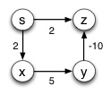
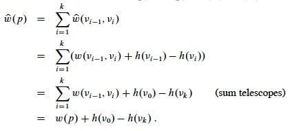
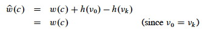
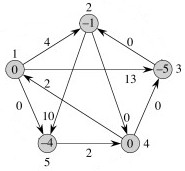
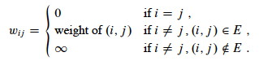
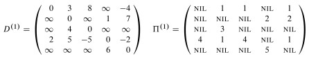
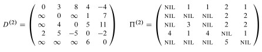
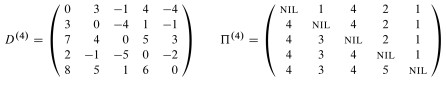
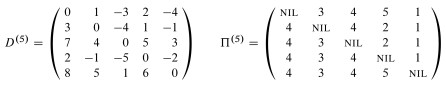

## Outline

  1. All-Pairs Shortest Paths Introduction
  2. Using Single-Source Algorithms
  3. Johnson's Bright Idea
  4. Floyd-Warshall: Dynamic Programming for Dense Graphs
  5. Transitive Closure (Briefly Noted)

##  All-Pairs Shortest Paths

The problem is an extension of Single-Source Shortest Paths to all sources. We
start by repeating the definition.

#### Path Weights and Shortest Paths

Input is a directed graph G = (_V_, _E_) and a **_weight function_** _w_: _E_
-> ℜ. Define the **_path weight_ _w_(_p_)** for _p_ = ⟨_v_0, _v_1, ... _vk_⟩
to be the sum of edge weights on the path:

 

The **_shortest path weight_** from _u_ to _v_ is:

A **_shortest path_** from _u_ to _v_ is any path such that _w_(_p_) = δ(_u_,
_v_).

#### All-Pairs Shortest Paths

Then the **all-pairs shortest paths problem** is to find a shortest path and
the shortest path weight for every pair _u_, _v_ ∈ _V_.

_(Consider what this means in terms of the graph shown above right. How many
shortest path weights would there be? How many paths?)_

#### Applications

An obvious real world application is computing **mileage charts**.

Unweighted shortest paths are also used in social network analysis to compute
the **betweeness centrality** of actors. (Weights are usually tie strength
rather than cost in SNA.) The more shortest paths between other actors that an
actor appears on, the higher the betweeness centrality. This is usually
normalized by number of paths possible. This measure is one estimate of an
actor's potential control of or influence over ties or communication between
other actors.

* * *

##  All-Pairs Shortest Paths Using Single-Source Algorithms

Since we already know how to compute shortest paths from _s_ to every _v_ ∈
_V_ (the Single Source version from the [last lecture](http://www2.hawaii.edu/
~suthers/courses/ics311s14/Notes/Topic-18.html)), why not just iterate one of
these algorithms for each vertex _v_ ∈ _V_ as the source?

That will work, but let's look at the complexity and constraints.

### Iterated Bellman-Ford

Bellman-Ford is O(_V E_), and it would have to be run |_V_| times, so the cost
would be **O(_V_2_E_)** for any graph.

  * On _dense graphs_, |_E_| = O(_V_2), so this would be O(_V_4). Ouch! 
  * But it will work on graphs with negative weight edges.

### Iterated Dijkstra

On sparser graphs, Dijkstra has better asymptotic performance. Dijkstra's is
O(_E_ lg _V_) with the binary min-heap (faster with Fibonacci heaps).

  * |_V_| iterations gives **O(_V_ _E_ lg _V_)**, which is O(_V_3 lg _V_) in dense graphs (already better), and will be lower in very sparse graphs. (This can be done in O(_V_2 lg _V_ \+ _VE_) with Fibonacci heaps.) 
  * But it will **_not_** work on graphs with negative weight edges.

What a pity. But why can't we just get rid of those pesky negative weights?

### Eliminating Negative Weights

**_Proposal:_ ** How about adding a constant value to every edge? 

  * Find the smallest (most negative) weight, and negate it to get a positive number _c_.
  * Add _c_ to every edge weight. (If we are using a matrix representation in which a sentinel value such as ∞ is used to represent the absence of an edge, this value is not changed.) 
  * Every weight will be 0 or more, i.e., non-negative. 

Since we have added the same constant value to everything, we are just scaling
up the costs linearly and should obtain the same solutions, right?

For example, in this graph the shortest path from s to z is **`s--x--y--z`**,
but [Dijkstra's algorithm](http://www2.hawaii.edu/~suthers/courses/ics311s14/N
otes/Topic-18.html#Dijkstra) can't find it because there is a negative weight
(_why? what goes wrong?_):

So, let's add 10 to every edge:

and the shortest path is .... Oops! **`s--z`**!

The strategy suggested above does not work because it does not add a constant
amount to each _path_; rather it adds a constant to each _edge_ and hence
longer paths are penalized disproportionately.

Perhaps because of this, the first algorithm for all-pairs shortest paths (in
the 1960's) by Floyd based on Warshall's work took a dynamic programming
approach. (We'll get to that later.) But then Johnson had a bright idea in
1977 that salvaged the greedy approach.

* * *

##  Johnson's Bright Idea

Donald Johnson figured out how to make a graph that has all edge weights ≥ 0,
and is also equivalent for purposes of finding shortest paths.

### Definitions

We have been using a weight function _w_ : _V_⊗_V_ -> ℜ that gives the weight
for each edge (_i_, _j_) ∈ _E_, or has value ∞ otherwise. (When working with
adjacency list representations, it may be more convenient to write _w_ : _E_
-> ℜ and ignore (_i_, _j_) ∉ _E_.)

We want to find a **modified weight function _ŵ_** that has these properties:

  1. **For all _u_, _v_ ∈ _V_, _p_ is a shortest path from _u_ to _v_ using _w_ _iff_ _p_ is a shortest path from _u_ to _v_ using _ŵ_**.   
_(A shortest path under each weight function is a shortest path under the
other weight function.)_

  

  2. **For all (_u_, _v_) ∈ _E_, _ŵ_(_u_, _v_) ≥ 0.**   
_(All weights are non-negative, so Dijkstra's efficient algorithm can be
used.)_

If property 1 is met, it suffices to find shortest paths with _ŵ_. If property
2 is met, we can do so by running Dijkstra's algorithm from each vertex. But
how do we come up with _ŵ_? That's where Johnson can help ...

Johnson figured out that if you add a weight associated with the source and
subtract one associated with the target, you preserve shortest paths.

### Reweighting Lemma

Given a directed, weighted graph _G_ = (_V_, _E_), _w_ : _E_ -> ℜ, let _h_ be
_any_ function (bad-ass lemming don't care) such that _h_ : _V_ -> ℜ.

For all (_u_, _v_) ∈ _E_ define

> **_ŵ_(_u_, _v_)   =   _w_(_u_, _v_)   \+   _h_(_u_)   −   _h_(_v_). **

Let _p_ = ⟨_v_0, _v_1, ..., _v__k_⟩ be any path from _v_0 to _v__k_.

Then _p_ is a shortest path from _v_0 to _v__k_ under _w_ **_iff_** _p_ is a
shortest path from _v_0 to _v__k_ under _ŵ_.

Furthermore, _G_ has a negative-weight cycle under _w_ **_iff_** _G_ has a
negative-weight cycle under _ŵ_.

_**Proof:**_ First we'll show that _ŵ_(_p_) = _w_(_p_) + _h_(_v_0) −
_h_(_v__k_); that is, that the defined relationship transfers to paths.

Therefore, any path from _v_0 to _v__k_ has _ŵ_(_p_) = _w_(_p_) + _h_(_v_0) −
_h_(_v__k_).

Since _h_(_v_0) and _h_(_v__k_) don't depend on the path from _v_0 to _v__k_,
if one path from _v_0 to _v__k_ is shorter than another with _w_, it will also
be shorter with _ŵ_.

Now we need to show that ∃ negative-weight cycle with _w_ **_iff_** ∃
negative-weight cycle with _ŵ_.

Let cycle _c_ = ⟨_v_0, _v_1, ..., _v__k_⟩ where _v_0 = _v__k_. Then:

Therefore, _c_ has a negative-weight cycle with _w_ **_iff_** it has a
negative-weight cycle with _ŵ_.

**_Implications:_** It's remarkable that under this definition of _ŵ_, _h_ can assign _any_ weight to the vertices and shortest paths and negative weight cycles will be preserved. This gets us Property 1. How can we choose _h_ to get Property 2?

### Johnson's _h_(_v_)

Property 2 states that ∀ (_u_, _v_) ∈ _E_, _ŵ_(_u_, _v_) ≥ 0.

Since we have defined _ŵ_(_u_, _v_) = _w_(_u_, _v_) + _h_(_u_) − _h_(_v_), to
get property 2 we need an _h_ : _V_ -> ℜ for which we can show that _w_(_u_,
_v_) + _h_(_u_) − _h_(_v_) ≥ 0.

The motivation for how this is done derives from a section on difference
constraints in Chapter 24 that we did not cover, so we'll just have to take
this as an insight out of the blue ....

Define _G'_ = (_V'_, _E'_)

  * _V'_ = _V_ ∪ {_s_}, where _s_ is a new vertex.
  * _E'_ = _E_ ∪ {(_s_, _v_) : _v_ ∈ _V_}.
  * _w_(_s_, _v_) = 0 for all _v_ ∈ _V_.

Since no edges enter _s_, _G'_ has the same cycles as _G_, including negative
weight cycles if they exist.

**Define _h_(_v_) = δ(_s_, _v_) for all _v_ ∈ _V_. **

_(We put a 0-weighted link from _s_ to every other vertex _v_, so isn't δ(_s_,
_v_) always 0? When is it not? What does this tell us?)_

#### Correctness (proof that we have property 2)

_**Claim:**_ _ŵ_(_u_, _v_)   =   _w_(_u_, _v_)   \+   _h_(_u_)   −   _h_(_v_)
≥   0.

_**Proof:**_ By the triangle inequality,

> δ(_s_, _v_)   ≤   δ(_s_, _u_)   \+   _w_(_u_, _v_),

Substituting _h_(_v_) = δ(_s_, _v_) (as defined above) and similarly for _u_,

> _h_(_v_)   ≤   _h_(_u_)   \+   _w_(_u_, _v_).

Subtracting _h_(_v_) from both sides,

> _w_(_u_, _v_)   \+  _h_(_u_)   −   _h_(_v_)   ≥   0\.

### The Algorithm

The algorithm constructs the augmented graph _G_' (line 1), uses Bellman-Ford
from _s_ to check whether there are negative weight cycles (lines 2-3), and if
there are none this provides the δ(_s_, _v_) values needed to compute _h_(_v_)
(lines 4-5).

Then it does the weight adjustment with _h_ (lines 6-7), and runs Dijkstra's
algorithm from each start vertex (lines 9-10), reversing the weight adjustment
to obtain the final distances put in a results matrix D (lines 11-12).

### Example

Let's start with this graph:

First we construct _G_' by adding _s_ (the black node) and edges of weight
from _s_ 0 to all other vertices. The original weights are still used. This
new graph G' is shown to the right. Vertex numbers have been moved outside of
the nodes.

Then we run Bellman-Ford on this graph with _s_ (the black node) as the start
vertex. The resulting path distances δ(_s_, _v_) are shown inside the nodes to
the right. Remember that _h_(_v_) = δ(_s_, _v_), so that these are also the
values we use in adjusting edge weights (next step).

In the next graph to the left, the edge weights have been adjusted to _ŵ_(_u_,
_v_) = _w_(_u_, _v_) + _h_(_u_) − _h_(_v_). For example, the edge (1, 5),
previously weighted -4, has been updated to -4 + 0 − (-4) = 0.

All weights are positive, so we can now run Dijkstra's algorithm from each
vertex _u_ as source (shown in black in the next step) using _ŵ_.

To the right is an example of one pass, starting with vertex 2.

Within each vertex _v_ the values δ̂(2, _v_) and δ(2, _v_) = δ̂(2, _v_) +
_h_(2) − _h_(_u_) are separated by a slash.

The values for δ̂(_2_, _v_) were computed by running Dijkstra's algorithm with
start vertex 2, using the modified weights _ŵ_. But to get the correct path
lengths in the original graph we have to map this back to _w_.

Of course, node 2 is labeled "0/0" for δ̂(_2_, _2_) and δ(_2_, _2_),
respectively, because it costs 0 to get from a vertex to itself in any graph
that does not have negative weight cycles.

The cost to get to vertex 4 is 0 in the modified graph. To get the cost in the
original graph, we reverse the adjustment that was done in computing _w_': we
now _subtract_ the source vertex weight _h_(2) = -1 (from figure above) and
_add_ the target vertex weight _h_(4) = 0, so 0 − (-1) + 0 = 1. That is where
the "1" on node 4 came from.

But that example was for a path of length 1: let's look at a longer one. Node
5 has "2/-1". Dijkstra's algorithm found the lowest cost path ((2, 4), (4, 1),
(1, 5)) to vertex 5, at a cost of 2 using the edge weights _w_'. To convert
this into the path cost under edge weights _w_, we do _not_ have to subtract
the source vertex weight _h_(_u_) and add the target vertex weight _h_(_v_)
for every edge on the path, because it is a telescoping sum. We only have to
subtract the source vertex weight _h_(2) = -1 for the start of the _path_ and
add the target vertex weight _h_(5) = -4 for the end of the path.

Thus δ(5) = δ̂(5) − _h_(2) + _h_(5) = 2 − (-1) + (-4) = -1.

Similarly, the numbers after the "/" on each node are δ(_v_) in the original
graph: these are the "answers" for the start vertex used in the given
Dijkstra's run. We collect all these answers in matrix _D_ across all
vertices.

### Time

Θ(_V_) to compute _G'_; O(_V E_) to run Bellman-Ford; Θ(_E_) to compute _ŵ_;
and Θ(_V_2) to compute _D_; but these are all dominated by **O(_V E_ lg _V_)**
to run Dijkstra |_V_| times with a binary min-heap implementation.

Not surprisingly, this is the same as iterated Dijkstra's, but it will handle
negative weights.

Asymptotic performance can be improved to O(_V_2 lg _V_ \+ _V E_) using
Fibonacci heaps.

  

* * *

##  Dynamic Programming Approaches and Matrix Multiplication

We should also be aware of dynamic programming approaches to solving all-pairs
shortest paths. We already saw in [Topic 18](http://www2.hawaii.edu/~suthers/c
ourses/ics311s14/Notes/Topic-18.html#optimal) that any subpath of a shortest
path is a shortest path; thus there is optimal substructure. There are also
overlapping subproblems since we can extend the solution to shorter paths into
longer ones. Two approaches differ in how they chararacterize the recursive
substructure.

CLRS first develop a dynamic programming solution that is similar to matrix
multiplication. Matrices are a natural representation for all-pairs shortest
paths as we need O(_V_2) memory elements just to represent the final results,
so it isn't terribly wasteful to use a non-sparse graph representation
(although for very large graphs once can use a sparse matrix representation).

### Optimal Substructure

A shortest path _p_ between distinct vertices _i_ and _j_ can be decomposed
into a shortest path from _i_ to some vertex _k_, plus the final edge from _k_
to _j_. In case that _i_ is directly connected to _j_, then _k_=_j_ and we
define the length of a shortest path from a vertex to itself to be 0.

### Extending Shortest Paths

This dynamic programming approach builds up shortest paths that contain at
most _m_ edges. For _m_ = 0, all the shortest paths from vertices to
themselves are of length 0; and others are infinite. For _m_ = 1, the
adjacency matrix gives the shortest paths between an pair of vertices _i_ and
_j_ (namely, the weight on the edge between them). For _m_ > 1, an algorithm
is developed that takes the minimum of paths of length _m_−1 and those that
can be obtained by extending these paths one more step via an intermediate
vertex _k_.

We will leave the details to the text, but it turns out that this algorithm
for extending paths one step has structure almost identical to that for
multiplying square matrices. The operations are different (min instead of
addition, addition instead of multiplication), but the structure is the same.
Both algorithms have three nested loops, so are O(_V_3).

After |_V_|−1 extensions, the paths will not get any shorter (assuming no
negative weight edges), so one can iterate the path extending algorithm
|_V_|−1 times, for an O(_V_4) algorithm overall: not very efficient.

However, the path extension algorithm, like matrix mutliplication, is
associative, and we can use this fact along with the fact that results won't
change after |_V_|−1 extensions to speed up the algorithm. We modify it to be
like **_repeated squaring_**, essentially multiplying the resulting matrix by
itself repeatedly. Then one needs only lg(_V_) "multiplications" (doubling of
path length) to have paths longer than |_V_|, so the runtime overall is O(_V_3
lg _V_).

But we can do better with a different way of characterizing optimal
substructure; one that does not just extend paths at their end, but rather
allows two paths of length greater than 1 to be combined.

* * *

##  Floyd-Warshall: Dynamic Programming for Dense Graphs

The textbook first develops a more complex version of this algorithm that
makes multiple copies of matrices, and then notes in exercise 25.2-4 that we
can reduce space requirements by re-using matrices. Here I go directly to that
simpler version.

### Dynamic Programming Analysis

Assume that _G_ is represented as an adjacency matrix of weights _W_ =
(_wij_), with vertices numbered from 1 to _n_.

We have _**optimal substructure**_ because subpaths of shortest paths are
shortest paths ([previous lecture](http://www2.hawaii.edu/~suthers/courses/ics
311s14/Notes/Topic-18.html#optimal)), and we have _**overlapping
subproblems**_ because a shortest path to one vertex may be extended to reach
a further vertex. We need the recursive structure that exploits this.

The subproblems are defined by computing, for 1 ≤ _k_ ≤ |_V_|, the shortest
path from each vertex to each other vertex that uses _only_ vertices from {1,
2, ..., _k_}. That is:

  * first find the shortest paths from each _i_ to each _j_ that go through no vertices (i.e., the direct edges);
  * then find the shortest paths from each _i_ to each _j_ that go either direct or only via vertex 1;
  * then find the shortest paths from each _i_ to each _j_ that go either direct or only via vertices 1 and 2; ...
  * ... and so on until we are considering solutions via all vertices.

Importantly, each step we can use what we just computed in the previous step,
considering whether the _k_th vertex improves on paths found using vertices {1
... _k_-1}. This is what enables us to leverage dynamic programming's ability
to save and re-use solutions to subproblems.

The basic insight is that the shortest path from vertex _i_ to vertex _j_
using only vertices from {1, 2, ..., _k_} is either:

  * the shortest path _p_ from vertex **_i_** to vertex **_j_** using only vertices from {1, 2, ..., _k_−1}, or 
  * a path _p_ composed of the shortest path _p1_ from vertex **_i_** to vertex **_k_** using only vertices from {1, 2, ..., _k_−1} and the shortest path _p2_ from vertex **_k_** to vertex **_j_** using only vertices from {1, 2, ..., _k_−1}

This way of characterizing optimal substructure allows the Floyd-Warshall
algorithm to consider more ways of combining shortest subpaths than the
matrix-multiplication-like algorithm did.

###  Algorithm

This leads immediately to the classic Floyd-Warshall algorithm (as presented
in excercise 25.2-4 and its public solution, as well as many other texts):

### Run Time Analysis

_It's trivial; you tell me._

### Constructing the Shortest Paths

Although one can infer the shortest paths from the final weight matrix _D_, it
is perhaps more straightforward to maintain a matrix of predecessor pointers
just like we maintain predecessor pointers on individual vertices in the
single-source version of shortest paths.

We update a matrix Π that is the same dimensions as _D_, and each entry π_i,j_
contains the predecessor of vertex _j_ on a shortest path from _i_ (the
predecessor on shortest paths from other vertices may differ).

The CLRS textbooks presentation shows us making a series of matrices Π(0) ...
Π(_n_), but as with the weight matrix _D_ we can actually do this in one
matrix Π, and we can understand the superscripts (0) ... (_n_) as merely
representing states of this matrix.

### Example

Examples of Floyd-Warshall, like of other dynamic programming problems, are
tedious to work through. I invite you to trace though the example in the text,
following the algorithm literally, and be prepared to do another example on
homework. I won't talk through it here.

  
  
  
  
  
  
  

* * *

##  Transitive Closure

Suppose we have a graph _G_ and we want to compute the **transitive closure**

> _G*_ = (_V_, _E*_) of _G_, where   (_u_, _v_) ∈ _E*_   _**iff**_   ∃ path
from _u_ to _v_ in _G_.

We can do this by assigning a weight of 1 to each edge, running the above
algorithm, and then concluding there is a path for any (_i_, _j_) that have
non-infinite path cost.

If all we care about is transitivity rather than path length, we can reduce
space requirements and possibly speed up the algorithm by representing all
edges as boolean values (1 for connected; 0 for not connected), and then
modify Floyd-Warshall to use boolean OR rather than min and AND rather than
addition. This reduces the space requirements from one numeric word to one bit
per edge weight, and may be faster on machines for which boolean operations
are faster than addition. See text for discussion.

* * *

Dan Suthers Last modified: Fri Apr 11 02:23:25 HST 2014  
Images are from the instructor's material for Cormen et al. Introduction to
Algorithms, Third Edition.  

