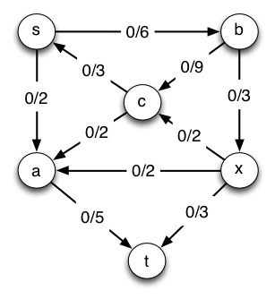
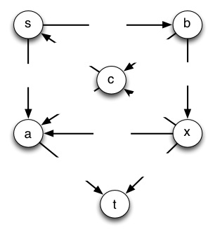
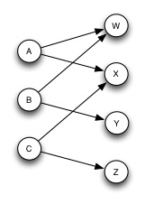

#### 1\. Peer Credit Assignment

Please list the names of the other members of your peer group for this week
and the number of extra credit points you think they deserve for their
participation in group work on Tuesday and Thursday combined.

  * If all three members besides yourself were present at some time, you have a total of 3 points to allocate.
  * If only two members besides yourself were present, you have a total of 4 points to allocate.
  * If only one other member was present, you have a total of 6 points to allocate.
  * You need not allocate all the points available to you. Points allocated to yourself will not be recorded.

* * *

#### 2\. (10 pts) Flow with Edmunds-Karp

**(a)** (8 pts) **Run Edmunds-Karp on the flow network shown below with **s** as the source and **t** as the sink.** Following the template below, draw the flow graph on the left hand side of the page with flows and capacities labeled as shown, and the residual graph on the right hand side of the page with capacities shown. (The first line is already done for you up to this point.) Then on each pass: 

  1. Mark the shortest augmenting path in the residual graph with a thick line or circles.
  2. Use this augmenting path to update flow in the original graph on the left hand side of the next line.
  3. Draw the updated residual graph on the right in that next line.
  4. Repeat at 1, redrawing both updated graphs on a new line until you can't find an augmenting path.

Please use the visual templates provided to make this easier to grade (.jpg,
.graffle, .vdx. and .svg versions of templates are available.)

       _**_G_ (flow network)**_
       
       _**_G__f_ (residual network)**_

       

       

       

       

                ... repeat as needed ...
       
                ... repeat as needed

When you can't update the graph any more (be sure you can say on an exam _why_
you can't update it any more!), answer the following:

**(b)** (1 pt) Write down the value of the flow |_f_| that was achieved. 

**(c)** (1 pt.) Draw a line in the final graph showing the min cut that corresponds to this max flow. (Be careful: all outgoing edges your line crosses must be filled to capacity.) 

* * *

#### 3\. (8 pts) Reducing Bipartite Matching to Flow Maximization

In this problem you will solve a bipartite matching problem by converting it
to a flow maximization problem and then to a linear program. This shows the
power of "problem reduction": converting a problem of one type into a
different problem for which you have a problem solving tool.

To the right is a **bipartite matching problem** (page 732). Adele will dance
with William and Xavier; Betty will dance with William and Yuhan, and Cindy
will dance with Xavier and Zachary. We want to maximize the dancing pairs.

**(a)** (2 pts) Convert this problem to a maximum flow problem by adding vertices and specifying edge capacities (page 733). 

**(b)** (4 pts) Convert the maximum flow problem to a linear program. _NOTE:_ Do not just write down the general formulas on page 860. Write out the specific formulas for each edge and vertex, using _f_AW etc. Specifically, you will write:

  * (1 pt) The expression to be maximized (use literal expressions, no Σ notation).
  * (2 pts) The capacity constraints: one equation per each edge.
  * (2 pts) The flow conservation constraints: one equation per each vertex other than _s_ and _t_.
  * (1 pt) The nonnegativity constraints for each edge: here you may use abbreviated notation.

_Comment:_ Although linear programming has great generality, now you can see
why it might be easier to just run Ford-Fulkerson. However, linear programming
may be easier and perhaps even necessary when there are other constraints,
such as in the problem below.

* * *

#### 4\. (2 pts) Minimum Cost Multi-Commodity Flow

On page 861, CLRS discuss **minimum-cost flow,** in which different edges
charge different costs per unit of flow and we wish to minimize cost. On page
862, CLRS discuss **multicommodity flow,** in which we want to transport
multiple kinds of commodities from different sources and targets over the same
network with delivery guarantees, and ask whether a flow that meets these
guarantees exists. The only known algorithms for solving this problem are
linear programming solutions (we can no longer handle it with a modified graph
and Edmunds-Karp).

The **minimum-cost multi-commodity flow problem** is the combination of these
problems:

> Given a graph _G_ = (_V_, _E_),

>

>   * Each edge (_u_, _v_) ∈ _E_ has _capacity_ _c_(_u_, _v_) ≥ 0 and _cost_
_a_(_u_, _v_) > 0\.

>   * We wish to transport _k_ _commodities_ _K_1, _K_2, .... _K__k_ over the
network

>   * Each commodity _K__i_ = (_s__i_, _t__i_, _d__i_) must be transported
from a commodity-specific _start vertex_ _s__i_ to _target vertex_ _t__i_, and
we need a _delivery guarantee_ that _d__i_ units are delivered.

>   * The _aggregate flow_ _f__u,v_ on edge (_u_, _v_) is the sum of the flow
for each commodity _f__i_.

>   * A solution is _feasible_ if _f__u,v_ ≤ _c_(_u_, _v_).

>   * We want to meet the delivery demands _d__i_ _and_ minimize the cost of
the flow, which is the sum of the cost time aggregate flow for each edge:

>

>> Σ_u,v_∈_V_ _a_(u_,_ _v_) _f__u,v_

**How can the solutions in CLRS be combined to solve the minimum-cost multi-commodity flow problem?** (It's easier than this looks at first.) 

* * *

Dan Suthers Last modified: Sat Apr 19 02:16:44 HST 2014

