## Outline

  1. Flow Networks and Maximum Flow Problem 
  2. Ford Fulkerson Method and Concepts
  3. Ford Fulkerson Algorithm
  4. Edmonds-Karp Algorithm (FF on a leash)
  5. Maximum Bipartite Matching

##  Flow Networks and Maximum Flow Problem

Many problems involve modeling flow through networks, to maximize flow or look
for vulnerabilities.

Includes liquids through pipes, materials through transportation networks, and
communication networks.

Flow algorithms also have applications to problems that don't look like flow,
such as scheduling.

### Flow Networks

A **flow network** is a directed graph _G_ = (_V_, _E_) where each edge (_u_,
_v_) has a **capacity** _c_(_u_, _v_) ≥ 0, and:

  * If (_u_, _v_) ∉ _E_ then _c_(_u_, _v_) = 0.
  * If (_u_, _v_) ∈ _E_ then reverse edge (_v_, _u_) ∉ _E_. [*]
  * A vertex _s_ is designated as the **source vertex**.
  * A vertex _t_ is designated as the **sink vertex** (or _t_ for "target").

Comments:

  * [*] Can work around this restriction. (Also, some authors _require_ that (_v_, _u_) ∈ _E_, but this is because they are using _G_ simultaneously for what we will do with two graphs.)
  * We assume that each vertex _v_ lies on a path from source _s_ to sink _t_. (A _v_ that does not will not participate in any flow, so can be ignored.) 

A simple example: the trucking capacity network:

### Flow (Not Csikszentmihalyi's!)

A **flow** for a network is a function _f_ : _V_ x _V_ -> ℜ _ (that is, _f_
assigns numbers to edges)_ satisfying:

  * **Capacity Constraint**: ∀ _u_, _v_ ∈ _V_,  0   ≤   _f_(_u_, _v_)   ≤   _c_(_u_, _v_).   
_(Can't push more over an edge than its capacity.)_

  

  * **Flow Conservation**: ∀ _u_ ∈ _V_ \- {_s_, _t_},  

  

_(Flow into a vertex must equal flow out of it, except for the source and
sink.)_

Example with flow/capacity:

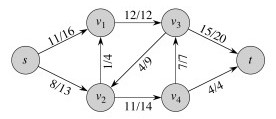

_Let's check flow conservation in this network. Also, are we making maximum
use of the network? How can we improve it?_

#### Value of Flow

The value of flow _f_ = |_f_| is the flow out of source minus the flow into
the source:

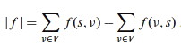

_What is the value of flow in the example above?_

###  Excluded Variations

Our formulation disallows **anti-parallel edges:**

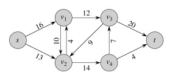

Fortunately they are easy to eliminate. _How would you do it? Why not just
subtract 4 from 10 to get 6? Click on image to see an alternate solution._

We also require that there be a single source and sink. We can easily convert
networks with multiple sources and sinks:

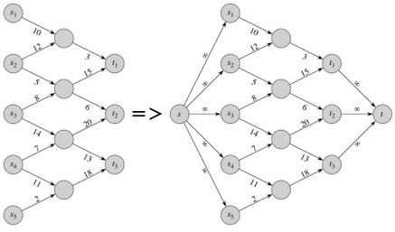

### Maximum Flow Problem

Given _G_, _s_, _t_, and _c_, find a flow _f_ whose value is maximum.

* * *

## Cuts and Flow

We take a brief diversion into some relevant graph theory.

A **cut** (_S_, _T_) of a flow network _G_ = (_V_, _E_) is a partition of _V_
into _S_ and _T_ = _V_ \- _S_ such that _s_ ∈ _S_ and _t_ ∈ _T_.

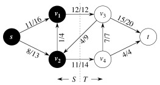

Here is an example of a cut:

The **net flow** across cut (_S_, _T_) for flow _f_ is:

The **capacity** of cut (_S_, _T_) is:

_What is the net flow for the cut in this example? The capacity?_

Note the **_assymetry between net flow and capacity of cut_**: For capacity,
count only edges going from _S_ to _T_, ignoring those in reverse direction.
For net flow, count flow on all edges across the cut: flow on edges from _S_
to _T_ minus flow on edges from _T_ to _S_. _Why does this assymetry make
sense?_

###  Examples

Consider the cut _S_ = {_s_, _w_, _y_}, _T_ = {_x_, _z_, _t_} in the network
shown.

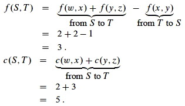 

Now consider the cut _S_ = {_s_, _w_, _x_, _y_}, _T_ = {_z_, _t_}.

 

We get the same flow as the previous cut, but higher capacity. It is not an
accident that changing cut can change capacity but not flow. _Can you explain
why?_

#### Minimum Cut

A **minimum cut** of _G_ is a cut whose capacity is minimum over all cuts of
_G_.

###  Useful Facts

The proofs of these are straightforward but involve long manipulations of
summations: see text.

#### Lemma

For any cut (_S_, _T_),   _f_(_S_, _T_)   =   |_f_|  
_(the net flow across any cut equals the value of the flow)._

The intuition is that no matter where you cut the pipes in a network, you'll
see the same flow volume coming out of the openings. If you did not,
conservation would be violated at some nonempty subset of the vertices.

#### Corollary

The value of any flow ≤ capacity of any cut.

This is again intuitive under the plumbing analogy: if it were false, you
could push more flow through the pipes than they can hold.

* * *

##  Ford Fulkerson Method and Concepts

This is a method, not an algorithm, because there are many ways to do it.

The intuition behind this method is simple: Find a pathway (an _augmenting
path_) of unused capacity and increase the flow along that pathway. Repeat
until no such pathways are found.

What makes this nontrivial is an apparent paradox: overall flow can sometimes
be increased by decreasing flow along certain edges (because they flow in the
"wrong" direction or move capacity to a part of the network that can't handle
it as well).  
_ See whether you can find an example in the graph shown._

Ford Fulkerson manages this by constructing a parallel network of the
available or _residual_ capacity. We will return to the method after
explaining these concepts.

###  Residual Network

Given a flow _f_ in a network _G_ = (_V_, _E_), consider a pair of vertices
_u_, _v_ ∈ _V_. How much additional flow can we push directly from _u_ to _v_?
This is the **residual capacity**:

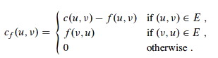

The first case says that if we have not used the full capacity _c_(_u_, _v_)
of an edge (_u_, _v_) in _E_ then we can increase it by the difference.

The second case says that if we are using _f_(_v_, _u_) of the capacity of
(_v_, _u_) in _E_ then we have the residual "capacity" of reversing
(cancelling) that much flow in the reverse direction (_u_, _v_) (_notice that
the letters are swapped_).

Otherwise there is no residual capacity between _u_ and _v_.

We record these capacities in the **residual network** _Gf_ = (_V_, _Ef_),
where

> **_Ef_** = {(_u_, _v_) ∈ _V_ x _V_ : _cf_(_u_, _v_) > 0}.

Each edge of the residual network can admit a positive flow.

#### Example

A flow network is on the left, and its residual network on the right.

 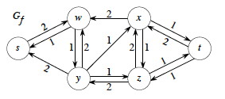

For example, _G__f_ says that we can add two more units from _s_ to _w_ in _G_
or we can take one unit back. _(Take a little time to understand the
relationship between the two graphs: it's critical, so don't go on until you
do!)_

Every edge (_u_, _v_) ∈ _Ef_ corresponds to (_u_, _v_) ∈ _E_ or (_v_, _u_) ∈
_E_ or both. So, |_Ef_| ≤ 2 |_E_|

A residual network is similar to a flow network, except that it may contain
antiparallel edges.

We can define flow in a residual network that satisfies the definition of
flow, but with respect to _cf_ in _Gf_.

###  Augmentation and Augmenting Paths

Given flows _f_ in _G_ and _f '_ in _Gf_, define the **augmentation** of _f_
by _f '_,   ** _f_ ↑ _f '_**,   to be a function _V_ x _V_ -> ℜ:

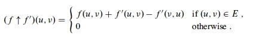

for all _u_, _v_ ∈ _V_.

**_In English:_** Increase the flow on (_u_, _v_) by _f '_(_u_, _v_), but _decrease_ it by _f '_(_v_, _u_) because pushing flow on the reverse edge in the residual network decreases the flow in the original network.

#### Another Lemma

Given flow network _G_, flow _f_ in _G_, and residual network _Gf_, let _f '_
be a flow in _Gf_. Then _f_ ↑ _f '_ is a flow in _G_ with value   |_f_ ↑ _f
'_|   =   |_f_| + |_f '_|.

_(A proof with lots of summations in the CLRS book shows that the capacity
constraint and flow conservation properties are met, and demonstrates that the
value of _f_ ↑ _f '_ is correct. The proof is easy to follow but more than I
want to write here; see CLRS.)_

#### Augmenting Paths

Any simple path _p_ from _s_ to _t_ in _Gf_ is an **augmenting path**.

Augmenting paths admit more flow along each edge in _Gf_ (because all the
edges have positive capacity).

How much more flow can we push from _s_ to _t_ along an augmenting path _p_?
The "weakest link" principle applies:

> _cf_ (_p_) = min{_cf_(_u_, _v_) : (_u_, _v_) is on _p_}.

#### Example

Here is a flow network (left) and a residual network (right).

 

Consider the augmenting path _p_ = ⟨_s_, _w_, _y_, _z_, _x_, _t_⟩ in _Gf_. The
minimum residual capacity of this path is ..._what???_

Push that much additional flow along _p_ in _G_. Notice that the path in _Gf_
goes over _G_'s edge (_y_, _w_) in the reverse direction, so we subtract that
much flow from the edge in _G_.

As a result, edge (_y_, _w_) has _f_(_y_, _w_) = 0, so we omit the flow,
showing only _c_(_y_, _w_) = 3 in the revised _G_ to the left.

  

Now let's update the residual network _Gf_. _Make sure you understand how we
got the graph to the right before going on._

_Is there an augmenting path in Gf?. How can we tell?_

Notice that no edges cross the cut ({_s_, _w_}, {_x_, _y_, _z_, _t_}) in the
forward direction in _Gf_, so no path can get from _s_ to _t_.

Since no further augmentation is possible, we claim that the flow shown in G
is a maximal flow. This theorem tells us we are right.

### Max-Flow Min-Cut Theorem (Important!)

The **following are equivalent** (see text for lemma, corollary and proof):

  1. _f_ is a maximum flow
  

  2. _Gf_ has no augmenting path
  

  3. |_f_| = _c_(_S_, _T_) for some cut (_S_, _T_).

This means that if (2) we can't find augmenting paths _or_ (3) have achieved a
flow equivalent to the capacity of some cut, then we are done: (1) we have
found the maximum flow.

(3) also lets us predict what the max flow will be: it will be equal to the
capacity of the _minimum_ cut (as measured by capacity). Hence **"max flow is
min cut"**.

* * *

##  Ford Fulkerson Algorithm

Intuition: keep augmenting flow along an augmenting path until there is no
augmenting path. The flow attribute is represented using dot notation on
edges: (_u_, _v_)._f_.

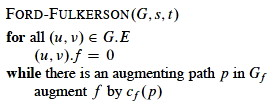

or in more detail

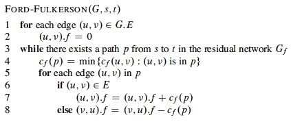

(Line 7: adding flow. Line 8: reducing flow.)

#### Analysis

Runtime depends on what costs can be, and method used to find paths.

Best to use integer weights when possible. (If capacities are irrational
numbers, Ford-Fulkerson might never terminate!)

The initialization lines 1-2 is O(_E_).

The cost to find a path _p_ from _s_ to _t_ in line 3 depends on the method
used. Breadth-First-Search or Depth-First-Search will work, and these are
O(_V_ \+ _E_). This is a connected graph, so |_E_| ≥ |_V_| − 1, so this
reduces to O(_E_).

The rest of the work in the `while` loop is of lower complexity, so the work
of each pass of the `while` loop is O(_E_).

How many times will the `while` loop run? The worst case scenario is:

  * If all capacities are integer, each augmenting path raises |_f_| ≥ 1.
  * In the worst case, it is possible for each augmenting path to raise |_f_| by _only_ 1, so if the maximum flow is _f*_ then _f*_ iterations may be needed. 
  * Each iteration costs _E_, so worst case is **O(_E_ _f*_)**.

The example to the right illustrates the classic worst case scenario. One
could:

  * find augmenting path ⟨(A,B), (B,C), (C,D)⟩, increasing flow by 1 to 1; then
  * find augmenting path ⟨(A,C), (C,B), (B,D)⟩ _(notice that this uses the antiparallel edge in the residual graph to subtract flow from (B,C))_, increasing flow by 1 to 2; then 
  * find augmenting path ⟨(A,B), (B,C), (C,D)⟩, increasing flow by 1 to 3; then
  * find augmenting path ⟨(A,C), (C,B), (B,D)⟩, increasing flow by 1 to 4; then ...

... requiring 2000 iterations due to the unlucky choice of augmenting paths.

* * *

##  Edmonds-Karp Algorithm (FF on a leash)

Edmonds-Karp come to the rescue with an insight that controls the order in
which Ford-Fulkerson explores paths.

Notice that in the example above, if the shortest paths (by number of edges,
not considering weight) are considered first, then the anomaly does not occur.
We would find augmenting path ⟨(A,B), (B,D)⟩ to increase flow by 1000, then
finish the job with augmenting path ⟨(A,C), (C,D)⟩, or find the second and
then the first.

Edmonds-Karp is the Ford-Fulkerson algorithm but with the constraint that
augmenting paths are computed by Breadth-First Search of _Gf_. (_ I told you
that those search algorithms are widely useful!_)

A proof in the CLRS text shows that the number of flow augmentations performed
by Edmunds-Karp is O(_V__E_). Since each BFS is still O(_E_) in a connected
graph, Edunds-Karp runs in **O(_V_ _E_2)** time. The proof in CLRS works by
bounding distances to vertices in _Gf_.

Even better bounds are possible: this has been a very active area of algorithm
development. Sections 26.4-26.5 of CLRS describe **push-relabel** algorithms
that are as fast as O(_V_3). The notes at the end of the chapter discuss
faster algorithms.

There are many variations of Maximum Flow, such as including multiple sources
and sinks; including costs and trying to minimize cost; including different
kinds of material that take different capacities to transport; etc. Some can
be very difficult to solve.

* * *

##  Maximum Bipartite Matching

Maximum Flow can also be used to solve problems that don't look like flow
problems. Here is an example.

Suppose we want to maximize ...

  * The number of boys and girls who can dance, given a list of who is willing to dance with whom (a.k.a. the "marriage problem").
  * The number of classes that can be scheduled, given a list of which classes can be held in which rooms.
  * The number of tasks that can be performed by some machines, given that some tasks can only be performed by some of the machines. 

... etc. We make a **bipartite** graph _G_ = (_V_, _E_) where _V_ = _L_ ∪ _R_
such that all edges go between _L_ and _R_.

A **matching** is a subset of the edges _M_ ⊆ _E_ such that for all _v_ ∈ _V_,
zero or one edges of _M_ are incident on _v_. (0: _v_ is **unmatched**; 1: _v_
is **matched**; > 1 is not allowed.) Here is one example with two solutions:

On the left we can see a nonmaximal matching, and on the right a **maximum
matching**, or matching of maximum cardinality: |_M_| ≥ |_M'_| ∀ matchings
_M'_.

### Solution

Given _G_, define flow network _G'_ = (_V'_, _E'_):

  * _V'_ = _V_ ∪ {_s_, _t_}.
  * _E'_ = _E_ augmented with edges from _s_ to every _u_ ∈ _L_ and from every _v_ in _R_ to _t_. 
  * _c_(_u_, _v_) = 1 ∀ (_u_, _v_) ∈ _E'_.

Then just run Ford-Fulkerson (Edumunds-Karp is not required, as all edges have
unit value):

This works because a maximum flow must use the maximum number of (unitary
capacity) edges across the cut (_L_, _R_).

###  Run Time Complexity

Previously we established that Ford-Fulkerson is O(_E_ _f_*).

In the present problem we are running Ford-Fulkerson on _E'_, but _E'_ =
O(_E_) since we are adding no more than _V_ edges (to vertices in _L_ and
vertices in _R_). Also, the flow value _f_* = O(_V_) since edges are of unit
value and you can't have flow across more edges than there are in min(|_L_|,
|_R_|) = O(_V_).

Therefore, bipartite matching can be computed with Ford-Fulkerson in
**O(_V__E_)**.

* * *

## Wrapup

We have just seen an example of **problem reduction**: reducing the maximum
bipartite matching problem to a flow problem and using a flow algorithm to
solve it. Last week we saw another problem reduction: solving job scheduling
by modeling it as a shortest-paths problem.

**_Problem reduction is a common theme in computer science._** In Topic 21, we will see how the flow problem reduces to the linear programming problem. In later topics, we'll consider reduction of classes of problems known as "P" and "NP", and encounter the greatest unsolved problem in computer science.

* * *

Dan Suthers Last modified: Sun Apr 13 00:50:36 HST 2014  
Most images are from the instructor's material for Cormen et al. Introduction
to Algorithms, Third Edition. The counter-example is from Goodrich & Tamassia,
and I found the Lemma lemming running around loose on the Internet somewhere.  

