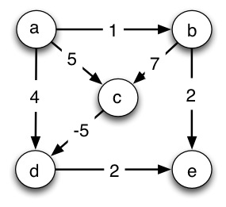

### Modeling Shortest-Paths Problems with Linear Programming:

**1\. Single-Source, Single-Destination (2 pts)**  
_Write the explicit linear program for finding the shortest path from node
**a** to node **e**_ in the graph above (single-source, single destination
shortest paths). By "explicit" I mean _write all the inequalities and
equations_ using variables _d_a, _d_b, _d_c, _d_d, and _d_e, and the actual
numbers for _w_(_u_,_v_), not the generic form on page 860. The first line is
shown.

**Maximize:**  
  
**Subject to constraints:**  

        _d__b_ ≤ _d__a_ \+ 1 

_Do you see how this gets _shortest_ paths even though we are maximizing
distances?_

**2\. Single-Source, All-Destinations (1 pt) **  

_How would you generalize the program you wrote above to solve the single
source shortest paths problem from **a** to **all vertices**_ in the graph
above? Write the part that changes.

**3\. Slack Form (2 pts)**   
Rewrite your equations and inequalities to be in slack form. Every variable
you used above should appear in every equation, even if they have 0
coefficients. Make all the coefficients explicit, including 0 and 1
coefficients (this will help you see what goes into the matrix). Use slack
variables _y_1, _y_2, ... in addition to the variables above. There should be
only one constant on the right hand side.

-1_d__a_ \+ 1_d__b_ \+ 0_d__c_ \+ 0_d__d_ \+ 0_d__e_ \+ _y_1 = 1

**Got time? All-Pairs Shortest Paths:** How would you need to modify the linear program you wrote in part 1 and 2 to solve the all-pairs shortest paths problem in the graph above?

