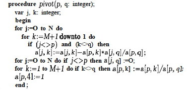

## Outline

  1. Introduction to Linear Programming
  2. Formulating Problems as Linear Programs 
  3. Foundations in Gaussian Elimination 
  4. The Simplex Method 

## Objectives

  * Be aware of the range of problems to which linear programming can be applied.
  * Understand the Simplex algorithm just enough to understand the format of linear equations used and what is done with them. 
  * Be able to write a simple linear program for a problem. 

## Readings

If you have a background in Gaussian Elimination and read and understand
Sections 29.0-29.3 of CLRS, up through the description of Simplex (you need
not read the proofs that follow), these objectives will be met. (The material
of CLRS Sections 29.4-29.5 is excellent, but we don't need to see all the
proofs concerning Simplex to use it.)

If you don't have a background in Gaussian Elimination, then reading and
understanding Section 28.1 of CLRS would provide it. However, Section 28.1
provides more detail than is needed to get the gist of Gaussian Elimination
and the Simplex. I found Sedgewick's (1984), Chapter 5 presentation of
Gaussian Elimination to be clear and sufficient. I also found his presentation
of Linear Programming in Chapter 38 useful for its clear narrative around an
example.

For a full study of linear programming I recommend this reading sequence:

  * **Chapter 5 of Sedgewick (1984) on Gaussian Elimination**
  * **Chapter 38 of Sedgewick (1984) on Linear Programming**
  * **Sections 29.0 through the first half of 29.3 of CLRS**

If you don't have time for the full reading:

  * **Read the following web notes** (which summarize the main points from Sedgewick and some material from CLRS 29.0-29.3).
  * Then **read 29.0, 29.1 and 29.2 of CLRS before class** (quiz questions and class problems are drawn from those sections). 

##  Introduction to Linear Programming

The following brief conceptual overview of Linear Programming and its roots
in Gaussian Elimination is based largely on Chapters 5 and 38 of: Robert
Sedgewick (1983). Algorithms. Reading, MA: Addison-Wesley. First Edition
(available on Internet), with some comments from CLRS Chapter 29. 

**Mathematical programming** is the process of modeling a problem as a set of mathematical equations. (The "programming" is in mathematics, not computer code.)

**Linear programming** is mathematical programming where the equations are _linear equations_ in a set of variables that model a problem, and include:

  * a set of **constraints** on the values of the variables (each constraint being expressed as a linear equation), and 
  * an **objective function** or linear function of these variables that is to be maximized subject to these constraints.

A large and diverse set of problems can be expressed as linear programs and
solved. Examples include:

  * _**Scheduling tasks,**_ such as in business, construction or manufacturing, for example, scheduling flight crews for an airline.
  * _**Flows in a network,**_ including flows of multiple types of substances or commodities subject to various constraints (example to be given).
  * _**Maximizing an outcome **_ given a set of constrained resources, such as deciding where to drill for oil for maximum expected payoff.

### Simplex Algorithm

  * A well established algorithm (actually, family of algorithms) for solving linear programming problems.
  * Available in many computer packages.
  * Not always the most efficient way to solve a problem (many of the algorithms we have studied are more efficient for their specialized problem), but is often the easiest feasible approach.
  * Well studied, but analyzing its asymptotic complexity is still an active area of research, over 50 years after its invention!
  * Examples have been given requiring exponential time, but Simplex has been repeatedly shown to have good performance in practice on real problems.

### Examples

We begin with examples of problems for which we already have more efficient
algorithms. The point of revisiting them here with less efficient linear
programming solutions is to show you how linear programming works in terms of
familiar problems; and also to reinforce the recurring theme that problems can
be solved with different algorithms if you change problem representation.

#### Linear Program for Single-Pair Shortest Paths

The [Bellman-Ford algorithm](http://www2.hawaii.edu/~suthers/courses/ics311s14
/Notes/Topic-18.html#bellmanford) for single-source shortest paths uses the `[
Relax`](http://www2.hawaii.edu/~suthers/courses/ics311s14/Notes/Topic-18.html#
relax) procedure to find a distance _v_._d_, where for every edge (_u_, _v_) ∈
_E_, _v_._d_ ≤ _u_._d_ \+ _w_(_u_, _v_) (since `Relax` changes _v_._d_
precisely when this is not true). Also, _s_._d_ for the source vertex _s_ is
always 0.

We can translate these observations directly into a linear program for the
**single-_pair_ shortest-path** problem from _s_ to _t_. We will use notation
_d__v_ instead of _v_._d_ to be consistent with typical linear programming
notation:

> Maximize:     _d__t_  
Subject to:  
                    _d__v_ ≤ _d__u_\+ _w_(_u_, _v_),   ∀ (_u_, _v_) ∈ _E_   
                    _s_._d_ = 0. 

Why are we _maximizing_ _d__t_ when we seek _shortest_ paths?

  * If we minimized _d__t_, then there would be a trivial solution where _d__v_ = 0, ∀ _v_ ∈ _V_. 
  * The minimization that finds shortest paths is actually implicit in the first constraint.   
Each _d__v_ will be given the maximum value that is yet ≤ the _smallest_
_d__u_ \+ _w_(_u_, _v_).

(Compare to the fact that we needed to find _longest_ paths when determining
the shortest time in which a set of jobs could finish in the parallel
scheduling problem given in class.)

The extension to **single-source all-destinations** is straightforward:
maximize the _sum_ of the destination distances.

The custom algorithms for [single-
source](http://www2.hawaii.edu/~suthers/courses/ics311s14/Notes/Topic-18.html)
and indeed [all-
pairs](http://www2.hawaii.edu/~suthers/courses/ics311s14/Notes/Topic-19.html)
shortest paths will be more efficient than solving these problems with linear
programming, but this example (and the next) illustrates how linear
programming works in terms of a familiar example.

#### Linear Program for Max Flow

Next we show how to model a max-flow problem with linear programming. Instead
of writing _f_(_s_,_a_) to indicate the flow over edge (_s_,_a_) (for
example), we follow the conventions of the linear programming literature and
write _f__sa_. (Sedgewick uses _X_AB.) CLRS present a more general template
for any flow network, whereas here we look at a specific example:

> Maximize:     _f_sa\+ _f_sb  
Subject to:  
                    _f_sa ≤ 8             _f_sb ≤ 2   
                    _f_ac ≤ 6             _f_da ≤ 3   
                    _f_bd≤ 5             _f_cb ≤ 2   
                    _f_ct ≤ 4             _f_dt ≤ 5   
                    _f_sa \+ _f_da = _f_ac         _f_sb \+ _f_cb = _f_bd   
                    _f_dt \+ _f_da = _f_bd         _f_cb \+ _f_ct = _f_ac   
                    _f_sa,   _f_sb,   _f_ac,   _f_cb,   _f_ct,   _f_bd,   _f_da,   _f_dt   ≥   0\. 

The expression to be maximized,

> _fsa_ \+ _fsb_

is the flow over the edges coming out of the source, and hence will be the
flow of the entire network. If the linear program maximizes this, then we have
found the max flow. (If there are edges incoming to _s_ we can subtract these
in the expression to be maximized.)

These inequalities capture edge capacities:

> _fsa_ ≤ 8;   _fsb_ ≤ 2;   _fac_ ≤ 6;   _fda_ ≤ 3;   _fbd_ ≤ 5;   _fcb_ ≤ 2;
_fct_ ≤ 4;   _fdt_ ≤ 5\.

These equalities capture the conservation of flow at vertices (we write the
single edge on the right hand side to give the equations uniform formats):

> _fsa_ \+ _fda_ = _fac_     (flow through a)  
_fsb_ \+ _fcb_ = _fbd_     (flow through b)  
_fcb_ \+ _fct_ = _fac_     (flow through c)  
_fdt_ \+ _fda_ = _fbd_     (flow through d)

The final eight inequalities (written in one line for brevity) express the
constraint that all flows must be positive:

> _f_sa,   _f_sb,   _f_ac,   _f_cb,   _f_ct,   _f_bd,   _f_da,   _f_dt   ≥
0\.

The Simplex algorithm (discussed later and in the readings), when given a
suitable form of these equations (see section 29.1 CLRS), will return an
assignment of values to variables _fsa_, ... _fdt_ that maximizes the
expression _fsa_ \+ _fsb_ and hence flow.

The Edmonds-Karp flow algorithm is more efficient than the Simplex algorithm
for solving this version of the max-flow problem. However, Edmonds-Karp is
difficult to modify for problem variations such as multiple commodities or
dealing with cost-benefit tradeoffs. These additional constraints are easy to
add to a linear program.

In general, if a problem can be expressed as a linear program it may be
quicker from a development standpoint to do that rather than to invent a
custom algorithm for it. Linear programming covers a large variety of
problems.

The point here is to introduce linear programming with a familiar example, and
to illustrate its generality, but this also provides another example of
"problem reduction", a concept that will be at the core of the final topic of
this course on Complexity Theory & NP-Completeness.

* * *

##  Gaussian Elimination

The Simplex algorithm works in a manner similar to (derived from) Gaussian
Elimination for solving a set of linear equations.

Invented by Chinese mathematicians a few thousand years ago, and in Europe by
Newton and revised by Gauss, Gaussian elimination is a two part method for
solving a system of linear equations.

As a simple example, suppose we have the following system:

> ** _x_ \+ 3_y_ − 4_z_ = 8  
_x_ \+ _y_ − 2_z_ = 2  
−_x_ − 2_y_ \+ 5_z_ = −1 **

The goal is to find values of _x_, _y_, and _z_ that satisfy these equations.
(Recall that there may be zero, one, or an infinite number of solutions, and
you need as many equations as variables to have a unique solution.)

If we think of the variables as subscripted as shown on the left, then we can
rewrite the system of equations as a matrix equation without bothering with
the letters, as shown on the right:

> _x_1 \+ 3_x_2 − 4_x_3 = 8  
_x_1 \+ _x_2 − 2_x_3 = 2  
−_x_1 − 2_x_2 \+ 5_x_3 = −1

> 

The following operations can be done on systems of linear equations such as
the above. (Later, in the section on linear programing, we'll drop the
parentheses and put everything in one matrix. Then, the operations below will
be operations on rows and columns of the matrix.)

  * _**Interchanging equations:**_ Since the order in which we write equations does not matter, we can reorder the rows.
  * _**Renaming variables:**_ Swapping entire columns with each other. Swapping columns _i_ and _j_, what was formerly _xi_ becomes _xj_ and vice-versa.
  * _**Multiplying equations by a constant:**_ Accomplished by multiplying all numbers in a row by that constant.
  * _**Adding two equations and replacing one by the sum:**_ Since the two sides of an equation are equal, we can add them to the two sides of another equation without affecting equality. 

###  The Strategy

Gaussian elimination is a systematic way of applying these operations to make
the value of one variable obvious (_forward elimination_), and then
substituting this value back into the other equations to expose their values
(_backward substitution_).

#### Forward Elimination (Triangulation)

Forward elimination turns the matrix into a triangular matrix, where there is
only one variable in the last equation, only that variable plus one more in
the next equation up, etc.

For example, replace the second equation by the difference between the first
two:

Before:       
After:       

One term has gone to 0: this means _x1_ has been eliminated from the second
equation. Let's eliminate _x1_ from the third equation by replacing the third
by the sum of the first and the third:

Now if we replace the third equation by the difference between the second and
twice the third, we can eliminate _x2_ from the third row, leaving a
_triangular_ matrix. Writing the result as equations:

> _x_1 \+ 3_x_2 − 4_x_3 = 8  
       2_x_2 − 2_x_3 = 6  
              −4_x_3 = −8 

At the completion of the forward elimination phase, the equations are easy to
solve.

#### Backward Substitution Phase

It is easy to determine from the third equation that _x3_ = 2. Substituting
that into the second equation, we can derive _x2_:

> 2_x_2 − 4 = 6  
        _x_2 = 5 

Substituting this and _x3_ = 2 into the equation above (rewritten below)
solves for _x1_:

> _x_1 \+ 3_x_2 − 4_x_3 = 8  
      _x_1 \+ 15 − 8 = 8  
                    _x_1 = 1 

###  The Algorithm

So, in general we can solve systems of linear equations as written on the left
by converting them into matrices as written on the right:

         

It is convenient to represent this entire system in one _N_ x (_N_+1) matrix.

#### Basic Algorithm for Gaussian Elimination

We can eliminate

  * the _first variable_ from _all but the first equation_ by adding an appropriate multiple of the first equation to each of the second through _N_th equations (the multiple will be different for each equation);
  * the _second variable_ from _all but the first two equations_ by adding an appropriate multiple of the second equation to the third through _N_th equations;
  * and so on ...

In general, the algorithm for forward elimination eliminates the _i_th
variable in the _j_th equation by multiplying the _i_th equation by _aji_ /
_aii_ and subtracting it from the _j_th equation, for _i_+1 ≤ _j_ ≤ _N_.

We use _aji_ / _aii_ because (_aji_ / _aii_) * _aii_ = _aji_, so when we
subtract row _i_ from row _j_ we get _aji_ \- _aji_ = 0 in cell _j,i_.

The essential idea can be expressed in this pseudocode fragment (translated
from Sedgewick's Pascal):

    
    
        for i = 1 to N do
            for j = i + 1 to N do
                for k = N + 1 downto i do
                    a[j,k] = a[j,k] − a[i,k] * a[j,i] / a[i,i] 
    

There are three nested loops. _Trivial Question: How do the loops grow with N?
What's the complexity?_

####  Elimination Elaborated

This code is too simple: In an actual implementation, various issues must be
dealt with, including:

  * If _aii_ = 0, cannot divide by 0. Need to swap rows to make _aii_ non-zero in the outer loop. If this is not possible, there is no unique solution.
  * If _aii_ is very small, the scaling factor _aji_ / _aii_ could get very large, leading to rounding error in floating point representations used in computers. This is solved by always choosing the row in _i_+1 to _N_ with the largest absolute value.

The process of elimination is also called **pivoting**, a concept that shows
up in the application to linear programming.

Sedgewick presents an improved version as a Pascal procedure. If you want to
understand the algorithm at this level of detail you should read CLRS 28.1.

* * *

##  Linear Programming

Linear programs are systems of linear equations, but with the additional
twists that

  * The constraint equations may include inequalities.
  * There is also a linear expression, the objective function, to be maximized.

These two are related:

  * The constraints being inequalities means there is often no unique solution to the system of constraints.
  * Maximizing the objective function helps us choose from among the infinite possible solutions.

In fact, these points capture our motivations, in many cases, for using linear
programming for real-world problems! There are many ways to act (i.e., many
solutions), but we want to know which one is the best (i.e., maximized
objective function). The constraints model a set of possible solutions, and
the objective function helps us pick one that maximizes something we care
about. Linear programming is a _general_ way to approach any such situation
that can be modeled with linear equations.

###  Example

For example, a simple linear program in two variables might look like this:

>   −_x_1 \+ _x_2 ≤ 5  
  _x_1 \+ 4_x_2 ≤ 45  
  2_x_1 \+ _x_2 ≤ 27  
3_x_1 − 4_x_2 ≤ 24  
  
      _x_1, _x_2 ≥ 0 

#### Geometric Interpretation

We can graph this example as shown:

Each inequality divides the plane into one half in which a solution cannot lie
and one in which it can.

For example, _x1_ ≥ 0 excludes solutions to the left of the _x2_ axis, and
−_x1_ \+ _x2_ ≤ 5 means solutions must lie below and to the right of the line
−_x1_ \+ _x2_ = 5, shown between (0,5) and (5,10).

### Simplex

Solutions must lie within this feasible region defined by intersecting regions
(half-planes in this example). That region is called the **simplex**.

The simplex is a **convex region:** for any two points in the region, all
points on a line segment between them are also in the region. Convexness can
be used to show an important fact:

#### Fundamental Theorem

**_The objective function is always maximized at one of the vertices of the simplex._**

Think of the objective function (here, _x1_ \+ _x2_, the dotted line) as a
line of known slope but unknown position. Imagine the line being slid towards
the simplex from infinity. If there is a solution, it will first touch the
simplex at one of the vertices (one solution) or coincide with an edge (many
solutions) that includes a vertex.

_Where would this line touch the simplex?_

_The algorithm does not actually slide a line_. Rather, this geometric
interpretation tells us that the algorithm need only need search for a
solution at the vertices of the convex simplex. _The simplex method
systematically searches the vertices, moving to new vertices on which the
objective function is no less, and is usually greater than the value for the
previous vertex_.

#### Other Issues Exposed by the Geometric Interpretation

  * **Linearity is important**: if either the objective function or the simplex were curved, it would be much harder to tell where they overlap optimally.
  * If the intersection of the half-planes is empty, the linear program is **infeasible**.
  * A constraint is **redundant** if the simplex defined by the other constraints lies entirely within its half-plane. Not a problem but the code must handle these situations.
  * The simplex may be **unbounded**. As a result, the solution may be ill-defined, or even if it is well defined an algorithm may have difficulty with the unbounded portion.

### Multiple Dimensions

The geometric interpretation extends to more variables = dimensions.

**In three dimensions,**

  * The simplex is a convex 3-D solid defined by the intersection of half-spaces defined by planes rather than lines.
  * The objective function is a plane that we can imagine being brought in to intersect with a vertex of the solid.

**In _n_ dimensions,**

  * (_n_-1)-dimensional hyperplanes are intersected to define an _n_-dimensional simplex.
  * The objective function is an _n_-1 dimensional hyper-plane brought from infinity to intersect with the simplex.

The anomalous situations get much harder to detect in advance as dimensions
increase, so it is important to handle them well in the code.

As an example, add the inequalities _x3_ ≤ 4 and _x3_ ≥ 0 to our previous
example. The simplex becomes a 3-D solid:

>   −_x_1 \+ _x_2 ≤ 5  
  _x_1 \+ 4_x_2 ≤ 45  
  2_x_1 \+ _x_2 ≤ 27  
3_x_1 − 4_x_2 ≤ 24  
            _x_3 ≤ 4  
  
  _x_1, _x_2, _x_3 ≥ 0

If the objective function is defined to be _x1_ \+ _x2_ \+ _x3_, this is a
plane perpendicular to the line _x1_= _x2_ = _x3_. Imagine this plane being
brought from infinity to the origin: _where would it hit the simplex?_

Again, the algorithm we discuss below does not actually move planes from
infinity; this is just a way of visualizing the fact that an optimal solution
must lie on _some_ vertex of the _n_-dimensional simplex, so we need only
search these vertices.

### The Simplex Method

Now we see how pivoting from Gaussian elimination is used. Pivoting is
analogous to moving between the vertices of the simplex, starting at the
origin. First, we need to prepare the data ...

#### Standard Form

_(Note: Sedgewick does not distinguish between standard and slack forms; this
discussion is based on CLRS section 29.1, to which the reader is referred for
details.)_

When equations are written to model a problem in a natural way, they may have
various features that are not suitable for input to the Simplex Method. We
begin by conversion into **standard form**:

Given **_n_ real numbers _c_1, _c_2, ... _c__n_**     _(coefficients on
objective function)_,  

**_m_ real numbers _b_1, _b_2, ... _b__m_**             _(constants on right hand side of equations)_,   

and **_m__n_ real numbers _a__i__j_** for   _i_ = 1, 2 ... _m_ and _j_ = 1, 2,
... _n_     _(coefficients on variables in equations)_,  

**find real numbers _x_1, _x_2, ... _x__n_**           _(the variables)_

**that maximize:   Σ_j_=1,_n_ _cj_ _xj_**     _(the objective function)_  
  
**subject to:   Σ_j_=1,_n_ _aij_ _xj_ ≤ _bj_   for _i_ = 1, 2, ... _m_**     _(regular constraints)_   
  
**and   _xj_ ≥ 0,   for _j_ = 1, 2, ... _n_**     _(nonnegativity constraints)_

The following conversions may be needed to convert a linear program into
standard form (see CLRS for details and justification):

  1. If the objective function is to be minimized rather than maximized, negate the objective function (i.e., negate its coefficients). 
  2. Replace each variable _x_ that does not have a nonnegativity constraint with _x'_−_x''_, and introduce the constraints _x'_ ≥ 0 and _x''_ ≥ 0\. 
  3. Convert equality constraints of form _f_(_x_1, _x_2, ... _x__n_) = _b_ into two inequality constraints _f_(_x_1, _x_2, ... _x__n_) ≤ _b_ and _f_(_x_1, _x_2, ... _x__n_) ≥ _b_. 
  4. Convert ≥ constraints (except the nonnegativity constraints) into ≤ constraints by multiplying the constraints by -1.

Our example above is already in standard form, except that some of the
coefficients _aij_ are equal to 1 and are not written out, and we have not
written terms with 0 coefficents. Making all _aij_ explicit, we would write:

−1_x_1 \+ 1_x_2 \+ 0_x_3 ≤ 5  
1_x_1 \+ 4_x_2 \+ 0_x_3 ≤ 45  
2_x_1 \+ 1_x_2 \+ 0_x_3 ≤ 27  
3_x_1 − 4_x_2 \+ 0_x_3 ≤ 24  
0_x_1 \+ 0_x_2 \+ 1_x_3 ≤ 4  
  
_x_1, _x_2, _x_3 ≥ 0

#### Slack Form

The Simplex Method is based on methods (akin to Gaussian elimination) for
solving systems of linear equations that require that we work with equalities
rather than inequalities (except for the constraints that the variables are
non-negative).

We can convert standard form into slack form by introducing **slack
variables**, one for each inequality, that "take up the slack" allowed by the
inequality. (These will be allowed to range as needed to do so.)

For example, instead of _x_1\+ 4_x_2 ≤ 45, we can write _x_1 \+ 4_x_2 \+ _y_ =
45, where _y_ can range over the values needed to "take up the slack" between
inequality and equality.

Applying this idea to the 3-D example above, and using a different _yi_ for
each equation, we can model that example with:

> Maximize _x_1 \+ _x_2 \+ _x_3 subject to the constraints:

>

>> −1_x_1 \+ 1_x_2 \+ 0_x_3 \+ _y_1 = 5  
  1_x_1 \+ 4_x_2 \+ 0_x_3 \+ _y_2 = 45  
  2_x_1 \+ 1_x_2 \+ 0_x_3 \+ _y_3 = 27  
  3_x_1 − 4_x_2 \+ 0_x_3 \+ _y_4 = 24  
  0_x_1 \+ 0_x_2 \+ 1_x_3 \+ _y_5 =   4  
  
_x_1, _x_2, _x_3, _y_1, _y_2, _y_3, _y_4, _y_5 ≥ 0

There are _m_ equations in _n_ variables, including up to _m_ slack variables
(one for each inequality). (Note: in using _n_ and _m_, I am following CLRS.
Sedgewick uses _M_ for number of variables and _N_ for number of equations.)

  * We assume that _n_ > _m_ (more variables than equations), so there are many solutions possible. (In our example above, _n_ = 8 and _m_ = 5.) 
  * We assume that the origin ((0, 0, 0) in this example) is a point on the simplex, so we can use it as a starting point for the search for the best solution, which must lie on some vertex. (The assumption that the origin is a solution can be eliminated if needed.) 

We can now write the slack-form system of equations (e.g., above) as a matrix
(e.g., shown below), where the 0th row contains the negated coefficients of
the objective function. Sedgewick describes how this negation directs the
procedure to select the correct rows and columns for pivoting), and the
(_n_+1)th column has the numbers on the right hand side of the equation.

We want to perform pivot operations, using the same row and column
manipulations as for Gaussian elimination.

  * Instead of trying to make a triangular matrix we are trying to get each column corresponding to the non-slack variables _x_1, _x_2, and _x_3 to have exactly one "1" in it and all the rest "0"s.
  * This is because the variables with one "1" in it and all the rest "0"s are the **basis variables**: their values give the solution if we set all other variables to 0.
  * Then we will be able to read off the values of the variables in the (_n_+1)th or rightmost column. The value of variable _x__i_ will be found in row _i_ column _n_+1, or at _a__i_, _n_+1.
  * We don't care what the values of the slack variables _yi_ are (they just move the solution around in the feasible inequality areas).

As we proceed, the upper right cell will have the current value of the
objective function. We always want to increase this. The question is what
strategy to take.

The most popular strategy is **greatest increment**:

  * Choose the _column q_ with the smallest value in row 0 (the largest absolute value). The objective function will increase if we use any column with a negative entry in row 0. 
  * Choose the _row p_ from among those with positive values in the chosen column that has the smallest value when divided into the (_n_+1)th element in the same row. (Sedgewick discusses how this guarantees that the objective function increases and also that we stay in the simplex.)
  * In the case of ties, choose the row that will result in the column of lowest index being removed from the basis (this policy prevents cycling). 

An alternative strategy is ** steepest descent ** (actually ascent!): evaluate
the alternatives and choose the column that increases the objective function
the most.

#### Example

We'll solve the example given above and copied below. Keep in mind that row
indices start at 0, but column indices start at 1. (See Sedgewick for
discussion of issues concerning staying in the simplex, detecting unbounded
simplexes, and avoiding circularity; and then CLRS if you want details and
proofs.)

There are three columns with the smallest value (-1) in row 0; we choose to
operate on the lowest indexed column 1. Dividing the last number by the
positive values in this column, 45/1 = 45 (row 2), 27/2 = 13.5 (row 3) and
24/3 = 8 (row 4), so we choose to pivot on row 4, as this has the smallest
result.

Pivot for row _p_= 4 and column _q_ = 1 by adding an appropriate multiple of
the fourth row to each of the other rows to make the first column 0 except for
a 1 in row 4):

After that pivot, only _x_1 is a basis variable. Setting the others to 0, we
have moved to vertex (8,0,0) on the simplex (see figure), and the objecive
function has value 8.00 (upper right corner of matrix above).

Now, column 2 has the smallest value. Rows 2 and 3 are candidates: for row 2,
37/5.33 = 6.94; and for row 3, 11/3.67 = 2.99. We choose row 3. Pivoting on
row _p_ = 3 and column _q_ = 2:

After that pivot, _x_1 and _x_2 are basis variables, with values 12 and 3
respectively, so we are at vertex (12,3,0). The objecive function has value
15.00. The figure to the right shows how we are moving through the space.

Now pivot on column _q_ = 3 (it has -1 in row 0) and row _p_ = 5 (it has the
only positive value in column 3).

Now all three _x__i_ are in the basis, and we are at vertex (12,3,4).

But we are not done: there is still a negative value in row 0 (at column 7),
so we know that we can still increase the objective function. I leave it to
you to do the math to verify that row 2 will be selected. Pivoting on row _p_
= 2 and column _q_ = 7, we get::

Now row 0 has no negative values, and the columns for the three variables of
interest are in the basis (all 0 except one 1 in each). We can read off the
solution: _x_1 = 9, _x_2 = 9, and _x_3 = 4, with optimum value 22.

### Sedgewick's Code

_(Here I briefly explain Sedgewick's Pascal code, but if you want to
understand the algorithm in detail I recommend going to CLRS for a more
current treatment in pseudocode you are familiar with.)_

Keep in mind that for Sedgewick there are _N_ equations in _M_ variables.

The main procedure finds values of _p_ and _q_ and calls `pivot`, repeating
until the optimum is reached (`_q_=_M_+1`) or the simplex is found to be
unbounded (`_p_=_N_+1`).

  * The first line finds _q_ by finding the first negative value in the 0th row.
  * The second line finds the first positive value in the _q_th column. 
  * The `for` loop finds the best row _p_ for pivoting by searching for the smallest ratio with the value in _M_+1).
  * If the conditions for continuation are met, `pivot` is called.

The `pivot` procedure has similarities to Gaussian elimination. (The `for`
loops below correspond to the two innermost `for` loops of Gaussian
elimination, and the outer `for` loop of Gauss corresponds to the `repeat`
loop in the main procedure above):

The innermost line is where one row is scaled and subtracted from another.
Other details are discussed in Sedgewick's chapter, including the need to
implement cycle avoidance and test whether the matrix has a feasible basis
(absent from the code above).

* * *

### What's Next

At this point, I highy recommend reading CLRS Sections 29.0 (the introduction
to the chapter) through the middle of 29.3 (where the Simplex algorithm is
introduced: as a "consumer" of the algorithm you don't need to read the proofs
that follow in the rest of the section).

* * *

Dan Suthers Last modified: Thu Apr 17 01:58:00 HST 2014  
Images are from Sedgewick (1983). Algorithms. Reading, MA: Addison-Wesley.
First Edition.  

