## Outline

  1. Concepts of Dynamic Multithreading 
  2. Modeling and Measuring Dynamic Multithreading 
  3. Analysis of Multithreaded Algorithms 
  4. Example: Matrix Multiplication
  5. Example: Merge Sort

##  Concepts of Dynamic Multithreading

Parallel Machines are getting cheaper and in fact are now ubiquitous ...

  * supercomputers: custom architectures and networks
  * computer clusters with dedicated networks (distributed memory)
  * multi-core integrated circuit chips (shared memory)
  * GPUs (graphics processing units) 

### Dynamic Multithreading

**Static threading:** abstraction of virtual processors. But rather than managing threads explicitly, our model is **dynamic multithreading** in which programmers specify opportunities for parallelism and a **concurrency platform** manages the decisions of mapping these to static threads (load balancing, communication, etc.).

#### Concurrency Constructs:

Three keywords are added, reflecting current parallel-computing practice:

  * **parallel**: add to loop construct such as `for` to indicate each iteration can be executed in parallel.
  * **spawn**: create a parallel subprocess, then keep executing the current process (parallel procedure call).
  * **sync**: wait here until all active parallel threads created by this instance of the program finish.

These keywords specify opportunities for parallelism without affecting whether
the corresponding sequential program obtained by removing them is correct. We
exploit this in analysis.

### Example: Parallel Fibonacci

For illustration, we take a really slow algorithm and make it parallel. (There
are much better ways to compute Fibonacci numbers.) Here is the definition of
Fibonacci numbers:

> F0 = 0.  
F1 = 1.  
F_i_ = F_i-1_ \+ F_i-2_, for _i_ ≥ 2\.

Here is a recursive non-parallel algorithm for computing Fibonacci numbers
modeled on the above definition, along with its recursion tree:

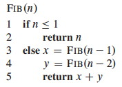 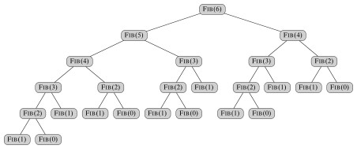

**`Fib`** has recurrence relation T(_n_) = T(_n_ \- 1) + T(_n_ \- 2) + Θ(1), which has the solution T(_n_) = Θ(F_n_) (see the text for substitution method proof). This grows exponentially in _n_, so it's not very efficient. (A straightforward iterative algorithm is much better.) 

Noticing that the recursive calls operate independently of each other, let's
see what improvement we can get by computing the two recursive calls in
parallel. This will illustrate the concurrency keywords and also be an example
for analysis:

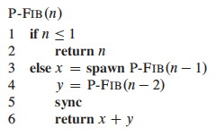

Notice that without the keywords it is still a valid serial program.

**Logical Parallelism**: The **spawn** keyword does not force parallelism: it just says that it is permissible. A scheduler will make the decision concerning allocation to processors.

However, if parallelism is used, **sync** must be respected. For safety, there
is an implicit sync at the end of every procedure.

We will return to this example when we analyze multithreading.

### Scheduling

Scheduling parallel computations is a complex problem: see the text for some
theorems concerning the performance of a greedy centralized scheduler (i.e.,
one that has information on the global state of computation, but must make
decisions on-line rather than in batch).

Professor Henri Casanova does research in this area, and would be an excellent
person to talk to if you want to get involved.

* * *

##  Modeling and Measuring Dynamic Multithreading

First we need a formal model to describe parallel computations.

### A Model of Multithreaded Execution

We will model a multithreaded computation as a **computation dag** (directed
acyclic graph) _G_ = (_V_, _E_); an example for P-Fib(4) is shown:

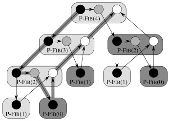

Vertices in _V_ are instructions, or **strands** = sequences of non-parallel
instructions.

Edges in _E_ represent dependencies between instructions or strands: (_u_,
_v_) ∈ _E_ means _u_ must execute before _v_.

  * **Continuation Edges** (_u_, _v_) are drawn horizontally and indicate that _v_ is the successor to _u_ in the sequential procedure.
  * **Call Edges** (_u_, _v_) point downwards, indicating that _u_ called _v_ as a normal subprocedure call.
  * **Spawn Edges** (_u_, _v_) point downwards, indicating that _u_ spawned _v_ in parallel.
  * **Return edges** point upwards to indicate the next strand executed after returning from a normal procedure call, or after parallel spawning at a sync point.

A strand with multiple successors means all but one of them must have spawned.
A strand with multiple predecessors means they join at a sync statement.

If _G_ has a directed path from _u_ to _v_ they are logically in **series**;
otherwise they are logically **parallel**.

We assume an ideal parallel computer with **sequentially consistent** memory,
meaning it behaves as if the instructions were executed sequentially in some
full ordering consistent with orderings within each thread (i.e., consistent
with the partial ordering of the computation dag).

### Performance Measures

We write _T__P_ to indicate the running time of an algorithm on _P_
processors. Then we define these measures and laws:

#### Work

**_T_1** = the total time to execute an algorithm on one processor. This is called _work_ in analogy to work in physics: the total amount of computational work that gets done.

An ideal parallel computer with _P_ processors can do at most _P_ units of
work in one time step. So, in _T__P_ time it can do at most _P_⋅_T__P_ work.
Since the total work is _T_1,   _P_⋅_T__P_ ≥ _T_1,   or dividing by P we get
the **work law:**

> _T__P_  ≥   _T_1 / _P_

The work law can be read as saying that the speedup for _P_ processors can be
no better than the time with one processor divided by _P_.

#### Span

**_T_∞** = the total time to execute an algorithm on an infinite number of processors (or, more practically speaking, on just as many processors as are needed to allow parallelism wherever it is possible).

_T_∞ is called the _span_ because it corresponds to the longest time to
execute the strands along any path in the computation dag (the biggest
computational span across the dag). It is the fastest we can possibly expect
-- an Ω bound -- because no matter how many processors you have, the algorithm
must take this long.

Hence the **span law** states that a _P_-processor ideal parallel computer
cannot run faster than one with an infinite number of processors:

> _T__P_   ≥   _T_∞

This is because at some point the span will limit the speedup possible, no
matter how many processors you add.

_What is the work and span of the computation dag for P-Fib shown?_

#### Speedup

The ratio **_T_1 / _T__P_** defines how much _speedup_ you get with _P_
processors as compared to one.

By the work law, _T__P_ ≥ _T_1 / _P_, so _T_1 / _T__P_ ≤ _P_: one cannot have
any more speedup than the number of processors.

This is important: **_parallelism provides only constant time improvements_**
(the constant being the number of processors) to any algorithm! **_Parallelism
cannot move an algorithm from a higher to lower complexity class (e.g.,
exponential to polynomial, or quadratic to linear)._** Parallelism is not a
silver bullet: good algorithm design and analysis is still needed.

When the speedup _T_1 / _T__P_ = Θ(_P_) we have **linear speedup**, and when
_T_1 / _T__P_ = _P_ we have **perfect linear speedup**.

#### Parallelism

The ratio **_T_1 / _T_∞** of the work to the span gives the potential
parallelism of the computation. It can be interpreted in three ways:

  * _Ratio _: The average amount of work that can be performed for each step of parallel execution time.
  * _Upper Bound _: the maximum possible speedup that can be achieved on any number of processors.
  * _Limit_: The limit on the possibility of attaining perfect linear speedup. Once the number of processors exceeds the parallelism, the computation cannot possibly achieve perfect linear speedup. The more processors we use beyond parallelism, the less perfect the speedup.

This latter point leads to the concept of **parallel slackness**,

> (_T_1 / _T_∞) / _P_   =   _T_1 / (_P_⋅_T_∞),

the factor by which the parallelism of the computation exceeds the number of
processors in the machine. If slackness is less than 1 then perfect linear
speedup is not possible: you have more processors than you can make use of. If
slackness is greater than 1, then the work per processor is the limiting
constraint and a scheduler can strive for linear speedup by distributing the
work across more processors.

_What is the parallelism of the computation dag for P-Fib shown previously?
What are the prospects for speedup at *this* n? What happens to work and span
as n grows?_

* * *

## Analysis of Multithreaded Algorithms

Analyzing _work_ is simple: ignore the parallel constructs and analyze the
serial algorithm. For example, the work of P-Fib(_n_) is T1(_n_) = T(_n_) =
Θ(F_n_). Analyzing _span_ requires more work.

### Analyzing Span

If in series, the span is the sum of the spans of the subcomputations. (This
is similar to normal sequential analysis.)

If in parallel, the span is the _maximum_ of the spans of the subcomputations.
(This is where analysis of multithreded algorithms differs.)

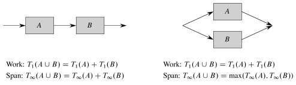

Returning to our example, the span of the parallel recursive calls of
P-Fib(_n_) is:

> _T_∞ (_n_)   =   max(T∞(_n_−1), T∞ (_n_−2)) \+ Θ(1)  
              =   T∞(_n_−1) + Θ(1). 

which has solution Θ(_n_).

The parallelism of P-Fib(_n_) in general (not the specific case we computed
earlier) is T1(_n_) / T∞   =   Θ(F_n_/_n_), which grows dramatically, as F_n_
grows much faster than _n_.

There is considerable parallel slackness, so above small _n_ there is
potential for near perfect linear speedup: there is likely to be something for
additional processors to do.

### Parallel Loops

So far we have used spawn, but not the **parallel** keyword, which is used
with loop constructs such as **for**. Here is an example.

Suppose we want to multiply an _n_ x _n_ matrix _A_ = (_a__ij_) by an _n_-
vector _x_ = (_x__j_). This yields an _n_-vector _y_ = (_y__i_) where:

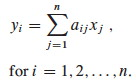

The following algoirthm does this in parallel:

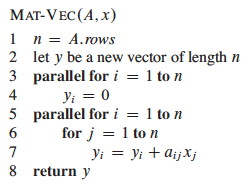

The **parallel for** keywords indicate that each iteration of the loop can be
executed concurrently. (Notice that the inner **for** loop is not parallel; a
possible point of improvement to be discussed.)

#### Implementing Parallel Loops

It is not realistic to think that all _n_ subcomputations in these loops can
be spawned immediately with no extra work. (For some operations on some
hardware up to a constant _n_ this may be possible; e.g., hardware designed
for matrix operations; but we are concerned with the general case.) How might
this parallel spawning be done, and how does this affect the analysis?

This can be accomplished by a compiler with a divide and conquer approach,
itself implemented with parallelism. The procedure shown below is called with
Mat-Vec-Main-Loop(_A_, _x_, _y_, _n_, 1, _n_). Lines 2 and 3 are the lines
originally within the loop.

 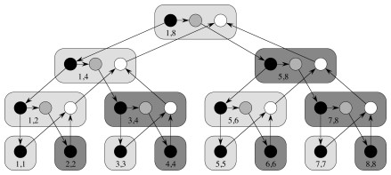

The computation dag is also shown. It appears that a lot of work is being done
to spawn the _n_ leaf node computations, but the increase is not asymptotic.

The _work_ of Mat-Vec is T1(_n_) = Θ(_n_2) due to the nested loops in 5-7.

Since the tree is a full binary tree, the number of internal nodes is 1 fewer
than the leaf nodes, so this extra work is also Θ(_n_).

So, the work of recursive spawning contributes a constant factor when
amortized across the work of the iterations.

However, concurrency platforms sometimes coarsen the recursion tree by
executing several iterations in each leaf, reducing the amount of recursive
spawning.

The span is increased by Θ(lg _n_) due to the tree. In some cases (such as
this one), this increase is washed out by other dominating factors (e.g., the
doubly nested loops).

#### Nested Parallelism

Returning to our example, the span is Θ(_n_) because even with full
utilization of parallelism the inner **for** loop still requires Θ(_n_). Since
the work is Θ(_n_2) the parallelism is Θ(_n_). Can we improve on this?

Perhaps we could make the inner **for** loop parallel as well? Compare the
original to this revised version:

 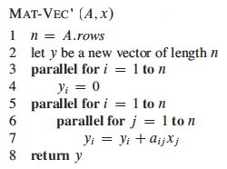

Would it work? We need to introduce a new issue ...

### Race Conditions

**Deterministic** algorithms do the same thing on the same input; while ** nondeterministic** algorithms may give different results on different runs.

The above Mat-Vec' algorithm is subject to a potential problem called a
**determinancy race**: when the outcome of a computation could be
nondeterministic (unpredictable). This can happen when two logically parallel
computations access the same memory and one performs a write.

Determinancy races are hard to detect with empirical testing: many execution
sequences would give correct results. This kind of software bug is
consequential: Race condition bugs caused the Therac-25 radiation machine to
overdose patients, killing three; and caused the North American Blackout of
2003.

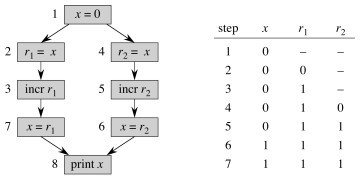

For example, the code shown below might output 1 or 2 depending on the order
in which access to _x_ is interleaved by the two threads:

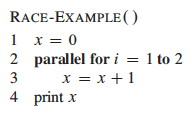  

After we understand that simple example, let's look at our matrix-vector
example again:

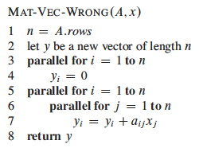

* * *

##  Example: Matrix Multiplication

####  Multithreading the basic algorithm

Here is an algorithm for multithreaded matrix multiplication, based on the
T1(_n_)   =   Θ(_n_3) algorithm:

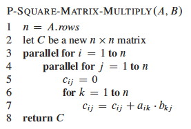

_How does this procedure compare to MAT-VEC-WRONG? Is is also subject to a
race condition? Why or why not? _

The span of this algorithm is T∞(_n_)   =   Θ(_n_), due to the path for
spawning the outer and inner parallel loop executions and then the _n_
executions of the innermost **for** loop. So the parallelism is T1(_n_) /
T∞(_n_)   =   Θ(_n_3) / Θ(_n_)   =   Θ(_n_2)

_Could we get the span down to Θ(1) if we parallelized the inner **for** with
**parallel for**?_

#### Multithreading the divide and conquer algorithm

Here is a parallel version of the divide and conquer algorithm from Chapter 4:

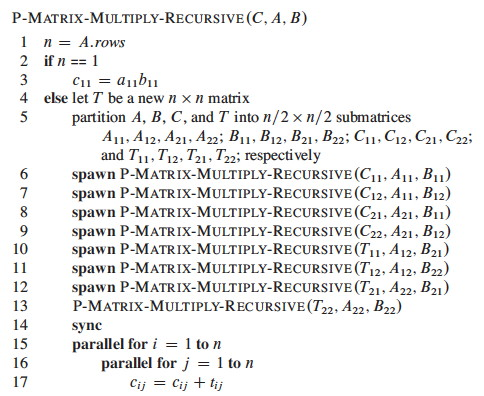

See the text for analysis, which concludes that the work is Θ(_n_3), while the
span is Θ(lg2_n_). Thus, while the work is the same as the basic algorithm the
parallelism is Θ(_n_3) / Θ(lg2_n_), which makes good use of parallel
resources.

* * *

##  Example: Merge Sort

Divide and conquer algorithms are good candidates for parallelism, because
they break the problem into independent subproblems that can be solved
separately. We look briefly at merge sort.

#### Parallelizing Merge-Sort

The dividing is in the main procedure `MERGE-SORT`, and we can parallelize it
by spawning the first recursive call:

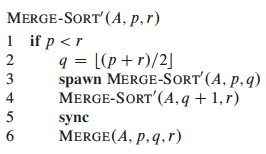

`MERGE` remains a serial algorithm, so its work and span are Θ(_n_) as before.

The recurrence for the _work_ MS'1(_n_) of `MERGE-SORT'` is the same as the
serial version:

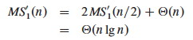

The recurrence for the _span_ MS'∞(_n_) of `MERGE-SORT'` is based on the fact
that the recursive calls run in parallel, so there is only one _n_/2 term:

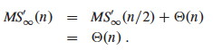

The _parallelism_ is thus MS'1(_n_) / MS'∞(_n_)   =   Θ(_n_ lg _n_ / _n_)   =
Θ(lg _n_).

This is low parallelism, meaning that even for large input we would not
benefit from having hundreds of processors. How about speeding up the serial
`MERGE`?

#### Parallelizing Merge

`MERGE` takes two sorted lists and steps through them together to construct a
single sorted list. This seems intrinsically serial, but there is a clever way
to make it parallel.

A divide-and-conquer strategy can rely on the fact that they are sorted to
break the lists into four lists, two of which will be merged to form the head
of the final list and the other two merged to form the tail.

To find the four lists for which this works, we

  1. Choose the longer list to be the first list, T[_p_1 .. _r_1] in the figure below.
  2. Find the middle element (median) of the first list (_x_ at _q_1).
  3. Use binary search to find the position (_q_2) of this element if it were to be inserted in the second list T[_p_2 .. _r_2].
  4. Recursively merge 
    * The first list up to just before the median T[_p_1 .. _q_1-1] and the second list up to the insertion point T[_p_2 .. _q_2-1].
    * The first list from just after the median T[_q_1+1 .. _r_1] and the second list after the insertion point T[_q_2 .. _r_2].
  5. Assemble the results with the median element placed between them, as shown below.

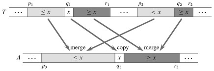

The text presents the `BINARY-SEARCH` pseudocode and analysis of Θ(lg _n_)
worst case; this should be review for you. It then assembles these ideas into
a parallel merge procedure that merges into a second array Z at location _p_3
(_r_3 is not provided as it can be computed from the other parameters):

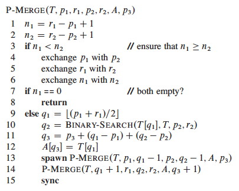

#### Analysis

My main purpose in showing this to you is to see that even apparently serial
algorithms sometimes have a parallel alternative, so we won't get into
details, but here is an outline of the analysis:

The span of `P-MERGE` is the maximum span of a parallel recursive call. Notice
that although we divide the first list in half, it could turn out that _x_'s
insertion point _q_2 is at the beginning or end of the second list. Thus
(informally), the maximum recursive span is 3_n_/4 (as at best we have
"chopped off" 1/4 of the first list).

The text derives the recurrence shown below; it does not meet the Master
Theorem, so an approach from a prior exercise is used to solve it:

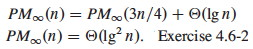

Given 1/4 ≤ α ≤ 3/4 for the unknown dividing of the second array, the work
recurrence turns out to be:

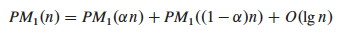

With some more work, PM1(_n_) = Θ(n) is derived. Thus the parallelism is Θ(n /
lg2_n_)

Some adjustment to the `MERGE-SORT'` code is needed to use this `P-MERGE`; see
the text. Further analysis shows that the work for the new sort, `P-MERGE-
SORT`, is PMS1(_n_ lg _n_) = Θ(_n_), and the span PMS∞(_n_) = Θ(lg3_n_). This
gives parallelism of Θ(_n_ / lg2_n_), which is much better than Θ(lg _n_) in
terms of the potential use of additional processors as _n_ grows.

The chapter ends with a comment on coarsening the parallelism by using an
ordinary serial sort once the lists get small. One might consider whether `P
-MERGE-SORT` is still a stable sort, and choose the serial sort to retain this
property if it is desirable.

* * *

Dan Suthers Last modified: Mon Jan 13 19:12:02 HST 2014  
Images are from the instructor's material for Cormen et al. Introduction to
Algorithms, Third Edition.  

