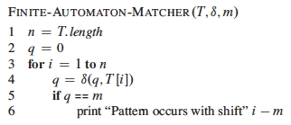

## Outline

  1. String Matching Introduction 
  2. Naive (Brute Force) String Matching 
  3. Matching with Finite State Automata 
  4. Knuth-Morris-Pratt Algorithm 
  5. FYI: Rabin-Karp Algorithm

##  String Matching Introduction

The **string matching problem** is the problem of finding all occurrences of a
string _P_ (the **pattern**) in a target text _T_, also a string.

We treat both _T_ and _P_ as arrays _T_[1 .. _n_] and _P_[1 .. _m_], where _m_
≤ _n_. The elements of the arrays are members of a finite alphabet Σ.

More precisely, we say that _P_ occurs with **shift** _s_ in _T_ (_P_ occurs
beginning at position _s_ \+ 1 in _T_) if

> 0   ≤   _s_   ≤   _n_ − _m_     _(one cannot fall off the end of T),_ and  
T[_s_ \+ 1 .. _s_ \+ _m_]   =   _P_[1 .. _m_].

The **string matching problem** is the problem of finding _**all valid
shifts**_.

A simple example:

### Applications

String matching is obviously important for implementing search in _**text
editing**_ programs, and for _**document search**_, whether searching within a
single document or searching multiple documents for a topic of interest. This
latter application extends to _**internet search engines**_. Other specialized
applications include processing _**DNA sequences**_ in bioinformatics.

### Brief History

In 1970 Cook proved that an O(_M_+_N_) machine is possible. His theorem was
not intended to be practical, but Knuth and Pratt followed the structure of
the theorem to design an algorithm. Around the same time, Morris derived the
algorithm independently as part of his design of a text editor. Eventually
they found out about each other's work and published it in 1976. Also in 1976,
Boyer and Moore found another efficient algorithm not covered here: see the
Sedgewick book. In 1980 Rabin & Karp came up with a modification to brute
force that searches on chunks of text of size _M_ using a hash function.
Researchers continue to come up with new algorithms.

### Algorithms

There are a surprising number of variations on string searching algorithms.
See [ http://www-igm.univ-mlv.fr/~lecroq/string/index.html](http://www-igm
.univ-mlv.fr/~lecroq/string/index.html) for summary descriptions, code and
animations in Java. Find out what a "**Backward Nondeterministic Dawg Matching
algorithm**" is!

Most algorithms require **preprocessing** of the pattern before entering the
**matching** phase. Analysis must consider both costs, and applications must
determine whether the preprocessing is worth the speedup in matching.

The algorithms we cover are summarized by this table from the text:

 

Today we will cover how these algorithms work, but not any proofs of
correctness, which you may find in the text.

### Notation and Terminology

**Prefix:** _p_ ⊏ _t_ (_p_ is a prefix of _t_) if _t_ = _pw_ for some _w_ ∈ Σ*

**Suffix:** _s_ ⊐ _t_ (_s_ is a suffix of _t_) if _t_ = _ws_ for some _w_ ∈ Σ*

The **empty string** is denoted ε.

The **_k_-character prefix** _T_[1 .. k] of any text or pattern _T_ is denoted
_Tk_.

**Comment on String Matching Time:** The test of whether "_x_ == _y_" takes Θ(_t_ \+ 1) time, where _t_ is the length of the longest string _z_ such that _z_ ⊏ _x_ and _z_ ⊏ _y_. (The "1" is included to cover the case where _t_ = 0, since a positive amount of time must be expended to determine this fact.) This comparison loop will be implicit in some of our pseudocode.

* * *

##  Naive (Brute Force) String Matching

It is often instructive to start with a brute force algorithm, that we can
then examine for possible improvements and also use as a baseline for
comparison.

The obvious approach is to start at the first character of _T_, _T_[1], and
then step through _T_ and _P_ together, checking to see whether the characters
match.

Once _P_ has been match at any given shift _T_[_s_], then go on to checking at
_T_[_s_+1] (since we are looking for all matches), up until _s_ = |_T_| −
|_P_| (which is _n_ − _m_).

### Example

Suppose _P_ = `aab` and _T_ = `acaabc`. There are four passes:

You an see C code and a Java applet animation at [ http://www-igm.univ-
mlv.fr/~lecroq/string/node3.html](http://www-igm.univ-
mlv.fr/~lecroq/string/node3.html)

### Analysis

No preprocessing is required.

For each of _n_ − _m_ \+ 1 start positions, potentially _m_ pattern characters
are compared to the target text in the matching phase. Thus, the naive
algorithm is **O((_n_ \- _m_ \+ 1)_m_)** in the worst case.

### Inefficiencies

The brute force method does not use information about what has been matched,
and does not use information about recurrences within the pattern itself.
Consideration of these factors leads to improvements.

For example, when we matched _P_ = `aab` at _s_ = 2, we found that _T_[5] =
`b`:

Then it is not possible for a shift of _s_ = 3 (or _s_ = 4 if _T_ were longer)
to be valid, beause these shifts juxtapose _P_[2] = `a` (and _P_[1] = `a` if
applicable) against _T_[5] = `b`:

This information is used in the finite state automata and Knuth-Morris-Pratt
approaches.

* * *

##  Matching with Finite State Automata

Finite state automata are machines that have a finite number of states, and
move between states as they read input one symbol at a time.

Algorithms that construct (or simulate) finite state automata can be very
efficient matchers, but they require some preprocessing to construct.

### Finite State Automata

Finite state automata are widely used in computability theory as well as in
practical algorithms. It's worth knowing about them even if you are not doing
string matching.

A **finite state automaton (FSA) ** or **finite automaton** _M_ is a 5-tuple
(_Q_, _q0_, _A_, Σ, δ) where

  * **_Q_** is a finite set of _**states**_
  

  * **_q0_** ∈ _Q_ is the _**start state**_
  

  * **_A_** ⊆ _Q_ is a set of _**accepting states**_
  

  * **Σ** is a finite _**input alphabet**_
  

  * **δ** : _Q_ x Σ -> _Q_ is the _**transition function**_ of _M_. 

The FSA starts in state _q0_. As each character (symbol) of the input string
is read, it uses δ to determine what state to transition into. Whenever _M_ is
in a state of _A_, the input read so far is **accepted**.

Here is a simple example:   _q0_ = 0 and _A_ = {1}.   (_What are Q, Σ, and
δ?_)

_What strings does this FSA accept?_

We define the **final state function φ** : Σ* -> _Q_ such that φ(_w_) is the
final state _M_ ends up in after reading _w_:

> φ(ε)   =   _q_0  
φ(_wa_)   =   δ(φ(_w_), _a_)   for _w_ ∈ Σ*, _a_ ∈ Σ

### String Matching Automata

Let's see how they work by an example. This is the string matching automaton
for _P_ = `ababaca`:

 

The start state is 0 and the only accepting state is 7. Any transitions not
shown (e.g., if `c` is read while in states 1, 2, 3, 4, 6, and 7) are assumed
to go back to state 0.

This automaton can be represented with the table to the right. The shading
shows the sequence of states through which a successful match transitions.
These transitions correspond to the darkened arrows in the diagram.

We can run this automaton continuously on a text _T_, and if and when state 7
is entered output the relevant positions: the match will start with shift _i_
− _m_ or at position _i_ − _m_ \+ 1.

The following code simulates any FSA on input text _T_, given the FSA's table
δ and pattern length _m_:

For example, below is a run on _T_ = `abababacaba`, which includes _P_ =
`ababaca` starting at position 3: `ab ababaca ba`.

 

State 7 is reached at _i_ = 9, so the pattern occurs starting at _i_ − _m_ \+
1, or 9 − 7 + 1 = 3. The FSA keeps going after a match, as it may find other
occurrences of the pattern.

Unlike the brute force approach, past work is not thrown away: the transitions
following either failure to match a character or success to match the entire
pattern pick up with the input read so far.

For example,

  * _After Failure:_ At _i_ = 5, `ababa` has been matched in _T_[1 .. 5] and `c` was expected but not found at _T_[6]. Rather than starting over, the FSA transitions to state δ(5, `b`) = 4 to indicate that the pattern prefix _P_4 = `abab` has matched the present text suffix _T_[3 .. 6]. 
  

  * _After Success:_ At, _i_ = 9, we are in state 7 (success), and a `b` is seen. We need not start over: the FSA transitions to state δ(7, `b`) = 2 to reflect the fact that there is already a match to the prefix _P_2 = `ab` at _T_[9 .. 11].

This makes FSAs much more efficient than brute force in the matching phase. In
fact, matching is Θ(_n_). But how do we build them?

### Constructing Finite State Automata (Preprocessing Phase)

In general, the FSA is constructed so that the state number tells us how much
of a prefix of _P_ has been matched.

  * If the pattern _P_ is of length _m_ and the FSA is in state _m_, then the pattern has been matched.
  

  * If the state number is smaller than _m_, then the state number is the length of the prefix of _P_ matched.

Another definition is needed to formalize this.

#### Definitions and Strategy

The **suffix function** corresponding to _P_ of length _m_ is σ_P_ : Σ* -> {0,
1, ... _m_} such that σ_P_ (_w_) is the length of the longest prefix of _P_
that is also a suffix of _x_:

> σ_P_(_w_) = max {_k_ : _Pk_ ⊐ _w_}.

For example, if _P_ = `ab` then

  * σ(ε) = 0
  * σ(`ccaca`) = 1
  * σ(`ccab`) = 2

(For simplicity, we leave out the subscript _P_ when it is clear from the
context.) Then we can define the automaton for pattern _P_[1 .. _m_] as:

  * _Q_ = {0, 1 .. _m_}
  

  * _q0_ = 0
  

  * _A_ = {_m_}
  

  * Σ is a superset of the characters in _P_
  

  * **δ(_q_, _a_) = σ(_Pq __a_)** for any state _q_ and character _a_. (_Pq __a_ is the concatenation of the first _q_ characters of _P_ with the character _a_.) 

By defining δ(_q_, _a_) = σ(_Pq __a_), the state of the FSA keeps track of the
longest prefix of the pattern _P_ that has matched the input text _T_ so far.

In order for a substring of _T_ ending at _T_[_i_] to match some prefix _Pj_,
then this prefix _Pj_ must be a suffix of _T_[_i_].

We design δ such that the state _q_ = φ(_T_[_i_]) gives the length of the
longest prefix of _P_ that matches a suffix of _T_. We have:

> _q_ = φ(_Ti_) = σ(_Ti_), and _Pq_ ⊐ _Ti_ (_Pq_ is a suffix of _Ti_).

Given a match so far to _Pq_ (which may be ε) and reading character _a_, there
are two kinds of transitions:

  * When _a_ = _P_[_q_ \+ 1], _a_ continues to match the pattern, so δ(_q_, a) = _q_ \+ 1 (going along the dark "spine" arrows of the example).
  

  * When _a_ ≠ _P_[_q_ \+ 1], _a_ fails to match the pattern. The preprocessing algorithm given below **_matches the pattern against itself_** to identify the longest smaller prefix of _P_ that is still matched. 

An example of this second case was already noted above for δ(5, `b`) = 4\.

#### Preprocessing Procedure

The following procedure computes the transition function δ from a pattern
_P_[1 .. _m_].

The nested loops process all combinations of states _q_ and characters _a_
needed for the cells of the table representing δ.

Lines 4-8 set δ(_q_, _a_) to the largest _k_ such that _Pk_ ⊐ _Pqa_.

  * The preprocessor is _matching P against itself_.
  * Thus, knowledge of the structure of P is used to retain information about the match so far, even when matches fail.
  * By starting at the largest possible value of _k_ (line 4) and working down (lines 5-7) we guarantee that we get the longest prefix of _P_ that has been matched so far. 
    * If the match succeeds at _k_ = _q_ \+ 1 then this transition indicates a successful match for the current _q_ and _a_. 
    * The loop is guaranteed to end at _k_ = 0, because _P0_ = ε is a suffix of any string.

#### Analysis

`Compute-Transition-Function` requires _m_*|Σ| for the nested outer loops.

Within these loops, the inner `repeat` runs at most _m_ \+ 1 times; and the
test on line 7 can require comparing up to _m_ characters. Together lines 5-7
contribute O(_m_2).

Therefore, `Compute-Transition-Function` is **O(_m_3 |Σ|)**. This is rather
expensive preprocessing, but the Θ(_n_) matching is the best that can be
expected.

You an see C code and a Java applet animation at [ http://www-igm.univ-
mlv.fr/~lecroq/string/nod43.html](http://www-igm.univ-
mlv.fr/~lecroq/string/node4.html)

* * *

##  Knuth-Morris-Pratt Algorithm

The Knuth-Morris-Pratt algorithm improves on the FSA algorithm by avoiding
computation of δ.

Instead it precomputes an auxiliary **prefix function π_P_**, represented as
an array π_P_[1 .. _m_], that can be computed from a pattern _P_ of length _m_
in Θ(_m_) time. (We'll leave off the _P_ subscript from now on.)

π[_q_] is the length of the longest prefix of _P_ that is a proper suffix of
_Pq_. This information enables fast amortized computation of δ(_q_, _a_) on
the fly.

The KMP matcher operates like the FSA matcher, but using π instead of δ. There
is some additional overhead at matching time, but asymptotic performance of
matching remains Θ(_n_).

### How π Works

Given _P_[1 .. _m_], the prefix function π for _P_ is π : {1, 2 ..., _m_} ->
{0, 1, ..., _m_-1} such that

> π[_q_] = max{_k_ : _k_ < _q_ and _Pk_ ⊐ _Pq_}

For example, for _P_ = `ababaca`, π is as follows (_let's use the formula
above to explain a few of the entries below, particularly for i=5._):

The table is structured such that a failure at a given position will drive the
system to hop to the next smaller prefix that could be matched. (_Here I am
skipping over the textbook's discussion of π* and Lemma 32.5, and using
examples instead_).

For example, for _P_ = `ababaca`, if _q_ = 5 and we are reading the 6th
character (to the right of the line), consider what happens when that
character is `c`, `b` or `a`:

From _P_[6] we see that a `c` is expected next.

  * If a `c` is read, we go to state 6 and continue.
  * If an `a` or `b` is read, then there is a mismatch and we need to figure out what prefix of _P_ has still been matched. We look up π[5], which says to skip back to state 3.
  * Repeating the test at state 3, the next character expected is _P_[4] = `b`. If we see a `b` we continue to state 4.
  * Otherwise (the next character is `a`), we look up π[3] and skip back to state 1. Again, the next character does not match what is expected for state 1, and π[1] tells us to start over at state 0. In state 0, an `a` is expected, so it goes to state 1. 

Thus, π helps us retain information from prior comparisions, shifting back to
the state for the maximum prefix matched so far, rather than starting over.

### The KMP Matcher

Both the KMP matcher and the algorithm for computing π are similar to the
FSA's `Compute-Transition-Function` (take the time to compare them when you
read the text).

The KMP matching code is below. We can see the "skipping" discussed above
happening in lines 6-7, with successful matching of the next character handled
in lines 8-9. After a successful match, we jump to the appropriate state to
continue looking for the next item in line 12.

### Computing π

The code for computing π is very similar to that of `KMP-Matcher`, because the
constructor is matching _P_ against itself:

You an see C code and a Java applet animation at [ http://www-igm.univ-
mlv.fr/~lecroq/string/node8.html](http://www-igm.univ-
mlv.fr/~lecroq/string/node8.html)

### Analysis and Correctness

The text presents an analysis showing that `Compute-Prefix-Function` is
**Θ(_m_)** \-- a considerable improvement over the FSA's O(_m_3 |Σ|) -- and
`KMP-Matcher` is **Θ(_n_)**.

These are good results, but in practice the FSA approach is still used when a
pattern will be used many times repeatedly, because of the greater simplicity
of the `Finite-Automaton-Matcher` code.

The proof of correctness is accomplished by showing how KMP-Matcher simulates
the FSA matcher's operation. It's worth reading the informal discussion pages
1009-1010, even if you don't wade into the formal proof.

* * *

##  Rabin-Karp Algorithm

There is an entirely different approach that functions in some respects like
the brute force approach, but instead of testing character by character it
tests on whole substrings of length _m_ by using a hash function. If the hash
function matches, it then uses brute force checking to verify the match.

### Comparing Strings as Radix-_d_ Numbers

Given |Σ| = _d_, Rabin-Karp algorithm treats each string in Σ* as if it were a
number in radix _d_ notation.

  * For example, if Σ = {0, 1, 2, 3, 4, 5, 6, 7, 8, 9} then _d_ = 10, and we interpret the string "274" to have value 2⋅d2 \+ 7⋅d1 \+ 4⋅d0 = 2⋅100 + 7⋅10 + 4⋅1\. 
  

  * Similarly, if Σ = {a, b} then _d_ = 2, and we map the characters of {a, b} to decimal values {0, 1}. Then "bab" = 1⋅d2 \+ 0⋅d1 +1⋅d0 = 1⋅4 + 0⋅2 +1⋅1\. (This is of course a binary representation of the decimal number 5.) 
  

  * Hexadecimal notation uses Σ = {0, 1, 2, 3, 4, 5, 6, 7, 8, 9, A, B, C, D, E, F} and _d_ = 16.

This idea can be extended to large but finite |Σ|.

Thus, we can treat _P_[1 .. _m_] and substrings _T_[_s_+1 .. _s_+_m_] (0 ≤ _s_
≤ _n_ − _m_) as _m_ digit numbers in radix-|Σ|.

Our running example will assume Σ = {0, 1, 2, 3, 4, 5, 6, 7, 8, 9} and _d_ =
10.

If we can compare these numbers directly to each other, we can quickly
determine whether _P_[1 .. _m_] matches _T_[_s_+1 .. _s_+_m_].

Two modifications need to be made to make this method suitable for a string
matching algorithm: shifting and hashing.

### Shifting

If a match to _T_[_s_+1 .. _s_+_m_] fails, we need to compute the next number
for _T_[_s_+**2** .. _s_+_m_+1].

Rather than recomputing the entire sum, this can be done efficiently by a
mathematical "shift":

  * Subtract the value of the highest order digit _a_⋅_d__m_-1.
  * Multiply the remaining value by _d_ to shift the values of the digits up by one position.
  * Add the value of the new character _T_[_s_ \+ _m_ \+ 1].

An example is shown below, shifting a 5-digit number. (The mod will be
explained below.)

### Hashing

These numbers can get very large. Even on a machine that allows arbitrarily
large numbers, this is still a problem: we can no longer assume that comparing
two numbers takes constant time.

The solution is to compute the numbers modulo the largest prime number _q_
such that _dq_ still fits in one computer word (which can be manipulated with
one machine level instruction).

Now you see why it is called "hashing:" it is like the division method of
hashing.

For example, suppose we are matching to a 5 digit pattern _P_ = 31415 in radix
_d_ = 10 we choose _q_ = 13, and we are comparing to string 14142. The hash
code for the pattern is 7, and for the target is 8, as shown in the previous
example. The hashes do not match, so the two patterns cannot be the same.

However, the converse is not necessarily true. Hashing introduces a secondary
problem: collisions. Two different numbers may hash to the same value, as
shown in the example below.

To solve this problem, when the hashes of _P_[1 .. _m_] and _T_[_s_+1 ..
_s_+_m_] are equal, the Rabin-Karp algorithm verifies the match with a brute
force comparison.

This is still saving on comparisons over the brute force method, as we do not
compare characters for failed hash matches: the strings cannot be the same.

### The Rabin-Karp Algorithm

Here is the pseudocode:

(The subscripts on _t_ are just for exposition and can be ignored.)

  * Line 3 initializes _h_ to the value of the highest order digit that will be subtracted when shifting.
  * Lines 4-8 compute the hash code _p_ for _P_ and the initial hash code _t_ for the substring of T to be compared in each iteration (_t_ will be updated by shifting digits as discussed).
  * Like the brute-force algorithm, lines 9-14 iterate over all possible shifts _s_, but instead of comparing character by character, at first the hash codes are compared. If they match, brute force comparison is done.

You an see C code and a Java applet animation at [http://www-igm.univ-mlv.fr/~lecroq/string/node5.html](http://www-igm.univ-mlv.fr/~lecroq/string/node5.html)

### Anaysis

Preprocessing is Θ(_m_): the loop 6-8 executes _m_ times and with the modular
arithmetic keeping the numbers within the size of one computer word the
numerical work in the loop is O(1).

The worst case matching time is still Θ((_n_ − _m_ \+ 1)_m_), like brute
force, because it is possible that every hash code matches and therefore every
brute force comparison has to be done.

But this is highly unlikely in any realistic application (where we are
searching for somewhat rare patterns in large texts). For constant number of
valid shifts the text offers an argument that the expected time is O(_n_ \+
_m_), or O(_n_) since _m_ ≤ _n_.

### Extensions

A major advantage of Rabin-Karp is that it has natural extensions to other
pattern matching problems, such as two-dimensional pattern matching (finding
an _m_ x _m_ pattern in an array of _n_ x _n_ characters), or searching for
multiple patterns at once. Therefore it remains an important pattern matching
algorithm.

* * *

Dan Suthers Last modified: Mon Jan 13 19:12:09 HST 2014  
Images are from the instructor's material for Cormen et al. Introduction to
Algorithms, Third Edition.  

