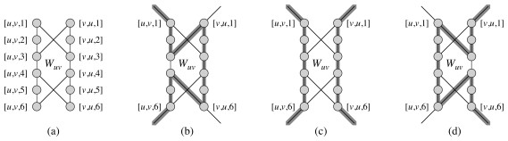

## Outline

  1. Don't Let This Happen to You
  2. Problem Classes
  3. P and NP Classes
  4. Encoding Problems and Polynomial Time Verification 
  5. NP Completeness 
  6. Constructing NPC 
  7. NP Complete Problems

##  Don't Let This Happen to You

Suppose you worked in industry, and your boss calls you to your office and
says they want to enter the emerging "iThingy" market. He wants to offer
customized iThingies, and it's important to have an algorithm that, given a
specification, can efficiently construct a design that meets the maximum
number of requirements in the lowest cost way.

You try for weeks but just can't seem to find an efficient solution. Every
solution that you come up with amounts to trying all combinations of
components, in exponential time. More efficient algorithms fail to find
optimal solutions.

You don't want to have to go your boss and say "I'm sorry I can't find an
efficient solution. I guess I'm just too dumb."

You would like to be able to confidently stride into his office and say "I
can't find an efficient solution because no such solution exists!"
Unfortunately, proving that the problem is inherently intractable is also very
hard: in fact, no one has succeeded in doing so.

Today we introduce a class of problems that no one has been able to prove is
intractable, but nor has anyone been able to find an efficient solution to any
of them.

If you can show that the iThingy configuration problem is one of these
problems, you can go to your boss and say, "I can't find an efficient
solution, but neither can all these smart and famous computer scientists!"

(Next week we'll cover what you would say next. Thanks to Garey & Johnson
(1979) for the story & images.)

* * *

##  Problem Classes

For most of this semester, we abstracted away from the study of particular
**_implementations_** to study the computational complexity of
**_algorithms_** independently of their implementation. More precisely, we
made universally quantified statements to the effect that all possible
implementations of an algorithm would exhibit certain asymptotic growth within
constant factors of each other.

Now we abstract further, to study the the computational complexity of
**_problems_**, independently of the algorithms used to solve them. We will be
trying to make universally quantified statements about the computational
complexity of all possible algorithms for a problem. (We won't always succeed
in doing this.)

For example, when we showed that any comparison-based sorting algorithm is
O(_n_ lg _n_) in [Topic
10](http://www2.hawaii.edu/~suthers/courses/ics311s14/Notes/Topic-10.html), we
were making a claim about a class of algorithms for a problem.

### Tractability and Decidability

Broadly, we are concerned with three classes of problems:

  * **Tractable problems**, generally considered to be those solvable in polynomial time (most of the problems considered so far in this course). 
    * _Examples:_ Any problem studied this semester for which we have solutions bounded by _nk_ for fixed _k_. 
    * Some solutions are not strictly polynomial but are bounded above by a polynomial (e.g., _n_ lg _n_ for sorting is bounded by _n2_), so sorting is considered polynomial.
  

  * **Intractable problems** are those solvable in super-polynomial but not polynomial time. Today we will be concerned with the question of which problems are in this class. 
    * _Examples:_ Enumerate all binary strings of length _n_; Compute the power set (set of all sets) of _n_ items. The solutions consist of 2_n_ binary strings, or 2_n_ sets, respectively, so even if the solution were available instantly exponential time would be required just to output the result!
    * _Unknown:_ Integer linear programming, finding longest simple paths in a graph, finding the optimal way to schedule tasks on factory machines under scheduling and deadline constraints, determining whether certain boolean formulas can be simultaneously satisfied, optimizing circuit layouts under certain constraints, finding the cheapest way to visit all of a set of cities without repeating any and returning to your starting city, finding the optimal partition of graphs under a modularity metric, and many many more ...
  

  * **Unsolvable problems** for which no algorithm can be given guaranteed to solve all instances of the problem. These problems are also known as _**Undecidable**_. 
    * Example: the _**halting problem**_ (given a description of a program and arbitrary input, decide whether the program will halt on that input), demonstrated by Alan Turing.

### Hierarchy of Problem Classes

The hierarchy of problem classes was illustrated at the beginning of the
semester with this diagram:

We have spent most of our time on problems in the lower half of this diagram.
Now we consider whether there are problems that are _intrisically_ in the
upper half.

* * *

##  P and NP Classes

**P** denotes the class of problems solvable in polynomial time, such as most of the problems we have considered this semester.

###  Nondeterministic Polynomial

**NP** denotes the class of problems for which solutions are _**verifiable**_ in polynomial time: given a description of the problem _x_ and a "certificate" _y_ describing a solution (or providing enough information to show that a solution exists) that is polynomial in the size of _x_, we can check the solution (or verify that a solution exists) in polynomial time as a function of _x_ and _y_.

Problems in NP are **decision problems**: we answer "yes" or "no" to whether
the certificate is a solution. The polynomial size requirement on _y_ rules
out problems that take exponential time just to output their results, such as
the enumeration of all binary strings of length _n_. (One could check the
solution in time polynomial in _y_, but _y_ would be exponential in _x_, so
overall the problem is not tractable.)

These problems are called "nondeterministic polynomial" because one way of
defining them is to suppose we have a **nondeterministic machine** that,
whenever faced with a choice, can guess the correct alternative, producing a
solution in polynomial time based on this guess. (Amazingly, no one has been
able to prove that such a fanciful machine would help!)

Another way to think of this is that the machine can copy itself at each
choice point, essentially being multithreaded on an infinite number of
processors and returning the solution as soon as the solution is found down a
span of polynomial depth (see [Topic on Multithreading](http://www2.hawaii.edu
/~suthers/courses/ics311s14/Notes/Topic-22.html)).

(Your text does not take either of these approaches, preferring the
"certificate" definition. We elaborate on this later, but not in depth.)

### Relationship of P to NP

Clearly, P is a subset of NP.

The million dollar question (literally, see the [ Clay Mathematics Institute
Millenium Prize](http://www.claymath.org/millennium-problems/rules-millennium-
prizes) for the [ P vs NP Problem ](http://www.claymath.org/millenium-
problems/p-vs-np-problem)), is whether P is a strict subset of NP (i.e.,
whether there are problems in NP that are not in P, so are inherently
exponential).

### NP Completeness

Theorists _have_ been able to show that there are problems that are just as
hard as any problem in NP, in that if any of these **NP-Hard** problems are
solved then any problem in NP can be solved by reduction to (translating them
into instances of) the NP-Hard problem.

Those NP-Hard problems that are also in NP are said to be ** NP Complete**,
denoted **NPC**, in that if _any_ NPC problem can be solved in polynomial time
then _all_ problems in NP can also be solved in polynomial time.

The study of NP Completeness is important: the _most cited reference in all of
Computer Science_ is Garey & Johnson's (1979) book Computers and
Intractability: A Guide to the Theory of NP-Completeness. (Your textbook is
the second most cited reference in Computer Science!)

In 1979 Garey & Johnson wrote, "The question of whether or not the NP-complete
problems are intractable is now considered to be one of the foremost open
questions of contemporary mathematics and computer science."

Over 30 years later, in spite of a million dollar prize offer and intensive
study by many of the best minds in computer science, this is still true: No
one has been able to either

  * Prove that there are problems in NP that cannot be solved in polynomial time (which would mean P ≠ NP), or 
  * Find a polynomial time solution for a single NP Complete Problem (which would mean P=NP).

Although either alternative is possible, most computer scientists believe that
P ≠ NP.

### Discriminating P and NP problems

Problems that look very similar to each other may belong to different
complexity classes (if P ≠ NP), for example:

  * **Linear programming** can be solved in polynomial time (the [simplex algorithm](http://www2.hawaii.edu/~suthers/courses/ics311s14/Notes/Topic-21.html)), but if we require that the assigned values be integers we have the **integer linear programming problem**, which is NP-Hard. 
  

  * **Shortest paths** in a graph [can be found in O(_VE_) or better](http://www2.hawaii.edu/~suthers/courses/ics311s14/Notes/Topic-18.html), but the problem of finding **longest simple paths** is NP-Hard (deciding whether there is a path longer than length _k_ is NP-Complete).
  

  * An **Euler tour** that traverses each edge of a graph once can be found in O(_E_) time, but finding a **Hamiltonian cycle** that traverses each vertex exactly once via a simple cycle is NP-Hard.
  

  * We can determine whether a boolean formula in **2-Conjunctive Normal Form** is satisfiable in polynomial time, but doing the same for a formula in **3-Conjunctive Normal Form** is NP-Complete.

Clearly, it is important that we be able to recognize such problems when we
encounter them and not share the fate of the iThingy algorithm designer. (In
[the next
topic](http://www2.hawaii.edu/~suthers/courses/ics311s14/Notes/Topic-25.html)
we'll discuss approximation algorithms for dealing with them in a practical
way.)

* * *

## Encoding Problems and Polynomial Time Verification

_This section discuses some concepts used in the study of complexity classes.
We are not delving into formal proofs such as those provided in the text, so
some of the material of this section is not essential to the discussion
following, but familiarity with the terminology may help you understand why
the remaining notes talk about "languages"._

### Abstract Problems

An **abstract problem** _Q_ is a binary relation mapping problem **instances**
_I_ to problem **solutions** _S_.

NP Completeness is concerned with **decision problems**: those having a yes/no
answer, or in which _Q_ maps _I_ to {0, 1}.

Many problems are **optimization problems**, which require that some value be
minimized (e.g., finding shortest paths) or maximized (e.g., finding longest
paths).

We can easily convert an optimization problem to a decision problem by asking:
is there a solution that has value lower than (or higher than) a given value?

### Encodings and Concrete Problems

To specify whether an abstract problem is solvable in polynomial time, we need
to carefully specify the size of the input.

An **encoding** of a problem maps problem instances to binary strings. We
consider only "reasonable" encodings

  * For example, we do not represent numbers in unary format. 
    * (If we did, the input to the problem of enumerating all binary strings of length _n_ would itself be of length 2_n_, so an "O(_n_)" solution would be possible!)
  * A "reasonable" encoding an integer is polynomial related to its representation, and a set of objects polynomially related to its encoding. Standard codings such as ASCII meet this requirement.

Once problems and their solutions are encoded, we are dealing with **concrete
problem instances**. Then a problem _Q_ can be thought of as a function _Q_ :
{0, 1}* -> {0, 1}*, or if it is a decision problem, _Q_ : {0, 1}* -> {0, 1}.
(_Q_(_x_) = 0 for any string _x_ ∈ Σ* that is not a legal encoding.)

### Accepting and Deciding Formal Langauges

By casting computational problems as decision problems, theorists can use
concepts from formal language theory in their proofs. We are not doing these
proofs but you should be aware of the basic concepts and distinctions:

A **language** _L_ over an alphabet Σ is a set of strings made up of symbols
from Σ.

An algorithm _A_ ** accepts** a string _x_ ∈ {0, 1}* if given _x_ the output
of _A_ is 1.

The **language _L_ accepted by _A_** is the set of strings _L_ = {_x_ ∈ {0,
1}* : _A_(_x_) = 1}.

But _A_ need not halt on strings not in _L_. It could just never return an
answer. (The existence of problems like the Halting Problem necessitate
considering this possibility.)

A language is **decided** by an algorithm A if it accepts precisely those
strings in L _and_ rejects those not in L (i.e., _A_ is guaranteed to halt
with result 1 or 0).

A language is **accepted in polynomial time** by A if it is accepted by A in
time O(_nk_) for any encoded input of length _n_ and some constant _k_.
Similarly, a language is **decided in polynomial time** by A if it is decided
by A in time O(_nk_).

###  Polynomial Time Verification

A **complexity class** is a set of languages for which membership is
determined by a complexity measure. (Presently we are interested in the
running time required of any algorithm that decides _L_, but complexity
classes can also be defined by other measures, such as space required.) For
example, we can now define P more formally as:

> **P** = {_L_ ⊆ {0, 1}* : ∃ algorithm _A_ that decides _L_ in polynomial
time}.

A **verification algorithm** _A_(_x_, _y_) takes two arguments: an encoding
_x_ of a problem and a **certificate** _y_ for a solution. _A_ returns 1 if
the solution is valid for the problem. (_A_ need not solve the problem; only
verify the proposed solution.)

The **language verified** by a verification algorithm _A_ is

> L = {_x_ ∈ {0, 1}*: ∃ _y_ ∈ {0, 1}* such that _A_(_x_, _y_) = 1}.

We can now define the complexity class **NP** as the class of languages that
can be verified by a polynomial time algorithm, or formally:

> _L_ ∈ NP iff ∃ polynomial time algorithm _A_(_x_, _y_) and constant _c_ such
that:

>

>> _L_ = {_x_ ∈ {0,1}* : ∃ certificate _y_ with |_y_| = O(|_x_|_c_) such that
_A_(_x_,_y_) = 1}.

The constant _c_ ensures that the size of the certificate _y_ is polynomial in
the problem size, and also we require that _A_ runs in time polynomial in its
input, which therefore must be polynomial in both |_x_| and |_y_|.

For example, although only exponential algorithms are known for the
Hamiltonian Cycle problem, a proposed solution can be encoded as a sequence of
vertices and verified in polynomial time.

* * *

* * *

##  NP Completeness

The NP-Complete problems are the "hardest" problems in NP, in that if one of
them can be solved in polynomial time then every problem in NP can be solved
in polynomial time. This relies on the concept of _reducibility_.

### Reducibility

A problem _A_ can be polynomially reduced to a problem _B_ if there exists a
polynomial-time computable function _f_ that converts an instance α of _A_
into an instance β of _B_.

Stated in terms of formal languages, _L_1 is reducible to _L_2 if there exists
a polynomial-time computable function _f_ : {0, 1}* -> {0, 1}* such that:

> _x_ ∈ _L_1 iff _f_(_x_) ∈ _L_2, ∀ _x_ ∈{0, 1}*.

### NP Completeness Defined

A language _L_ ⊆ {0, 1}* is **NP-Complete (in NPC) if**

  1. **_L_ ∈ NP**, and 
  2. **Every _L'_ ∈ NP is polynomial reducible to _L_.**

Languages satisfying 2 but not 1 are said to be **NP-Hard**. (This includes
optimization problems that can be converted to decision problems in NP.)

The major Theorem of this lecture is:

> **If any NP-Complete problem is polynomial-time solvable, then P = NP. **

> Equivalently, **if any problem in NP is not polynomial-time solvable, then
no NP-Complete problem is polynomial time solvable.**

The expected situation (but by no means proven) corresponds to the second
statement of the theorem, as depicted to the right.

* * *

* * *

##  Constructing NPC

In order to construct the class NPC, we need to have one problem known to be
in NPC. Then we can show that other problems are in NPC by reducibility proofs
(reducing the other candidates to this known problem).

### Circuit Satisfiability: An Initial Problem

In 1971, Cook defined the class NPC and proved that it is nonempty by proving
that the **Circuit Satisfiability _ (CIRCUIT-SAT)_** problem is NP-Complete.

This problem asks: given an acyclic boolean combinatorial circuit composed of
AND, OR and NOT gates, does there exist an assignment of values to the input
gates that produces a "1" at a designated output wire? Such a circuit is said
to be **satisfiable**.

The first part of the proof, that CIRCUIT-SAT is in NP, is straightforward.

  * Given as certifiate an assignment of boolean values to each of the wires in a circuit, one can check that the assignment meets the logic conditions of each component, which clearly can be done in polynomial time in the size of the description of the circuit.
  * Alternatively, one can give as certificate only the input values, and verify by simulating the circuit, propagating values through the gates and to the designated output wire, in polynomial time.

The second part of the proof, that CIRCUIT-SAT is NP-Hard, was complex. The
gist was as follows.

  * Given any language _L_ corresponding to a problem in NP, there must exist an algorithm _A_ that verifies _L_ in polynomial time.
  

  * We can represent the computation of _A_ as a sequence of configurations or states of a machine _M_ on which the algorithm runs. (A configuration represents the state of the computer, including program, storage and program counters.) 
  

  * First, a boolean circuit corresponding to _M_ is constructed. 
  

  * Then the reduction makes a copy of the boolean circuit for each possible state (computational configuration) of _M_, feeding the output of one configuration into the input of another configuration in such a manner that computer memory is no longer needed: all state is encoded in the circuit wiring. The result is a single combinatorial circuit.
  

  * Crucially, this transformation can be done in polynomial time, as _A_ verifies _L_ in polynomial time, so only needs to make a polynomial number of copies of the circuit for _M_. (Since state changes only with new input, the number of copies of _M_ is bounded by the input size _n_.)
  

  * Then an algorithm that solves CIRCUIT-SAT can be used to simulate _A_, deciding _L_.

### NP Completeness Proofs by Reduction

Polynomial reduction is transitive:

> If _L_ is a language such that _L'_ reduces polynomially to _L_ for some
_L'_ ∈ NPC, then _L_ is NP-Hard.

> Furthermore, if _L_ ∈ NP, then _L_ ∈ NPC.

Transitivity follows from the definitions and that the sum of two polynomials
is itself polynomial.

This means that we can prove that other problems are in NPC without having to
reduce every possible problem to them. The general procedure for proving that
_L_ is in NPC is:

  1. **Prove _L_ ∈ NP** (show one can check solutions in polynomial time).
  2. **Prove _L_ is NP-Hard**:
    1. Select a known language _L'_ in NPC
    2. Describe an algorithm _A_ that computes function _f_ mapping _every_ instance _x_ ∈ {0, 1}* of _L'_ to _some appropriately constructed_ instance _f_(_x_) of _L_. 
    3. Prove that x ∈ _L'_ iff _f_(_x_) ∈ _L_, ∀ _x_ ∈ {0, 1}*. 
    4. Prove that _A_ runs in polynomial time.

_Important:_ Why doesn't mapping _every_ instance of _L_ to _some_ instances
of _L_' work?

Now we can populate the class NPC, first by reducing some problems to CIRCUIT-
SAT, and then other problems to these new problems. Literally thousands of
problems have been proven to be in NPC by this means. Let's look at a few.

* * *

##  NP Complete Problems

The text steps through reduction of problems as shown in the figure. We do not
have time to go through the proofs, and it is more important that you are
aware of the diversity of problems in NPC than that you are able to do NP-
Completeness proofs. So we just list them briefly.

### Satisfiability (SAT)

An instance is a boolean formula φ composed of

  * _n_ boolean variables _x_1 ... _x__n_, 
  * _m_ boolean connectives of two inputs and one output: ∧, ∨ ¬ -> ↔, and 
  * parentheses.

A **truth assignment** is a set of values for the variables of φ and a **
satisfying assignment** is a truth assignment that evaluates to 1 (true).

> SAT = {⟨φ⟩ : φ is a satisfiable boolean formula}

There are 2_n_ possible assignments, but a given assignment can be checked in
polynomial time.

CIRCUIT-SAT is reduced to SAT in polynomial time through a construction that
turns CIRCUIT-SAT gates into small logical formulas for SAT:

  1. Define a variable _xi_ for each of the wires.
  2. Write a formula φ that is the conjunction of the variable for the output wire plus a logical expression for each of the logic gates.

The resulting boolean formula is satisfied just when the circuit is satisfied.
(You can verify that the formula shown is equivalent to the circuit.)

> _x_10 ∧ (_x_4 ↔ ¬ _x_3) ∧ (_x_5 ↔ (_x_1 ∨ _x_2)) ∧ (_x_6 ↔ ¬ _x_4) ∧ (_x_7 ↔
(_x_1 ∧ _x_2 ∧ _x_4)) ∧ (_x_8 ↔ (_x_5 ∨ _x_6)) ∧ (_x_9 ↔ (_x_6 ∨ _x_7)) ∧
(_x_10 ↔ (_x_7 ∧ _x_8 ∧ _x_9))

### 3-Conjunctive Normal Form Satisfiability (3-CNF-SAT)

Reduction proofs require that we handle any possible case of a known NPC
problem. It would be complicated to handle all the possible forms of SAT
formulas, so it is useful to have a more restricted logical form for the
target for reduction proofs. 3-CNF serves this purpose.

A **literal** in a boolean formula is an occurrence of a variable or its
negation.

A boolean formula is in **conjunctive normal form (CNF)** if it is a
conjunction of **clauses**, each of which is the disjunction of one or more
literals.

A boolean formula is in **3-conjunctive normal form (3-CNF)** if each clause
has exactly three distinct literals. For example:

> (_x_1∨ ¬_x_1 ∨ ¬_x_2) ∧ (_x_3 ∨ _x_2 ∨ _x_4) ∧ (¬_x_1 ∨ ¬_x_3 ∨ ¬_x_4)

3-CNF-SAT asks whether a boolean formula is satisfiable by an assignment of
truth values to the variables.

There are an exponential possible number of variable assignments, but a given
one can be checked in polynomial time merely by substituting and evaluating
the expression.

SAT can be reduced to 3-CNF-SAT through a polynomial-time process of:

  1. parsing the SAT expression into a binary tree with literals as leaves and connectives as internal nodes; 
  2. introducing a variable _yi_ for the output of each internal node; 
  3. rewriting as the conjunction of the root variable and a clause for each node of the binary tree (_yi_ ↔ the literal for its child nodes); 
  4. converting each clause to conjunctive normal form (see text), first by converting to disjunctive normal form and then applying DeMorgan's laws to convert to CNF; and then 
  5. supplying dummy variables as needed to convert clauses of 1 or 2 variables into 3-CNF.

For ((_x_1 -> _x_2) ∨ ¬((¬_x_1 ↔ _x_3) ∨ _x_4)) ∧ ¬_x_2, the tree is shown to
the right and the expression resulting from the tree is shown below.

> _y_1 ∧ (_y_1 ↔ (_y_2 ∧ ¬_x_2)) ∧ (_y_2 ↔ (_y_3 ∨ _x_4))  
    ∧ (_y_3 ↔ (_x_1 -> _x_2)) ∧ (_y_4 ↔ ¬_y_5)   
    ∧ (_y_5 ↔ (_y_6 ∨ _x_4)) ∧ (_y_6 ↔ (¬_x_1 ↔ _x_3)) 

The remainder of the conversion uses DeMorgan's laws (see the text for the
step by step description):

> ¬(_a_ ∧ _b_) ≡ ¬_a_ ∨ ¬_b_  
¬(_a_ ∨ _b_) ≡ ¬_a_ ∧ ¬_b_

resulting in:

> (¬_y_1 ∨ ¬_y_2 ∨ ¬_x_2) ∧ (¬_y_1 ∨ _y_2 ∨ ¬_x_2) ∧ (¬_y_1 ∨ _y_2 ∨ _x_2) ∧
(_y_1 ∨ ¬_y_2 ∨ _x_2).

### CLIQUE

A **clique** in an undirected graph _G_ = (_V_, _E_) is a subset _V'_ ⊆ _V_,
each pair of which is connected by an edge in _E_ (a complete subgraph of
_G_). (Example cliques are shown.)

The **clique problem** is the problem of finding a clique of maximum size in
_G_. This can be converted to a decision problem by asking whether a clique of
a given size _k_ exists in the graph:

> CLIQUE = {⟨_G_, _k_⟩ : _G_ is a graph containing a clique of size _k_}

One can check a solution in polynomial time.

3-CNF-SAT is reduced to CLIQUE by a clever reduction illustrated in the
figure.

  * There is a vertex for every literal
  * There is an edge between vertices only if the corresponding literals are in different triples _and_ the literals are consistent (i.e., one is not the negation of the other).

If there are _k_ clauses we ask whether the graph has a _k_-clique. Such a
clique exists if and only if there is a satisfying assignment.

  * The fact that there is a _k_-clique means there are _k_ vertices that are all connected to each other. 
  * The fact that two vertices are connected to each other means that they can receive a consistent boolean assignment, _and_ that they are in different clauses.
  * Since there are _k_ vertices then a literal from each of the _k_ clauses must be satisfied. 

Any arbitrary instance of 3-CNF-SAT can be converted to an instance of CLIQUE
with this particular structure. That means if we can solve CLIQUE we can solve
any instance of 3-CNF-SAT. Mapping an arbitrary instance of CLIQUE to a
specialized instance of 3-CNF-SAT would not work.

### Vertex Cover

A vertex cover of an undirected graph _G_ = (_V_, _E_) is a subset _V'_ ⊆ _V_
such that if (_u_, _v_) ∈ _E_ then _u_ ∈ _V'_ or _v_ ∈ _V'_ or both.

Each vertex "covers" its incident edges, and a vertex cover for _G_ is a set
of vertices that covers all the edges in _E_.

The **Vertex Cover Problem** is to find a vertex cover of minimum size in _G_.
Phrased as a decision problem,

> VERTEX-COVER = {⟨_G_, _k_⟩ : graph _G_ has a vertex cover of size _k_}

There is a straightforward reduction of CLIQUE to VERTEX-COVER, illustrated in
the figure. Given an instance _G_=(_V_,_E_) of CLIQUE, one computes the
complement of _G_, which we will call _Gc_ = (_V_,_Ē_), where (_u_,_v_) ∈ _Ē_
iff (_u_,_v_) ∉ _E_. The graph _G_ has a clique of size _k_ iff the complement
graph has a vertex cover of size |_V_| - _k_.

###  Hamiltonian Cycle (HAM-CYCLE)

> HAM-CYCLE = {⟨_G_⟩ : _G_ is a Hamiltonian graph}

The Hamiltonian Cycle problem is shown to be in NPC by reduction of VERTEX-
COVER to HAM-CYCLE.

The construction converts edges of _G_ an instance of VERTEX-COVER into
subgraph "widgets" through which one can find a portion of a Hamiltonian Cycle
only if one or both of the vertices of the edge are in a covering set. There
is one such widget per edge.

Any Hamiltonian cycle must include all the vertices in the widget (a), but
there are only three ways to pass through each widget (b, c, and d in the
figure). If only vertex _u_ is included in the cover, we will use path (b); if
only vertex _v_ then path (d); otherwise path (c) to include both.

The widgets are then wired together in sequences that chain all the widgets
that involve a given vertex, so if the vertex is selected all of the widgets
corresponding to its edges will be reached.

Finally, _k_ selector vertices are added, and wired such that each will select
the _k_th vertex in the cover of size _k_. I leave it to you to examine the
discussion in the text, to see how clever these reductions can be!

### Traveling Salesperson Problem (TSP)

Finally, one of the more famous problems: Suppose you are a traveling
salesperson, and you want to visit _n_ cities exactly once in a Hamiltonian
cycle, but choosing a **tour** with minimum cost.

> TSP = {⟨_G_, _c_, _k_⟩ : _G_ = (_V_, _E_) is a complete graph,  
              _c_ : _V_ x _V_ -> ℕ,   
              _k_ ∈ ℕ, and   
              _G_ has a traveling-salesperson tour with cost at most _k_} 

Only exponential solutions have been found to date, although it is easy to
check a solution in polynomial time.

The reduction represents a HAM-CYCLE problem as a TSP problem on a complete
graph, but with the cost of the edges in TSP being 0 if the edge is in the
HAM-CYCLE problem, or 1 if not.

### Subset-Sum Problem (SUBSET-SUM)

Many NP-Complete problems are of a numerical nature. We already mentioned
integer linear programming. Another example is the subset-sum problem: given a
finite set _S_ of positive integers and an integer target _t_ > 0, does there
exist a subset of _S_ that sums to _t_?

> SUBSET-SUM = {⟨_S_, _t_ : ∃ subset _S'_ ⊆ _S_ such that _t_ = Σ_s_∈_S'__s_}

The proof reduces 3-CNF-SAT to SUBSET-SUM. Please see the text for the details
of yet another clever reduction! Briefly:

  * It involves constructing two numbers for each variable _xi_ (one for the varaible and one for its negation), and two numbers for each clause _Cj_ (these will hold "slack variables" needed to meet the target sum). 
  * The digits of the numbers are arranged in columns. 
  * The numbers for literals (variables and their negations) have a "1" in the column that indicates which variable it corresponds to, and also a "1" in the columns for the clauses in which that literal occurs.
  * The numbers for clauses have either a 1 or a 2 in the column corresponding to that clause.
  * The target value _t_ has a 1 in each digit labeled by a variable and a 4 in each digit labeled by a clause. 
  * The only way one can achieve this target sum is to select those numbers corresponding to the literals that are satisfied in each clause, plus the required slack variables to reach 4. 

For example, see how this clause maps to the table shown:

> (_x_1 ∨ ¬_x_2 ∨ ¬_x_3) ∧ (¬_x_1 ∨ ¬_x_2 ∨ ¬_x_3) ∧ (¬_x_1 ∨ ¬_x_2 ∨ _x_3) ∧
(_x_1 ∨ _x_2 ∨ _x_3).

###  Other Problems

One can find large catalogs of other problems online, starting with those
identified in the book Garey & Johnson (1979), Computers and Intractability.
See for example [Wikipedia](http://en.wikipedia.org/wiki/List_of_NP-
complete_problems). Following Garey & Johnson's outline they list problems in:

  1. Graph theory 
    1. Covering and partitioning
    2. Subgraphs and supergraphs
    3. Vertex ordering
    4. Iso- and other morphisms
    5. Miscellaneous
  2. Network design 
    1. Spanning trees
    2. Cuts and connectivity
    3. Routing problems
    4. Flow problems
    5. Miscellaneous
    6. Graph Drawing
  3. Sets and partitions 
    1. Covering, hitting, and splitting
    2. Weighted set problems
    3. Set partitions
  4. Storage and retrieval 
    1. Data storage
    2. Compression and representation
    3. Database problems
  5. Sequencing and scheduling 
    1. Sequencing on one processor
    2. Multiprocessor scheduling
    3. Shop scheduling
    4. Miscellaneous
  6. Mathematical programming
  7. Algebra and number theory
    1. Divisibility problems
    2. Solvability of equations
    3. Miscellaneous
  8. Games and puzzles
  9. Logic 
    1. Propositional logic
    2. Miscellaneous
  10. Automata and language theory 
    1. 1 Automata theory
    2. 2 Formal languages
  11. Computational geometry
  12. Program optimization
    1. 1 Code generation
    2. 2 Programs and schemes
  13. Miscellaneous

There are also problems for which their status is as of yet unknown. Much work
to do!

* * *

Dan Suthers Last modified: Mon Apr 21 11:46:18 HST 2014  
Images are from the instructor's material for Cormen et al. Introduction to
Algorithms, Third Edition; Garey & Johnson (1979), Computers and
Intractability; and Weisstein, Eric W. "Complete Graph." From MathWorld--A
Wolfram Web Resource. http://mathworld.wolfram.com/CompleteGraph.html,
xkcd.com, and possibly other sites whom I thank for not suing me.  

