## Outline

  1. Approximation Algorithms
  2. Example: Vertex Cover 
  3. Example: TSP 
  4. Two Strategies: Randomization and Linear Programming 

"Although this may seem a paradox, all exact science is dominated by the idea
of approximation." _− Bertrand Russell_

* * *

##  Approximation Algorithms

Well, your boss understands it's a hard problem, but he still wants you to do
something about it! After all, we can't abandon the lucrative iThingy market!
Is there a way to configure iThingies to be "good enough" without using a huge
amount of computer time delaying the orders?

There are three broad approaches to handing NP-Complete or NP-Hard problems in
practice:

  1. **Stick with small problems,** where the total execution time for an optimal solution is not bad. Your boss rejects this as it would limit the configuration options the company offers.
  

  2. **Find special cases** of the problem that can be solved in polynomial time (e.g., 2-CNF rather than 3-CNF). It requires that we know more about the structure of the problem. We don't know much about iThingies, but we will use some restrictions to help with the third approach ... 
  

  3. **Find near-optimal solutions** with ** approximation algorithms**. Your boss thinks it just might work: since the problem is hard, customers won't realize you haven't given them the optimal solution as long as a lot of their requests are met. This is the approach we'll examine today. 

### Definitions

Let _C_ be the cost of a solution found for a problem of size _n_ and _C_* be
the optimal solution for that problem.

Then we say an algorithm has an **approximation ratio of ρ(n)** _(that's
"rho")_ if

> _C_/_C_* ≤ ρ(n) for minimization problems: the factor by which the actual
solution obtained is larger than the optimal solution.

> _C_*/_C_ ≤ ρ(n) for maximization problems: the factor by which the optimal
solution is larger than the solution obtained

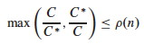

The CLRS text says both of these at once in one expression shown to the right.
The ratio is never less than 1 (perfect performance).

An algorithm that has an approximation ratio of ρ(n) is called a
**ρ(_n_)-approximation algorithm**.

An **approximation scheme** is a parameterized approximation algorithm that
takes an additional input ε > 0 and for any fixed ε is a (1+ε)-approximation
algorithm.

An approximation scheme is a **polynomial approximation scheme** if for any
fixed ε > 0 the scheme runs in time polynomial in input size _n_. (We will not
be discussing approximation schemes today; just wanted you to be aware of the
idea. See section 35.5)

### A Question

By definition, if a problem A is NP-Complete then if we can solve A in O(f(n))
then we can solve any other problem B in NP in O(g(n)) where g(n) is
polynomially related to f(n). (A polynomial time reduction of the other
problems to A exists.)

_So, if we have a ρ(n)-approximation algorithm for the optimization version of
A, does this mean we have a ρ(n)-approximation algorithm for the optimization
version of any problem B in NP? Can we just use the same polynomial time
reduction, and solve A, to get a ρ(n)-approximation for B?_

That would be pretty powerful! Below we show we have a 2-approximation
algorithm for NP-Hard Vertex Cover: so is 2-approximation possible for the
optimization version of _any_ problem in NP? (See problem 35.1-5.)

We examine two examples in detail before summarizing other approximation
strategies.

* * *

##  Vertex Cover Approximations

Recall that a **vertex cover** of an undirected graph _G_ = (_V_, _E_) is a
subset _V'_ ⊆ _V_ such that if (_u_, _v_) ∈ _E_ then _u_ ∈ _V'_ or _v_ ∈ _V'_
or both (there is a vertex in _V'_ "covering" every edge in _E_).

The optimization version of the **Vertex Cover Problem** is to find a vertex
cover of minimum size in _G_.

We previously showed by reduction of CLIQUE to VERTEX-COVER that the
corresonding decision problem is NP-Complete, so the optimization problem is
NP-Hard.

### Approx-Vertex-Cover

Vertex Cover can be approximated by the following surprisingly simple
algorithm, which iterately chooses an edge that is not covered yet and covers
it:

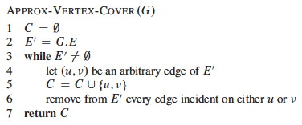  
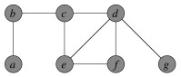

#### Example

Suppose we have this input graph:

Suppose then that edge {_b_, _c_} is chosen. The two incident vertices are
added to the cover and all other incident edges are removed from
consideration:

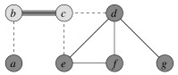

Iterating now for edges {_e_, _f_} and then {_d_, _g_}:

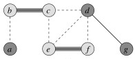
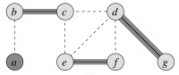

The resulting vertex cover is shown on the left and the optimal vertex on the
right:

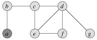
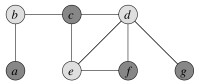

_(Would the approximation bound be tighter if we always chose an edge with the
highest degree vertex remaining? Let's try it on this example. Would it be
tighter in general? See 35.1-3.)_

#### Analysis

How good is the approximation? We can show that the solution is within a
factor of 2 of optimal.

_Theorem:_ **Approx-Vertex-Cover is a polynomial time 2-approximation
algorithm for Vertex Cover.**

_Proof:_ The algorithm is correct because it loops until every edge in _E_ has
been covered.

The algorithm has O(|_E_|) iterations of the loop, and (using aggregate
analysis, [Topic
15](http://www2.hawaii.edu/~suthers/courses/ics311s14/Notes/Topic-15.html))
across all loop iterations, O(|V|) vertices are added to _C_. Therefore it is
O(_E_ \+ _V_), so is polynomial.

It remains to be shown that the solution is no more than twice the size of the
optimal cover. We'll do so by finding a lower bound on the optimal solution
_C_*.

Let _A_ be the set of edges chosen in line 4 of the algorithm. Any vertex
cover must cover at least one endpoint of every edge in _A_. No two edges in
_A_ share a vertex (see algorithm), so in order to cover _A_, the optimal
solution _C_* must have at least as many vertices:

> | _A_ |   ≤   | _C_* |

Since each execution of line 4 picks an edge for which neither endpoint is yet
in _C_ and adds these two vertices to _C_, then we know that

> | _C_ |   =   2 | _A_ |

Therefore:

> | _C_ |   ≤   2 | _C_* |

That is, |_C_| cannot be larger than twice the optimal, so is a
2-approximation algorithm for Vertex Cover.

This is a common strategy in approximation proofs: we don't know the size of
the optimal solution, but we can set a lower bound on the optimal solution and
relate the obtained solution to this lower bound.

### Problems

_Can you come up with an example of a graph for which Approx-Vertex-Cover
always gives a suboptimal solution?_

Suppose we restrict our graphs to trees. _Can you give an efficient greedy
algorithm that always finds an optimal vertex cover for trees in linear time?_

* * *

##  TSP Approximations

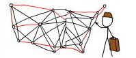

In the **Traveling Salesperson Problem** (TSP) we are given a complete
undirected graph _G_ = (_V_, _E_) (representing, for example, routes between
cities) that has a nonnegative integer cost _c_(_u_, _v_) for each edge {_u_,
_v_} (representing distances between cities), and must find a Hamiltonian
cycle or tour with minimum cost. We define the cost of such a cycle _A_ to be
the sum of the costs of edges:

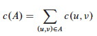

The unrestricted TSP is very hard, so we'll start by looking at a common
restriction.

### Triangle Inequality TSP

In many applications (e.g., Euclidean distances on two dimensional surfaces),
the TSP cost function satisfies the **triangle inequality**:

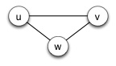

> _c_(_u_, _v_)   ≤   _c_(_u_, _w_) + _c_(_w_, _v_),     ∀ _u_, _v_, _w_ ∈
_V_.

Essentially this means that it is no more costly to go directly from _u_ to
_v_ than it would be to go between them via a third point _w_.

#### Approximate Tour for Triangle Inequality TSP

The triangle inequality TSP is still NP-Complete, but there is a
2-approximation algorithm for it. The algorithm finds a minimum spanning tree
([Topic
17](http://www2.hawaii.edu/~suthers/courses/ics311s14/Notes/Topic-17.html)),
and then converts this to a low cost tour:

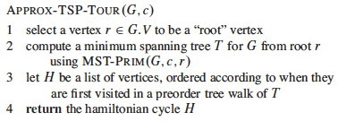

_(Another MST algorithm might also work.)_

#### Example

Suppose we are working on the graph shown below to the left. (Vertices are
placed on a grid so you can compute distances if you wish.) The MST starting
with vertex _a_ is shown to the right.

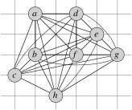
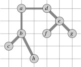

Recall from early in the semester (or ICS 241) that a preorder walk of a tree
visits a vertex before visiting its children. Starting with vertex _a_, the
preorder walk visits vertices in order _a_, _b_, _c_, _h_, _d_, _e_, _f_, _g_.
This is the basis for constructing the cycle in the center (cost 19.074). The
optimal solution is shown to the right (cost 14.715).

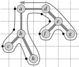
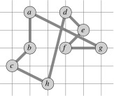
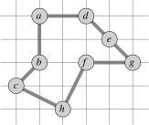

#### Analysis of Approx-TSP-Tour

_Theorem:_ **Approx-TSP-Tour is a polynomial time 2-approximation algorithm
for TSP with triangle inequality.**

_Proof:_ The algorithm is correct because it produces a Hamiltonian circuit.

The algorithm is polynomial time because the most expensive operation is `MST-
Prim`, which can be computed in O(_E_ lg _V_) (see [Topic 17 notes](http://www
2.hawaii.edu/~suthers/courses/ics311s14/Notes/Topic-17.html)).

For the approximation result, let _T_ be the spanning tree found in line 2,
_H_ be the tour found and _H_* be an optimal tour for a given problem.

If we delete any edge from _H_*, we get a spanning tree that can be no cheaper
than the _minimum_ spanning tree _T_, because _H_* has one more (nonegative
cost) edge than _T_:

> _c_(_T_)   ≤   _c_(_H_*)

Consider the cost of the **full walk** _W_ that traverses the edges of _T_
exactly twice starting at the root. (For our example, _W_ is ⟨{_a_, _b_},
{_b_, _c_}, {_c_, _b_}, {_b_, _h_}, {_h_, _b_}, {_b_, _a_}, {_a_, _d_}, ...
{_d_, _a_}⟩.) Since each edge in _T_ is traversed twice in _W_:

> _c_(_W_)   =   2 _c_(_T_)

This walk _W_ is not a tour because it visits some vertices more than once,
but we can skip the redundant visits to vertices once we have visited them,
producing the same tour _H_ as in line 3. (For example, instead of ⟨{_a_,
_b_}, {_b_, _c_}, {_c_, _b_}, {_b_, _h_}, ... ⟩, go direct: ⟨{_a_, _b_}, {_b_,
_c_}, {_c_, _h_}, ... ⟩.)

By the triangle inequality, which says it can't cost any more to go direct
between two vertices,

> _c_(_H_)   ≤   _c_(_W_)

Noting that _H_ is the tour constructed by Approx-TSP-Tour, and putting all of
these together:

> _c_(_H_)   ≤   _c_(_W_)   =   2 _c_(_T_)   ≤   2 _c_(_H_*)

So, _c_(_H_) ≤ 2 _c_(_H_*), and thus `Approx-TSP-Tour` is a 2-approximation
algorithm for TSP. (The CLRS text notes that there are even better solutions,
such as a 3/2-approximation algorithm.)

### Closest Point Heuristic

Another algorithm that is a 2-approximation on the triangle inequality TSP is
the **closest point heuristic**, in which one starts with a trivial cycle
including a single arbitrarily chosen vertex, and at each iteration adds the
next closest vertex not on the cycle until the cycle is complete.

### The General TSP

Above we got our results using a restriction on the TSP. Unfortunately, the
general problem is harder ...

_Theorem:_ **If P ≠ NP, then for any constant ρ ≥ 1 there is no polynomial
time approximation algorithm with ratio ρ for the general TSP.**

The proof by contradiction shows that if there were such an approximation one
can solve instances of Hamiltonian Cycle in polynomial time. Since Hamiltonian
Cycle is NP-Complete, then P = NP. The proof uses a reduction similar to that
used in [Topic
24](http://www2.hawaii.edu/~suthers/courses/ics311s14/Notes/Topic-24.html),
where edges for TSP graph _G'_ are given unit cost only if the corresponding
edge is in the edge-set _E_ for the Hamiltonian Cycle problem graph _G_:

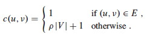

For _any_ ρ(n) ≥ 1, a TSP approximation algorithm will choose the edges of
cost 1 in _G'_ (because to include even one edge not in _E_ would exceed the
approximation ratio), thereby finding a Hamiltonian Cycle in _G_ if such a
cycle exists. (See text for details.)

* * *

## Hierarchy of Problem Difficulty

We have just seen that even within NP, some problems are harder than others in
terms of whether they allow approximations.

The proof technique of reduction to NP-Complete problems has been used to
organize the class NPC into problems that can be polynomially approximated and
those that cannot under the assumption that P ≠ NP. Further discussion can be
found in Garey and Johnson (1979).

You can probably guess that the answer to the question I raised in the
beginning concerning transfer of ρ(n)-approximation across problem reductions
is negative, but _ why would that be the case? Why aren't approximation
properties carried across problem reductions?_

* * *

##  Two Strategies

Various reusable strategies for approximations have been found, two of which
we review briefly here.

### Randomized Approximations

The approximation ratio ρ(_n_) of a randomized algorithm is based on its
**expected cost _C_**. Otherwise the definition is the same.

A randomized algorithm that achieves an expected cost within a factor ρ(_n_)
of the optimal cost _C_* is called a ** randomized ρ(_n_)-approximation
algorithm**.

#### Max-3-CNF Satisfiability

Recall that 3-CNF-SAT ([Topic
24](http://www2.hawaii.edu/~suthers/courses/ics311s14/Notes/Topic-24.html))
asks whether a boolean formula in 3-conjunctive normal form (3-CNF) is
satisfiable by an assignment of truth values to the variables.

The Max-3-CNF variation is an optimization problem that seeks to maximize the
number of conjunctive clauses evaluating to 1. We assume that no clause
contains both a variable and its negation.

Amazingly, a purely random solution is expected to be pretty good:

_Theorem:_ **The randomized algorithm that independently sets each variable of
MAX-3-CNF to 1 with probability 1/2 and to 0 with probabilty 1/2 is a
randomized 8/7-approximation algorithm.**

_Proof:_ Given a MAX-3-CNF instance with _n_ variables _x_1 ... _x__n_ and _m_
clauses, set each variable randomly to either 0 or 1 with probability 1/2 in
each case. Define the _indicator random variable_ ([Topic
5](http://www2.hawaii.edu/~suthers/courses/ics311s14/Notes/Topic-05.html)):

> Y_i_ = I{clause _i_ is satisfied}.

A clause is only unsatisfied if all three literals are 0, so Pr{clause _i_ is
not satisfied} = (1/2)3 = 1/8. Thus, Pr{clause _i_ is satisfied} = 7/8. By an
important lemma from [Topic
5](http://www2.hawaii.edu/~suthers/courses/ics311s14/Notes/Topic-05.html),
E[Y_i_] = 7/8.

Let Y = Σ Y1 ... Y_m_ be the number of clauses satisified overall. Then:

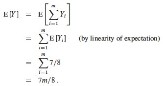

Since _m_ is the upper bound _C_* on the number of satisfied clauses, the
approximation ratio _C_* / _C_ is

> _m_ / (7_m_/8)   =   8/7.

The restriction on a variable and its negation can be lifted. This is just an
example: randomization can be applied to many different problems − but don't
always expect it to work out so well!

### Linear Programming Approximations

Sometimes we can "relax" a problem to make it amenable to linear programming
([Topic
21](http://www2.hawaii.edu/~suthers/courses/ics311s14/Notes/Topic-21.html)).
For example ...

#### Minimum-Weight Vertex-Cover

In the **minimum-weight vertex-cover** problem, we are given an undirected
graph _G_ = (_V_, _E_), and a weight function _w_(_v_) ≥ 0 for _v_ ∈ _V_. We
define the weight of a vertex cover _V'_ to be Σv∈_V'__w_(_v_) and seek to
find a vertex cover of minimum weight.

#### Linear Programming Relaxation

Let each vertex _v_ ∈ _V_ be associated with a variable _x_(_v_), which is 1
iff _v_ in the vertex cover and 0 otherwise.

Since any edge (_u_, _v_) must be covered, _x_(_u_) + _x_(_v_) ≥ 1\. This
leads to the NP-Hard **0-1 integer linear program**:

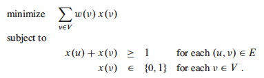

Now let's "relax" the formulation to allow _x_(_v_) to range over 0 ≤ _x_(_v_)
≤ 1\. Then the problem can be written as this **linear programming
relaxation**:

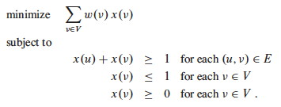

Since a solution to the 0-1 integer version of the problem is a legal solution
to the relaxed version of the problem, the value of an optimal solution to
this latter relaxed program gives a lower bound on the value of an optimal
solution to the 0-1 integer problem.

The solution to the relaxed linear program can be converted to an
approximation of the integer linear program with this algorithm:

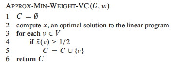

This procedure essentially "rounds" the fractional values to 0 or 1.

#### Analysis

_Theorem:_ **`Approx-Min-Weight-VC` is a polynomial 2-approximation algorithm
for the mimimum-weight vertex-cover problem.**

_Proof:_ There is a polynomial time algorithm for linear programming (line 2),
and lines 3-5 are also polynomial in time. So, `Approx-Min-Weight-VC` is
polynomial.

The result must be a vertex cover, since for any edge (_u_, _v_) the
constraint _x_(_u_) + _x_(_v_) ≥ 1 implies that at least one of the vertices
must have a value of 1/2, so is included in the vertex cover by lines 4-5 of
the algorithm, thereby covering the edge.

To show 2-approximation, let _C_* be an optimal solution and let _z_* be the
value of the solution to the relaxed linear program shown above.

An optimal solution _C_* must be a feasible solution to the relaxed linear
program for which _z_* is an optimal solution, so _z_* cannot be any worse
than _C_*:

> _z_*   ≤   _w_(_C_*)

We've already established that every edge is covered. We bound the weight of
this cover from above by transforming the value of the optimal solution to the
relaxed problem:

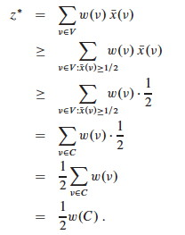

So, _w_(_C_) ≤ 2 _z_*. This result with the prior result of _z_* ≤ _w_(_C_*)
gives:

> _w_(_C_)   ≤   2_z_*   ≤   2_w_(_C_*)

That is, _w_(_C_) ≤ 2_w_(_C_*), so we have 2-approximation.

* * *

## Other Examples

It is worth reading the other examples in the text.

Section 35.3 shows how the Set Covering Problem, which has many applications,
can be approximated using a simple greedy algorithm with a logarithmic
approximation ratio.

Section 35.5 uses the Subset Sum problem to show how an exponential but
optimal algorithm can be transformed into a fully polynomial time
approximation scheme, meaning that we can give the algorithm a parameter
specifying the desired approximation ratio.

Many more examples are suggested in the problem set for the chapter.

* * *

## Summary of Strategies

Faced with an NP Hard optimization problem, your options include:

  1. Use a known exponential algorithm and stick to small problems.
  2. Figure out whether you can restrict your problem to a special case for which polynomial solutions are known.
  3. Give up on optimality, and find or design an approximation algorithm that gives "good enough" results. Strategies include: 
    * Design a clever approximation using some heuristic (e.g., as for vertex cover and TSP in this lecture). 
    * Model the problem as an integer linear program and relax it to allow real valued solutions that are then used (e.g. by rounding) to determine an approximate integer solution. 
    * Get lucky and show that randomly choosing a solution is good enough!

* * *

Dan Suthers Last modified: Mon Jan 13 19:12:25 HST 2014  
Images are from the instructor's material for Cormen et al. Introduction to
Algorithms, Third Edition, and from Garey & Johnson (1979), Computers and
Intractability.  

